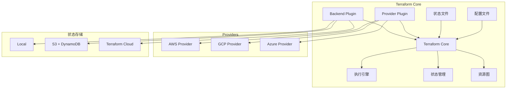
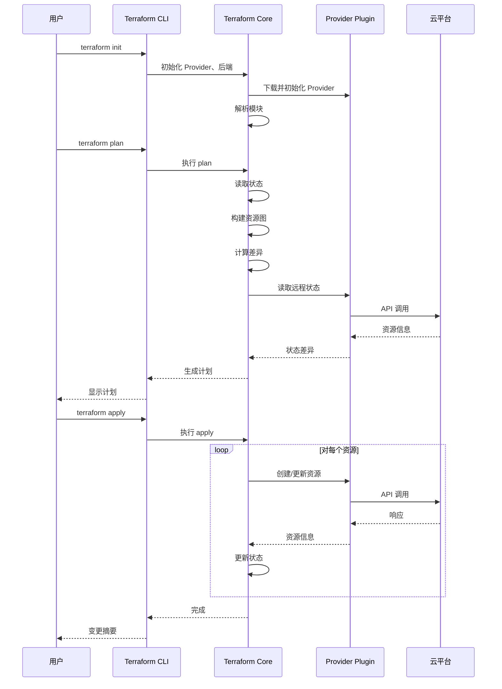
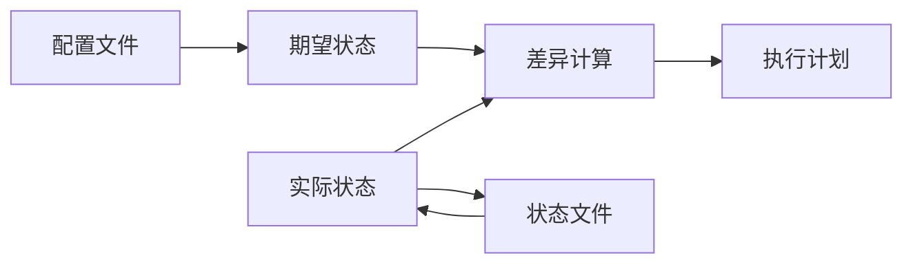
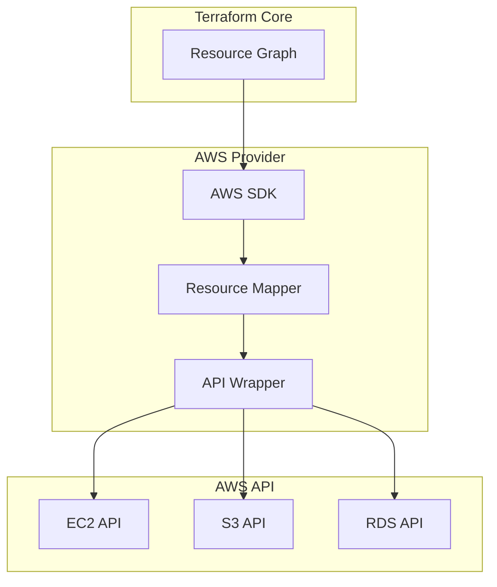
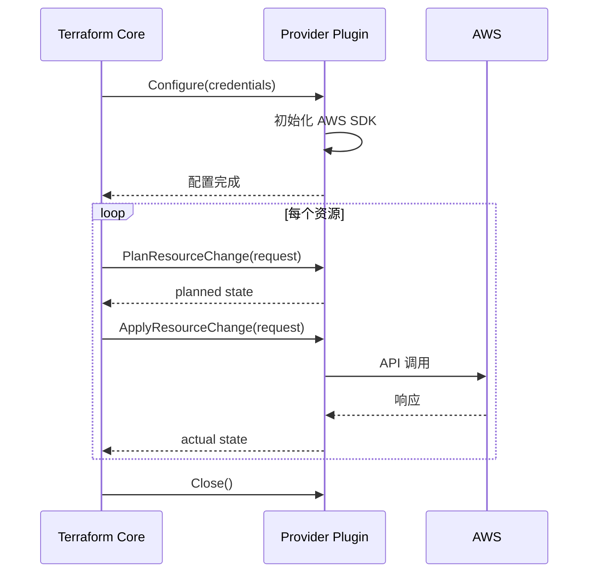
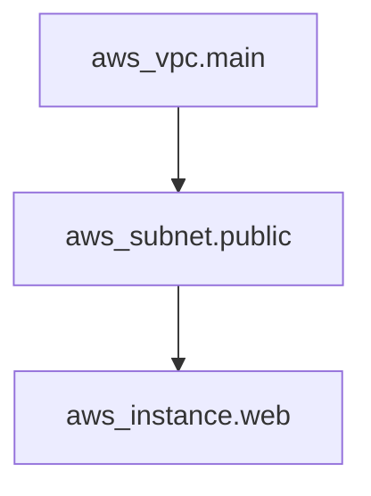
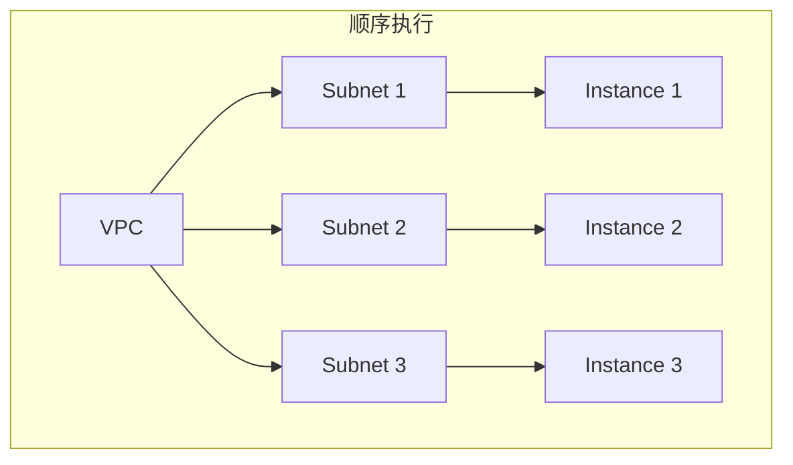

Terraform 不是魔法。它看起来只需要写几行配置，就能神奇地创建出复杂的云基础设施。但在这「简单」的背后，有一套精心设计的架构在运转。

理解 Terraform 的架构，不仅能帮助你更好地使用它，还能在遇到问题时快速定位原因。

## 整体架构

Terraform 的架构可以分为五个核心组件：



### 核心组件

| 组件 | 职责 | 说明 |
| --- | --- | --- |
| **Configuration Parser** | 解析 HCL/JSON 配置 | 将配置文件转换为内部结构 |
| **State Manager** | 管理基础设施状态 | 追踪实际资源 |
| **Resource Graph** | 构建资源依赖图 | 分析资源间的依赖关系 |
| **Plan Builder** | 生成执行计划 | 计算当前状态与期望状态的差异 |
| **Executor** | 执行变更 | 调用 Provider API 创建/更新/销毁资源 |

## 工作流程

### 标准工作流程



### 初始化阶段（terraform init）

```bash
$ terraform init

Initializing the backend...
Initializing provider plugins...
- Finding hashicorp/aws versions matching "~> 5.0"...
- Installing hashicorp/aws v5.31.0...
Terraform has been successfully initialized!
```

做了什么：

1. 初始化 backend（本地或远程）
2. 下载 required_providers 声明的 Provider
3. 安装模块（如果使用了 module）
4. 检查 backend 配置

### 规划阶段（terraform plan）

```bash
$ terraform plan

Terraform will perform the following actions:

  # aws_instance.web will be created
  + resource "aws_instance" "web" {
      + ami                          = "ami-12345678"
      + arn                          = (known after apply)
      + instance_type                = "t3.medium"
      + private_ip                   = (known after apply)
      + public_ip                    = (known after apply)
      + tags                         = {
          + "Environment" = "prod"
          + "Name"        = "web-server"
        }
    }

Plan: 1 to add, 0 to change, 0 to destroy.
```

做了什么：

1. 读取当前配置文件
2. 读取当前状态文件
3. 构建资源依赖图
4. 调用 Provider 获取远程资源状态
5. 计算差异（哪些需要创建/更新/销毁）
6. 生成执行计划

### 应用阶段（terraform apply）

```bash
$ terraform apply

Terraform will perform the following actions:

  # aws_instance.web will be created
  + resource "aws_instance" "web" {
      ...
    }

Plan: 1 to add, 0 to change, 0 to destroy.

Do you want to perform these actions?
  Terraform will perform the actions exactly as planned.
  Type 'yes' to execute the Terraform plan.

Enter a value: yes

aws_instance.web: Creating...
aws_instance.web: Still creating... [10s elapsed]
aws_instance.web: Creation complete after 15s [id=i-1234567890abcdef0]

Apply complete! Resources: 1 added, 0 changed, 0 destroyed.
```

做了什么：

1. 确认用户同意（或使用 `-auto-approve`）
2. 按照依赖顺序执行资源操作
3. 更新状态文件
4. 显示变更摘要

## 状态管理

### 状态的作用



状态文件是 Terraform 的「记忆」——它记录了上次执行后，云平台上实际存在哪些资源。

### Backend 类型

```hcl title="本地后端（默认）"
terraform {
  backend "local" {
    path = "terraform.tfstate"
  }
}
```

```hcl title="S3 后端（推荐生产使用）"
terraform {
  backend "s3" {
    bucket         = "my-terraform-state"
    key            = "prod/web/terraform.tfstate"
    region         = "us-east-1"
    encrypt        = true
    dynamodb_table = "terraform-locks"
  }
}
```

:::tip S3 后端的好处

- **状态共享**：团队成员可以访问同一份状态
- **状态锁定**：DynamoDB 表防止并发修改
- **版本控制**：S3 自带版本控制，可回滚
- **加密**：状态文件可以加密存储
:::

### 状态锁定

```
$ terraform apply

Error: Error acquiring the state lock
Acquiring state lock. This may take a moment...

│ Error: InvalidLockToken: Lock token provided is invalid or expired
│ 
│ Terraform acquires a state lock to protect the state from another
│ writer modifying the state at the same time.
```

状态锁定防止多人同时修改状态导致的不一致。

## Provider 架构

### Provider 工作原理



### Provider 生命周期



### 常用 Provider

| Provider | 描述 | GitHub Stars |
| --- | --- | --- |
| AWS | Amazon Web Services | 10k+ |
| Azure | Microsoft Azure | 3k+ |
| Google | Google Cloud Platform | 3k+ |
| Kubernetes | Kubernetes 集群 | 2k+ |
| Helm | Helm Charts | 1k+ |
| Vault | HashiCorp Vault | 500+ |

## 资源图

Terraform 使用有向无环图（DAG）来表示资源间的依赖关系。

### 图的构建

```hcl title="资源依赖"
resource "aws_vpc" "main" {
  cidr_block = "10.0.0.0/16"
}

resource "aws_subnet" "public" {
  vpc_id     = aws_vpc.main.id  # 依赖 VPC
  cidr_block = "10.0.1.0/24"
}

resource "aws_instance" "web" {
  subnet_id      = aws_subnet.public.id  # 依赖子网
  instance_type = "t3.medium"
}
```

对应的依赖图：



### 并行执行



没有依赖关系的资源可以**并行创建**，提高效率。

```hcl title="没有依赖的资源"
resource "aws_s3_bucket" "bucket1" {}
resource "aws_s3_bucket" "bucket2" {}
resource "aws_s3_bucket" "bucket3" {}

# 这三个 bucket 可以并行创建
```

## 变更执行顺序

Terraform 按照以下规则决定执行顺序：

### 规则一：显式依赖优先

```hcl
resource "aws_instance" "db" {
  instance_type = "r6g.large"
}

resource "aws_instance" "web" {
  # 明确依赖 db
  depends_on = [aws_instance.db]
}
```

### 规则二：隐式依赖通过引用自动发现

```hcl
resource "aws_instance" "web" {
  subnet_id = aws_subnet.main.id  # 隐式依赖
}
```

### 规则三：特定资源的隐式依赖

某些资源类型有隐式的创建顺序：

- 安全组需要先于 EC2 创建（需要安全组 ID）
- IAM 角色需要先于 EC2 创建（需要实例配置文件）

### 规则四：depends_on 显式声明

```hcl
resource "aws_db_instance" "main" {
  allocated_storage = 100
}

resource "aws_instance" "app" {
  depends_on = [aws_db_instance.main]  # 必须显式声明
}
```

## 深入理解 Plan

### Plan 的类型

| 类型 | 说明 | 触发条件 |
| --- | --- | --- |
| **Normal Plan** | 创建/更新/销毁资源的计划 | `terraform plan` |
| **Refresh-only Plan** | 只更新状态，不修改资源 | `terraform plan -refresh-only` |
| **Destroy Plan** | 销毁所有资源 | `terraform plan -destroy` |

### Plan 文件

```bash
# 保存计划到文件
terraform plan -out=tfplan

# 使用计划文件
terraform apply tfplan
```

```go title="Plan 文件结构（内部）"
type Plan struct {
    Version   uint64
    Backend   BackendState
    Variables map[string]DynamicValue

    Changes *ChangesStruct
    PriorState *State
    ConfigStates *State
}

type ChangesStruct struct {
    Resources []*ResourceInstanceChange
}
```

### 计划的局限性

:::warning Plan 可能不准确

- Provider 可能返回意外的资源差异
- 外部系统的变更不会被 Terraform 检测到
- 某些 API 调用可能在 apply 时才返回最终状态

这就是为什么即使 plan 通过了，apply 时也可能出错。
:::

## 总结

Terraform 的架构设计使其能够：

1. **声明式管理**：你描述结果，Terraform 负责实现
2. **状态驱动**：通过状态文件追踪实际基础设施
3. **依赖图优化**：自动解析依赖，支持并行执行
4. **可插拔架构**：Provider 插件机制支持任意平台

理解这些核心概念，能帮助你：

- 更好地组织代码结构
- 排查执行过程中的问题
- 优化大规模 Terraform 的性能

:::info 下一步

想学习 Terraform 的语法？请阅读 [Terraform 核心语法](/cloud-native/iac/terraform-syntax)。
:::
