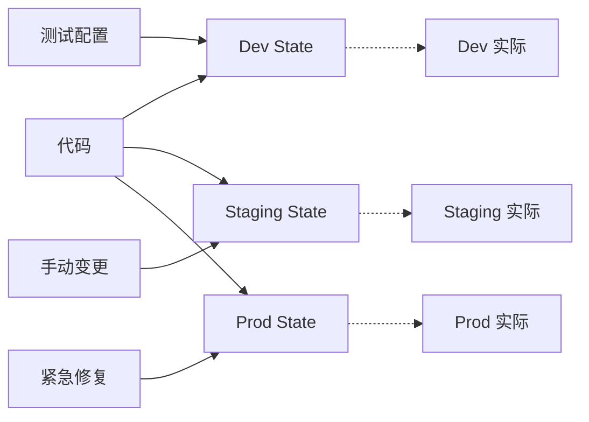
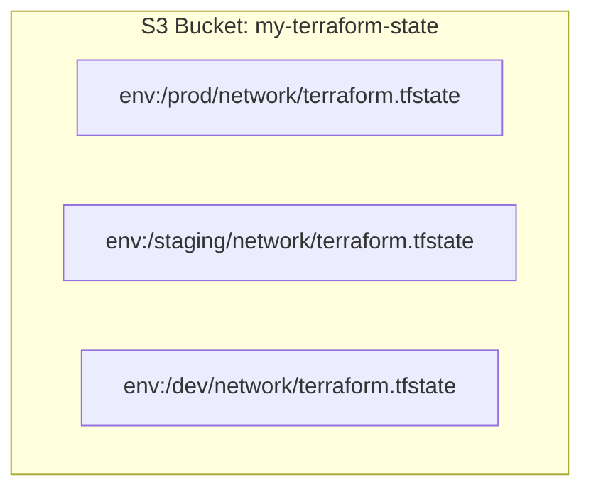
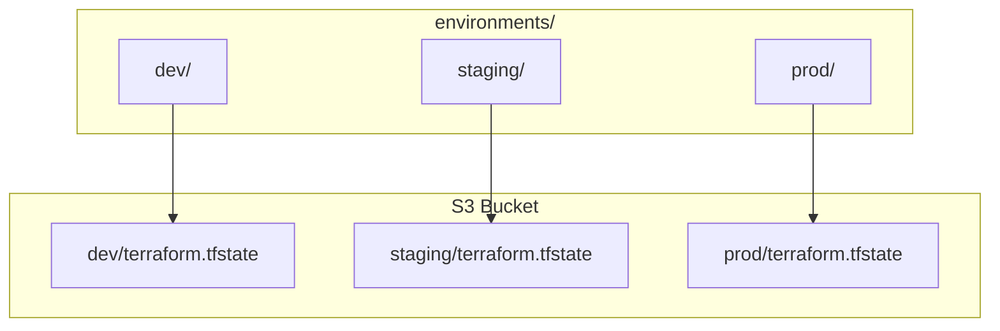
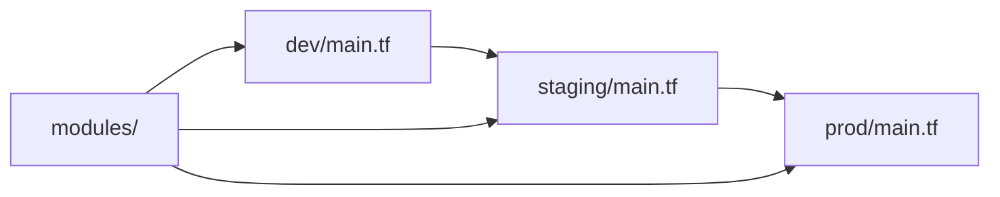
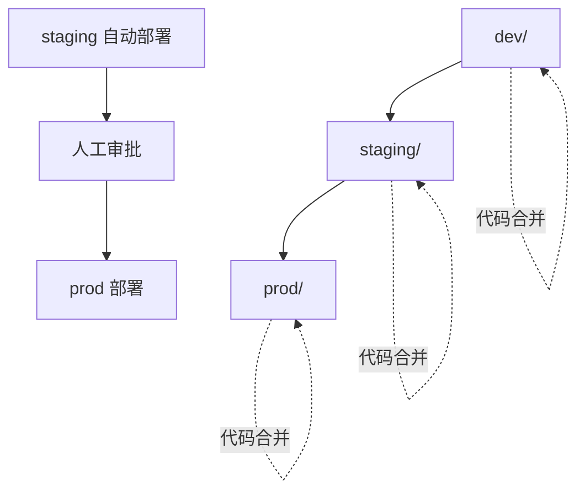

当你开始用 Terraform 管理生产环境时，第一个问题是：**如何安全地管理多个环境？**

dev 环境需要快速迭代，可以接受频繁重建；staging 要尽可能接近生产；production 则是红线地带，每一次变更都需要 triple-check。

但问题是：这些环境的配置有什么不同？状态如何隔离？变量如何管理？这就是多环境管理的核心挑战。

## 环境管理的挑战

### 漂移问题



手动变更导致状态与代码不一致。

### 变量冲突

```hcl title="错误的做法：共用变量文件"
# terraform.tfvars
instance_type = "t3.medium"  # dev/prod 混在一起
db_password = "prod-secret"   # 敏感信息泄露
```

### 状态污染

```bash
# 错误：在同一状态中管理多个环境
terraform state list | grep prod  # 在 dev 环境中看到了 prod 资源
```

## 核心策略

### 策略一：Workspace 隔离

```bash
terraform workspace list
  default
* prod
  staging
  dev
```

```hcl title="每个 Workspace 独立状态"
terraform {
  backend "s3" {
    bucket = "my-terraform-state"
    key    = "env:/${terraform.workspace}/network/terraform.tfstate"
    # env:/ 会自动替换为当前 workspace 名
  }
}
```



**优点**：

- 同一套代码，不同配置
- 状态完全隔离
- 简单易用

**缺点**：

- 切换 workspace 可能混淆
- 需要额外的机制防止误操作

### 策略二：目录隔离（推荐）

```
terraform/
├── modules/
│   └── networking/
├── environments/
│   ├── dev/
│   │   ├── main.tf
│   │   ├── variables.tf
│   │   ├── outputs.tf
│   │   └── terraform.tfvars
│   ├── staging/
│   └── prod/
└── global/
    └── backend/
```



**优点**：

- 物理隔离，风险可控
- Git 权限可以独立设置
- 状态文件不会混淆

**缺点**：

- 代码更新需要同步到多个环境
- 需要良好的模块化设计

## 目录隔离最佳实践

### 环境配置

```hcl title="environments/prod/main.tf"
terraform {
  required_version = ">= 1.5.0"

  required_providers {
    aws = {
      source  = "hashicorp/aws"
      version = "~> 5.0"
    }
  }

  backend "s3" {
    bucket         = "my-terraform-state"
    key            = "prod/networking/terraform.tfstate"
    region         = "us-east-1"
    encrypt        = true
    dynamodb_table = "terraform-locks"
  }
}

provider "aws" {
  region = "us-east-1"

  default_tags {
    tags = {
      Environment = "prod"
      ManagedBy   = "Terraform"
      Project     = var.project
    }
  }
}

module "networking" {
  source = "../../modules/networking"

  project     = var.project
  environment = "prod"
  vpc_cidr    = var.vpc_cidr
  # ...
}
```

### 环境变量

```hcl title="environments/prod/variables.tf"
variable "project" {
  description = "项目名称"
  type        = string
  default     = "myapp"
}

variable "vpc_cidr" {
  description = "VPC CIDR"
  type        = string
  default     = "10.1.0.0/16"
}

variable "instance_type" {
  description = "EC2 实例类型"
  type        = string
  default     = "t3.medium"
}
```

### tfvars 文件

```hcl title="environments/prod/terraform.tfvars"
project     = "myapp"
vpc_cidr    = "10.1.0.0/16"
instance_type = "t3.medium"

# 环境特定的配置
enable_monitoring      = true
deletion_protection   = true
auto_scaling_desired  = 5
```

```hcl title="environments/dev/terraform.tfvars"
project     = "myapp"
vpc_cidr    = "10.0.0.0/16"
instance_type = "t3.micro"

# 开发环境配置
enable_monitoring      = false
deletion_protection   = false
auto_scaling_desired  = 1
```

```hcl title="environments/staging/terraform.tfvars"
project     = "myapp"
vpc_cidr    = "10.2.0.0/16"
instance_type = "t3.small"

# 预发环境配置
enable_monitoring      = true
deletion_protection   = false
auto_scaling_desired  = 2
```

## 变量继承模式

### 基础配置 + 环境覆盖

```hcl title="base_config.auto.tfvars"
# 共享配置
project = "myapp"
enable_vpn = true
log_retention_days = 30
```

```hcl title="environments/prod/override.auto.tfvars"
# 生产环境覆盖
instance_type = "t3.medium"
log_retention_days = 90
deletion_protection = true
```

```bash
# Terraform 自动加载
terraform.tfvars           # 普通变量
*_override.tfvars          # 覆盖变量（后加载）
environment-specific.tfvars # 环境特定变量
```

### 变量验证

```hcl title="environments/prod/variables.tf"
variable "deletion_protection" {
  description = "是否启用删除保护"
  type        = bool

  validation {
    condition     = var.deletion_protection == true
    error_message = "生产环境必须启用删除保护。"
  }
}

variable "instance_type" {
  description = "EC2 实例类型"
  type        = string

  validation {
    condition     = contains(["t3.medium", "t3.large", "m5.large"], var.instance_type)
    error_message = "生产环境实例类型必须为 t3.medium、t3.large 或 m5.large。"
  }
}
```

## CI/CD 集成

### GitHub Actions

```yaml title=".github/workflows/terraform.yml"
name: Terraform

on:
  push:
    branches:
      - main
    paths:
      - 'environments/prod/**'
  pull_request:
    paths:
      - 'environments/prod/**'

jobs:
  terraform:
    runs-on: ubuntu-latest
    steps:
      - uses: actions/checkout@v3

      - name: Setup Terraform
        uses: hashicorp/setup-terraform@v2
        with:
          terraform_version: 1.5.0

      - name: Terraform Init
        working-directory: environments/prod
        run: terraform init

      - name: Terraform Format
        working-directory: environments/prod
        run: terraform fmt -check

      - name: Terraform Plan
        working-directory: environments/prod
        run: terraform plan -no-color
        env:
          TF_VAR_db_password: ${{ secrets.DB_PASSWORD }}

      - name: Terraform Apply
        if: github.ref == 'refs/heads/main' && github.event_name == 'push'
        working-directory: environments/prod
        run: terraform apply -auto-approve
        env:
          TF_VAR_db_password: ${{ secrets.DB_PASSWORD }}
```

### 审批流程

```yaml title=".github/workflows/terraform-prod.yml"
name: Terraform Production

on:
  push:
    paths:
      - 'environments/prod/**'

jobs:
  plan:
    runs-on: ubuntu-latest
    outputs:
      plan: ${{ steps.plan.outputs.plan }}
    steps:
      - uses: actions/checkout@v3
      - uses: hashicorp/setup-terraform@v2
      - name: Terraform Init
        run: terraform init
        working-directory: environments/prod
      - name: Terraform Plan
        id: plan
        run: |
          terraform plan -no-color > plan.txt
          echo "plan=$(cat plan.txt)" >> $GITHUB_OUTPUT

  approve:
    needs: plan
    runs-on: ubuntu-latest
    environment: production  # 需要在 GitHub 设置环境审批
    steps:
      - name: Review Plan
        run: cat plan.txt

  apply:
    needs: [plan, approve]
    runs-on: ubuntu-latest
    environment: production
    steps:
      - uses: actions/checkout@v3
      - uses: hashicorp/setup-terraform@v2
      - name: Terraform Init
        run: terraform init
        working-directory: environments/prod
      - name: Terraform Apply
        run: terraform apply -auto-approve
```

## 敏感数据管理

### AWS Secrets Manager

```hcl title="从 Secrets Manager 获取敏感数据"
data "aws_secretsmanager_secret_version" "db_creds" {
  secret_id = "prod/myapp/database"
}

locals {
  db_creds = jsondecode(data.aws_secretsmanager_secret_version.db_creds.secret_string)
}

resource "aws_db_instance" "main" {
  identifier = "myapp-db"
  username   = local.db_creds.username
  password   = local.db_creds.password
}
```

### SOPS 加密

```bash
# 安装 SOPS
brew install sops

# 创建加密的 tfvars
sops --encrypt secrets.tfvars > secrets.enc.tfvars
```

```yaml title=".sops.yaml（SOPS 配置）"
creation_rules:
  - path_regex: secrets\.enc\.tfvars
    kms: arn:aws:kms:us-east-1:123456789012:key/xxx
```

### 环境变量注入

```bash
# 不在 tfvars 文件中存储敏感数据
export TF_VAR_db_password="xxx"
terraform plan
```

```hcl title="variables.tf"
variable "db_password" {
  type      = string
  sensitive = true
}
```

## 环境 promotion

### 代码 promotion



代码从 dev 开始，经过 staging，最终到 prod。模块更新通过版本标签管理。

### 基础设施 promotion



## 常见问题

### 问题一：如何同步多个环境

:::tip 解决方案

使用 CI/CD 流水线，在 staging 通过后自动部署到 staging，prod 需要手动审批。
:::

### 问题二：状态漂移怎么处理

```bash
# 检测漂移
terraform plan -refresh-only

# 修复漂移
# 如果确认漂移是预期行为
terraform apply -refresh-only

# 如果需要强制同步
terraform apply  # 会把实际状态同步到 State
```

### 问题三：如何回滚环境

```bash
# 1. 查看状态历史
terraform state list

# 2. 从备份恢复状态
aws s3 cp s3://my-terraform-state/prod/terraform.tfstate.backup \
           s3://my-terraform-state/prod/terraform.tfstate

# 3. 或者使用 Terraform Cloud
# 直接在 UI 中回滚
```

## 总结

Terraform 多环境管理的核心原则：

1. **状态隔离**：每个环境独立状态，S3 key 使用环境前缀
2. **代码复用**：通过 modules 共享代码
3. **变量分层**：基础配置 + 环境覆盖
4. **敏感数据**：使用 Vault/Secrets Manager/SOPS
5. **审批流程**：生产环境必须有人工审批
6. **自动化**：CI/CD 流水线确保一致性

:::info 下一步

想了解 Pulumi vs Terraform 的对比？请阅读 [Pulumi vs Terraform](/cloud-native/iac/pulumi-vs-terraform)。
:::
