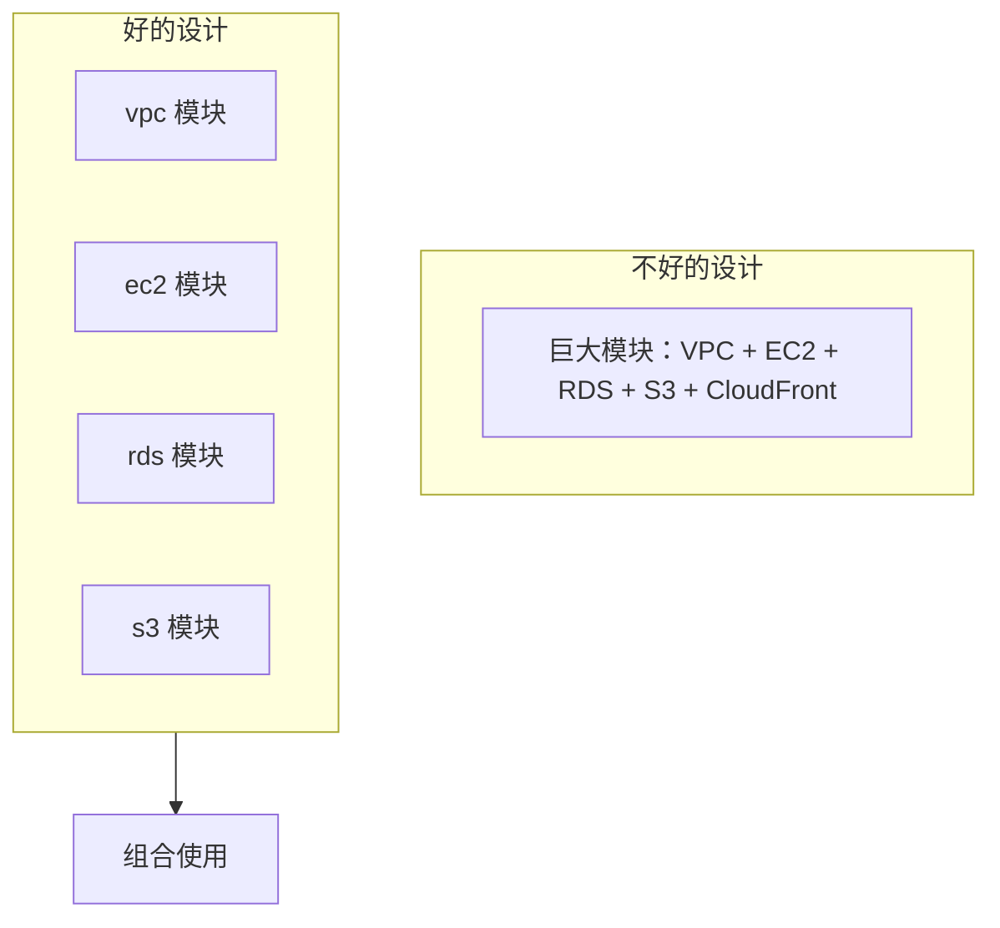

Terraform 模块是代码复用的基础。一个设计良好的模块，可以在多个环境、多个项目中复用，减少重复代码，确保基础设施一致性。

但模块设计不好，反而会成为维护噩梦：参数太多、默认值混乱、隐藏的依赖、难以理解的输出……

好的模块设计，是**把复杂性封装在内部，把简洁留给调用者**。

## 模块基础

### 模块定义

```hcl title="模块结构"
module/
├── main.tf          # 资源定义
├── variables.tf     # 输入变量
├── outputs.tf       # 输出值
├── versions.tf      # 版本约束
├── data.tf          # 数据源
└── README.md        # 文档
```

### 基本模块示例

```hcl title="vpc-module/main.tf"
# VPC 模块
resource "aws_vpc" "main" {
  cidr_block           = var.cidr_block
  enable_dns_hostnames = var.enable_dns_hostnames
  enable_dns_support   = var.enable_dns_support

  tags = merge(
    var.tags,
    {
      Name = var.name
    }
  )
}

# 子网
resource "aws_subnet" "public" {
  count = length(var.public_subnets)

  vpc_id                  = aws_vpc.main.id
  cidr_block              = var.public_subnets[count.index]
  availability_zone       = var.availability_zones[count.index]
  map_public_ip_on_launch = true

  tags = {
    Type = "public"
  }
}

resource "aws_subnet" "private" {
  count = length(var.private_subnets)

  vpc_id            = aws_vpc.main.id
  cidr_block        = var.private_subnets[count.index]
  availability_zone = var.availability_zones[count.index]

  tags = {
    Type = "private"
  }
}

# Internet Gateway
resource "aws_internet_gateway" "main" {
  vpc_id = aws_vpc.main.id

  tags = {
    Name = "${var.name}-igw"
  }
}
```

```hcl title="vpc-module/variables.tf"
variable "name" {
  description = "VPC 名称"
  type        = string
}

variable "cidr_block" {
  description = "VPC CIDR 块"
  type        = string
  default     = "10.0.0.0/16"
}

variable "enable_dns_hostnames" {
  description = "启用 DNS 主机名"
  type        = bool
  default     = true
}

variable "enable_dns_support" {
  description = "启用 DNS 支持"
  type        = bool
  default     = true
}

variable "public_subnets" {
  description = "公有子网 CIDR 列表"
  type        = list(string)
  default     = []
}

variable "private_subnets" {
  description = "私有子网 CIDR 列表"
  type        = list(string)
  default     = []
}

variable "availability_zones" {
  description = "可用区列表"
  type        = list(string)
  default     = []
}

variable "tags" {
  description = "标签"
  type        = map(string)
  default     = {}
}
```

```hcl title="vpc-module/outputs.tf"
output "vpc_id" {
  description = "VPC ID"
  value       = aws_vpc.main.id
}

output "vpc_cidr" {
  description = "VPC CIDR"
  value       = aws_vpc.main.cidr_block
}

output "public_subnet_ids" {
  description = "公有子网 ID 列表"
  value       = aws_subnet.public[*].id
}

output "private_subnet_ids" {
  description = "私有子网 ID 列表"
  value       = aws_subnet.private[*].id
}

output "public_subnet_cidrs" {
  description = "公有子网 CIDR 列表"
  value       = aws_subnet.public[*].cidr_block
}

output "private_subnet_cidrs" {
  description = "私有子网 CIDR 列表"
  value       = aws_subnet.private[*].cidr_block
}

output "igw_id" {
  description = "Internet Gateway ID"
  value       = aws_internet_gateway.main.id
}
```

### 使用模块

```hcl title="使用 VPC 模块"
module "vpc" {
  source = "./modules/vpc"

  name                = "prod-vpc"
  cidr_block          = "10.0.0.0/16"
  enable_dns_hostnames = true
  enable_dns_support   = true

  public_subnets = [
    "10.0.1.0/24",
    "10.0.2.0/24",
    "10.0.3.0/24"
  ]

  private_subnets = [
    "10.0.10.0/24",
    "10.0.11.0/24",
    "10.0.12.0/24"
  ]

  availability_zones = [
    "us-east-1a",
    "us-east-1b",
    "us-east-1c"
  ]

  tags = {
    Environment = "prod"
    ManagedBy   = "terraform"
  }
}
```

## 模块设计原则

### 原则 1：单一职责



### 原则 2：最小接口

```hcl title="变量过多的问题"
# 糟糕的接口设计
module "ecs_cluster" {
  source = "./modules/ecs"

  # 太多参数，用户需要了解所有细节
  cluster_name           = "my-cluster"
  vpc_id                = "vpc-xxx"
  subnet_ids             = ["subnet-xxx"]
  instance_type          = "t3.medium"
  instance_count         = 3
  ami_id                = "ami-xxx"
  key_name              = "my-key"
  security_groups       = ["sg-xxx"]
  iam_instance_profile   = "ecs-profile"
  user_data             = "..."
  ebs_volume_size       = 100
  ebs_volume_type       = "gp3"
  # ... 30+ 参数
}
```

```hcl title="好的接口设计 - 使用对象类型"
variable "cluster_config" {
  description = "ECS 集群配置"
  type = object({
    name           = string
    instance_type  = string
    instance_count = number
  })
  default = {
    name           = "default"
    instance_type  = "t3.medium"
    instance_count = 2
  }
}

variable "autoscaling_config" {
  description = "自动扩展配置"
  type = object({
    enabled         = bool
    min_size       = number
    max_size       = number
    target_cpu_utilization = number
  })
  default = {
    enabled                = false
    min_size               = 2
    max_size               = 10
    target_cpu_utilization = 70
  }
}
```

### 原则 3：合理默认值

```hcl title="设置合理的默认值"
variable "instance_type" {
  description = "EC2 实例类型"
  type        = string
  default     = "t3.micro"  # 小实例适合开发和测试

  validation {
    condition     = contains(["t3.micro", "t3.small", "t3.medium", "t3.large"], var.instance_type)
    error_message = "Instance type must be valid."
  }
}

variable "enable_monitoring" {
  description = "启用详细监控"
  type        = bool
  default     = true  # 监控应该是默认启用的
}

variable "deletion_protection" {
  description = "启用删除保护"
  type        = bool
  default     = true  # 生产环境应该默认保护
}
```

### 原则 4：输出所有需要的值

```hcl title="输出完整的信息"
output "cluster_info" {
  description = "集群完整信息"
  value = {
    id               = aws_ecs_cluster.main.id
    arn              = aws_ecs_cluster.main.arn
    name             = aws_ecs_cluster.main.name
    security_group_id = aws_security_group.cluster.id
    instance_ids      = aws_instance.cluster[*].id
    autoscaling_group_id = aws_autoscaling_group.main.id
  }
}
```

## 模块版本管理

### 语义化版本

```bash title="模块版本标签"
# 模块版本 v1.0.0
git tag modules/vpc/v1.0.0

# 模块版本 v1.1.0
git tag modules/vpc/v1.1.0

# 模块版本 v2.0.0
git tag modules/vpc/v2.0.0
```

### 使用特定版本

```hcl title="使用特定版本"
module "vpc" {
  source  = "git::https://github.com/myorg/terraform-aws-vpc.git?ref=v1.2.0"
  version = "~> 1.2.0"  # 支持 1.2.x

  name      = "prod-vpc"
  cidr_block = "10.0.0.0/16"
}
```

### 版本约束

```hcl title="versions.tf"
terraform {
  required_version = ">= 1.6.0"

  required_providers {
    aws = {
      source  = "hashicorp/aws"
      version = "~> 5.0"
    }
  }
}
```

## 组合模块

### 应用模块示例

```hcl title="webapp-module/main.tf"
resource "aws_security_group" "app" {
  name        = "${var.name}-app"
  vpc_id      = var.vpc_id

  ingress {
    from_port   = 80
    to_port     = 80
    protocol    = "tcp"
    cidr_blocks = ["0.0.0.0/0"]
  }

  egress {
    from_port   = 0
    to_port     = 0
    protocol    = "-1"
    cidr_blocks = ["0.0.0.0/0"]
  }

  tags = var.tags
}

resource "aws_instance" "app" {
  count = var.instance_count

  ami           = var.ami_id
  instance_type = var.instance_type
  subnet_id    = var.subnet_ids[count.index % length(var.subnet_ids)]

  vpc_security_group_ids = [aws_security_group.app.id]
  key_name              = var.key_name
  user_data             = templatefile("${path.module}/user_data.sh", {
    env = var.environment
  })

  root_block_device {
    volume_size = var.root_volume_size
    volume_type = var.root_volume_type
  }

  tags = merge(var.tags, {
    Name = "${var.name}-${count.index + 1}"
    Role = "webapp"
  })
}

resource "aws_lb" "app" {
  name               = var.name
  internal           = false
  load_balancer_type = "application"
  security_groups    = [aws_security_group.app.id]
  subnets            = var.subnet_ids

  enable_deletion_protection = var.deletion_protection

  tags = var.tags
}

resource "aws_lb_target_group" "app" {
  name     = var.name
  port     = 80
  protocol = "HTTP"
  vpc_id   = var.vpc_id
}

resource "aws_lb_listener" "app" {
  load_balancer_arn = aws_lb.app.arn
  port             = 80
  protocol         = "HTTP"

  default_action {
    type             = "forward"
    target_group_arn = aws_lb_target_group.app.arn
  }
}
```

### 调用组合模块

```hcl title="使用应用模块"
module "webapp" {
  source = "../../modules/webapp"

  name   = "prod-webapp"
  vpc_id = module.vpc.vpc_id

  subnet_ids = module.vpc.private_subnet_ids

  ami_id          = "ami-0c55b159cbfafe1f0"
  instance_type   = "t3.medium"
  instance_count = 3

  key_name = "prod-key"

  environment = "production"

  deletion_protection = true

  tags = {
    Environment = "production"
    Project     = "mywebapp"
    ManagedBy   = "terraform"
  }
}
```

## 本地模块 vs 远程模块

### 本地模块

```hcl title="本地模块"
module "vpc" {
  source = "./modules/vpc"
  # ...
}
```

### 远程模块

```hcl title="Terraform Registry"
module "vpc" {
  source  = "terraform-aws-modules/vpc/aws"
  version = "~> 5.0"

  name = "my-vpc"
  # ...
}
```

```hcl title="Git 模块"
module "vpc" {
  source = "git::https://github.com/myorg/terraform-aws-vpc.git"
  # 或者指定分支
  source = "git::https://github.com/myorg/terraform-aws-vpc.git?ref=develop"
}
```

```hcl title="S3 模块"
module "vpc" {
  source = "s3::https://s3.amazonaws.com/my-bucket/modules/vpc.zip"
}
```

## 模块文档

```markdown title="modules/vpc/README.md"
# VPC 模块

创建标准的 VPC 架构，包含公有子网、私有子网、NAT Gateway 等。

## 用法

```hcl
module "vpc" {
  source = "github.com/myorg/terraform-aws-vpc?ref=v1.0.0"

  name = "my-vpc"
  cidr_block = "10.0.0.0/16"

  availability_zones = ["us-east-1a", "us-east-1b"]

  public_subnets  = ["10.0.1.0/24", "10.0.2.0/24"]
  private_subnets = ["10.0.10.0/24", "10.0.11.0/24"]
}
```

## 变量

| 变量名 | 类型 | 描述 | 默认值 |
|--------|------|------|--------|
| `name` | string | VPC 名称 | - |
| `cidr_block` | string | CIDR 块 | `10.0.0.0/16` |

## 输出

| 输出名 | 类型 | 描述 |
|--------|------|------|
| `vpc_id` | string | VPC ID |
| `public_subnet_ids` | list(string) | 公有子网 ID |
| `private_subnet_ids` | list(string) | 私有子网 ID |

## 示例

### 高可用配置

```hcl
module "vpc" {
  source = "..."

  name = "ha-vpc"
  cidr_block = "10.0.0.0/16"

  availability_zones = ["us-east-1a", "us-east-1b", "us-east-1c"]

  public_subnets  = ["10.0.1.0/24", "10.0.2.0/24", "10.0.3.0/24"]
  private_subnets = ["10.0.10.0/24", "10.0.11.0/24", "10.0.12.0/24"]
}
```

## 限制

- 最多支持 3 个可用区
- CIDR 块必须在 10.0.0.0/8 范围内
```

## 模块检查清单

| 检查项 | 说明 |
| --- | --- |
| 单一职责 | 一个模块只做一件事 |
| 最小接口 | 参数不要太多 |
| 合理默认值 | 降低使用门槛 |
| 完整输出 | 输出调用者需要的信息 |
| 版本管理 | 使用语义化版本 |
| 文档完善 | README 说明用法 |
| 版本约束 | 声明 Terraform 和 Provider 版本 |
| 单元测试 | 使用 Terratest 测试模块 |

好的模块设计可以显著提高基础设施的一致性和可维护性。记住核心原则：**把复杂性封装在模块内部，把简洁留给调用者**。
