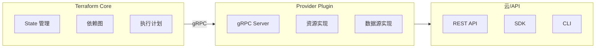

Terraform 的强大之处在于它的可扩展性。通过 Provider，Terraform 可以管理任何资源——只要有人开发了对应的 Provider。

官方 Provider 已经覆盖了主流云厂商，但很多企业有自己的内部平台、遗留系统、特殊硬件……这些都需要自定义 Provider。

开发 Provider 不是一件轻松的事，但它会让你深入理解 Terraform 的工作原理。

## Provider 架构

### Terraform Provider 本质



### Provider 结构

```go title="provider.go"
package main

import (
    "github.com/hashicorp/terraform-plugin-framework/providers"
    "github.com/hashicorp/terraform-plugin-framework/resource"
)

type provider struct {
    version string
}

func New(version string) func() providers.Provider {
    return func() providers.Provider {
        return &provider{
            version: version,
        }
    }
}

func (p *provider) Metadata(ctx context.Context, req providers.MetadataRequest, resp *providers.MetadataResponse) {
    resp.ProviderName = "myprovider"
    resp.ProviderTypeName = "myprovider"
}

func (p *provider) Schema(ctx context.Context, req providers.SchemaRequest, resp *providers.SchemaResponse) {
    resp.Schema = schema.Schema{
        Attributes: map[string]schema.Attribute{
            "endpoint": schema.StringAttribute{
                Required: true,
            },
        },
    }
}

func (p *provider) Resources(ctx context.Context) []func() resource.Resource {
    return []func() resource.Resource{
        NewExampleResource,
    }
}

func (p *provider) Configure(ctx context.Context, req providers.ConfigureRequest, resp *providers.ConfigureResponse) {
    var config struct {
        Endpoint string `tfsdk:"endpoint"`
    }

    resp.Diagnostics.Append(req.Config.Get(ctx, &config)...)
    if resp.Diagnostics.HasError() {
        return
    }

    client := NewClient(config.Endpoint)
    resp.ProviderData = client
}
```

## 环境准备

### 必需工具

```bash title="安装开发工具"
# 安装 Terraform CLI
brew install terraform

# 安装 Go
brew install go

# 安装 tfplugingen
go install github.com/hashicorp/terraform-plugin-cli@latest

# 安装 golangci-lint
brew install golangci-lint
```

### 初始化项目

```bash title="创建 Provider 项目"
# 创建项目目录
mkdir -p terraform-provider-mycompany
cd terraform-provider-mycompany

# 初始化 Go 模块
go mod init github.com/mycompany/terraform-provider-mycompany

# 创建目录结构
mkdir -p internal/provider
mkdir -p internal/client
mkdir -p docs
```

## 资源实现

### 定义资源 Schema

```go title="internal/provider/example_resource.go"
package provider

import (
    "context"

    "github.com/hashicorp/terraform-plugin-framework/resource"
    "github.com/hashicorp/terraform-plugin-framework/resource/schema"
    "github.com/hashicorp/terraform-plugin-framework/resource/schema/stringdefault"
    "github.com/hashicorp/terraform-plugin-framework/schema/validator"
    "github.com/hashicorp/terraform-plugin-framework-validators/stringvalidator"
)

type exampleResource struct {
    client *Client
}

func NewExampleResource() resource.Resource {
    return &exampleResource{}
}

func (r *exampleResource) Metadata(ctx context.Context, req resource.MetadataRequest, resp *resource.MetadataResponse) {
    resp.TypeName = req.ProviderTypeName + "_example"
}

func (r *exampleResource) Schema(ctx context.Context, req resource.SchemaRequest, resp *resource.SchemaResponse) {
    resp.Schema = schema.Schema{
        Description: "管理示例资源",
        Attributes: map[string]schema.Attribute{
            "id": schema.StringAttribute{
                Description: "资源 ID",
                Computed: true,
            },
            "name": schema.StringAttribute{
                Description: "资源名称",
                Required: true,
                Validators: []validator.String{
                    stringvalidator.LengthBetween(3, 50),
                    stringvalidator.RegexMatches(
                        regexp.MustCompile(`^[a-z][a-z0-9-]*$`),
                        "名称必须以小写字母开头",
                    ),
                },
            },
            "type": schema.StringAttribute{
                Description: "资源类型",
                Optional: true,
                Computed: true,
                Default: stringdefault.StaticString("standard"),
                Validators: []validator.String{
                    stringvalidator.OneOf("standard", "premium", "enterprise"),
                },
            },
            "size": schema.StringAttribute{
                Description: "资源大小",
                Optional: true,
                Validators: []validator.String{
                    stringvalidator.OneOf("small", "medium", "large"),
                },
            },
            "tags": schema.MapAttribute{
                Description: "资源标签",
                ElementType: types.StringType,
                Optional: true,
            },
            "endpoint": schema.StringAttribute{
                Description: "API 端点",
                Computed: true,
            },
            "created_at": schema.StringAttribute{
                Description: "创建时间",
                Computed: true,
            },
        },
    }
}

func (r *exampleResource) Configure(ctx context.Context, req resource.ConfigureRequest, resp *resource.ConfigureResponse) {
    if req.ProviderData == nil {
        return
    }

    client, ok := req.ProviderData.(*Client)
    if !ok {
        resp.Diagnostics.AddError(
            "Unexpected Provider Data",
            "Expected *Client",
        )
        return
    }

    r.client = client
}
```

### CRUD 操作

```go title="CRUD 实现"
func (r *exampleResource) Create(ctx context.Context, req resource.CreateRequest, resp *resource.CreateResponse) {
    var plan ExampleResourceModel

    resp.Diagnostics.Append(req.Plan.Get(ctx, &plan)...)
    if resp.Diagnostics.HasError() {
        return
    }

    // 调用 API 创建资源
    createReq := &CreateExampleRequest{
        Name: plan.Name.ValueString(),
        Type: plan.Type.ValueString(),
        Size: plan.Size.ValueString(),
        Tags: convertMapToTags(plan.Tags),
    }

    result, err := r.client.CreateExample(ctx, createReq)
    if err != nil {
        resp.Diagnostics.AddError(
            "Error creating resource",
            err.Error(),
        )
        return
    }

    // 更新状态
    plan.ID = types.StringValue(result.ID)
    plan.Endpoint = types.StringValue(result.Endpoint)
    plan.CreatedAt = types.StringValue(result.CreatedAt)

    resp.Diagnostics.Append(resp.State.Set(ctx, &plan)...)
}

func (r *exampleResource) Read(ctx context.Context, req resource.ReadRequest, resp *resource.ReadResponse) {
    var state ExampleResourceModel

    resp.Diagnostics.Append(req.State.Get(ctx, &state)...)
    if resp.Diagnostics.HasError() {
        return
    }

    // 调用 API 获取最新状态
    result, err := r.client.GetExample(ctx, state.ID.ValueString())
    if err != nil {
        if errors.Is(err, ErrNotFound) {
            resp.State.RemoveResource(ctx)
            return
        }
        resp.Diagnostics.AddError(
            "Error reading resource",
            err.Error(),
        )
        return
    }

    // 更新状态
    state.Name = types.StringValue(result.Name)
    state.Type = types.StringValue(result.Type)
    state.Size = types.StringValue(result.Size)
    state.Tags = convertTagsToMap(result.Tags)
    state.Endpoint = types.StringValue(result.Endpoint)

    resp.Diagnostics.Append(resp.State.Set(ctx, &state)...)
}

func (r *exampleResource) Update(ctx context.Context, req resource.UpdateRequest, resp *resource.UpdateResponse) {
    var plan ExampleResourceModel

    resp.Diagnostics.Append(req.Plan.Get(ctx, &plan)...)
    if resp.Diagnostics.Append(req.State.Get(ctx, &state)...)
    if resp.Diagnostics.HasError() {
        return
    }

    // 调用 API 更新资源
    updateReq := &UpdateExampleRequest{
        Name: plan.Name.ValueString(),
        Type: plan.Type.ValueString(),
        Size: plan.Size.ValueString(),
        Tags: convertMapToTags(plan.Tags),
    }

    result, err := r.client.UpdateExample(ctx, plan.ID.ValueString(), updateReq)
    if err != nil {
        resp.Diagnostics.AddError(
            "Error updating resource",
            err.Error(),
        )
        return
    }

    // 更新状态
    plan.Endpoint = types.StringValue(result.Endpoint)

    resp.Diagnostics.Append(resp.State.Set(ctx, &plan)...)
}

func (r *exampleResource) Delete(ctx context.Context, req resource.DeleteRequest, resp *resource.DeleteResponse) {
    var state ExampleResourceModel

    resp.Diagnostics.Append(req.State.Get(ctx, &state)...)
    if resp.Diagnostics.HasError() {
        return
    }

    // 调用 API 删除资源
    err := r.client.DeleteExample(ctx, state.ID.ValueString())
    if err != nil && !errors.Is(err, ErrNotFound) {
        resp.Diagnostics.AddError(
            "Error deleting resource",
            err.Error(),
        )
        return
    }

    // 重置状态
    resp.State.RemoveResource(ctx)
}
```

## 数据源实现

```go title="数据源实现"
type exampleDataSource struct {
    client *Client
}

func NewExampleDataSource() datasource.DataSource {
    return &exampleDataSource{}
}

func (d *exampleDataSource) Metadata(ctx context.Context, req datasource.MetadataRequest, resp *datasource.MetadataResponse) {
    resp.TypeName = req.ProviderTypeName + "_example"
}

func (d *exampleDataSource) Schema(ctx context.Context, req datasource.SchemaRequest, resp *datasource.SchemaResponse) {
    resp.Schema = schema.Schema{
        Description: "查询示例数据",
        Attributes: map[string]schema.Attribute{
            "id": schema.StringAttribute{
                Description: "资源 ID",
                Required: true,
            },
            "name": schema.StringAttribute{
                Description: "资源名称",
                Computed: true,
            },
            "type": schema.StringAttribute{
                Description: "资源类型",
                Computed: true,
            },
        },
    }
}

func (d *exampleDataSource) Read(ctx context.Context, req datasource.ReadRequest, resp *datasource.ReadResponse) {
    var data ExampleDataSourceModel

    resp.Diagnostics.Append(req.Config.Get(ctx, &data)...)
    if resp.Diagnostics.HasError() {
        return
    }

    result, err := d.client.GetExample(ctx, data.ID.ValueString())
    if err != nil {
        if errors.Is(err, ErrNotFound) {
            resp.Diagnostics.AddError(
                "Resource not found",
                "The requested resource does not exist.",
            )
            return
        }
        resp.Diagnostics.AddError(
            "Error reading resource",
            err.Error(),
        )
        return
    }

    data.Name = types.StringValue(result.Name)
    data.Type = types.StringValue(result.Type)

    resp.Diagnostics.Append(resp.State.Set(ctx, &result)...)
}
```

## 客户端实现

```go title="internal/client/client.go"
package client

import (
    "context"
    "fmt"
    "net/http"
    "time"
)

type Client struct {
    baseURL    string
    httpClient *http.Client
    apiKey     string
}

func New(baseURL, apiKey string) *Client {
    return &Client{
        baseURL: baseURL,
        apiKey:  apiKey,
        httpClient: &http.Client{
            Timeout: 30 * time.Second,
        },
    }
}

type CreateExampleRequest struct {
    Name string
    Type string
    Size string
    Tags map[string]string
}

type ExampleResponse struct {
    ID        string
    Name      string
    Type      string
    Size      string
    Tags      map[string]string
    Endpoint  string
    CreatedAt string
}

func (c *Client) CreateExample(ctx context.Context, req *CreateExampleRequest) (*ExampleResponse, error) {
    // 实现 API 调用逻辑
    return &ExampleResponse{
        ID:        "generated-id",
        Name:      req.Name,
        Type:      req.Type,
        Size:      req.Size,
        Tags:      req.Tags,
        Endpoint:  fmt.Sprintf("https://%s.mycompany.com", req.Name),
        CreatedAt: time.Now().Format(time.RFC3339),
    }, nil
}

func (c *Client) GetExample(ctx context.Context, id string) (*ExampleResponse, error) {
    // 实现 API 调用逻辑
    return nil, nil
}

func (c *Client) UpdateExample(ctx context.Context, id string, req *CreateExampleRequest) (*ExampleResponse, error) {
    // 实现 API 调用逻辑
    return nil, nil
}

func (c *Client) DeleteExample(ctx context.Context, id string) error {
    // 实现 API 调用逻辑
    return nil
}
```

## 构建和发布

### 本地开发测试

```bash title="本地开发测试"
# 构建 Provider
go build -o terraform-provider-mycompany

# 创建开发目录
mkdir -p ~/.terraform.d/plugins/registry.terraform.io/mycompany/mycompany/1.0.0/darwin_arm64

# 复制 Provider
cp terraform-provider-mycompany ~/.terraform.d/plugins/registry.terraform.io/mycompany/mycompany/1.0.0/darwin_arm64/

# 使用 provider 配置
terraform {
  required_providers {
    mycompany = {
      source = "mycompany/mycompany"
    }
  }
}

provider "mycompany" {
  # 配置
}
```

### 交叉编译

```bash title="交叉编译"
# macOS ARM64
GOOS=darwin GOARCH=arm64 go build -o terraform-provider-mycompany_1.0.0_darwin_arm64

# Linux AMD64
GOOS=linux GOARCH=amd64 go build -o terraform-provider-mycompany_1.0.0_linux_amd64

# Windows AMD64
GOOS=windows GOARCH=amd64 go build -o terraform-provider-mycompany_1.0.0_windows_amd64
```

### 发布到 Terraform Registry

```bash title="发布流程"
# 1. 创建 GitHub Release
git tag v1.0.0
git push origin v1.0.0

# 2. 创建 GitHub Release
gh release create v1.0.0 \
    --title "v1.0.0" \
    --notes "Initial release"

# 3. 上传到 GitHub Release
gh release upload v1.0.0 \
    terraform-provider-mycompany_1.0.0_darwin_arm64 \
    terraform-provider-mycompany_1.0.0_linux_amd64 \
    terraform-provider-mycompany_1.0.0_windows_amd64
```

## 测试

### 单元测试

```go title="资源单元测试"
package provider

import (
    "context"
    "testing"

    "github.com/hashicorp/terraform-plugin-framework/resource"
    "github.com/hashicorp/terraform-plugin-framework/resource/schema"
)

func TestExampleResourceSchema(t *testing.T) {
    req := resource.SchemaRequest{}
    resp := &resource.SchemaResponse{}

    r := NewExampleResource()
    r.Schema(context.Background(), req, resp)

    if resp.Diagnostics.HasError() {
        t.Fatalf("Schema creation failed: %s", resp.Diagnostics)
    }

    // 验证 Schema 属性
    if resp.Schema.Attributes["name"] == nil {
        t.Error("Expected 'name' attribute to exist")
    }

    if !resp.Schema.Attributes["id"].(schema.StringAttribute).Computed {
        t.Error("Expected 'id' attribute to be computed")
    }
}
```

### 接受测试

```go title="接受测试"
package provider

import (
    "context"
    "testing"

    "github.com/hashicorp/terraform-plugin-testing/helper/resource"
)

func TestAccExampleResource(t *testing.T) {
    resource.Test(t, resource.TestCase{
        PreCheck:                 func() { testAccPreCheck(t) },
        ProtoV6ProviderFactories: testAccProtoV6ProviderFactories,
        Steps: []resource.TestStep{
            {
                Config: testAccExampleResourceConfig(),
                Check: resource.ComposeAggregateTestCheckFunc(
                    resource.TestCheckResourceAttrSet("mycompany_example.test", "id"),
                    resource.TestCheckResourceAttr("mycompany_example.test", "name", "test"),
                ),
            },
        },
    })
}

func testAccExampleResourceConfig() string {
    return `
resource "mycompany_example" "test" {
    name = "test"
    type = "standard"
    size = "small"
}
`
}
```

## Provider 开发检查清单

| 检查项 | 说明 |
| --- | --- |
| 使用框架 | 使用 terraform-plugin-framework |
| Schema 定义 | 使用强类型 Schema |
| CRUD 操作 | 正确处理创建、读取、更新、删除 |
| 错误处理 | 正确处理资源不存在等错误 |
| 状态验证 | 实现 ImportState 验证 |
| 测试覆盖 | 单元测试 + 接受测试 |
| 文档完善 | 提供使用文档和示例 |
| 版本管理 | 遵循语义化版本 |

开发 Provider 是一项复杂的工程，但通过它可以深入理解 Terraform 的插件架构。记住几个关键点：**Schema 是核心，CRUD 是骨架，客户端是桥梁，测试是保障**。
