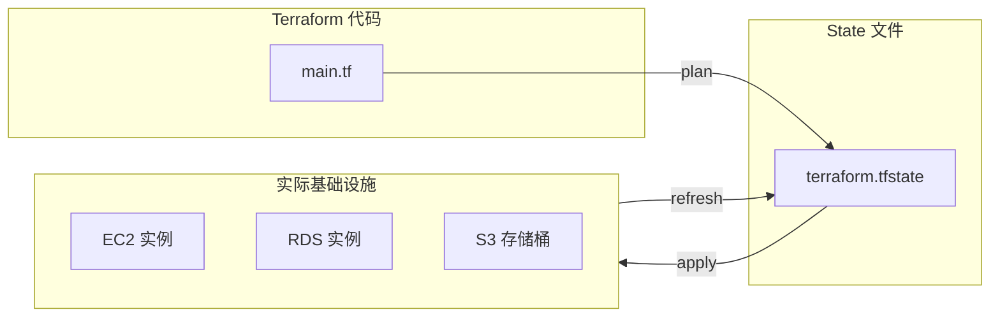

Terraform State 是 Terraform 最重要的组成部分之一，也是最容易出问题的地方。

你可能会遇到这些问题：`terraform apply` 报资源已经存在但代码里没有？两个人同时 apply 导致状态不一致？State 文件损坏导致整个基础设施无法管理？

这些问题的根源在于：**对 State 的理解不够深入**。

## State 是什么

Terraform State 是 Terraform 用于记录**实际基础设施状态**的文件。它是 Terraform 与真实世界之间的桥梁。



### State 的作用

| 作用 | 说明 |
| --- | --- |
| **映射关系** | 代码中的资源 ID 与实际资源对应 |
| **元数据** | 存储创建时间、依赖关系等额外信息 |
| **性能** | 避免每次都查询云 API |
| **协作** | 团队成员共享状态 |

### 默认 State 文件

```bash title="查看 State 文件"
cat terraform.tfstate

# 输出结构
{
  "version": 4,
  "terraform_version": "1.6.0",
  "serial": 1,
  "lineage": "xxxx-xxxx-xxxx",
  "outputs": {},
  "resources": [
    {
      "mode": "managed",
      "type": "aws_instance",
      "name": "web",
      "provider": "provider[\"registry.terraform.io/hashicorp/aws\"]",
      "instances": [
        {
          "schema_version": 1,
          "attributes": {
            "id": "i-xxxxx",
            "ami": "ami-xxxxx",
            "instance_type": "t3.micro",
            "tags": {}
          },
          "depends_on": []
        }
      ]
    }
  ]
}
```

## State 存储后端

### 本地 State（默认）

```hcl title="本地 State 配置"
terraform {
  # 默认使用本地文件系统
  # 无需额外配置
}

# 或者显式配置
terraform {
  backend "local" {
    path = "terraform.tfstate"
  }
}
```

:::warning
**本地 State 的问题**：不适合团队协作，无法锁定状态，无法在 CI/CD 中使用。
:::

### S3 后端（推荐生产环境）

```hcl title="S3 后端配置"
terraform {
  backend "s3" {
    bucket         = "mycompany-terraform-state"
    key            = "prod/networking/terraform.tfstate"
    region         = "us-east-1"
    encrypt        = true
    dynamodb_table = "terraform-locks"
    acl           = "private"
  }
}
```

```bash title="创建 S3 桶和 DynamoDB 表"
# 创建 S3 桶
aws s3 mb s3://mycompany-terraform-state --region us-east-1

# 启用版本控制
aws s3api put-bucket-versioning \
    --bucket mycompany-terraform-state \
    --versioning-configuration Status=Enabled

# 启用服务器端加密
aws s3api put-bucket-encryption \
    --bucket mycompany-terraform-state \
    --server-side-encryption-configuration '{
        "Rules": [{
            "ApplyServerSideEncryptionByDefault": {
                "SSEAlgorithm": "AES256"
            }
        }]
    }'

# 创建 DynamoDB 表（用于状态锁定）
aws dynamodb create-table \
    --table-name terraform-locks \
    --attribute-attributes AttributeName=LockID,AttributeType=S \
    --key-schema AttributeName=LockID,KeyType=HASH \
    --billing-mode PAY_PER_REQUEST
```

### Terraform Cloud 后端

```hcl title="Terraform Cloud 配置"
terraform {
  backend "remote" {
    organization = "mycompany"

    workspaces {
      name = "prod-networking"
    }
  }
}
```

### GCS 后端（Google Cloud）

```hcl title="GCS 后端配置"
terraform {
  backend "gcs" {
    bucket = "mycompany-terraform-state"
    prefix = "prod/networking"
  }
}
```

## State 锁定

State 锁定防止多人同时修改状态：

```bash title="State 锁定示例"
# 锁定时尝试 apply，会报错
Error: Error acquiring the state lock

ConditionalLockFailed: Lock ID: "prod/networking/xxxxxxxx-xxxx-xxxx"
is already held by lock holder "terraform/1.6.0 (darwin/arm64)"
Lock ID: "prod/networking/xxxxxxxx-xxxx-xxxx"
is already held by lock holder "terraform/1.6.0 (darwin/arm64)"
```

### DynamoDB 锁定表结构

```json title="DynamoDB 表结构"
{
  "TableName": "terraform-locks",
  "KeySchema": [
    {
      "AttributeName": "LockID",
      "KeyType": "HASH"
    }
  ],
  "AttributeDefinitions": [
    {
      "AttributeName": "LockID",
      "AttributeType": "S"
    }
  ],
  "BillingMode": "PAY_PER_REQUEST",
  "SSESpecification": {
    "Enabled": true
  }
}
```

### 强制解锁（谨慎使用）

:::danger
**强制解锁可能造成状态损坏**：只有确认持有锁的人已经放弃操作时才能使用。
:::

```bash title="强制解锁"
terraform force-unlock LOCK_ID
```

## State 隔离

### 工作空间隔离

```bash title="工作空间操作"
# 创建工作空间
terraform workspace new staging

# 切换工作空间
terraform workspace select staging

# 列出工作空间
terraform workspace list

# 查看当前工作空间
terraform workspace show
```

```hcl title="使用工作空间的配置"
terraform {
  backend "s3" {
    bucket         = "mycompany-terraform-state"
    key            = "${terraform.workspace}/networking/terraform.tfstate"
    region         = "us-east-1"
    encrypt        = true
    dynamodb_table = "terraform-locks"
  }
}

# 根据环境使用不同的变量
variable "instance_type" {
  type = map(string)
  default = {
    default = "t3.micro"
    staging = "t3.small"
    prod    = "t3.medium"
  }
}

resource "aws_instance" "web" {
  instance_type = var.instance_type[terraform.workspace]
  # ...
}
```

### 目录隔离

```
terraform/
├── globals/
│   ├── main.tf
│   ├── variables.tf
│   └── terraform.tfstate  # 全局资源（VPC）
├── networking/
│   ├── main.tf
│   ├── variables.tf
│   └── terraform.tfstate  # 网络资源
├── apps/
│   ├── main.tf
│   ├── variables.tf
│   └── terraform.tfstate  # 应用资源
└── databases/
    └── ...
```

### 文件隔离 vs 工作空间

| 隔离方式 | 适用场景 | 优点 | 缺点 |
| --- | --- | --- | --- |
| **工作空间** | 环境差异小 | 复用配置 | 状态混淆 |
| **目录隔离** | 不同组件 | 清晰分离 | 配置重复 |

## State 操作

### 查看 State

```bash title="查看 State"
# 查看所有资源
terraform state list

# 查看特定资源
terraform state list aws_instance.web

# 查看资源详情
terraform state show aws_instance.web

# 查看资源属性
terraform state show aws_instance.web.id
```

### 移动资源

```bash title="移动资源到新模块"
# 将 aws_instance.web 移动到 module.web_server
terraform state mv aws_instance.web module.web_server
```

### 引入已有资源

```bash title="引入已有资源"
# 将已存在的 EC2 实例纳入 Terraform 管理
terraform import aws_instance.web i-xxxxx
```

### 删除和重新创建

```bash title="删除和重新创建"
# 删除资源（但不破坏真实资源）
terraform state rm aws_instance.web

# 破坏并重新创建资源
terraform taint aws_instance.web
terraform apply
```

## State 备份

### 自动备份

```bash title="备份 State"
# 手动备份
cp terraform.tfstate terraform.tfstate.backup

# 查看历史版本（S3）
aws s3api list-object-versions \
    --bucket mycompany-terraform-state \
    --prefix prod/networking/terraform.tfstate
```

### 版本控制集成

```bash title="Git 忽略 State 文件"
# .gitignore
*.tfstate
*.tfstate.*

# 但保留 .backup 文件
!.tfstate.backup
```

:::warning
**不要把 State 提交到 Git**：State 可能包含敏感信息（如密码），即使加密存储也不安全。
:::

### State 恢复

```bash title="从备份恢复"
# 停止当前 Terraform 进程
# 备份当前 State
cp terraform.tfstate terraform.tfstate.corrupted

# 恢复备份
cp terraform.tfstate.backup terraform.tfstate

# 验证
terraform plan
```

## State 问题排查

### 常见问题 1：State 落后于实际资源

```bash title="同步 State 与实际资源"
# 刷新 State
terraform refresh

# 查看差异
terraform plan
```

### 常见问题 2：State 锁定无法释放

```bash title="检查锁定状态"
# 查看 DynamoDB 中的锁
aws dynamodb scan \
    --table-name terraform-locks \
    --output json
```

### 常见问题 3：State 文件损坏

```bash title="State 文件损坏修复"
# 1. 找到备份或历史版本
aws s3api list-object-versions \
    --bucket mycompany-terraform-state \
    --prefix prod/networking/terraform.tfstate

# 2. 下载历史版本
aws s3api get-object \
    --bucket mycompany-terraform-state \
    --key "prod/networking/terraform.tfstate" \
    --version-id VERSION_ID \
    terraform.tfstate.restored

# 3. 验证并使用
terraform state push terraform.tfstate.restored
```

## State 安全

### 敏感值处理

```hcl title="敏感变量"
variable "db_password" {
  description = "Database password"
  type        = string
  sensitive   = true
}

output "db_password" {
  value     = var.db_password
  sensitive = true  # 在输出中隐藏
}
```

### State 中的敏感数据

```hcl title="标记敏感资源"
resource "aws_db_instance" "main" {
  # ...
  password = var.db_password
  # Terraform 会自动加密存储在 State 中的敏感属性
}
```

## State 管理检查清单

| 检查项 | 说明 |
| --- | --- |
| 使用远程后端 | 本地 State 不适合团队协作 |
| 启用 State 锁定 | 使用 DynamoDB 或 Terraform Cloud |
| State 版本控制 | 启用 S3 桶版本控制 |
| 加密存储 | 启用服务端加密 |
| 备份策略 | 定期备份并验证可恢复性 |
| 敏感值标记 | 使用 sensitive 属性 |
| 锁定超时 | 设置合理的锁超时时间 |

State 管理是 Terraform 运维的核心。好的 State 管理策略，可以让团队协作更顺畅，基础设施更安全，故障恢复更容易。
