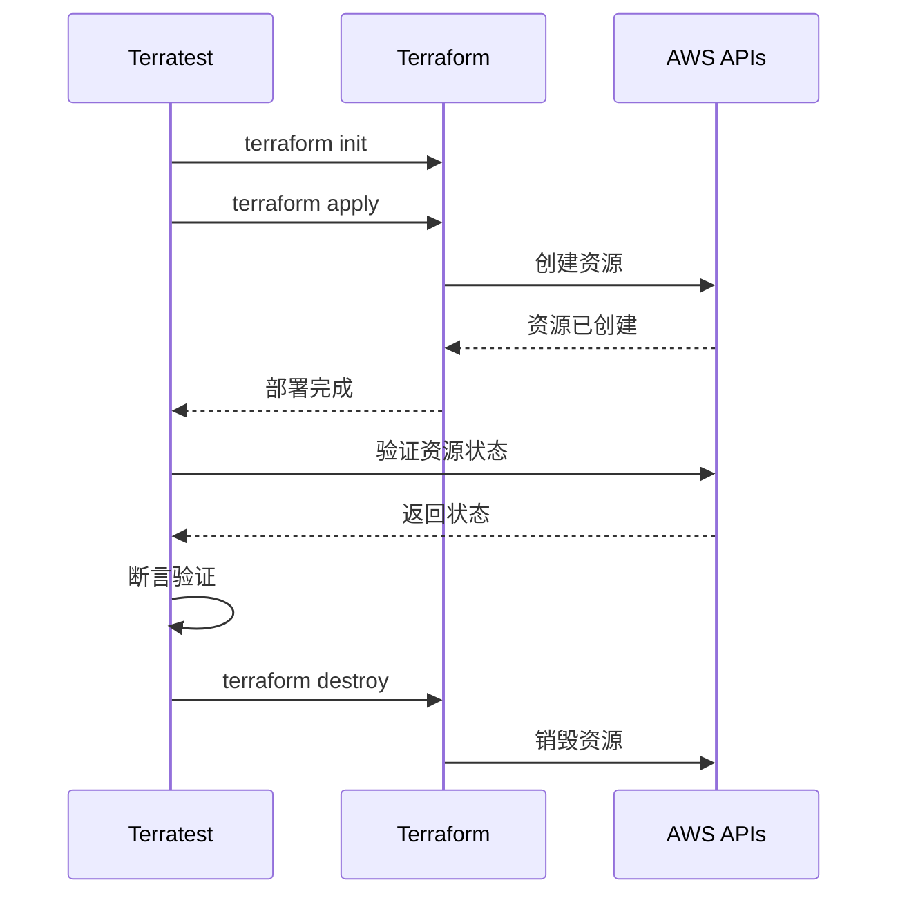

单元测试告诉你「代码是正确的」，但对于基础设施代码，这远远不够。你需要知道：**当 Terraform 真正创建这些资源时，它们能正常工作吗？**

Terratest 是 Gruntwork 开发的 Go 语言测试框架，专门用于测试 Terraform、Packer、Docker、Kubernetes 等基础设施代码。它能**真实部署资源**到云环境，然后验证这些资源的行为是否符合预期。

## Terratest 核心概念

### 测试工作流



### 核心模块

| 模块 | 说明 |
| --- | --- |
| `terraform` | 运行 Terraform 命令 |
| `packer` | 运行 Packer 构建 |
| `docker` | Docker 操作 |
| `k8s` | Kubernetes 操作 |
| `aws` | AWS 服务操作 |
| `http-helper` | HTTP 请求辅助 |
| `retry` | 重试机制 |
| `ssh` | SSH 连接 |

## 环境准备

### 安装依赖

```bash title="安装 Terratest"
# 1. 安装 Go
brew install go

# 2. 创建项目
mkdir my-infra-test && cd my-infra-test
go mod init github.com/myorg/my-infra-test

# 3. 添加 Terratest 依赖
go get github.com/gruntwork-io/terratest/modules/terraform
go get github.com/gruntwork-io/terratest/modules/aws
go get github.com/gruntwork-io/terratest/modules/http-helper
go get github.com/stretchr/testify

# 4. 验证安装
go mod tidy
```

### 项目结构

```
infra-test/
├── examples/                 # Terraform 示例代码
│   ├── vpc/
│   │   ├── main.tf
│   │   ├── variables.tf
│   │   └── outputs.tf
│   └── ec2/
│       └── ...
├── test/                    # Terratest 测试
│   ├── vpc_test.go
│   ├── ec2_test.go
│   └── helpers.go
├── .github/workflows/       # CI/CD
│   └── test.yml
└── Makefile
```

## 基础测试

### VPC 测试

```go title="test/vpc_test.go"
package test

import (
    "testing"

    "github.com/gruntwork-io/terratest/modules/terraform"
    "github.com/stretchr/testify/assert"
)

func TestVpcBasic(t *testing.T) {
    t.Parallel()

    // Terraform 配置
    terraformOptions := &terraform.Options{
        TerraformDir: "../examples/vpc",
        Vars: map[string]interface{}{
            "environment": "test",
            "cidr_block":  "10.99.0.0/16",
        },
        // CI/CD 时使用远程后端
        BackendConfig: map[string]interface{}{
            "dynamodb_table": "terraform-test-locks",
            "bucket":         "my-terraform-state",
        },
    }

    // 测试结束后销毁
    defer terraform.Destroy(t, terraformOptions)

    // 初始化并部署
    terraform.InitAndApply(t, terraformOptions)

    // 获取输出
    vpcId := terraform.Output(t, terraformOptions, "vpc_id")

    // 验证
    assert.NotEmpty(t, vpcId, "VPC ID should not be empty")

    // 验证 CIDR
    vpcCidr := terraform.Output(t, terraformOptions, "vpc_cidr")
    assert.Equal(t, "10.99.0.0/16", vpcCidr)

    // 验证子网数量
    publicSubnetIds := terraform.OutputList(t, terraformOptions, "public_subnet_ids")
    privateSubnetIds := terraform.OutputList(t, terraformOptions, "private_subnet_ids")
    assert.Equal(t, 3, len(publicSubnetIds), "Should have 3 public subnets")
    assert.Equal(t, 3, len(privateSubnetIds), "Should have 3 private subnets")
}
```

### EC2 测试

```go title="test/ec2_test.go"
package test

import (
    "testing"
    "time"

    "github.com/gruntwork-io/terratest/modules/aws"
    "github.com/gruntwork-io/terratest/modules/http-helper"
    "github.com/gruntwork-io/terratest/modules/logger"
    "github.com/gruntwork-io/terratest/modules/retry"
    "github.com/gruntwork-io/terratest/modules/terraform"
    "github.com/stretchr/testify/assert"
    "github.com/stretchr/testify/require"
)

func TestEc2Instance(t *testing.T) {
    t.Parallel()

    terraformOptions := &terraform.Options{
        TerraformDir: "../examples/ec2",
        Vars: map[string]interface{}{
            "environment":    "test",
            "instance_type":  "t3.micro",
        },
    }

    defer terraform.Destroy(t, terraformOptions)
    terraform.InitAndApply(t, terraformOptions)

    // 获取实例 ID
    instanceID := terraform.OutputRequired(t, terraformOptions, "instance_id")
    publicIP := terraform.Output(t, terraformOptions, "public_ip")

    // 验证实例存在
    instance := aws.GetEc2InstanceByID(t, instanceID, "us-east-1")

    assert.Equal(t, "running", *instance.State.Name)
    assert.Equal(t, "t3.micro", *instance.InstanceType)

    // 等待服务启动
    logger.Log(t, "Waiting for instance to be reachable...")

    // 重试机制：等待 SSH 可用
    maxRetries := 30
    timeBetweenRetries := 5 * time.Second

    retry.DoWithRetry(t, "Waiting for SSH", maxRetries, timeBetweenRetries, func() {
        // 验证 HTTP 服务
        httpHelper.HttpGetWithRetry(
            t,
            "http://"+publicIP,
            nil,
            200,
            "Welcome to nginx",
            maxRetries,
            timeBetweenRetries,
        )
    })

    // 验证标签
    tagValue := aws.GetEc2Tag(t, instanceID, "us-east-1", "Environment")
    assert.Equal(t, "test", tagValue)
}
```

## AWS 服务测试

### RDS 测试

```go title="test/rds_test.go"
package test

import (
    "testing"

    "github.com/gruntwork-io/terratest/modules/aws"
    "github.com/gruntwork-io/terratest/modules/terraform"
    "github.com/stretchr/testify/assert"
    "github.com/stretchr/testify/require"
)

func TestRdsInstance(t *testing.T) {
    t.Parallel()

    terraformOptions := &terraform.Options{
        TerraformDir: "../examples/rds",
        Vars: map[string]interface{}{
            "environment":          "test",
            "db_instance_class":    "db.t3.micro",
            "db_allocated_storage": 20,
        },
    }

    defer terraform.Destroy(t, terraformOptions)
    terraform.InitAndApply(t, terraformOptions)

    // 获取输出
    dbEndpoint := terraform.OutputRequired(t, terraformOptions, "endpoint")
    dbPort := terraform.Output(t, terraformOptions, "port")
    dbName := terraform.Output(t, terraformOptions, "db_name")

    // 验证 RDS 状态
    dbInstanceID := terraform.OutputRequired(t, terraformOptions, "db_instance_id")
    dbInstance := aws.GetRdsInstanceDetails(t, dbInstanceID, "us-east-1")

    assert.Equal(t, "available", *dbInstance.DBInstanceStatus)
    assert.Equal(t, "db.t3.micro", *dbInstance.DBInstanceClass)
    assert.Equal(t, 20, *dbInstance.AllocatedStorage)
    assert.True(t, *dbInstance.StorageEncrypted)

    // 验证端点可解析
    assert.NotEmpty(t, dbEndpoint)
    assert.Contains(t, dbEndpoint, ".")

    // 验证多可用区（如果配置了）
    if *dbInstance.MultiAZ {
        assert.Equal(t, 2, len(dbInstance.AvailabilityZones))
    }

    // 验证备份配置
    assert.Equal(t, 1, dbInstance.BackupRetentionPeriod)
}
```

### ALB 测试

```go title="test/alb_test.go"
package test

import (
    "testing"
    "fmt"

    "github.com/gruntwork-io/terratest/modules/aws"
    "github.com/gruntwork-io/terratest/modules/http-helper"
    "github.com/gruntwork-io/terratest/modules/terraform"
    "github.com/stretchr/testify/assert"
    "github.com/stretchr/testify/require"
)

func TestAlb(t *testing.T) {
    t.Parallel()

    terraformOptions := &terraform.Options{
        TerraformDir: "../examples/alb",
        Vars: map[string]interface{}{
            "environment": "test",
        },
    }

    defer terraform.Destroy(t, terraformOptions)
    terraform.InitAndApply(t, terraformOptions)

    // 获取输出
    albDNSName := terraform.OutputRequired(t, terraformOptions, "alb_dns_name")
    albZoneID := terraform.OutputRequired(t, terraformOptions, "alb_zone_id")
    targetGroupArn := terraform.OutputRequired(t, terraformOptions, "target_group_arn")

    // 验证 ALB 状态
    albARN := terraform.OutputRequired(t, terraformOptions, "alb_arn")
    alb := aws.GetLoadBalancerByArn(t, albARN, "us-east-1")

    assert.Equal(t, "active", *alb.State.Code)
    assert.Equal(t, "internet-facing", alb.Scheme)
    assert.Equal(t, 2, len(alb.AvailabilityZones))

    // 验证目标组健康状态
    healthCheck := aws.GetTargetGroupHealthCheck(t, targetGroupArn, "us-east-1")
    assert.Equal(t, "healthy", *healthCheck.TargetHealthDescriptions[0].TargetHealth.State)

    // 验证 DNS 解析
    dnsName := aws.GetDnsName(t, albZoneID, "us-east-1")
    assert.Equal(t, albDNSName, dnsName)

    // HTTP 测试
    url := fmt.Sprintf("http://%s/health", albDNSName)

    // 等待 ALB 完全就绪
    http_helper.HttpGetWithRetryWithCustomValidation(
        t,
        url,
        nil,
        30,
        10 * 1e9, // 10秒
        func(statusCode int, body string) bool {
            return statusCode == 200
        },
    )
}
```

## Packer 测试

```go title="test/packer_test.go"
package test

import (
    "testing"

    "github.com/gruntwork-io/terratest/modules/packer"
    "github.com/gruntwork-io/terratest/modules/aws"
    "github.com/stretchr/testify/assert"
    "github.com/stretchr/testify/require"
)

func TestPackerImage(t *testing.T) {
    t.Parallel()

    // Packer 模板
    packerOptions := &packer.Options{
        TemplatePath: "../examples/packer/web-server.json",
        VarFiles:     []string{"../examples/packer/vars/test.json"},
        Only:         []string{"amazon-ebs"},
    }

    // 构建镜像
    imageID := packer.BuildArtifact(t, packerOptions)

    defer func() {
        // 清理：删除测试镜像
        logger.Log(t, "Cleaning up AMI...")
        aws.DeleteAmi(t, imageID, "us-east-1")
    }()

    // 验证镜像
    ami := aws.GetAmi(t, "us-east-1", imageID)

    assert.Equal(t, "available", *ami.State)
    assert.True(t, *ami.BlockDeviceMappings[0].Ebs.Encrypted)

    // 验证标签
    amiTags := aws.GetAmiTags(t, "us-east-1", imageID)
    assert.Equal(t, "Packer", amiTags["Builder"])
    assert.Contains(t, amiTags["Name"], "web-server")
}
```

## Kubernetes 测试

```go title="test/k8s_test.go"
package test

import (
    "testing"

    "github.com/gruntwork-io/terratest/modules/helm"
    "github.com/gruntwork-io/terratest/modules/k8s"
    "github.com/stretchr/testify/assert"
    "github.com/stretchr/testify/require"
    metav1 "k8s.io/apimachinery/pkg/apis/meta/v1"
)

func TestKubernetesDeployment(t *testing.T) {
    t.Parallel()

    // kubeconfig 路径
    kubeconfigPath := "/path/to/kubeconfig"

    // Helm 部署
    helmOptions := &helm.Options{
        Kubeconfig: kubeconfigPath,
        SetValues: map[string]string{
            "image.repository": "myregistry/web-server",
            "image.tag":        "v1.0.0",
            "replicaCount":     "3",
            "service.type":     "LoadBalancer",
        },
    }

    // 部署 chart
    helmChartPath := "../examples/helm/web-server"
    defer helm.DeleteHelmRelease(t, helmOptions, true, "web-server")

    err := helm.Install(t, helmOptions, helmChartPath, "web-server")
    require.NoError(t, err)

    // 等待 deployment 就绪
    k8s.WaitForDeployment(t, kubeconfigPath, "default", "web-server", 3, 60, 30)

    // 验证 deployment
    deployment := k8s.GetDeployment(t, kubeconfigPath, "default", "web-server")

    assert.Equal(t, int32(3), *deployment.Spec.Replicas)
    assert.Equal(t, "myregistry/web-server", deployment.Spec.Template.Spec.Containers[0].Image)

    // 验证 pod
    pods := k8s.ListPods(t, kubeconfigPath, "default", metav1.ListOptions{
        LabelSelector: "app.kubernetes.io/name=web-server",
    })

    assert.Equal(t, 3, len(pods))

    // 验证所有 pod 都是 Running
    for _, pod := range pods {
        assert.Equal(t, "Running", string(pod.Status.Phase))
    }

    // 验证 service
    service := k8s.GetService(t, kubeconfigPath, "default", "web-server")
    assert.Equal(t, "LoadBalancer", string(service.Spec.Type))
}
```

## 高级特性

### 重试机制

```go title="重试和错误处理"
package test

import (
    "testing"
    "time"

    "github.com/gruntwork-io/terratest/modules/retry"
    "github.com/gruntwork-io/terratest/modules/logger"
    "github.com/stretchr/testify/require"
)

func TestWithRetry(t *testing.T) {
    maxRetries := 5
    timeBetweenRetries := 10 * time.Second

    // 标准重试
    retry.DoWithRetry(t, "Database connection", maxRetries, timeBetweenRetries, func() {
        // 连接数据库
        db := connectToDatabase()
        defer db.Close()

        // 执行查询
        result := db.Query("SELECT 1")
        require.NotNil(t, result)
    })

    // 带自定义验证的重试
    retry.DoWithRetryE(t, "Service health check", maxRetries, timeBetweenRetries, func() (string, error) {
        resp, err := http.Get("http://service/health")
        if err != nil {
            return "", err
        }

        if resp.StatusCode != 200 {
            return "", fmt.Errorf("Expected 200, got %d", resp.StatusCode)
        }

        return "Service is healthy", nil
    })
}
```

### 结构化日志

```go title="日志输出"
package test

import (
    "testing"

    "github.com/gruntwork-io/terratest/modules/logger"
    "github.com/gruntwork-io/terratest/modules/terraform"
)

func TestWithLogging(t *testing.T) {
    terraformOptions := &terraform.Options{
        TerraformDir: "../examples/webapp",

        // 启用详细日志
        Logger: logger.New(logger.Detailed),

        // 或使用默认格式但包含时间戳
        // Logger: logger.Default,

        // 捕获 terraform 输出
        Stdout: true,
        Stderr: true,
    }

    defer terraform.Destroy(t, terraformOptions)
    terraform.InitAndApply(t, terraformOptions)

    // 自定义日志
    logger.Logf(t, "Deployed infrastructure with VPC ID: %s", vpcID)
    logger.Log(t, "Waiting for services to initialize...")
}
```

### 超时配置

```go title="超时控制"
terraformOptions := &terraform.Options{
    TerraformDir: "../examples/complex-infra",

    // 设置超时时间
    Timeouts: &terraform.Timeouts{
        Create: 30 * time.Minute,
        Update: 15 * time.Minute,
        Delete: 10 * time.Minute,
    },
}
```

## 测试组织

### 表驱动测试

```go title="表驱动测试"
package test

import (
    "testing"

    "github.com/gruntwork-io/terratest/modules/terraform"
    "github.com/stretchr/testify/assert"
)

func TestEc2InstanceTypes(t *testing.T) {
    testCases := []struct {
        name        string
        instanceType string
        expectedCPU int
    }{
        {"t3.micro", "t3.micro", 2},
        {"t3.small", "t3.small", 2},
        {"t3.medium", "t3.medium", 2},
        {"t3.large", "t3.large", 2},
        {"m5.large", "m5.large", 2},
    }

    for _, tc := range testCases {
        t.Run(tc.name, func(t *testing.T) {
            t.Parallel()

            terraformOptions := &terraform.Options{
                TerraformDir: "../examples/ec2",
                Vars: map[string]interface{}{
                    "instance_type": tc.instanceType,
                },
            }

            defer terraform.Destroy(t, terraformOptions)
            terraform.InitAndApply(t, terraformOptions)

            instanceID := terraform.OutputRequired(t, terraformOptions, "instance_id")
            instance := aws.GetEc2InstanceByID(t, instanceID, "us-east-1")

            assert.Equal(t, tc.instanceType, *instance.InstanceType)
        })
    }
}
```

### 测试夹具

```go title="测试辅助函数"
package test

import (
    "testing"

    "github.com/gruntwork-io/terratest/modules/terraform"
    "github.com/gruntwork-io/terratest/modules/aws"
)

func setupTestInfrastructure(t *testing.T) (*terraform.Options, string) {
    terraformOptions := &terraform.Options{
        TerraformDir: "../examples/test-fixture",
        Vars: map[string]interface{}{
            "environment": "test",
        },
    }

    terraform.InitAndApply(t, terraformOptions)

    return terraformOptions, terraform.OutputRequired(t, terraformOptions, "vpc_id")
}

func cleanupTestInfrastructure(t *testing.T, opts *terraform.Options) {
    terraform.Destroy(t, opts)
}

func TestWithFixture(t *testing.T) {
    // 使用测试夹具
    opts, vpcID := setupTestInfrastructure(t)
    defer cleanupTestInfrastructure(t, opts)

    // 测试逻辑
    instance := aws.GetEc2InstanceByID(t, terraform.OutputRequired(t, opts, "instance_id"), "us-east-1")
    assert.Contains(t, vpcID, "vpc-")
}
```

## CI/CD 集成

```yaml title="GitHub Actions"
name: Infrastructure Tests

on:
  push:
    branches: [main]
  pull_request:

jobs:
  test:
    runs-on: ubuntu-latest
    steps:
      - uses: actions/checkout@v4

      - name: Setup Go
        uses: actions/setup-go@v5
        with:
          go-version: '1.21'

      - name: Setup Terraform
        uses: hashicorp/setup-terraform@v2
        with:
          terraform_version: 1.7.0

      - name: Configure AWS Credentials
        uses: aws-actions/configure-aws-credentials@v4
        with:
          aws-access-key-id: ${{ secrets.AWS_ACCESS_KEY_ID }}
          aws-secret-access-key: ${{ secrets.AWS_SECRET_ACCESS_KEY }}
          aws-region: us-east-1

      - name: Download dependencies
        run: go mod download

      - name: Run VPC Tests
        run: go test -v -timeout 30m -run TestVpc ./test/

      - name: Run EC2 Tests
        run: go test -v -timeout 30m -run TestEc2 ./test/

      - name: Run RDS Tests
        run: go test -v -timeout 30m -run TestRds ./test/
```

## 常见问题

### 问题一：测试太慢

**解决**：并行运行独立测试

```go
func TestVpc(t *testing.T) {
    t.Parallel()  // 关键：并行执行
    // ...
}
```

### 问题二：测试环境冲突

**解决**：使用唯一标识

```go
terraformOptions := &terraform.Options{
    Vars: map[string]interface{}{
        "project":    "myapp",
        "environment": "test",
        "unique_id": random.UniqueId(),  // 添加唯一后缀
    },
}
```

### 问题三：清理不完整

**解决**：使用 `defer` 确保清理

```go
func TestInfra(t *testing.T) {
    opts := &terraform.Options{...}

    // 确保失败时也清理
    defer terraform.Destroy(t, opts)

    terraform.InitAndApply(t, opts)
    // 测试逻辑...
}
```

## 延伸思考

Terratest 是**生产级 IaC 测试**的标准选择。但需要注意：

1. **成本**：真实部署云资源会产生费用
2. **速度**：完整测试可能需要数十分钟
3. **稳定性**：云 API 有时会超时，需要合理的重试
4. **安全性**：测试代码也需要审查，避免泄露敏感信息

一个好的测试策略：**单元测试快速反馈，集成测试全面覆盖**。

:::info 下一步

- [IaC 测试策略](/cloud-native/iac/testing)：了解完整的测试方法论
- [IaC 与 CI/CD 集成](/cloud-native/iac/cicd-integration)：实现自动化部署流水线
