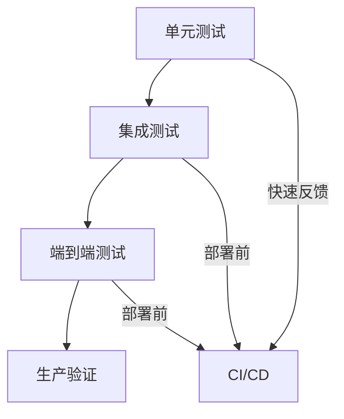

想象一下，你在生产环境执行 `terraform apply`，屏幕上显示：

```
Apply complete! Resources: 1 added, 0 changed, 0 destroyed.
```

你松了一口气。但两周后，你发现这个资源创建时忘记配置加密，数据安全问题浮出水面。

这正是 IaC 缺少测试的后果——问题只在生产环境暴露。

本文探讨如何为 IaC 建立完整的测试策略。

## 测试金字塔



| 层级 | 工具 | 执行时机 | 反馈速度 |
| --- | --- | --- | --- |
| **静态分析** | terraform validate, tflint | 每次提交 | 毫秒级 |
| **单元测试** | Terratest module tests | PR 时 | 秒级 |
| **集成测试** | Terratest e2e tests | 合并后 | 分钟级 |
| **生产监控** | drift detection | 持续运行 | 实时 |

## 静态分析

### terraform validate

```bash
# 基本验证
terraform validate

# 检查所有模块
terraform validate -recursive
```

```hcl title="验证内容"
# 检查项
- 语法正确
- 必需变量定义
- 类型正确
- 引用有效
- 块结构正确
```

### tflint

```bash
# 安装
brew install tflint

# 配置
tflint --init

# 扫描
tflint
```

```hcl title=".tflint.hcl"
config {
  module    = true
  force     = false
}

plugin "aws" {
  source  = "github.com/terraform-linters/tflint-ruleset-aws"
  version = "0.25.0"
}

rule "aws_instance_invalid_type" {
  enabled = true
}

rule "terraform_deprecated_interpolation" {
  enabled = true
}
```

```bash
# tflint 输出
$ tflint

Issue report format: pretty
================================================
3 issue(s) are required to fix:
────────────────────────────────────────────────
Warning - aws_instance_invalid_type on main.tf line 1
  aws_instance has an invalid type "t3.mega". Use one of: t3.nano, t3.micro, t3.small, t3.medium, etc.

Warning - terraform_documented_outputs on outputs.tf line 1
  Output "vpc_id" is not documented.

Warning - terraform_documented_variables on variables.tf line 1
  Variable "region" is not documented.
```

### Checkov

```bash
# 安装
pip install checkov

# 扫描 Terraform 文件
checkov -f main.tf

# 扫描目录
checkov -d ./terraform/
```

```bash
# 扫描结果
       _        _             _
   ____| _____| |__       __| |__
  / __| |/ / _ \ _ \_____|__   __|
 | |__|   <  __/ __/ |_____| | |__
  \___|_|\_\___|___/        |_|

Passed: 12 | Failed: 3 | Skipped: 0

Check: CKV_AWS_79: "Ensure Instance Metadata Service IMDSv2 is enabled"
  FAILED for resource: aws_instance.web

Check: CKV_AWS_41: "Ensure no hard coded AWS secret access key and secret token in use"
  PASSED for resource: aws_instance.web

Check: CKV_TF_1: "Terraform module source should use pin to exact version"
  FAILED for resource: module.vpc
```

### tfsec

```bash
# 安装
brew install tfsec

# 扫描
tfsec .
```

```bash
# tfsec 输出
Result: 2 problems (1 critical, 1 medium)

✗ [CRITICAL] S3 bucket has no encryption enabled.
  Bucket: my-terraform-state
  [SECURITY-TEST-001]

✗ [MEDIUM] RDS instance does not have backup enabled.
  Instance: my-db
  [AWS-0076]
```

## 单元测试

### Terraform Test Framework

```hcl title="tests/unit.tftest.hcl"
mock_provider "aws" {}

run "test_vpc_creation" {
  command = plan

  assert {
    condition     = aws_vpc.main.cidr_block == "10.0.0.0/16"
    error_message = "VPC CIDR should be 10.0.0.0/16"
  }

  assert {
    condition     = aws_vpc.main.enable_dns_hostnames == true
    error_message = "DNS hostnames should be enabled"
  }
}
```

```hcl title="tests/setup.tftest.hcl"
mock_provider "aws" {}

variables {
  vpc_cidr = "10.0.0.0/16"
  environment = "test"
}

run "test_vpc_exists" {
  command = plan

  assert {
    condition     = aws_vpc.main.id != ""
    error_message = "VPC should be created"
  }
}
```

### 运行测试

```bash
# Terraform 1.6+ 内置测试
terraform test

# 或指定测试文件
terraform test ./tests/
```

## Terratest

### 项目结构

```
modules/
└── networking/
    ├── main.tf
    ├── variables.tf
    ├── outputs.tf
    ├── versions.tf
    ├── examples/
    │   └── complete/
    │       ├── main.tf
    │       └── variables.tf
    └── test/
        └── networking_test.go
```

### 第一个测试

```go title="test/networking_test.go"
package test

import (
    "testing"

    "github.com/stretchr/testify/assert"
    "github.com/gruntwork-io/terratest/modules/terraform"
)

func TestNetworkingModule(t *testing.T) {
    // 1. 配置 Terraform 选项
    terraformOptions := &terraform.Options{
        TerraformDir: "./examples/complete",
        Vars: map[string]interface{}{
            "environment": "test",
            "vpc_cidr":    "10.10.0.0/16",
        },
        BackendConfig: map[string]interface{}{
            "dynamodb_table": "terraform-locks",
        },
    }

    // 2. 测试完成后销毁资源
    defer terraform.Destroy(t, terraformOptions)

    // 3. 初始化并应用
    terraform.InitAndApply(t, terraformOptions)

    // 4. 验证结果
    vpcId := terraform.Output(t, terraformOptions, "vpc_id")
    assert.NotEmpty(t, vpcId, "VPC ID should not be empty")
}
```

### 完整测试示例

```go title="test/vpc_test.go"
package test

import (
    "testing"

    "github.com/stretchr/testify/assert"
    "github.com/gruntwork-io/terratest/modules/aws"
    "github.com/gruntwork-io/terratest/modules/terraform"
)

func TestVpcModule(t *testing.T) {
    terraformOptions := &terraform.Options{
        TerraformDir: "./examples/complete",
        Vars: map[string]interface{}{
            "environment": "test",
            "vpc_cidr":    "10.10.0.0/16",
            "availability_zones": []string{"us-east-1a", "us-east-1b"},
        },
    }

    defer terraform.Destroy(t, terraformOptions)
    terraform.InitAndApply(t, terraformOptions)

    t.Run("VPC exists", func(t *testing.T) {
        vpcId := terraform.Output(t, terraformOptions, "vpc_id")
        assert.NotEmpty(t, vpcId)

        // 验证 VPC 实际存在
        vpcInfo := aws.GetVpcById(t, vpcId, "us-east-1")
        assert.Equal(t, "10.10.0.0/16", *vpcInfo.CidrBlock)
    })

    t.Run("Subnets created", func(t *testing.T) {
        publicSubnetIds := terraform.OutputList(t, terraformOptions, "public_subnet_ids")
        privateSubnetIds := terraform.OutputList(t, terraformOptions, "private_subnet_ids")

        assert.Equal(t, 2, len(publicSubnetIds))
        assert.Equal(t, 2, len(privateSubnetIds))

        // 验证子网在正确的 AZ
        for _, subnetId := range publicSubnetIds {
            subnetInfo := aws.GetSubnetById(t, subnetId, "us-east-1")
            assert.Contains(t, []string{"us-east-1a", "us-east-1b"}, *subnetInfo.AvailabilityZone)
        }
    })

    t.Run("Tags applied", func(t *testing.T) {
        tags := terraform.OutputMap(t, terraformOptions, "vpc_tags")
        assert.Equal(t, "test", tags["environment"])
    })
}
```

### 集成测试

```go title="test/integration_test.go"
package test

import (
    "fmt"
    "testing"

    "github.com/stretchr/testify/require"
    "github.com/gruntwork-io/terratest/modules/http-helper"
    "github.com/gruntwork-io/terratest/modules/terraform"
)

func TestWebServerIntegration(t *testing.T) {
    terraformOptions := &terraform.Options{
        TerraformDir: "./examples/webserver",
        Vars: map[string]interface{}{
            "environment": "test",
        },
    }

    defer terraform.Destroy(t, terraformOptions)
    terraform.InitAndApply(t, terraformOptions)

    // 获取负载均衡器地址
    albUrl := terraform.OutputRequired(t, terraformOptions, "alb_url")

    // 等待服务启动
    maxRetries := 30
    retryInterval := 10

    http_helper.HttpGetWithRetry(
        t,
        albUrl,
        nil,
        maxRetries,
        retryInterval,
    )

    // 验证响应
    statusCode := http_helper.HttpGet(t, albUrl, nil)
    require.Equal(t, 200, statusCode)
}
```

### 性能和压力测试

```go title="test/performance_test.go"
package test

import (
    "testing"
    "time"

    "github.com/gruntwork-io/terratest/modules/terraform"
)

func TestAutoScalingPerformance(t *testing.T) {
    terraformOptions := &terraform.Options{
        TerraformDir: "./examples/asg",
        Vars: map[string]interface{}{
            "min_size":         1,
            "max_size":         10,
            "desired_capacity": 1,
        },
    }

    defer terraform.Destroy(t, terraformOptions)
    terraform.InitAndApply(t, terraformOptions)

    // 获取 ASG 名称
    asgName := terraform.OutputRequired(t, terraformOptions, "asg_name")

    // 模拟负载测试
    startTime := time.Now()

    // 增加实例
    terraform.Apply(t, terraform.WithRetry(
        terraformOptions,
        terraform.WithVars(map[string]interface{}{
            "min_size":         5,
            "max_size":         10,
            "desired_capacity": 5,
        }),
    ))

    // 等待扩容完成
    time.Sleep(2 * time.Minute)

    elapsed := time.Since(startTime)
    t.Logf("Scaling took: %v", elapsed)

    // 验证新实例数量
    instanceCount := terraform.OutputList(t, terraformOptions, "instance_ids")
    require.Equal(t, 5, len(instanceCount))
}
```

## 测试最佳实践

### 测试隔离

```go title="测试隔离"
func TestWithUniquePrefix(t *testing.T) {
    uniqueId := random.UniqueId()

    terraformOptions := &terraform.Options{
        TerraformDir: "./examples/complete",
        Vars: map[string]interface{}{
            "environment": "test",
            "name_prefix": uniqueId,  // 唯一的名称前缀
        },
    }

    // 确保清理
    defer terraform.Destroy(t, terraformOptions)
}
```

### 并行测试

```bash
# 并行运行测试
go test -v -parallel 4 ./test/...

# 限制并发
-TF_TEST_PARALLELISM=2
```

### 测试数据

```go title="测试数据工厂"
package test

import (
    "github.com/gruntwork-io/terratest/modules/random"
)

func RandomShortName(prefix string) string {
    return fmt.Sprintf("%s-%s", prefix, random.UniqueId()[:8])
}

func TestWithRandomNames(t *testing.T) {
    bucketName := RandomShortName("test-bucket")

    terraformOptions := &terraform.Options{
        TerraformDir: "./examples/s3",
        Vars: map[string]interface{}{
            "bucket_name": bucketName,
        },
    }
}
```

## CI/CD 集成

### GitHub Actions

```yaml title=".github/workflows/test.yml"
name: IaC Tests

on:
  push:
    branches: [main]
  pull_request:
    paths:
      - '**/*.tf'
      - '**/*.go'
      - '**/go.mod'

jobs:
  validate:
    runs-on: ubuntu-latest
    steps:
      - uses: actions/checkout@v3

      - name: Setup Terraform
        uses: hashicorp/setup-terraform@v2
        with:
          terraform_version: 1.5.0

      - name: Terraform Format Check
        run: terraform fmt -check -recursive

      - name: Terraform Init
        run: terraform init -recursive

      - name: Terraform Validate
        run: terraform validate -recursive

  security-scan:
    runs-on: ubuntu-latest
    steps:
      - uses: actions/checkout@v3

      - name: Run tfsec
        uses: aquasecurity/tfsec-action@v1

      - name: Run Checkov
        uses: bridgecrewio/checkov-action@master
        with:
          directory: .
          framework: terraform

  unit-test:
    runs-on: ubuntu-latest
    steps:
      - uses: actions/checkout@v3

      - name: Setup Go
        uses: actions/setup-go@v4
        with:
          go-version: '1.21'

      - name: Run Unit Tests
        run: go test -v -short ./test/...

  integration-test:
    runs-on: ubuntu-latest
    if: github.event_name == 'push'
    steps:
      - uses: actions/checkout@v3

      - name: Setup Go
        uses: actions/setup-go@v4
        with:
          go-version: '1.21'

      - name: Configure AWS
        uses: aws-actions/configure-aws-credentials@v2
        with:
          aws-access-key-id: ${{ secrets.AWS_ACCESS_KEY_ID }}
          aws-secret-access-key: ${{ secrets.AWS_SECRET_ACCESS_KEY }}
          aws-region: us-east-1

      - name: Run Integration Tests
        env:
          AWS_DEFAULT_REGION: us-east-1
        run: |
          go mod download
          go test -v -timeout 30m ./test/...
```

## 测试报告

### 覆盖率报告

```bash
# 生成覆盖率报告
go test -coverprofile=coverage.out ./...

# 查看覆盖率
go tool cover -html=coverage.out

# 合并覆盖率
go tool cover -func=coverage.out
```

### JUnit XML

```go title="JUnit 输出"
func TestWithJUnitOutput(t *testing.T) {
    // 使用 testify-junit 或自定义报告
}
```

```xml title="JUnit 报告"
<testsuites name="terraform-tests">
  <testsuite name="TestVpcModule" tests="3" failures="0">
    <testcase name="VPC exists" classname="TestVpcModule" time="12.5s"/>
    <testcase name="Subnets created" classname="TestVpcModule" time="8.2s"/>
    <testcase name="Tags applied" classname="TestVpcModule" time="2.1s"/>
  </testsuite>
</testsuites>
```

## 总结

IaC 测试的关键要点：

1. **测试金字塔**：静态分析 → 单元测试 → 集成测试
2. **自动化**：所有测试集成到 CI/CD
3. **隔离**：测试环境独立，使用唯一标识
4. **快速反馈**：静态分析在提交时运行
5. **生产监控**：Drift 检测持续运行

:::info 下一步

想深入学习 Terratest？请阅读 [Terratest 基础设施测试](/cloud-native/iac/terratest)。
:::
