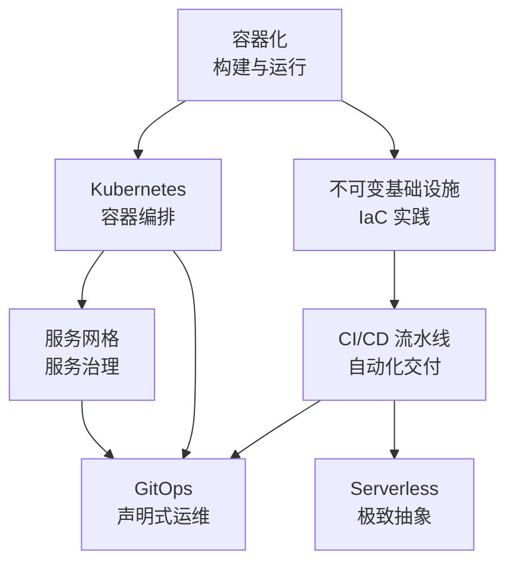

# 云原生与基础设施

云原生（Cloud Native）是当今软件架构的主流范式，它不仅仅是「把应用跑在云上」，而是一整套从开发方法论到技术栈的彻底变革。当我们谈论云原生时，我们谈论的是：如何用容器化打破环境壁垒、如何用 Kubernetes 实现声明式的集群管理、如何用服务网格把治理逻辑下沉到基础设施、如何用 GitOps 让交付流程可复现、如何用 Serverless 让开发者只关心业务逻辑。

本模块聚焦云原生技术栈的六大核心领域：容器化、Kubernetes 架构、服务网格、不可变基础设施与 IaC、CI/CD 流水线、Serverless。无论你是准备在生产环境落地云原生技术，还是准备架构师面试，这套知识体系都是绕不开的基础。

## 模块结构

本模块按主题分为 6 个子模块：

| 子模块 | 核心问题 | 典型场景 |
| --- | --- | --- |
| 容器化 | 如何构建一致的应用交付环境 | Docker 镜像构建/多阶段构建/容器安全 |
| Kubernetes 架构 | 如何管理大规模容器集群 | Pod 调度/服务发现/弹性伸缩/Operator |
| 服务网格 | 如何治理服务间通信 | 流量管理/mTLS/可观测性 |
| 不可变基础设施与 IaC | 如何用代码管理基础设施 | Terraform/Pulumi/Packer/GitOps |
| CI/CD 流水线 | 如何实现自动化、可重复的交付 | ArgoCD/Flux/Jenkins/GitHub Actions |
| Serverless | 如何让开发者只关心业务逻辑 | FaaS/冷启动优化/事件驱动 |

## 核心演进路径

云原生技术的学习顺序建议如下：

## 学习建议

1. **从容器化入手**：理解镜像、容器、Namespace、Cgroup 等基础概念，这是整个云原生技术栈的地基
2. **深入 Kubernetes**：Kubernetes 是云原生的核心，掌握它需要理解控制平面、工作节点、核心资源、调度机制
3. **结合实践学习**：每个概念都要动手实验，光看文档不敲命令，永远学不会
4. **理解权衡分析**：每个技术都有适用场景和局限性，学会问「什么时候不该用」比「什么时候该用」更重要

准备好开始了吗？让我们从容器化开始，探索云原生的技术世界。
