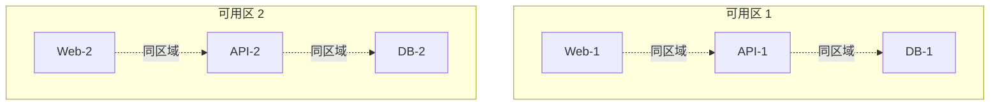

# 调度策略与亲和性

你有没有想过，为什么某些 Pod 总是被调度到一起（或分开）？

**Kubernetes 的亲和性机制，让你能够精细控制 Pod 的调度位置。**

## 亲和性概述

Kubernetes 支持两种亲和性：

| 类型 | 作用 | 说明 |
| --- | --- | --- |
| **节点亲和性** | 控制 Pod 与节点的关系 | 类似节点选择器，但更强大 |
| **Pod 亲和性** | 控制 Pod 与 Pod 的关系 | 用于共同调度或分散调度 |
| **Pod 反亲和性** | 避免 Pod 与 Pod 的关系 | 用于高可用分散 |

## 节点亲和性

### 基本语法

```yaml
spec:
  affinity:
    nodeAffinity:
      requiredDuringSchedulingIgnoredDuringExecution:
        # 必须满足的条件
        nodeSelectorTerms:
        - matchExpressions:
          - key: topology.kubernetes.io/zone
            operator: In
            values:
            - us-east-1a
            - us-east-1b
      preferredDuringSchedulingIgnoredDuringExecution:
        # 优先满足的条件
        - weight: 1
          preference:
            matchExpressions:
            - key: disktype
              operator: In
              values:
              - ssd
```

### 操作符

| 操作符 | 说明 |
| --- | --- |
| **In** | 值在列表中 |
| **NotIn** | 值不在列表中 |
| **Exists** | 键存在（不检查值） |
| **DoesNotExist** | 键不存在 |
| **Gt** | 大于（数值） |
| **Lt** | 小于（数值） |

### 与节点选择器对比

```yaml
# 节点选择器（简单）
spec:
  nodeSelector:
    disktype: ssd
    zone: us-east-1a

# 节点亲和性（强大）
spec:
  affinity:
    nodeAffinity:
      requiredDuringSchedulingIgnoredDuringExecution:
        nodeSelectorTerms:
        - matchExpressions:
          - key: zone
            operator: In
            values:
            - us-east-1a
            - us-east-1b
      preferredDuringSchedulingIgnoredDuringExecution:
      - weight: 50
        preference:
          matchExpressions:
          - key: disktype
            operator: In
            values:
            - ssd
```

## Pod 亲和性与反亲和性

### Pod 亲和性

让 Pod 倾向于调度到具有特定标签的 Pod 所在节点：

```yaml
spec:
  affinity:
    podAffinity:
      requiredDuringSchedulingIgnoredDuringExecution:
      - labelSelector:
          matchExpressions:
          - key: app
            operator: In
            values:
            - database
        topologyKey: kubernetes.io/hostname
```

### Pod 反亲和性

让 Pod 倾向于调度到远离特定标签的 Pod 所在节点：

```yaml
spec:
  affinity:
    podAntiAffinity:
      requiredDuringSchedulingIgnoredDuringExecution:
      - labelSelector:
          matchExpressions:
          - key: app
            operator: In
            values:
            - cache
        topologyKey: kubernetes.io/hostname
```

### 拓扑键（Topology Key）

拓扑键定义了「拓扑域」的概念：

| 拓扑键 | 说明 |
| --- | --- |
| `kubernetes.io/hostname` | 同一主机 |
| `topology.kubernetes.io/zone` | 同一可用区 |
| `topology.kubernetes.io/region` | 同一区域 |
| ` topology.kubernetes.io/os` | 同一操作系统 |

## 使用场景

### 场景一：Web + API + Database 架构



```yaml title="web-pod.yaml"
# Web 层：尽量分散
spec:
  affinity:
    podAntiAffinity:
      requiredDuringSchedulingIgnoredDuringExecution:
      - labelSelector:
          matchExpressions:
          - key: app
            operator: In
            values:
            - web
        topologyKey: kubernetes.io/hostname
    podAffinity:
      preferredDuringSchedulingIgnoredDuringExecution:
      - weight: 100
        podAffinityTerm:
          labelSelector:
            matchExpressions:
            - key: app
              operator: In
              values:
              - api
          topologyKey: topology.kubernetes.io/zone
```

```yaml title="api-pod.yaml"
# API 层：与 Web 同区域，与 Database 同区域
spec:
  affinity:
    podAffinity:
      requiredDuringSchedulingIgnoredDuringExecution:
      - labelSelector:
          matchExpressions:
          - key: tier
            operator: In
            values:
            - database
            - frontend
        topologyKey: topology.kubernetes.io/zone
```

### 场景二：缓存服务高可用

```yaml title="redis-pod.yaml"
# Redis Pod：确保不在同一节点
spec:
  affinity:
    podAntiAffinity:
      requiredDuringSchedulingIgnoredDuringExecution:
      - labelSelector:
          matchExpressions:
          - key: app
            operator: In
            values:
            - redis
        topologyKey: kubernetes.io/hostname
    nodeAffinity:
      preferredDuringSchedulingIgnoredDuringExecution:
      - weight: 50
        preference:
          matchExpressions:
          - key: node-type
            operator: In
            values:
            - memory-optimized
```

### 场景三：GPU 训练任务

```yaml title="gpu-training-pod.yaml"
spec:
  affinity:
    nodeAffinity:
      requiredDuringSchedulingIgnoredDuringExecution:
        nodeSelectorTerms:
        - matchExpressions:
          - key: nvidia.com/gpu
            operator: Exists
      preferredDuringSchedulingIgnoredDuringExecution:
      - weight: 100
        preference:
          matchExpressions:
          - key: nvidia.com/gpu-count
            operator: Gt
            values:
            - "4"
```

## Topology Spread Constraints

### 基本配置

```yaml
spec:
  topologySpreadConstraints:
  - maxSkew: 1
    topologyKey: topology.kubernetes.io/zone
    whenUnsatisfiable: DoNotSchedule
    labelSelector:
      matchLabels:
        app: nginx
```

| 字段 | 说明 |
| --- | --- |
| `maxSkew` | 最大分布不均匀程度 |
| `topologyKey` | 拓扑键 |
| `whenUnsatisfiable` | 不可满足时的行为 |
| `labelSelector` | 选择要统计的 Pod |

### 多维度分布

```yaml
spec:
  topologySpreadConstraints:
  # 按可用区分散
  - maxSkew: 1
    topologyKey: topology.kubernetes.io/zone
    whenUnsatisfiable: DoNotSchedule
    labelSelector:
      matchLabels:
        app: api

  # 按节点分散
  - maxSkew: 2
    topologyKey: kubernetes.io/hostname
    whenUnsatisfiable: ScheduleAnyway
    labelSelector:
      matchLabels:
        app: api
```

### whenUnsatisfiable 选项

| 选项 | 说明 |
| --- | --- |
| **DoNotSchedule** | 不调度（硬约束） |
| **ScheduleAnyway** | 仍调度，但优先选择更平衡的节点 |

## 软硬约束

| 类型 | 前缀 | 说明 |
| --- | --- | --- |
| **硬约束** | `requiredDuringScheduling` | 必须满足，否则不调度 |
| **软约束** | `preferredDuringScheduling` | 尽量满足，不满足也可调度 |

```yaml
# 硬约束：不满足则不调度
requiredDuringSchedulingIgnoredDuringExecution:
  nodeSelectorTerms:
  - matchExpressions:
    - key: zone
      operator: In
      values:
      - us-east-1a

# 软约束：尽量满足
preferredDuringSchedulingIgnoredDuringExecution:
- weight: 100
  preference:
    matchExpressions:
    - key: ssd
      operator: Exists
```

## 常见问题

### Pod 调度失败

```bash
# 查看失败原因
kubectl describe pod <pod-name> | grep -A 10 "Events:"

# 常见原因：
# - 硬约束无法满足
# - 拓扑分布约束冲突
```

### 调度不均衡

```bash
# 检查拓扑分布
kubectl get pods -o wide | head -20

# 查看节点标签
kubectl get nodes --show-labels
```

### 与污点冲突

```bash
# 查看节点污点
kubectl describe node <node-name> | grep Taints

# 常见冲突：
# - Pod 需要 GPU 节点
# - GPU 节点有 dedicated=gpu:NoSchedule
# - 需要添加对应的容忍
```

## 最佳实践

### 1. 优先使用软约束

```yaml
# 推荐：使用软约束
preferredDuringSchedulingIgnoredDuringExecution:

# 避免：硬约束太多
requiredDuringSchedulingIgnoredDuringExecution:
```

### 2. 合理设置权重

```yaml
preferredDuringSchedulingIgnoredDuringExecution:
# 高权重：重要偏好
- weight: 100
  preference:
    matchExpressions:
    - key: ssd
      operator: Exists

# 低权重：一般偏好
- weight: 1
  preference:
    matchExpressions:
    - key: zone
      operator: In
      values:
      - us-east-1a
```

### 3. 配合污点使用

```yaml
# 节点添加污点
kubectl taint nodes node1 dedicated=ai:NoSchedule

# Pod 添加容忍
spec:
  tolerations:
  - key: dedicated
    operator: Equal
    value: ai
    effect: NoSchedule
```

### 4. 测试验证

```bash
# 查看调度模拟结果
kubectl describe node <node-name> | grep -A 20 "Allocated resources"

# 使用 cordon 测试
kubectl cordon <node-name>
kubectl uncordon <node-name>
```

## 延伸思考

亲和性机制让 Kubernetes 的调度变得极其灵活：

1. **拓扑感知**：理解数据中心拓扑结构
2. **协同调度**：让相关组件更紧密
3. **高可用分散**：确保故障隔离

但过度使用亲和性也会带来问题：

1. **调度困难**：约束太多可能导致 Pod 无法调度
2. **资源浪费**：为了满足约束可能牺牲资源效率
3. **运维复杂**：增加故障排查难度

建议只在真正需要时才使用硬约束，大多数场景使用软约束即可。

## 延伸阅读

- [Kubernetes 调度器原理](./scheduler)：调度器内部机制
- [污点与容忍](./taint-toleration)：节点污点管理
- [HPA（水平自动伸缩）](./hpa)：自动扩缩容
