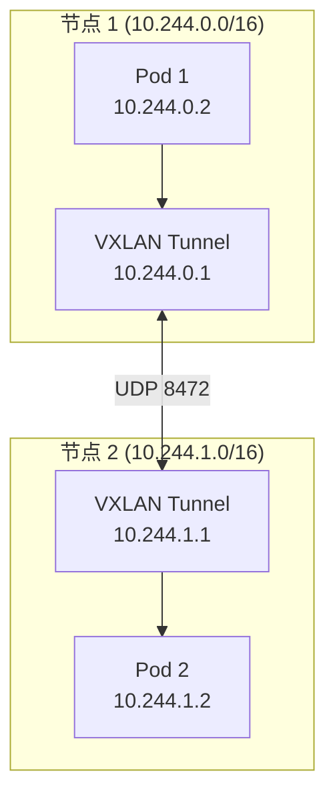
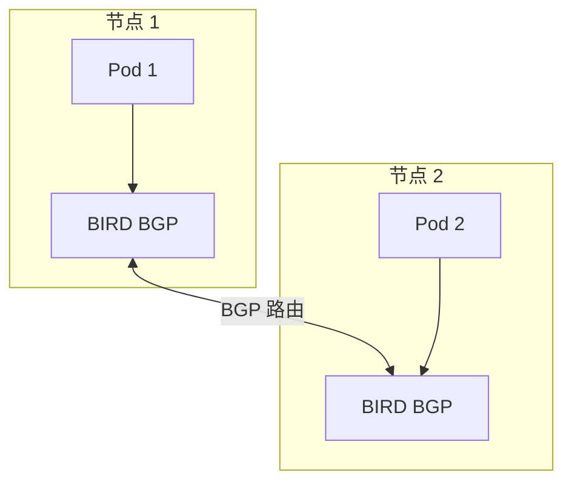
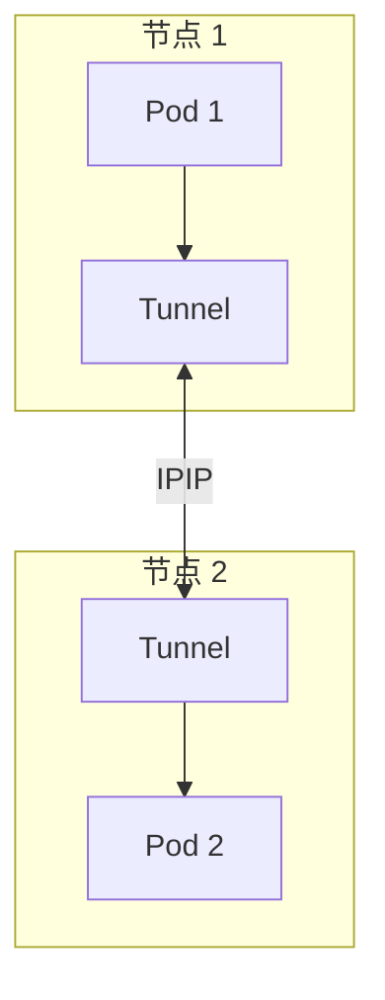
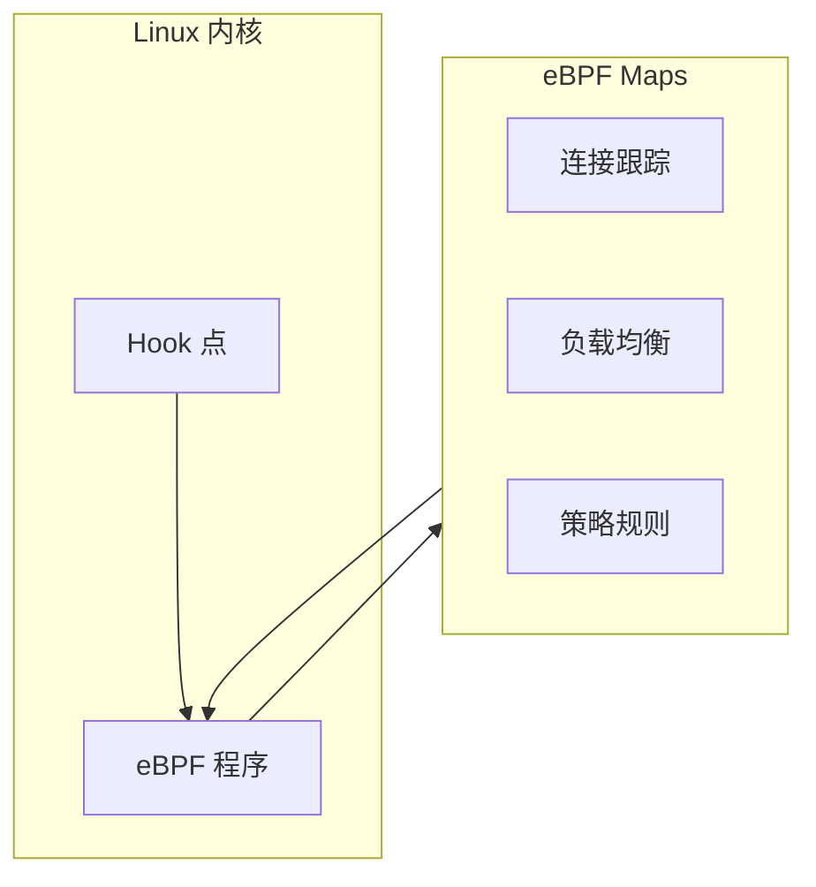
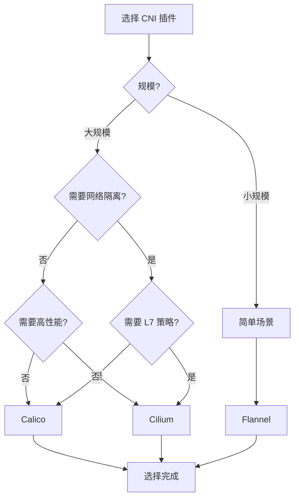

# CNI 插件对比

Kubernetes 本身不提供网络实现，它定义了 CNI（Container Network Interface）标准，由第三方插件来实现网络功能。

选择合适的 CNI 插件，是部署 Kubernetes 集群的关键决策之一。

## CNI 概述

CNI 定义了容器网络接口标准：

1. **ADD**：为容器添加网络接口
2. **DEL**：删除容器的网络接口
3. **CHECK**：检查容器的网络配置

```mermaid
flowchart LR
    subgraph Kubelet
        K["kubelet"]
    end

    subgraph CNI["CNI 插件"]
        CNI["CNI Plugin\n(Flannel/Calico/Cilium)"]
    end

    subgraph Network["底层网络"]
        N1["Overlay Network"]
        N2["BGP/路由"]
        N3["eBPF"]
    end

    K -->|"调用 CNI"| CNI
    CNI --> N1
    CNI --> N2
    CNI --> N3
```

## Flannel

### 特点

Flannel 是最简单的 CNI 插件之一，专注于提供扁平的网络覆盖（Overlay Network）。

| 特性 | 说明 |
| --- | --- |
| **网络模型** | VXLAN 覆盖网络 |
| **配置复杂度** | 低 |
| **性能** | 中等（VXLAN 开销） |
| **功能** | 基本网络，不支持网络策略 |
| **适用场景** | 小规模集群，简单部署 |

### 工作原理



### 安装配置

```bash
# 使用 kubeadm 安装 Flannel
kubectl apply -f https://raw.githubusercontent.com/flannel-io/flannel/master/Documentation/kube-flannel.yml

# 或者使用 helm
helm install flannel flannel/flannel --set podCidr=10.244.0.0/16
```

```yaml title="kube-flannel.yml"
net-conf.json: |
  {
    "Network": "10.244.0.0/16",
    "Backend": {
      "Type": "vxlan"
    }
  }
```

### 优缺点

| 优点 | 缺点 |
| --- | --- |
| 简单易用 | 不支持网络策略 |
| 资源占用低 | 性能受 VXLAN 开销影响 |
| 社区成熟 | 不支持高级路由 |
| 广泛兼容 | 无法与底层网络集成 |

## Calico

### 特点

Calico 是功能最丰富的 CNI 插件之一，支持 BGP 路由和网络策略。

| 特性 | 说明 |
| --- | --- |
| **网络模型** | BGP 路由或 IPIP 覆盖网络 |
| **配置复杂度** | 中等 |
| **性能** | 高（BGP 直通） |
| **功能** | 网络策略、流量管理、QOS |
| **适用场景** | 中大规模集群，需要网络隔离 |

### 工作原理

#### BGP 直通模式



#### IPIP 覆盖模式



### 安装配置

```bash
# 使用 helm 安装 Calico
helm repo add projectcalico https://projectcalico.docs.tigera.io/charts
helm install calico projectcalico/tigera-operator

# 或使用 kubectl
kubectl apply -f https://docs.projectcalico.io/manifests/calico.yaml
```

```yaml title="calico-config.yaml"
apiVersion: operator.tigera.io/v1
kind: Installation
metadata:
  name: default
spec:
  cni:
    type: Calico
  calicoNetwork:
    ipPools:
    - cidr: 10.244.0.0/16
      encapsulation: VXLANCrossSubnet  # 跨子网用 VXLAN
    nodeAddressAutodetectionV4:
      firstFound: true
  flexVolumePath: /usr/libexec/kubernetes/kubelet-plugins/volume/exec/
```

### 网络策略示例

```yaml title="calico-networkpolicy.yaml"
apiVersion: projectcalico.org/v3
kind: NetworkPolicy
metadata:
  name: web-policy
  namespace: production
spec:
  selector: app == "web"
  types:
  - Ingress
  - Egress
  ingress:
  - action: Allow
    protocol: TCP
    source:
      selector: role == "frontend"
    destination:
      ports:
      - 80
  - action: Deny
  egress:
  - action: Allow
    to:
    - serviceAccounts:
        name: dns
```

### 优缺点

| 优点 | 缺点 |
| --- | --- |
| 功能丰富 | 配置复杂 |
| 高性能（BGP 直通） | BGP 需要网络设备支持 |
| 强大的网络策略 | 默认占用较多资源 |
| 可视化和监控 | 学习曲线陡峭 |

## Cilium

### 特点

Cilium 是基于 eBPF 的高性能网络插件，提供深度可观测性和安全性。

| 特性 | 说明 |
| --- | --- |
| **网络模型** | eBPF |
| **配置复杂度** | 中等 |
| **性能** | 极高（内核级处理） |
| **功能** | 网络策略、可观测性、负载均衡 |
| **适用场景** | 大规模集群，需要深度可观测性 |

### eBPF 原理



### 安装配置

```bash
# 使用 helm 安装 Cilium
helm repo add cilium https://helm.cilium.io
helm install cilium cilium/cilium \
  --namespace kube-system \
  --set kubeProxyReplacement=partial \
  --set k8sServiceHost=api-server \
  --set k8sServicePort=443
```

```yaml title="cilium-config.yaml"
apiVersion: helm.cilium.io/v1alpha1
kind: CiliumHelmSpec
metadata:
  namespace: kube-system
spec:
  ipam:
    mode: cluster-pool
    clusterPoolIPv4PodCIDRList:
    - 10.244.0.0/16
  kubeProxyReplacement: partial
  k8sServiceHost: api-server
  k8sServicePort: 443
```

### Hubble 可观测性

```bash
# 部署 Hubble
helm upgrade cilium cilium/cilium \
  --namespace kube-system \
  --reuse-values \
  --set hubble.enabled=true \
  --set hubble.ui.enabled=true

# 查看流量
kubectl exec -it -n kube-system deployment/cilium-operator -- cilium hubble observe
```

### 优缺点

| 优点 | 缺点 |
| --- | --- |
| 极高性能 | 需要内核支持 eBPF |
| 深度可观测性 | 学习曲线较陡 |
| 零信任安全 | 文档相对较少 |
| 透明加密 | 特定内核版本要求 |

## 功能对比

| 特性 | Flannel | Calico | Cilium |
| --- | --- | --- | --- |
| **覆盖网络** | ✓ VXLAN | ✓ VXLAN/IPIP | ✓ VXLAN/GENEVE |
| **路由直通** | ✗ | ✓ BGP | ✓ eBPF |
| **网络策略** | ✗ | ✓ K8s + Calico | ✓ K8s + L7 |
| **流量加密** | ✗ | ✓ WireGuard | ✓ WireGuard/IPsec |
| **负载均衡** | ✗ | ✗ | ✓ kube-proxy 替代 |
| **可观测性** | ✗ | ✓ Felix | ✓ Hubble |
| **性能** | 中等 | 高 | 极高 |
| **配置复杂度** | 低 | 中等 | 中等 |

## 选型指南



### 推荐场景

| 场景 | 推荐 |
| --- | --- |
| 开发测试环境 | Flannel |
| 小规模生产集群 | Flannel 或 Calico |
| 需要网络策略 | Calico 或 Cilium |
| 大规模高性能集群 | Cilium |
| 多云/混合云 | Calico |
| 严格安全要求 | Cilium |

## 常见问题

### Flannel

```bash
# 查看 Flannel 日志
kubectl logs -n kube-system -l app=flannel
```

### Calico

```bash
# 检查 Calico 状态
kubectl get pods -n calico-system
calicoctl node status

# 查看 BGP 对等关系
calicoctl bgp peer
```

### Cilium

```bash
# 检查 Cilium 状态
cilium status
cilium connectivity test

# 查看端点
cilium endpoint list
```

## 延伸思考

选择 CNI 插件需要考虑几个关键因素：

1. **功能需求**：是否需要网络策略？
2. **性能要求**：对网络延迟的敏感度
3. **运维能力**：团队的 CNI 配置和维护能力
4. **生态系统**：与其他工具的兼容性

Flannel 是入门的好选择，Calico 适合需要网络隔离的场景，Cilium 是大规模高性能集群的最佳选择。

## 延伸阅读

- [Kubernetes 网络模型](./network-model)：网络基础原理
- [NetworkPolicy 网络策略](./network-policy)：流量控制
- [服务网格概述](/cloud-native/service-mesh/overview)：Cilium 与 Istio 的结合
