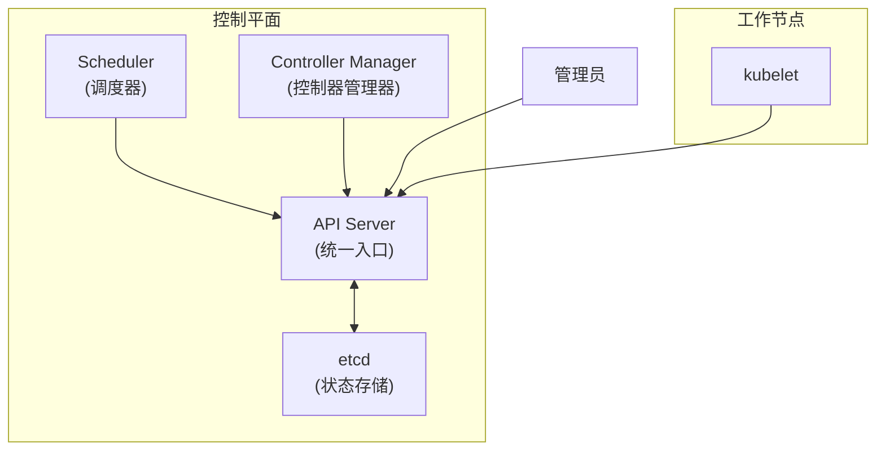
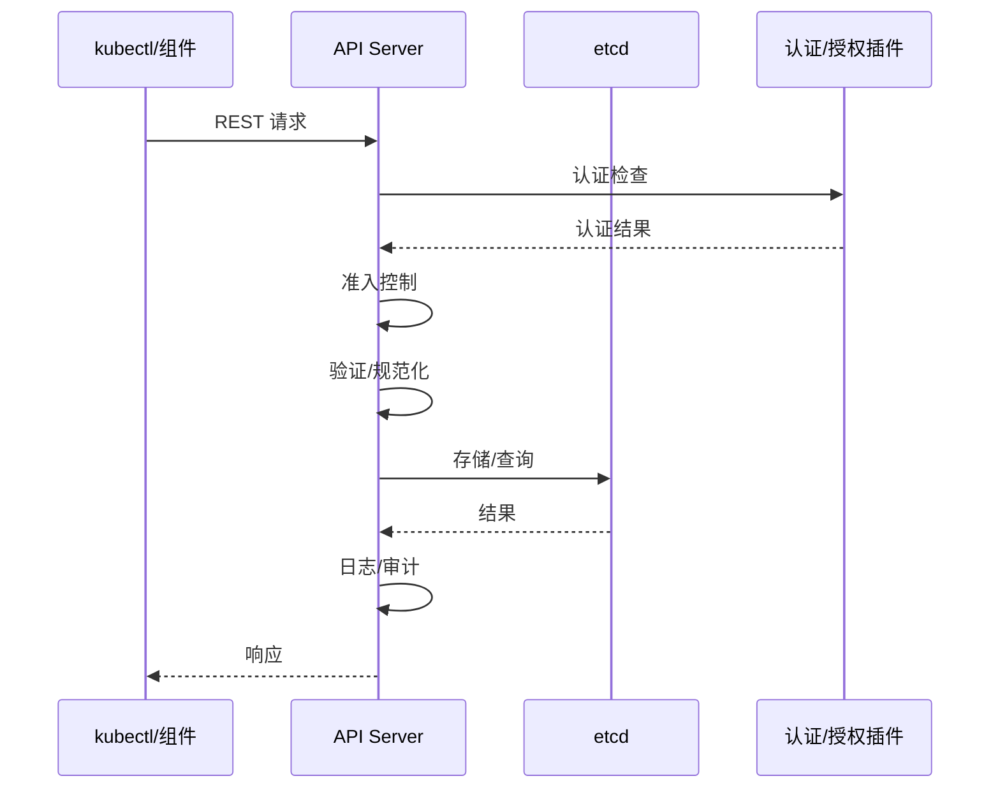
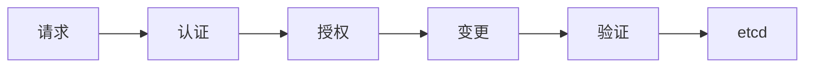
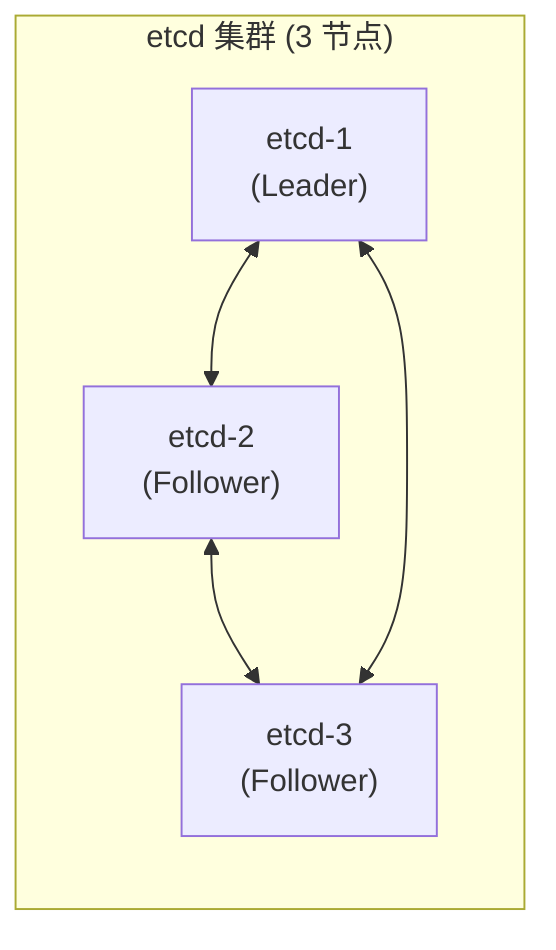
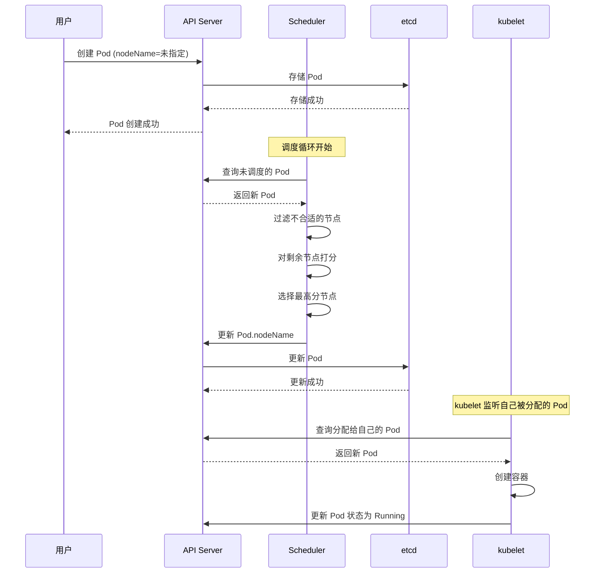
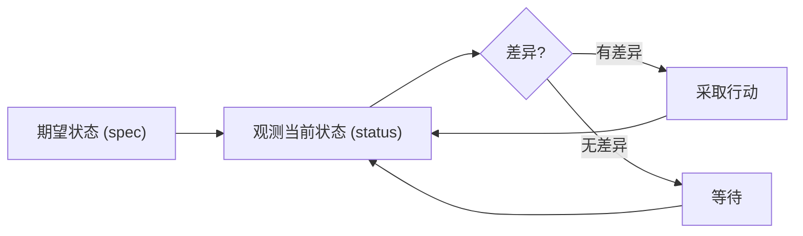
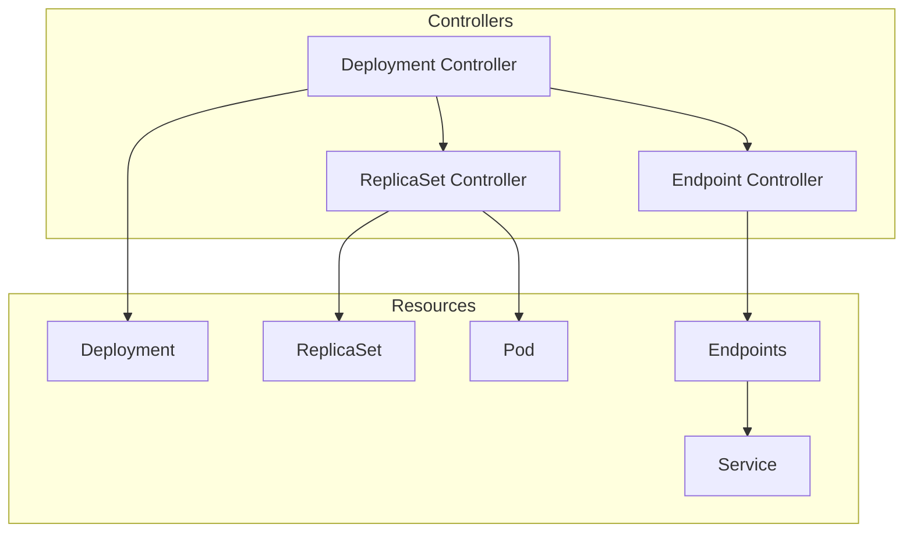

# 控制平面组件

想象一下，如果一座城市没有中央控制中心会怎样？交通信号互不协调，供水系统各自为政，紧急服务无法统一调度。Kubernetes 的控制平面就是这座「城市」的大脑，它协调着集群内的所有资源，确保每一件事都按照预期运行。

2018 年，Kubernetes 的一个 API Server 漏洞（ CVE-2018-1002105）让整个社区意识到：**控制平面的安全性，就是整个集群安全性的基石**。攻击者只需要一个合法的 Pod 权限，就可以通过 API Server 的后门直接访问后端数据。这个漏洞的发现，让人们重新审视控制平面组件的设计和安全。

## 控制平面概述

控制平面由四个核心组件组成：

| 组件 | 作用 |
| --- | --- |
| **API Server** | 集群的统一 HTTP API 入口，处理所有 RESTful 操作 |
| **etcd** | 高可用的键值存储，保存集群所有状态数据 |
| **Scheduler** | 负责将 Pod 调度到合适的工作节点 |
| **Controller Manager** | 运行各种控制器，维护集群期望状态 |



### 控制平面的重要性

控制平面是整个 Kubernetes 集群的「指挥中心」：

1. **单点故障 = 集群不可用**：如果 API Server 宕机，所有 kubectl 命令都会失败，新 Pod 无法调度
2. **数据丢失 = 状态丢失**：如果 etcd 数据丢失，集群的所有配置和状态都会丢失
3. **调度器故障 = 资源浪费或负载不均**：新 Pod 可能在性能不足的节点上运行

:::danger
生产环境中，控制平面必须高可用部署。建议至少 3 个 etcd 节点、3 个 API Server 节点，分布在不同的可用区。
:::

## API Server

### 架构设计

API Server 是 Kubernetes 集群的**唯一入口**。所有组件——kubectl、kubelet、scheduler、controller——都只与 API Server 通信，组件之间不直接通信。



这种设计有几个关键优势：

1. **单一信任边界**：所有请求都经过统一的认证授权
2. **可审计**：所有操作都有完整的审计日志
3. **松耦合**：组件可以独立演进，不相互依赖

### 认证（Authentication）

API Server 支持多种认证插件：

| 插件 | 说明 | 适用场景 |
| --- | --- | --- |
| **X509 客户端证书** | 使用 TLS 证书认证 | Kubernetes 组件之间通信 |
| **Bearer Token** | 使用 JWT Token 认证 | ServiceAccount |
| **Bootstrap Token** | 用于新节点加入集群 | Node bootstrap |
| **OIDC** | 集成外部身份提供商 | 企业 SSO |
| **Webhook** | 外部认证服务 | 自定义认证逻辑 |

```bash
# 查看 API Server 的认证配置
kubectl describe pod kube-apiserver -n kube-system
```

### 授权（Authorization）

API Server 支持多种授权模式：

```yaml title="kube-apiserver 配置"
--authorization-mode=Node,RBAC
```

| 模式 | 说明 |
| --- | --- |
| **RBAC** | 基于角色的访问控制（最常用） |
| **ABAC** | 基于属性的访问控制 |
| **Node** | 允许 kubelet 访问其自身节点的资源 |
| **Webhook** | 外部授权服务 |

### 准入控制（Admission Control）

准入控制器在对象写入 etcd 之前拦截请求，可以**修改**或**验证**请求。



常见的准入控制器：

| 控制器 | 作用 |
| --- | --- |
| **NamespaceLifecycle** | 防止删除系统保留命名空间 |
| **LimitRanger** | 强制资源限制 |
| **ServiceAccount** | 自动挂载 ServiceAccount Token |
| **DefaultStorageClass** | 为 PVC 设置默认 StorageClass |
| **ResourceQuota** | 限制命名空间资源使用 |
| **PodSecurityPolicy** | 强制 Pod 安全策略 |

:::info
准入控制器分为两类：**变更（Mutating）**和**验证（Validating）**。变更控制器可以修改请求对象，验证控制器只能拒绝或允许请求。
:::

### REST API

API Server 暴露的 REST API 是 Kubernetes 的核心接口：

```bash
# 获取所有 Pod（使用 curl，需要 Bearer Token）
curl -k -H "Authorization: Bearer $TOKEN" \
  https://api-server/api/v1/namespaces/default/pods

# 使用 kubectl proxy 代理（不需要认证）
kubectl proxy --port=8001 &
curl http://localhost:8001/api/v1/namespaces/default/pods
```

API Server 的 API 遵循 Kubernetes 的版本化设计：

```bash
# API 版本路径
/api/v1           # 核心 API（Pod、Service、Node 等）
/apis/apps/v1     # 应用 API（Deployment、StatefulSet 等）
/apis/networking.k8s.io/v1  # 网络 API（Ingress、NetworkPolicy）
```

## etcd

### 什么是 etcd？

etcd 是一个基于 Raft 共识算法实现的**分布式键值存储**，专为配置共享和服务发现而设计。它是 Kubernetes 的「记忆」，保存着集群的所有状态数据。

:::info
etcd 使用 Raft 共识算法保证数据一致性。Raft 的核心思想是将共识问题分解为三个子问题：Leader 选举、日志复制、安全性。详细内容可参考 [Raft 算法详解](/distributed-theory/consensus/raft)。
:::

### 数据存储

etcd 存储 Kubernetes 对象的方式是**层次化的键路径**：

```bash
# 键路径示例
/kubernetes.io/minions/node-1                          # 节点信息
/kubernetes.io/services/default/nginx                   # Service 信息
ubernetes.io/pods/default/nginx-7ff6fb8c58-x4r2z        # Pod 信息
```

这种设计使得：

1. **按命名空间查询**：可以快速获取某个命名空间下的所有资源
2. **按类型查询**：可以快速获取某种类型的所有资源
3. **Watcher 支持**：支持高效的资源变更监听

### 高可用配置

生产环境的 etcd 必须高可用部署：



```bash
# etcd 集群配置示例
ETCD_NAME=etcd-1
ETCD_INITIAL_CLUSTER_STATE=new
ETCD_INITIAL_CLUSTER_TOKEN=k8s-etcd-cluster
ETCD_INITIAL_CLUSTER=etcd-1=https://10.0.0.1:2380,etcd-2=https://10.0.0.2:2380,etcd-3=https://10.0.0.3:2380
ETCD_ADVERTISE_CLIENT_URLS=https://10.0.0.1:2379
ETCD_LISTEN_PEER_URLS=https://0.0.0.0:2380
```

:::warning
etcd 的数据目录必须使用 SSD。etcd 的写入性能直接决定了 Kubernetes API 的响应速度。如果 etcd 使用机械硬盘，会严重影响集群性能。
:::

### 备份与恢复

```bash
# 备份 etcd
ETCDCTL_API=3 etcdctl snapshot save snapshot.db \
  --endpoints=https://127.0.0.1:2379 \
  --cacert=/etc/kubernetes/pki/etcd/ca.crt \
  --cert=/etc/kubernetes/pki/etcd/server.crt \
  --key=/etc/kubernetes/pki/etcd/server.key

# 恢复 etcd
ETCDCTL_API=3 etcdctl snapshot restore snapshot.db \
  --data-dir=/var/lib/etcd/restore
```

## Scheduler

### 调度流程

当用户创建一个 Pod 时，调度器的工作是将这个 Pod 绑定到最合适的工作节点上。



### 调度策略

调度器的工作可以分为两个阶段：

#### 阶段一：预选（Filtering）

预选阶段过滤掉**不满足 Pod 需求的节点**。常见的预选条件：

| 谓词 | 说明 |
| --- | --- |
| **PodFitsResources** | 节点有足够的 CPU、内存 |
| **PodFitsHostPorts** | 节点没有冲突的端口 |
| **HostName** | Pod 指定了 nodeName |
| **MatchNodeSelector** | Pod 有节点选择器 |
| **NoVolumeZoneConflict** | Pod 的 Volume 不在节点可用区冲突 |
| **MaxEBSVolumeCount** | EBS 卷数量不超过限制 |
| **MaxGCEPDVolumeCount** | GCE PD 卷数量不超过限制 |
| **MaxAzureDiskVolumeCount** | Azure 磁盘数量不超过限制 |

#### 阶段二：打分（Scoring）

预选阶段后，剩余的节点进入打分阶段。调度器根据多个因素给节点打分：

| 优先级 | 说明 |
| --- | --- |
| **SelectorSpreadPriority** | 优先将 Pod 分散到不同拓扑域 |
| **InterPodAffinityPriority** | 考虑 Pod 亲和性/反亲和性 |
| ** LeastRequestedPriority** | 优先调度到资源使用率低的节点 |
| **BalancedResourceAllocation** | 平衡 CPU 和内存使用率 |
| **NodePreferAvoidPodsPriority** | 避免调度到有 `scheduler.alpha.kubernetes.io/preferAvoidPods` 注解的节点 |

### 自定义调度

Kubernetes 支持自定义调度器：

```yaml title="custom-scheduler-pod.yaml"
apiVersion: v1
kind: Pod
metadata:
  name: nginx
spec:
  schedulerName: my-custom-scheduler  # 指定调度器
  containers:
  - name: nginx
    image: nginx:1.25
```

## Controller Manager

### 控制器模式

Controller Manager 运行着多个**控制器**，每个控制器都是**控制循环**的实现：



### 核心控制器

| 控制器 | 作用 |
| --- | --- |
| **Node Controller** | 监控节点状态，标记不可用节点 |
| **Replication Controller** | 确保 Pod 副本数符合期望（已被 Deployment 替代） |
| **Deployment Controller** | 管理 Deployment 和 ReplicaSet |
| **StatefulSet Controller** | 管理 StatefulSet |
| **DaemonSet Controller** | 确保每个节点运行一个 Pod |
| **Job Controller** | 管理 Job，追踪进度 |
| **CronJob Controller** | 管理定时 Job |
| **Service Controller** | 管理 LoadBalancer 类型的 Service |
| **Endpoint Controller** | 自动更新 Service 的端点 |
| **Namespace Controller** | 清理已删除命名空间的资源 |
| **PV Controller** | 管理 PersistentVolumeClaim 的绑定 |
| **TTL Controller** | 清理已完成的 Job |

### 控制器协同



以 Deployment 为例：

1. **Deployment 控制器**创建 ReplicaSet，监听 Deployment 变更
2. **ReplicaSet 控制器**创建/删除 Pod，监听 ReplicaSet 变更
3. **Endpoint 控制器**更新 Service 的 Endpoints，监听 Pod 变更

## 常见问题

### 控制平面组件的端口

| 组件 | 端口 | 协议 | 用途 |
| --- | --- | --- | --- |
| API Server | 6443 | HTTPS | 集群内部组件通信 |
| etcd | 2379 | HTTPS | 客户端通信 |
| etcd | 2380 | HTTPS | Peer 通信 |
| Scheduler | 10251 | HTTP | 健康检查 |
| Controller Manager | 10252 | HTTP | 健康检查 |

### etcd 与 API Server 通信问题

如果 API Server 无法连接 etcd，可能的原因：

1. **etcd 节点宕机**：检查 etcd 服务状态
2. **网络不通**：检查防火墙规则
3. **证书过期**：检查证书有效期
4. **磁盘空间不足**：etcd 需要足够的磁盘空间

### Scheduler 调度缓慢

如果 Pod 调度时间过长，可能的原因：

1. **节点数量过多**：调度器需要遍历所有节点
2. **预选/打分策略过于复杂**：自定义调度器可能导致性能问题
3. **资源碎片化**：大量小请求无法找到合适的节点

## 延伸思考

控制平面的设计哲学，体现了分布式系统的几个核心原则：

1. **中心化协调**：虽然分布式系统强调去中心化，但协调本身需要一个中心
2. **状态存储的重要性**：分布式系统的「真相」只有一个来源
3. **控制循环的价值**：持续对比、持续调整，是维护系统稳定性的关键

但控制平面也是 Kubernetes 的**单点风险**。如果控制平面不可用，整个集群就无法管理。这也是为什么 Kubernetes 如此强调控制平面的高可用部署。

## 延伸阅读

- [Kubernetes 调度器原理](./scheduler)：深入了解调度器的调度算法
- [etcd 架构](/distributed-theory/consensus/raft)：了解 etcd 的 Raft 实现
- [Kubernetes 故障排查](./troubleshooting)：当控制平面出问题时如何排查
