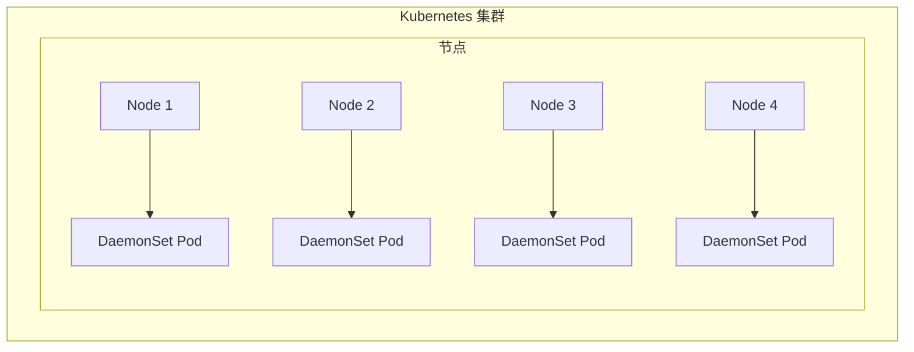
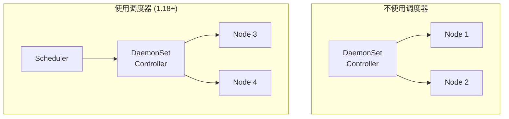

# DaemonSet 守护进程

想象一下，你需要部署一个日志收集代理到集群中的每一台机器上。你会怎么做？

手动在每个节点上部署？太繁琐，且无法自动扩展。
用 Deployment？但 Deployment 无法保证每个节点都运行一个副本。

**DaemonSet 就是来解决这个问题的。**

## DaemonSet 是什么？

DaemonSet 确保**所有（或部分）节点**上都运行一个 Pod 副本。当新节点加入集群时，Pod 会被自动调度到新节点；当节点离开集群时，Pod 会被自动回收。

DaemonSet 的典型用途：

- **日志收集代理**：Fluentd、Logstash、Filebeat
- **监控代理**：Prometheus Node Exporter、Datadog Agent
- **网络插件**：Calico、Flannel 的节点组件
- **存储守护进程**：GlusterFS、Ceph 的客户端
- **日志聚合器**：kube-state-metrics



## 创建 DaemonSet

```yaml title="filebeat-daemonset.yaml"
apiVersion: apps/v1
kind: DaemonSet
metadata:
  name: filebeat
  labels:
    app: filebeat
spec:
  selector:
    matchLabels:
      app: filebeat
  template:
    metadata:
      labels:
        app: filebeat
    spec:
      containers:
      - name: filebeat
        image: elastic/filebeat:8.11.0
        args:
        - -e
        - --strict.perms=false
        env:
        - name: ELASTICSEARCH_HOST
          value: elasticsearch.default.svc.cluster.local
        - name: LOG_DIRS
          value: /var/log/containers/*.log
        securityContext:
          runAsUser: 0
          privileged: true
        volumeMounts:
        - name: varlogcontainers
          mountPath: /var/log/containers
          readOnly: true
        - name: varlogpods
          mountPath: /var/log/pods
          readOnly: true
        - name: filebeat-config
          mountPath: /usr/share/filebeat/filebeat.yml
          subPath: filebeat.yml
      volumes:
      - name: varlogcontainers
        hostPath:
          path: /var/log/containers
      - name: varlogpods
        hostPath:
          path: /var/log/pods
      - name: filebeat-config
        configMap:
          name: filebeat-config
```

```bash
# 创建 DaemonSet
kubectl apply -f filebeat-daemonset.yaml

# 查看 DaemonSet
kubectl get daemonset
# NAME      DESIRED   CURRENT   READY   UP-TO-DATE   AVAILABLE   AGE
# filebeat  4         4         4       4            4           1m

# 查看 Pod
kubectl get pods -l app=filebeat
# NAME            READY   STATUS    RESTARTS   AGE
# filebeat-abcde  1/1     Running   0          1m
# filebeat-fghij  1/1     Running   0          1m
# filebeat-klmno  1/1     Running   0          1m
# filebeat-pqrst  1/1     Running   0          1m
```

## DaemonSet 的调度机制

### 默认调度

默认情况下，DaemonSet 的 Pod 由 DaemonSet 控制器直接调度，**不经过默认调度器**。这确保了即使调度器有问题，DaemonSet Pod 也能正常调度。



### 调度器集成（Kubernetes 1.18+）

从 Kubernetes 1.18 开始，可以通过配置让 DaemonSet 使用默认调度器：

```yaml title="daemonset-with-scheduler.yaml"
spec:
  schedulerName: default-scheduler
```

这种模式下，DaemonSet Pod 会经过调度器的预选和打分阶段，可以利用调度器的亲和性、反亲和性等高级特性。

## 节点选择

### nodeSelector

```yaml
spec:
  template:
    spec:
      nodeSelector:
        disktype: ssd
```

只会在有 `disktype=ssd` 标签的节点上运行。

### 节点亲和性

```yaml
spec:
  template:
    spec:
      affinity:
        nodeAffinity:
          requiredDuringSchedulingIgnoredDuringExecution:
            nodeSelectorTerms:
            - matchExpressions:
              - key: topology.kubernetes.io/zone
                operator: In
                values:
                - us-east-1a
                - us-east-1b
          preferredDuringSchedulingIgnoredDuringExecution:
          - weight: 1
            preference:
              matchExpressions:
              - key: node.kubernetes.io/instance-type
                operator: In
                values:
                - t3.medium
```

### 污点和容忍

DaemonSet 可以使用污点和容忍来控制 Pod 的调度：

```yaml
spec:
  template:
    spec:
      tolerations:
      - key: "node-role"
        operator: "Equal"
        value: "compute"
        effect: "NoSchedule"
      - key: "node.kubernetes.io/not-ready"
        operator: "Exists"
        effect: "NoExecute"
        tolerationSeconds: 300
```

## 滚动更新

DaemonSet 支持滚动更新：

```yaml title="daemonset-update.yaml"
spec:
  updateStrategy:
    type: RollingUpdate
    rollingUpdate:
      maxUnavailable: 1  # 最多同时更新 1 个 Pod
```

```bash
# 查看更新状态
kubectl rollout status daemonset/filebeat

# 查看历史版本
kubectl rollout history daemonset/filebeat

# 回滚
kubectl rollout undo daemonset/filebeat --to-revision=1
```

## 与 Deployment 的对比

| 特性 | DaemonSet | Deployment |
| --- | --- | --- |
| **副本数控制** | 每个匹配节点一个 | 用户指定 |
| **调度方式** | DaemonSet 控制器或调度器 | 调度器 |
| **节点变化响应** | 自动添加/删除 Pod | 依赖 ReplicaSet |
| **滚动更新** | 支持 | 支持 |
| **回滚** | 支持 | 支持 |
| **适用场景** | 系统级守护进程 | 应用服务 |

## 常见使用场景

### 1. 日志收集

```yaml title="fluentd-daemonset.yaml"
apiVersion: apps/v1
kind: DaemonSet
metadata:
  name: fluentd
  labels:
    k8s-app: fluentd
spec:
  selector:
    matchLabels:
      k8s-app: fluentd
  template:
    metadata:
      labels:
        k8s-app: fluentd
    spec:
      serviceAccount: fluentd
      serviceAccountName: fluentd
      containers:
      - name: fluentd
        image: fluent/fluentd:v1.16-1
        env:
        - name: FLUENTD_ES_HOST
          value: "elasticsearch.logging.svc"
        - name: FLUENTD_ES_PORT
          value: "9200"
        resources:
          limits:
            memory: 512Mi
          requests:
            cpu: 100m
            memory: 200Mi
        volumeMounts:
        - name: varlog
          mountPath: /var/log
        - name: varlibdockercontainers
          mountPath: /var/lib/docker/containers
          readOnly: true
      volumes:
      - name: varlog
        hostPath:
          path: /var/log
      - name: varlibdockercontainers
        hostPath:
          path: /var/lib/docker/containers
```

### 2. 节点监控

```yaml title="node-exporter-daemonset.yaml"
apiVersion: apps/v1
kind: DaemonSet
metadata:
  name: node-exporter
spec:
  selector:
    matchLabels:
      app: node-exporter
  template:
    metadata:
      labels:
        app: node-exporter
    spec:
      hostNetwork: true
      hostPID: true
      containers:
      - name: node-exporter
        image: prom/node-exporter:v1.6.1
        args:
        - --path.procfs=/host/proc
        - --path.sysfs=/host/sys
        - --path.rootfs=/host
        - --collector.filesystem.mount-points-exclude=^/(sys|proc|dev|host|etc)($$|/)
        ports:
        - containerPort: 9100
          hostPort: 9100
        resources:
          requests:
            cpu: 100m
            memory: 50Mi
          limits:
            cpu: 200m
            memory: 100Mi
        volumeMounts:
        - name: proc
          mountPath: /host/proc
          readOnly: true
        - name: sys
          mountPath: /host/sys
          readOnly: true
        - name: root
          mountPath: /host
          readOnly: true
      volumes:
      - name: proc
        hostPath:
          path: /proc
      - name: sys
        hostPath:
          path: /sys
      - name: root
        hostPath:
          path: /
```

### 3. CNI 网络插件

```yaml title="calico-daemonset.yaml"
apiVersion: apps/v1
kind: DaemonSet
metadata:
  name: calico-node
  namespace: kube-system
spec:
  selector:
    matchLabels:
      k8s-app: calico-node
  template:
    metadata:
      labels:
        k8s-app: calico-node
    spec:
      hostNetwork: true
      tolerations:
      - operator: Exists
        effect: NoSchedule
      - operator: Exists
        effect: NoExecute
      serviceAccountName: calico-node
      containers:
      - name: calico-node
        image: calico/node:v3.26.1
        env:
        - name: CALICO_IPV4POOL_CIDR
          value: "192.168.0.0/16"
        - name: CALICO_NETWORKING_BACKEND
          value: "bird"
        - name: CLUSTER_TYPE
          value: "k8s"
        - name: FELIX_DEFAULTENDPOINTTOHOSTACTION
          value: "ACCEPT"
        securityContext:
          privileged: true
        resources:
          requests:
            cpu: 100m
            memory: 100Mi
        volumeMounts:
        - name: lib-modules
          mountPath: /lib/modules
          readOnly: true
        - name: var-run-calico
          mountPath: /var/run/calico
      volumes:
      - name: lib-modules
        hostPath:
          path: /lib/modules
      - name: var-run-calico
        hostPath:
          path: /var/run/calico
```

## 常见问题

### DaemonSet Pod 未在节点上运行

```bash
# 查看 DaemonSet 详情
kubectl describe daemonset filebeat

# 查看 Pod 事件
kubectl describe pod filebeat-xxx

# 常见原因：
# - 节点不匹配选择条件
# - 资源不足
# - 污点无容忍
```

### 节点标签变化后 Pod 未更新

DaemonSet 控制器会持续监控节点变化。如果 Pod 数量不对：

```bash
# 强制触发同步
kubectl rollout restart daemonset filebeat
```

### 如何排除特定节点

使用节点亲和性排除特定节点：

```yaml
spec:
  template:
    spec:
      affinity:
        nodeAffinity:
          requiredDuringSchedulingIgnoredDuringExecution:
            nodeSelectorTerms:
            - matchExpressions:
              - key: node-role.kubernetes.io/master
                operator: DoesNotExist
```

## 最佳实践

### 1. 设置合适的资源限制

DaemonSet Pod 运行在每个节点上，需要合理设置资源限制：

```yaml
resources:
  requests:
    cpu: 50m
    memory: 50Mi
  limits:
    cpu: 500m
    memory: 256Mi
```

### 2. 配置健康检查

```yaml
livenessProbe:
  httpGet:
    path: /healthz
    port: 10249
  initialDelaySeconds: 10
  periodSeconds: 10
```

### 3. 使用 serviceAccount

```yaml
spec:
  serviceAccountName: my-daemonset-sa
```

### 4. 配置污点容忍

确保 DaemonSet Pod 能在所有节点上运行：

```yaml
tolerations:
- key: node.kubernetes.io/not-ready
  operator: Exists
  effect: NoExecute
  tolerationSeconds: 300
```

## 延伸思考

DaemonSet 是 Kubernetes 管理系统级服务的标准方式。它的设计哲学是：

1. **全覆盖**：确保每个节点都运行指定的服务
2. **自我修复**：节点加入/离开时自动维护 Pod 数量
3. **独立维护**：每个节点的 Pod 独立运行，互不影响

DaemonSet 解决了集群级别服务的部署问题，但也有局限：

1. **不支持滚动更新回滚**：与 Deployment 相比，DaemonSet 的回滚能力较弱
2. **调度控制有限**：传统模式下无法使用调度器的高级特性

对于需要更精细控制的场景，可以考虑使用自定义调度器或 Operator。

## 延伸阅读

- [Deployment 与 ReplicaSet](./deployment)：应用部署
- [污点与容忍](./taint-toleration)：节点污点管理
- [调度策略与亲和性](./affinity)：高级调度控制
