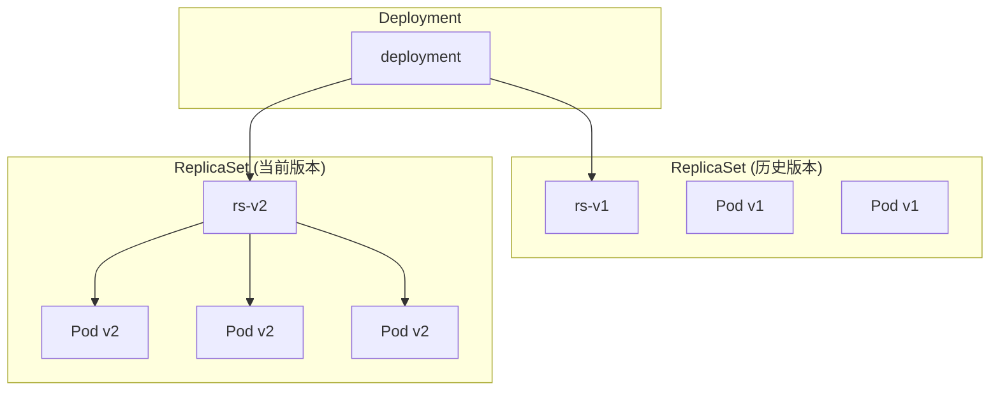
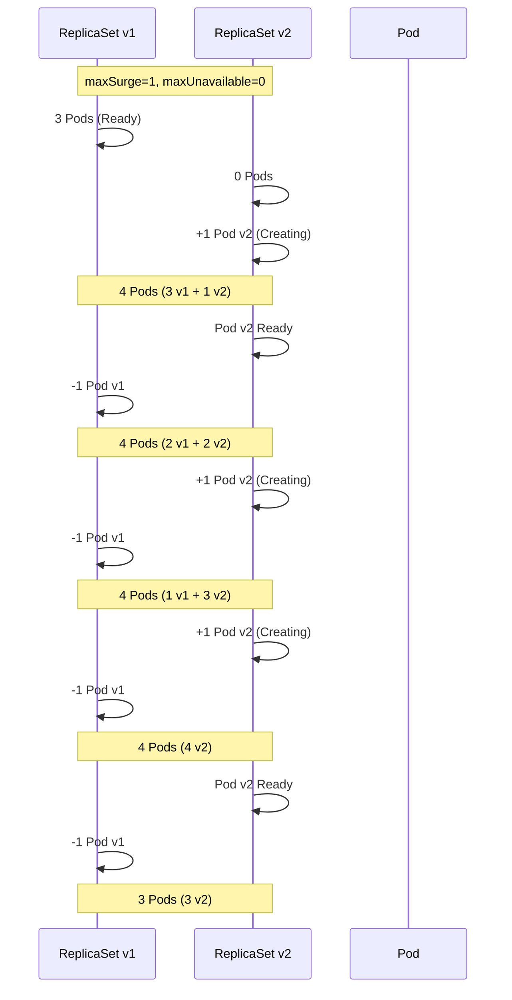
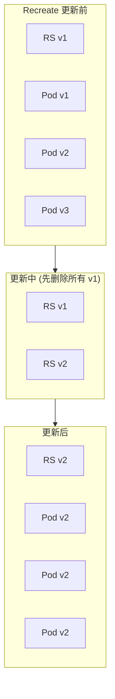
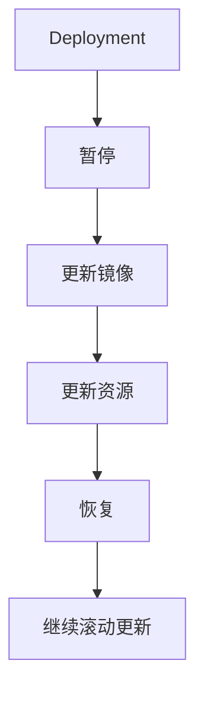
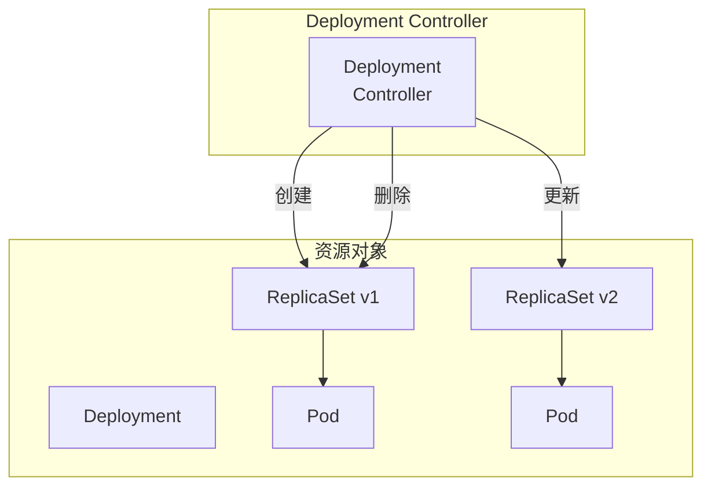

# Deployment 与 ReplicaSet

你曾经手动管理过几十台服务器的应用部署吗？每次发布新版本，需要登录每台服务器，执行部署脚本，检查部署结果。如果某台服务器失败了，还要手动回滚。

**Deployment 的出现，让这一切变得自动化。**

## Deployment 是什么？

Deployment 是 Kubernetes 最常用的**工作负载控制器**，它管理 ReplicaSet，实现应用的**声明式更新**。

Deployment 的核心能力：

1. **声明期望状态**：告诉 Kubernetes 你想要几个副本、什么镜像
2. **自动维护副本数**：自动创建/删除 Pod，维持期望副本数
3. **滚动更新**：平滑地升级应用版本
4. **回滚**：出现问题时快速回退到历史版本
5. **暂停/恢复**：可以在更新过程中暂停



## 创建 Deployment

```yaml title="nginx-deployment.yaml"
apiVersion: apps/v1
kind: Deployment
metadata:
  name: nginx
  labels:
    app: nginx
spec:
  replicas: 3
  selector:
    matchLabels:
      app: nginx
  template:
    metadata:
      labels:
        app: nginx
    spec:
      containers:
      - name: nginx
        image: nginx:1.25
        ports:
        - containerPort: 80
        resources:
          requests:
            memory: "64Mi"
            cpu: "250m"
          limits:
            memory: "128Mi"
            cpu: "500m"
```

```bash
# 创建 Deployment
kubectl apply -f nginx-deployment.yaml

# 查看 Deployment
kubectl get deployment
# NAME   READY   UP-TO-DATE   AVAILABLE   AGE
# nginx  3/3     3            3           30s

# 查看 ReplicaSet
kubectl get replicaset
# NAME              DESIRED   CURRENT   READY   AGE
# nginx-7ff6fb8c58  3         3         3       30s

# 查看 Pod
kubectl get pods -l app=nginx
```

## Deployment 详解

### 字段说明

| 字段 | 说明 |
| --- | --- |
| `replicas` | 期望的 Pod 副本数 |
| `selector` | Deployment 管理的 Pod 选择器 |
| `template` | Pod 模板，定义 Pod 的规格 |
| `strategy` | 更新策略（RollingUpdate/Recreate） |
| `minReadySeconds` | 新 Pod Ready 后最少保持的时间 |
| `revisionHistoryLimit` | 保留的历史版本数 |

### 状态解读

```bash
kubectl get deployment nginx -o wide
# NAME   READY   UP-TO-DATE   AVAILABLE   AGE   CONTAINERS   IMAGES       SELECTOR
# nginx  3/3     3            3           2m    nginx        nginx:1.25   app=nginx
```

| 字段 | 说明 |
| --- | --- |
| **READY** | 当前可用的 Pod 数 / 期望 Pod 数 |
| **UP-TO-DATE** | 已经更新到期望版本的 Pod 数 |
| **AVAILABLE** | 可用（Ready 且至少达到 minReadySeconds） |

## 滚动更新

### RollingUpdate 策略

```yaml title="rollingupdate-deployment.yaml"
spec:
  strategy:
    type: RollingUpdate
    rollingUpdate:
      maxSurge: 1        # 最多超出期望副本数
      maxUnavailable: 0  # 最少可用的 Pod 数
```

| 参数 | 说明 | 推荐值 |
| --- | --- | --- |
| `maxSurge` | 最多超出期望副本数的数量或百分比 | 25% |
| `maxUnavailable` | 最多不可用的 Pod 数量或百分比 | 25% |



### 触发更新

```bash
# 更新镜像
kubectl set image deployment/nginx nginx=nginx:1.26

# 编辑配置
kubectl edit deployment/nginx

# 查看更新状态
kubectl rollout status deployment/nginx
# Waiting for rollout to finish: 2 out of 3 new pods have been updated...

# 查看历史
kubectl rollout history deployment/nginx
# REVISION  CHANGE-CAUSE
# 1         kubectl apply --filename=nginx-deployment.yaml
# 2         kubectl set image deployment/nginx nginx=nginx:1.26
```

### 回滚

```bash
# 回滚到上一个版本
kubectl rollout undo deployment/nginx

# 回滚到指定版本
kubectl rollout undo deployment/nginx --to-revision=1

# 查看回滚状态
kubectl rollout status deployment/nginx
```

### Recreate 策略

```yaml
spec:
  strategy:
    type: Recreate
```



:::warning
`Recreate` 策略会先删除所有旧 Pod，再创建新 Pod。更新过程中应用会**短暂不可用**，适用于不能同时运行两个版本的应用。
:::

## 暂停与恢复

```bash
# 暂停更新
kubectl rollout pause deployment/nginx

# 执行多次更新
kubectl set image deployment/nginx nginx=nginx:1.26
kubectl set resources deployment/nginx nginx --limits=cpu=500m

# 恢复更新
kubectl rollout resume deployment/nginx

# 查看状态
kubectl rollout status deployment/nginx
```



## 金丝雀发布

Deployment 原生不支持金丝雀发布，但可以通过调整副本数实现简单的金丝雀：

```bash
# 创建金丝雀 Deployment（10% 流量）
kubectl set image deployment/nginx-canary nginx=nginx:1.26
kubectl scale deployment/nginx-canary --replicas=1

# 验证金丝雀
kubectl get pods -l app=nginx-canary

# 确认无误后，将金丝雀提升为主版本
kubectl set image deployment/nginx nginx=nginx:1.26
kubectl scale deployment/nginx --replicas=3

# 删除金丝雀
kubectl delete deployment nginx-canary
```

## 生命周期

### Deployment 与 ReplicaSet 关系



### 清理历史版本

```yaml
spec:
  revisionHistoryLimit: 3  # 保留最近 3 个版本
```

```bash
# 查看历史 ReplicaSet
kubectl get replicaset -l app=nginx
kubectl get replicaset -o wide

# 手动删除旧 ReplicaSet
kubectl delete replicaset nginx-7ff6fb8c58
```

## Pod 选择器

Deployment 的 `selector` 定义了它管理的 Pod：

```yaml
spec:
  selector:
    matchLabels:
      app: nginx
  template:
    metadata:
      labels:
        app: nginx
```

:::warning
Deployment 的 `selector` 是不可变的。修改 selector 会导致现有管理的 Pod 脱离控制，可能创建孤立的 Pod。
:::

## 探针配置

```yaml title="deployment-with-probes.yaml"
spec:
  template:
    spec:
      containers:
      - name: app
        image: app:1.0
        readinessProbe:
          httpGet:
            path: /health/ready
            port: 8080
          initialDelaySeconds: 5
          periodSeconds: 10
          failureThreshold: 3
        livenessProbe:
          httpGet:
            path: /health/live
            port: 8080
          initialDelaySeconds: 15
          periodSeconds: 20
          failureThreshold: 3
```

## 常见问题

### Deployment 无法创建

```bash
# 查看事件
kubectl describe deployment nginx

# 检查 selector 冲突
kubectl get replicaset -l app=nginx
```

### 更新卡住

```bash
# 查看滚动更新状态
kubectl rollout status deployment/nginx

# 查看 Pod 详情
kubectl describe pod <pod-name>

# 常见原因：镜像拉取失败、资源不足
```

### Pod 无法调度

```bash
# 检查调度问题
kubectl describe pod <pod-name> | grep -A 10 "Events:"

# 常见原因：
# - 资源不足
# - 节点选择器不匹配
# - 污点/容忍不匹配
```

## 最佳实践

### 生产环境配置

```yaml title="production-deployment.yaml"
apiVersion: apps/v1
kind: Deployment
metadata:
  name: app
  labels:
    app: app
spec:
  replicas: 3
  revisionHistoryLimit: 5
  minReadySeconds: 30
  strategy:
    type: RollingUpdate
    rollingUpdate:
      maxSurge: 1
      maxUnavailable: 0
  selector:
    matchLabels:
      app: app
  template:
    metadata:
      labels:
        app: app
    spec:
      terminationGracePeriodSeconds: 60
      containers:
      - name: app
        image: app:1.0
        imagePullPolicy: IfNotPresent
        ports:
        - containerPort: 8080
        resources:
          requests:
            memory: "128Mi"
            cpu: "100m"
          limits:
            memory: "256Mi"
            cpu: "500m"
        readinessProbe:
          httpGet:
            path: /health/ready
            port: 8080
          initialDelaySeconds: 5
          periodSeconds: 10
          failureThreshold: 3
        livenessProbe:
          httpGet:
            path: /health/live
            port: 8080
          initialDelaySeconds: 15
          periodSeconds: 20
          failureThreshold: 3
        lifecycle:
          preStop:
            exec:
              command: ["/bin/sh", "-c", "sleep 10"]
```

## 延伸思考

Deployment 是 Kubernetes 最成功的抽象之一：

1. **声明式更新**：你描述「想要什么」，Kubernetes 负责「怎么做」
2. **零停机发布**：滚动更新机制保证了服务持续可用
3. **版本化管理**：每次更新都有历史记录，可以随时回滚

但 Deployment 也有局限：

1. **不支持金丝雀**：需要手动实现流量分割
2. **不支持 A/B 测试**：无法基于请求内容路由
3. **状态管理有限**：对于有状态应用无能为力

对于更复杂的发布策略，Ingress Controller + Service Mesh 是更好的选择。

## 延伸阅读

- [Pod 生命周期与钩子](./pod-lifecycle)：Pod 的完整生命周期
- [Service 详解](./service)：Pod 的服务发现
- [StatefulSet 有状态应用](./statefulset)：有状态应用的部署
