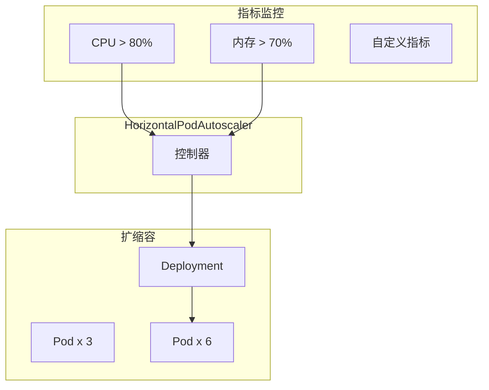
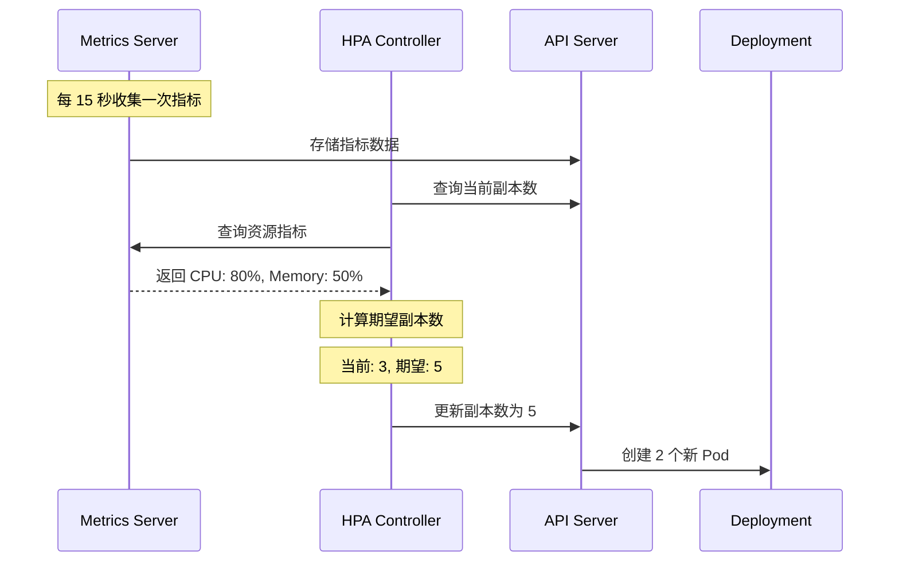
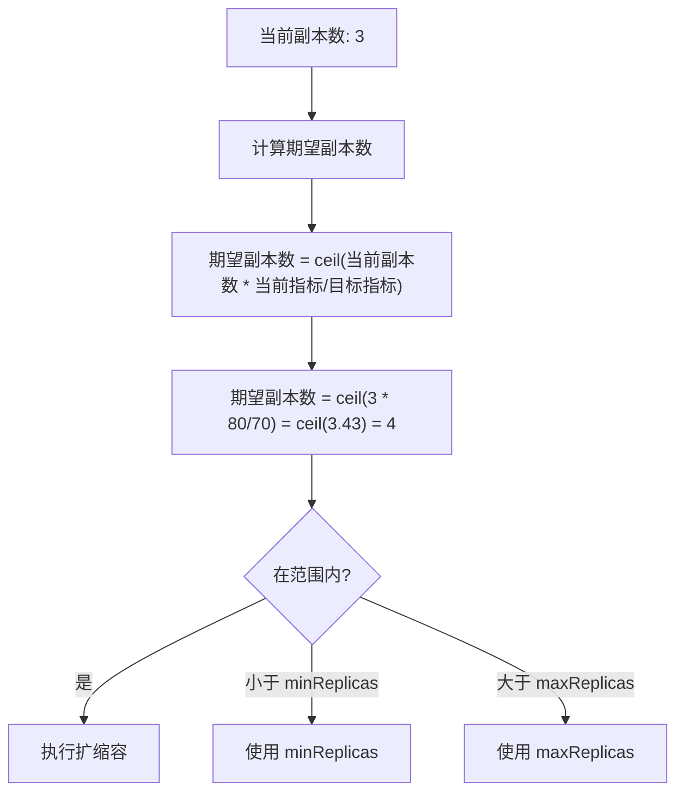
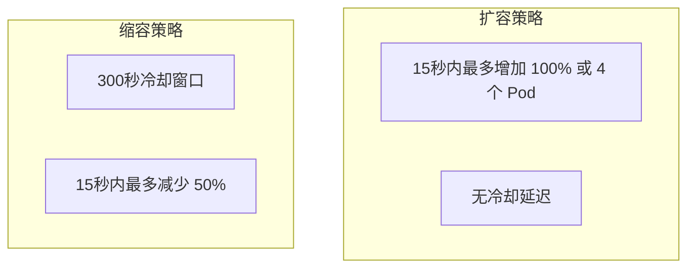

# HPA（水平自动伸缩）

凌晨 2 点，你的电商网站突然遭遇流量高峰。手忙脚乱地登录服务器，扩容、再扩容...如果这一切能自动完成就好了。

**HorizontalPodAutoscaler（HPA）就是来解决这个问题的。**

## HPA 是什么？

HPA 是 Kubernetes 的水平 Pod 自动伸缩控制器。它根据指定的指标（如 CPU 使用率、内存使用率）自动调整 Deployment 或 StatefulSet 的副本数。



## 创建 HPA

### 基本配置

```yaml title="hpa-basic.yaml"
apiVersion: autoscaling/v2
kind: HorizontalPodAutoscaler
metadata:
  name: nginx-hpa
spec:
  scaleTargetRef:
    apiVersion: apps/v1
    kind: Deployment
    name: nginx
  minReplicas: 2      # 最小副本数
  maxReplicas: 10     # 最大副本数
  metrics:
  - type: Resource
    resource:
      name: cpu
      target:
        type: Utilization
        averageUtilization: 70
  - type: Resource
    resource:
      name: memory
      target:
        type: Utilization
        averageUtilization: 80
```

```bash
# 创建 HPA
kubectl apply -f hpa-basic.yaml

# 查看 HPA
kubectl get hpa
# NAME       REFERENCE          TARGETS               MINPODS   MAXPODS   REPLICAS   AGE
# nginx-hpa  Deployment/nginx   cpu: 45%/70%, memory: 60%/80%   2         10        3         5m

# 查看详情
kubectl describe hpa nginx-hpa
```

### 基于自定义指标

```yaml title="hpa-custom-metrics.yaml"
apiVersion: autoscaling/v2
kind: HorizontalPodAutoscaler
metadata:
  name: api-hpa
spec:
  scaleTargetRef:
    apiVersion: apps/v1
    kind: Deployment
    name: api
  minReplicas: 2
  maxReplicas: 20
  metrics:
  # CPU 指标
  - type: Resource
    resource:
      name: cpu
      target:
        type: Utilization
        averageUtilization: 60
  # 内存指标
  - type: Resource
    resource:
      name: memory
      target:
        type: Utilization
        averageUtilization: 70
  # 自定义指标（需要 Prometheus Adapter）
  - type: Pods
    pods:
      metric:
        name: http_requests_per_second
      target:
        type: AverageValue
        averageValue: "1000"
```

### 基于外部指标

```yaml
metrics:
- type: External
  external:
    metric:
      name: queue_depth
      selector:
        matchLabels:
          queue: "work-queue"
    target:
      type: AverageValue
      averageValue: "100"
```

## HPA 工作原理

### 指标收集



### 扩缩容算法



```bash
# 示例计算过程
# 当前 CPU 利用率: 80%
# 目标 CPU 利用率: 70%
# 当前副本数: 3
# 期望副本数: ceil(3 * 80/70) = 4
```

## 指标类型

### Resource 指标

| 指标 | 说明 |
| --- | --- |
| `cpu` | CPU 使用率（相对于 requests） |
| `memory` | 内存使用率（相对于 requests） |

### Pods 指标

```yaml
- type: Pods
  pods:
    metric:
      name: http_requests_per_second
    target:
      type: AverageValue
      averageValue: "1000"
```

### Object 指标

```yaml
- type: Object
  object:
    metric:
      name: service-latency
    describedObject:
      apiVersion: v1
      kind: Service
      name: backend
    target:
      type: AverageValue
      averageValue: "100ms"
```

### External 指标

```yaml
- type: External
  external:
    metric:
      name: queue_size
      selector:
        matchLabels:
          queue: "order-queue"
    target:
      type: AverageValue
      averageValue: "10"
```

## 扩缩容策略

### 冷却时间

```yaml title="hpa-with-behavior.yaml"
spec:
  behavior:
    scaleDown:
      stabilizationWindowSeconds: 300  # 缩容冷却时间（5分钟）
      policies:
      - type: Percent
        value: 50
        periodSeconds: 15
    scaleUp:
      stabilizationWindowSeconds: 0   # 扩容无延迟
      policies:
      - type: Percent
        value: 100
        periodSeconds: 15
      - type: Pods
        value: 4
        periodSeconds: 15
      selectPolicy: Max
```



### 百分比 vs Pods

```yaml
policies:
# 每 15 秒最多增加 4 个 Pod
- type: Pods
  value: 4
  periodSeconds: 15

# 或每 15 秒最多增加当前副本数的 50%
- type: Percent
  value: 50
  periodSeconds: 15
```

## 垂直伸缩 (VPA)

HPA 是水平伸缩（增加副本数），VPA 是垂直伸缩（增加单个 Pod 的资源）：

| 类型 | 方式 | 适用场景 |
| --- | --- | --- |
| **HPA** | 水平伸缩（副本数） | 流量突增、请求分散 |
| **VPA** | 垂直伸缩（资源配额） | 单 Pod 资源不足 |

详细内容请参考 [VPA（垂直自动伸缩）](./vpa)。

## 常见问题

### HPA 不生效

```bash
# 查看 HPA 事件
kubectl describe hpa nginx-hpa

# 检查 Metrics Server
kubectl get pods -n kube-system -l k8s-app=metrics-server

# 查看当前指标
kubectl top pods
kubectl top nodes
```

### 常见原因

1. **Metrics Server 未安装**
2. **Deployment 没有设置 resource requests**
3. **副本数已达 maxReplicas**
4. **指标收集延迟**

### 扩缩容震荡

如果系统频繁扩缩容：

1. 增加 `stabilizationWindowSeconds`
2. 调整目标利用率
3. 使用渐进式策略

## 最佳实践

### 1. 设置合理的资源请求

```yaml
spec:
  template:
    spec:
      containers:
      - name: app
        resources:
          requests:
            cpu: "100m"
            memory: "128Mi"
```

### 2. 设置合理的副本范围

```yaml
spec:
  minReplicas: 2   # 保证基础可用性
  maxReplicas: 20  # 避免过度扩容
```

### 3. 配置冷却时间

```yaml
behavior:
  scaleDown:
    stabilizationWindowSeconds: 300
```

### 4. 使用自定义指标

```yaml
metrics:
- type: Pods
  pods:
    metric:
      name: business_metric
    target:
      type: AverageValue
      averageValue: "100"
```

## 延伸思考

HPA 让 Kubernetes 实现了真正的弹性伸缩：

1. **响应式**：根据实时负载自动调整
2. **预测性**：可以结合外部系统做预扩容
3. **成本优化**：高峰期自动扩容，低谷期自动缩容

但 HPA 也有局限：

1. **指标单一**：默认只支持 CPU/内存
2. **冷启动延迟**：新 Pod 启动需要时间
3. **不感知业务**：不理解请求类型的差异

对于更复杂的弹性伸缩场景，可以考虑 KEDA（基于事件驱动的自动伸缩）。

## 延伸阅读

- [VPA（垂直自动伸缩）](./vpa)：Pod 资源的垂直调整
- [Metrics Server](/observability/metrics/overview)：指标收集组件
- [Prometheus](/observability/metrics/overview)：自定义指标监控
