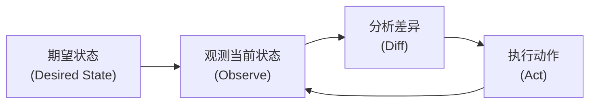
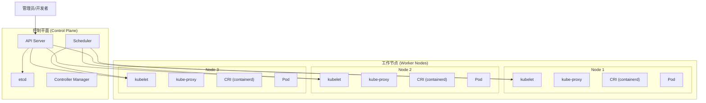
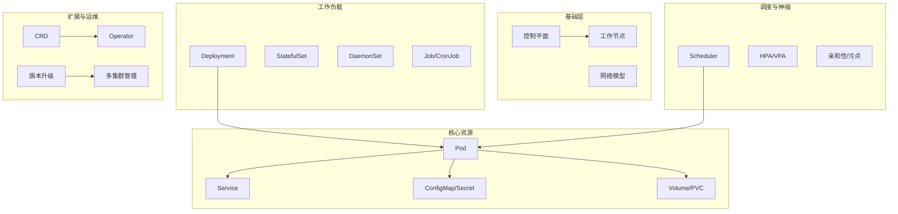
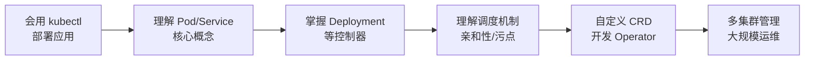

# Kubernetes 架构

2015 年，Google 将内部运行了十几年的容器编排系统 Borg 的经验开源，发布了 Kubernetes。短短几年，它就成了容器编排领域的事实标准，几乎所有云厂商都提供托管的 Kubernetes 服务。

Kubernetes 之所以能够如此迅速地占领市场，核心原因在于它解决了一个根本问题：**如何让分布式系统既保持弹性扩展的能力，又不陷入运维的泥潭？**

传统运维模式中，工程师需要手动管理服务器、网络、存储，应用部署需要关心底层细节。Kubernetes 提出的思路是：**不要让人去管理机器，让机器去管理机器**。开发者只需要声明「我需要几个副本」「我需要多少资源」，Kubernetes 会自动处理调度、扩缩容、自愈等运维任务。

这个系列的文章，将从架构设计者的视角，深入剖析 Kubernetes 的每一个核心组件和工作原理。无论你是刚接触 Kubernetes 的新手，还是已经有一定经验的工程师，都能从中获得新的理解。

## Kubernetes 是什么？

Kubernetes（简称 K8s）是一个**容器编排引擎**，用于自动化容器化应用的部署、扩缩容、运维和调度。

:::tip
Kubernetes 的 Logo 是一个七轴舵轮，象征着航海中的掌舵者。这个比喻非常贴切——Kubernetes 正是云原生时代的掌舵者，帮助我们驾驭复杂的分布式系统。
:::

## 核心设计思想

### 声明式 API

Kubernetes 的核心理念是**声明式配置（Declarative Configuration）**。你只需要告诉 Kubernetes「我希望达到什么状态」，而不是「请执行哪些命令来达到这个状态」。

```yaml title="nginx-deployment.yaml"
apiVersion: apps/v1
kind: Deployment
metadata:
  name: nginx
spec:
  replicas: 3
  selector:
    matchLabels:
      app: nginx
  template:
    metadata:
      labels:
        app: nginx
    spec:
      containers:
      - name: nginx
        image: nginx:1.25
        ports:
        - containerPort: 80
```

上面的配置声明了「我希望有 3 个 nginx 副本运行」。Kubernetes 会持续监控当前状态，确保实际状态与期望状态一致。如果某个 Pod 崩溃，Kubernetes 会自动创建新的 Pod 来维持 3 个副本的期望状态。

### 控制循环

Kubernetes 的每一个组件，几乎都遵循**控制循环（Control Loop）**的设计模式：



这个模式的核心是**观测-分析-执行**的持续循环。控制器不断比较当前状态与期望状态的差异，发现差异后采取行动，直到两者一致。

### 资源抽象

Kubernetes 提供了一层**统一的资源抽象**，屏蔽了底层基础设施的差异：

| 资源类型 | 说明 | 示例 |
| --- | --- | --- |
| Workload（工作负载） | 运行应用的方式 | Deployment、StatefulSet、DaemonSet、Job |
| Service（服务） | 网络访问抽象 | ClusterIP、NodePort、LoadBalancer、Ingress |
| Config（配置） | 配置与密钥管理 | ConfigMap、Secret |
| Storage（存储） | 持久化存储抽象 | PersistentVolume、StorageClass |
| Policy（策略） | 安全与网络策略 | NetworkPolicy、PodSecurityPolicy |
| Meta（元数据） | 资源的额外信息 | Labels、Annotations、HPA |

## 整体架构



### 控制平面（Control Plane）

控制平面是 Kubernetes 的大脑，负责整个集群的管理决策：

- **API Server**：集群的统一的 HTTP API 入口，所有操作都通过它
- **etcd**：高可用的键值存储，保存集群所有状态数据
- **Scheduler**：负责将 Pod 调度到合适的工作节点
- **Controller Manager**：运行各种控制器，维护集群期望状态

### 工作节点（Worker Nodes）

工作节点是实际运行 Pod 的机器，负责执行控制平面分配的任务：

- **kubelet**：节点上的 Agent，与 API Server 通信，确保容器运行
- **kube-proxy**：维护节点上的网络规则，实现 Service 负载均衡
- **Container Runtime**：实际运行容器的引擎（如 containerd）

## 学习路径

本系列文章按照以下逻辑组织，帮助你从浅入深理解 Kubernetes：

1. **架构基础**：从整体架构开始，了解控制平面和工作节点的职责
2. **核心资源**：掌握 Pod、Service、ConfigMap、Volume 等基础资源
3. **控制器**：理解 Deployment、StatefulSet、DaemonSet 等工作负载控制器
4. **弹性伸缩**：学习 HPA、VPA 实现应用的自动扩缩容
5. **扩展机制**：深入 CRD 和 Operator，掌握自定义 Kubernetes 的能力
6. **网络与安全**：理解 Kubernetes 网络模型、安全机制
7. **运维实践**：掌握监控、日志、故障排查、版本升级等运维技能

## 常见问题

### Kubernetes 和 Docker 是什么关系？

Docker 是容器运行时，负责构建和运行容器。Kubernetes 是容器编排引擎，负责管理和调度多个容器。简单来说，Docker 回答「怎么运行一个容器」，Kubernetes 回答「怎么管理一堆容器」。

### Kubernetes 和 Docker Swarm 有什么区别？

Docker Swarm 是 Docker 自带的容器编排方案，轻量但功能有限。Kubernetes 功能更丰富，生态更成熟，是目前的主流选择。

### 生产环境使用 Kubernetes 需要多少节点？

学习环境 1-3 个节点足够。生产环境通常建议至少 3 个控制平面节点和若干工作节点，具体数量取决于应用的规模和可用性要求。

## 延伸阅读

- [控制平面组件详解](./control-plane)：深入了解 API Server、etcd、Scheduler、Controller Manager
- [工作节点组件详解](./node-components)：理解 kubelet、kube-proxy、CRI 的工作原理
- [Pod 深度解析](./pod)：Kubernetes 最核心的资源类型

## 模块结构

本模块涵盖 Kubernetes 架构与运维的核心知识点：



## 演进路径

从 Kubernetes 新手到专家的成长路径：



| 阶段 | 核心技能 | 衡量标准 |
| --- | --- | --- |
| **入门** | kubectl 基础操作 | 能独立部署一个 Deployment |
| **初级** | Pod、Service、ConfigMap 使用 | 能为应用配置网络和配置 |
| **中级** | Deployment、StatefulSet、HPA | 能设计生产级工作负载 |
| **高级** | 调度机制、自定义资源 | 能根据业务需求调整调度策略 |
| **专家** | Operator 开发、多集群管理 | 能扩展 Kubernetes 能力 |

