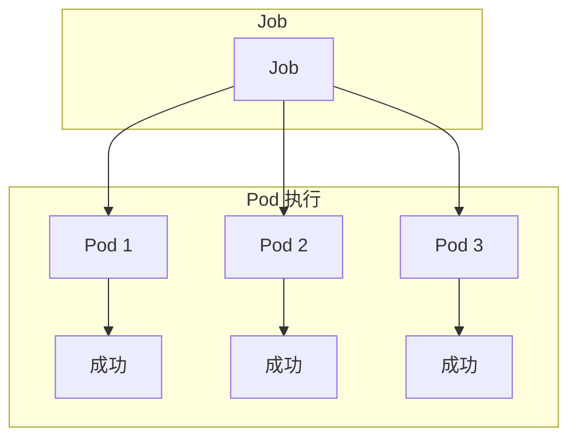
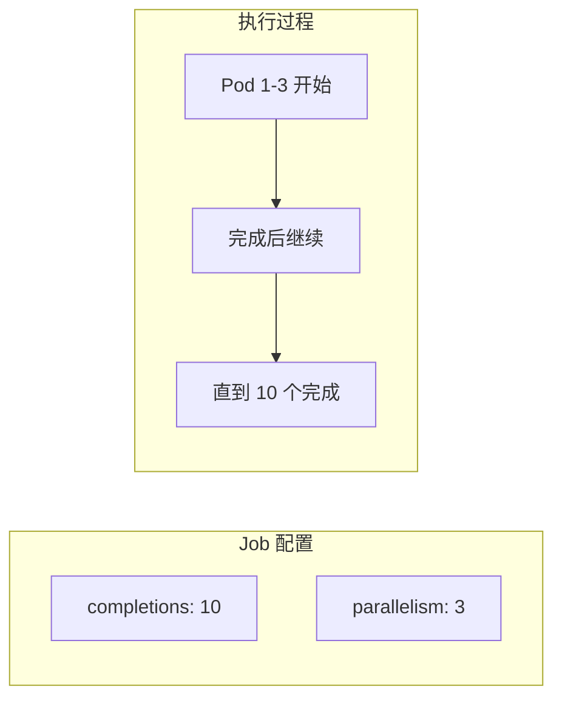

# Job 与 CronJob

想象一下，你需要执行一个数据迁移任务：处理 100 万条数据，每条数据需要计算 10 秒。你会怎么做？

在传统服务器上，启动一个进程，运气不好的话进程可能崩溃。
在 Kubernetes 上，用 **Job** 来处理这个任务。

Job 确保任务**成功完成**，即使 Pod 崩溃也会自动重启。

## Job 是什么？

Job 创建一个或多个 Pod，并确保指定数量的 Pod **成功完成**。

Job 的特点：

1. **一次性任务**：Pod 完成后不会自动重启
2. **保证完成**：直到所有 Pod 成功退出才认为 Job 完成
3. **可重试**：Pod 失败时会自动创建新的 Pod
4. **并行执行**：支持并发执行多个 Pod



## 创建 Job

```yaml title="pi-job.yaml"
apiVersion: batch/v1
kind: Job
metadata:
  name: pi
spec:
  ttlSecondsAfterFinished: 100  # Job 完成后 100 秒自动清理
  backoffLimit: 4              # 失败重试次数
  completions: 1               # 需要完成的 Pod 数量
  parallelism: 1                # 并行 Pod 数量
  template:
    spec:
      restartPolicy: OnFailure  # 注意：Job 必须设置 OnFailure 或 Never
      containers:
      - name: pi
        image: perl:5.34
        command: ["perl", "-Mbignum=bpi", "-wle", "print bpi(2000)"]
```

```bash
# 创建 Job
kubectl apply -f pi-job.yaml

# 查看 Job
kubectl get job
# NAME   COMPLETIONS   DURATION   AGE   SELECTOR
# pi     1/1           45s        2m    controller-uid=xxx

# 查看 Pod
kubectl get pods -l job-name=pi
# NAME         READY   STATUS      RESTARTS   AGE
# pi-xxx       0/1     Completed   0          45s

# 查看输出
kubectl logs pi-xxx
```

## Job 详解

### 完成模式

| 模式 | 说明 |
| --- | --- |
| **NonIndexed**（默认） | Pod 完成顺序不重要，只要完成指定数量即可 |
| **Indexed** | Pod 有序号，按序号依次完成 |

```yaml title="indexed-job.yaml"
spec:
  completions: 5
  parallelism: 2
  completionMode: Indexed
  template:
    spec:
      restartPolicy: OnFailure
      containers:
      - name: work
        image: busybox
        env:
        - name: JOB_COMPLETION_INDEX
          valueFrom:
            fieldRef:
              fieldPath: metadata.labels['batch.kubernetes.io/job-completion-index']
        command:
        - sh
        - -c
        - "echo Processing item $JOB_COMPLETION_INDEX"
```

### 并行执行控制

```yaml
spec:
  completions: 10     # 需要完成的总任务数
  parallelism: 3      # 同时运行的 Pod 数
  backoffLimit: 6    # 失败重试上限
```



### 超时控制

```yaml
spec:
  activeDeadlineSeconds: 300   # Job 最大运行时间
  ttlSecondsAfterFinished: 3600  # 完成后保留时间
```

### 失败重试

```yaml
spec:
  backoffLimit: 3  # 失败后重试 3 次
  # backoffLimit: null (无限重试)
```

```bash
# 查看失败原因
kubectl describe job pi
# Events:
# Type     Reason            Age   From            Message
# ----     ------            ----  ----            -------
# Warning  BackoffLimitExceeded  2m  job-controller  Job failed due to exceeded backoff limit
```

## CronJob 定时任务

### 创建 CronJob

```yaml title="backup-cronjob.yaml"
apiVersion: batch/v1
kind: CronJob
metadata:
  name: database-backup
spec:
  schedule: "0 2 * * *"       # 每天凌晨 2 点执行
  timezone: Asia/Shanghai     # 时区
  concurrencyPolicy: Forbid   # 并发策略
  successfulJobsHistoryLimit: 3  # 保留成功记录数
  failedJobsHistoryLimit: 1      # 保留失败记录数
  startingDeadlineSeconds: 200   # 启动截止时间
  jobTemplate:
    spec:
      ttlSecondsAfterFinished: 3600  # Job 完成后 1 小时清理
      template:
        spec:
          restartPolicy: OnFailure
          containers:
          - name: backup
            image: postgres:15
            command:
            - /bin/sh
            - -c
            - |
              echo "Starting backup at $(date)"
              pg_dump -h postgres.default.svc -U postgres mydb > /backups/backup-$(date +%Y%m%d).sql
              echo "Backup completed"
            volumeMounts:
            - name: backup-volume
              mountPath: /backups
          volumes:
          - name: backup-volume
            persistentVolumeClaim:
              claimName: backup-pvc
```

```bash
# 创建 CronJob
kubectl apply -f backup-cronjob.yaml

# 查看 CronJob
kubectl get cronjob
# NAME              SCHEDULE    TIMEZONE        SUSPEND   ACTIVE   LAST SCHEDULE   AGE
# database-backup    0 2 * * *  Asia/Shanghai  False     0        2h              5d

# 查看 Job
kubectl get jobs
# NAME                         COMPLETIONS   DURATION   AGE
# database-backup-28155600     1/1           5m         2h
# database-backup-28156320     1/1           6m         26m

# 查看最近的 Pod
kubectl get pods -l job-name=database-backup-28156320
```

### 并发策略

| 策略 | 说明 | 适用场景 |
| --- | --- | --- |
| **Allow**（默认） | 允许并发运行多个 Job | 任务可以重叠执行 |
| **Forbid** | 如果上一个 Job 还在运行，跳过本次执行 | 任务不能重叠 |
| **Replace** | 如果上一个 Job 还在运行，取消并启动新 Job | 任务不能重叠 |

```yaml
spec:
  concurrencyPolicy: Forbid
```

### Cron 表达式

```
┌───────────── 分钟 (0 - 59)
│ ┌───────────── 小时 (0 - 23)
│ │ ┌───────────── 日 (1 - 31)
│ │ │ ┌───────────── 月 (1 - 12)
│ │ │ │ ┌───────────── 星期 (0 - 6)
│ │ │ │ │
* * * * *
```

| 特殊字符 | 说明 | 示例 |
| --- | --- | --- |
| `*` | 任意值 | `* * * * *` |
| `,` | 列表 | `1,15 * * * *` |
| `-` | 范围 | `0 9-17 * * *` |
| `/` | 步长 | `*/15 * * * *` |

常用表达式：

| 表达式 | 说明 |
| --- | --- |
| `*/5 * * * *` | 每 5 分钟 |
| `0 * * * *` | 每小时 |
| `0 0 * * *` | 每天午夜 |
| `0 2 * * *` | 每天凌晨 2 点 |
| `0 0 * * 0` | 每周日午夜 |
| `0 0 1 * *` | 每月 1 日午夜 |
| `0 9-17 * * 1-5` | 工作日 9 点到 17 点每小时 |

## 实际使用场景

### 1. 数据处理流水线

```yaml title="data-process-job.yaml"
apiVersion: batch/v1
kind: Job
metadata:
  name: data-process
spec:
  parallelism: 5
  completions: 100
  backoffLimit: 2
  template:
    spec:
      restartPolicy: OnFailure
      containers:
      - name: processor
        image: data-processor:1.0
        env:
        - name: BATCH_SIZE
          value: "1000"
        - name: WORKER_ID
          valueFrom:
            fieldRef:
              fieldPath: metadata.name
        resources:
          requests:
            memory: "1Gi"
            cpu: "500m"
          limits:
            memory: "2Gi"
            cpu: "1000m"
```

### 2. 批量数据迁移

```yaml title="migration-job.yaml"
apiVersion: batch/v1
kind: Job
metadata:
  name: mysql-to-postgres
spec:
  ttlSecondsAfterFinished: 3600
  template:
    spec:
      initContainers:
      - name: check-source
        image: mysql:8.0
        command:
        - sh
        - -c
        - |
          until mysql -h mysql -u root -p$MYSQL_ROOT_PASSWORD -e "SELECT 1"; do
            sleep 5
          done
          echo "Source database ready"
        env:
        - name: MYSQL_ROOT_PASSWORD
          valueFrom:
            secretKeyRef:
              name: mysql-secret
              key: password
      containers:
      - name: migrator
        image: mycompany/migration-tool:2.0
        env:
        - name: SOURCE_DB
          value: "mysql"
        - name: TARGET_DB
          value: "postgres"
        - name: BATCH_SIZE
          value: "10000"
        resources:
          requests:
            memory: "2Gi"
            cpu: "1000m"
      restartPolicy: OnFailure
```

### 3. 定时报告生成

```yaml title="report-cronjob.yaml"
apiVersion: batch/v1
kind: CronJob
metadata:
  name: weekly-report
spec:
  schedule: "0 8 * * 1"  # 每周一早上 8 点
  concurrencyPolicy: Replace
  successfulJobsHistoryLimit: 4
  jobTemplate:
    spec:
      ttlSecondsAfterFinished: 86400
      template:
        spec:
          serviceAccountName: report-generator
          restartPolicy: OnFailure
          containers:
          - name: report-generator
            image: report-generator:3.0
            env:
            - name: REPORT_TYPE
              value: "weekly"
            - name: SEND_EMAIL
              value: "true"
            - name: EMAIL_RECIPIENTS
              value: "team@example.com"
```

## 常见问题

### Job 一直处于 Active 状态

```bash
# 查看 Job 状态
kubectl get job
kubectl describe job <job-name>

# 常见原因：
# - Pod 还在运行
# - 超过了 activeDeadlineSeconds
# - 资源不足，Pod 无法调度
```

### CronJob 没有触发

```bash
# 查看 CronJob 事件
kubectl describe cronjob database-backup

# 检查调度时间
# - 确认 timezone 配置正确
# - 确认 schedule 表达式正确

# 检查挂起的 Job
kubectl get jobs | grep -v "1/1"
```

### Pod 失败但 Job 未标记为失败

```bash
# 检查 restartPolicy
# Job 的 restartPolicy 只能是 OnFailure 或 Never，不能是 Always
```

### Job 无法清理

```bash
# 手动删除 Job
kubectl delete job <job-name>

# 使用 TTL 控制器自动清理
kubectl patch job <job-name> -p '{"spec":{"ttlSecondsAfterFinished":3600}}'
```

## 最佳实践

### 1. 设置合理的重试策略

```yaml
spec:
  backoffLimit: 3  # 不要无限重试
  activeDeadlineSeconds: 600  # 设置最大运行时间
```

### 2. 使用 TTL 控制器清理

```yaml
spec:
  ttlSecondsAfterFinished: 3600  # 完成后 1 小时清理
```

### 3. 配置资源限制

```yaml
template:
  spec:
    containers:
    - name: work
      resources:
        requests:
          memory: "256Mi"
          cpu: "100m"
        limits:
          memory: "512Mi"
          cpu: "500m"
```

### 4. 使用合适的 restartPolicy

```yaml
# 用于数据处理/计算的任务
restartPolicy: OnFailure

# 用于一次性验证/测试
restartPolicy: Never
```

### 5. 监控 Job 执行

```bash
# 标签选择器
kubectl get jobs -l "app=batch,env=production"

# 查看失败 Job
kubectl get jobs --field-selector=status.failed=true
```

## 延伸思考

Job 和 CronJob 将 Kubernetes 的能力扩展到了批处理场景：

1. **声明式任务管理**：声明任务规格，Kubernetes 负责执行和重试
2. **与现有系统集成**：可以复用 Kubernetes 的调度、监控、日志等基础设施
3. **弹性和可靠性**：利用 Kubernetes 的自愈能力

但批处理任务也有一些独特的考量：

1. **任务状态管理**：复杂任务的中间状态需要持久化
2. **故障恢复**：任务中断后如何从断点恢复
3. **资源配额**：大批量任务可能消耗大量资源

对于更复杂的批处理场景（如 Spark、Flink），可以使用 Kubernetes Operator 来管理。

## 延伸阅读

- [Deployment 与 ReplicaSet](./deployment)：长期运行的服务
- [StatefulSet 有状态应用](./statefulset)：需要持久标识的任务
- [HPA（水平自动伸缩）](./hpa)：基于负载的任务伸缩
