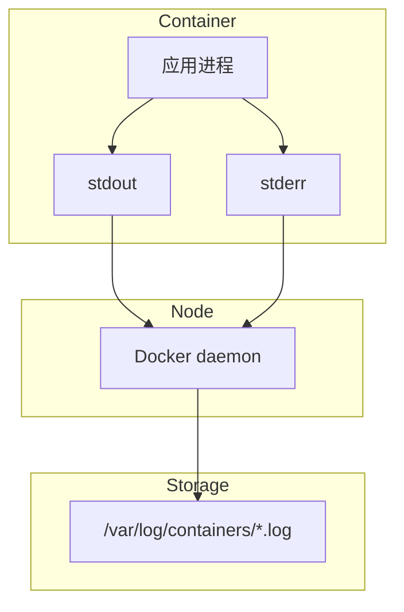
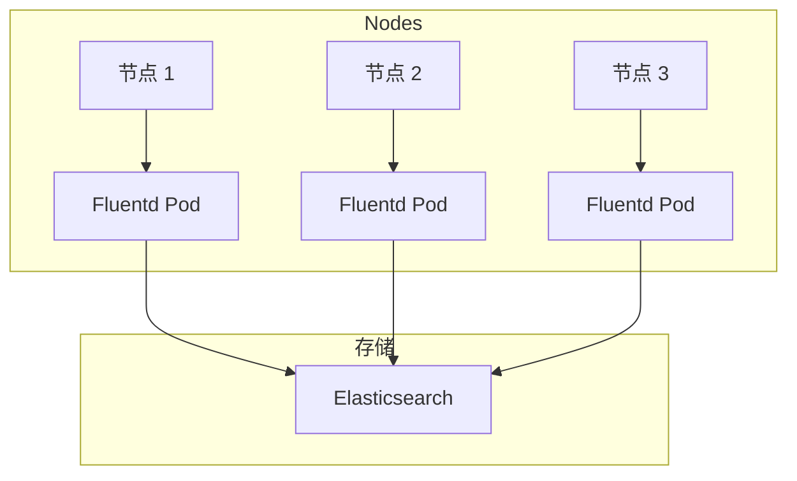

# Kubernetes 日志收集

容器崩溃了，你想知道原因。登录节点，`docker logs` 查看...但 Pod 已经被重启了，日志找不到了。

**Kubernetes 日志收集让你能够集中管理所有日志。**

## 日志概述

Kubernetes 的日志分为几层：

| 层级 | 来源 | 说明 |
| --- | --- | --- |
| **应用日志** | 容器内应用 | stdout/stderr |
| **容器日志** | kubelet | 容器进程日志 |
| **系统日志** | Kubernetes 组件 | API Server、Scheduler 等 |
| **审计日志** | API Server | API 访问审计 |

## 应用日志

### 基本概念

容器应用通过 stdout 和 stderr 输出日志：



### 查看日志

```bash
# 查看 Pod 日志
kubectl logs nginx-7ff6fb8c58-x4r2z

# 查看上一个实例的日志（容器重启后）
kubectl logs nginx-7ff6fb8c58-x4r2z --previous

# 实时跟踪日志
kubectl logs -f nginx-7ff6fb8c58-x4r2z

# 查看特定容器的日志（多容器 Pod）
kubectl logs nginx -c nginx

# 过滤日志行
kubectl logs nginx | grep ERROR
```

## 节点级日志收集

### 日志存储位置

```bash
# 容器日志位置
/var/log/containers/*.log

# Pod 日志位置
/var/log/pods/<namespace>_<pod_name>_<uid>/<container>/*.log

# Kubernetes 系统组件日志
/var/log/kube-apiserver.log
/var/log/kube-scheduler.log
/var/log/kube-controller-manager.log
```

### 日志轮转

```bash
# kubelet 日志配置
/var/lib/kubelet/config.yaml

# 容器日志轮转配置（kubelet 管理）
# 默认保留 5 个文件，每个最大 100MB
```

## 日志收集方案

### 方案一：DaemonSet 收集



#### Fluentd 安装

```yaml title="fluentd-daemonset.yaml"
apiVersion: v1
kind: ServiceAccount
metadata:
  name: fluentd
  namespace: kube-system
---
apiVersion: rbac.authorization.k8s.io/v1
kind: ClusterRole
metadata:
  name: fluentd
rules:
- apiGroups:
  - ""
  resources:
  - pods
  - namespaces
  verbs:
  - get
  - list
  - watch
---
apiVersion: rbac.authorization.k8s.io/v1
kind: ClusterRoleBinding
metadata:
  name: fluentd
roleRef:
  kind: ClusterRole
  name: fluentd
  apiGroup: rbac.authorization.k8s.io
subjects:
- kind: ServiceAccount
  name: fluentd
  namespace: kube-system
---
apiVersion: apps/v1
kind: DaemonSet
metadata:
  name: fluentd
  namespace: kube-system
spec:
  selector:
    matchLabels:
      k8s-app: fluentd
  template:
    metadata:
      labels:
        k8s-app: fluentd
    spec:
      serviceAccountName: fluentd
      tolerations:
      - key: node-role.kubernetes.io/control-plane
        operator: Exists
        effect: NoSchedule
      containers:
      - name: fluentd
        image: fluent/fluentd-kubernetes-daemonset:v1.16-debian-elasticsearch8
        env:
        - name: FLUENT_ELASTICSEARCH_HOST
          value: "elasticsearch.logging.svc"
        - name: FLUENT_ELASTICSEARCH_PORT
          value: "9200"
        - name: FLUENT_CONTAINER_TAIL_EXCLUDE_PATH
          value: "/var/log/containers/fluentd*"
        resources:
          limits:
            memory: 512Mi
          requests:
            cpu: 100m
            memory: 200Mi
        volumeMounts:
        - name: varlog
          mountPath: /var/log
        - name: varlibdockercontainers
          mountPath: /var/lib/docker/containers
          readOnly: true
        - name: config
          mountPath: /etc/fluent/config.d
      volumes:
      - name: varlog
        hostPath:
          path: /var/log
      - name: varlibdockercontainers
        hostPath:
          path: /var/lib/docker/containers
      - name: config
        configMap:
          name: fluentd-config
```

### 方案二：Sidecar 收集

```yaml title="sidecar-logging.yaml"
apiVersion: v1
kind: Pod
metadata:
  name: app-with-logging
spec:
  containers:
  - name: app
    image: my-app:1.0
    volumeMounts:
    - name: log
      mountPath: /var/log

  - name: log-shipper
    image: busybox
    command: ["sh", "-c", "tail -f /var/log/app.log"]
    volumeMounts:
    - name: log
      mountPath: /var/log
```

### 方案三：应用直接发送

```go title="app_with_logger.go"
package main

import (
    "github.com/sirupsen/logrus"
    "gopkg.in/gemnasium/logrus-blackhole-formatter.v1"
)

func main() {
    // 配置 JSON 格式输出
    logrus.SetFormatter(&logrus.JSONFormatter{})
    logrus.SetOutput(os.Stdout)

    // 结构化日志
    logrus.WithFields(logrus.Fields{
        "service": "my-app",
        "version": "1.0.0",
        "request_id": requestID,
    }).Info("Processing request")
}
```

## EFK 堆栈

### 部署 Elasticsearch

```yaml title="elasticsearch.yaml"
apiVersion: elasticsearch.k8s.elastic.co/v1
kind: Elasticsearch
metadata:
  name: elasticsearch
  namespace: logging
spec:
  version: 8.11.0
  nodeSets:
  - name: default
    count: 3
    config:
      node.store.allow_mmap: false
    volumeClaimTemplates:
    - metadata:
        name: elasticsearch-data
      spec:
        accessModes:
        - ReadWriteOnce
        resources:
          requests:
            storage: 50Gi
        storageClassName: fast
```

### 部署 Kibana

```yaml title="kibana.yaml"
apiVersion: kibana.k8s.elastic.co/v1
kind: Kibana
metadata:
  name: kibana
  namespace: logging
spec:
  version: 8.11.0
  count: 1
  elasticsearchRef:
    name: elasticsearch
```

### 部署 Fluentd

```yaml title="fluentd-configmap.yaml"
apiVersion: v1
kind: ConfigMap
metadata:
  name: fluentd-config
  namespace: kube-system
data:
  fluent.conf: |
    <source>
      @type tail
      @id /var/log/containers/*.log
      path /var/log/containers/*.log
      pos_file /var/log/fluentd-containers.log.pos
      tag kubernetes.*
      read_from_head true
      <parse>
        @type json
        time_format %Y-%m-%dT%H:%M:%S.%NZ
      </parse>
    </source>

    <filter kubernetes.**>
      @type kubernetes_metadata
      @id kubernetes_metadata
    </filter>

    <match kubernetes.**>
      @type elasticsearch
      @id elasticsearch_output
      host ${FLUENT_ELASTICSEARCH_HOST}
      port ${FLUENT_ELASTICSEARCH_PORT}
      logstash_format true
      logstash_prefix kubernetes
      <buffer>
        @type file
        path /var/log/fluentd-buffers/kubernetes.buffer
        flush_mode interval
        retry_type exponential_backoff
        flush_thread_count 2
        flush_interval 5s
        retry_forever
        retry_max_interval 30
        chunk_limit_size 2M
        queue_limit_length 8
        overflow_action block
      </buffer>
    </match>
```

## Loki 日志系统

### 部署 Loki

```bash
helm repo add grafana https://grafana.github.io/helm-charts
helm install loki grafana/loki \
  --namespace logging \
  --create-namespace
```

### Promtail 收集

```yaml title="promtail.yaml"
apiVersion: v1
kind: ConfigMap
metadata:
  name: promtail
  namespace: logging
data:
  promtail.yaml: |
    server:
      http_listen_port: 3101
    positions:
      filename: /tmp/positions.yaml
    client:
      url: http://loki:3100/loki/api/v1/push
    scrape_configs:
    - job_name: kubernetes
      kubernetes_sd_configs:
      - role: pod
      relabel_configs:
      - source_labels: [__meta_kubernetes_pod_name]
        target_label: pod
      - source_labels: [__meta_kubernetes_namespace]
        target_label: namespace
```

## 日志最佳实践

### 1. 结构化日志

```json
{
  "timestamp": "2024-01-15T10:30:00.000Z",
  "level": "INFO",
  "service": "api-gateway",
  "trace_id": "abc123",
  "message": "Request processed",
  "duration_ms": 45,
  "status_code": 200
}
```

### 2. 统一日志格式

```go
log.SetFormatter(&logrus.JSONFormatter{
    TimestampFormat: "2006-01-02T15:04:05.000Z07:00",
})

logrus.WithFields(logrus.Fields{
    "service": "api",
    "version": "1.0.0",
    "env": "production",
}).Info("Application started")
```

### 3. 日志级别控制

```yaml
spec:
  containers:
  - name: app
    env:
    - name: LOG_LEVEL
      value: "info"  # debug, info, warn, error
```

### 4. 敏感数据脱敏

```yaml
filters:
- name: mask-secrets
  type: record_modifier
  record:
    access_token: "[REDACTED]"
    password: "[REDACTED]"
    credit_card: "[REDACTED]"
```

## 常见问题

### 日志丢失

```bash
# 原因：Pod 被删除后日志轮转前的日志丢失
# 解决：使用节点级日志收集或日志聚合系统
```

### 日志存储成本

```bash
# 配置日志保留策略
# Elasticsearch ILM
curl -X PUT "localhost:9200/_ilm/policy/logs-policy" -H 'Content-Type: application/json' -d'
{
  "policy": {
    "phases": {
      "hot": {
        "actions": {
          "rollover": {
            "max_size": "50GB",
            "max_age": "7d"
          }
        }
      },
      "delete": {
        "min_age": "30d",
        "actions": {
          "delete": {}
        }
      }
    }
  }
}
'
```

### 日志延迟

```bash
# 原因：批量发送导致延迟
# 解决：调整 flush_interval 和 buffer 配置
```

## 延伸思考

Kubernetes 日志收集是运维的重要部分：

1. **集中管理**：避免登录节点查看日志
2. **持久化**：Pod 重启后日志不丢失
3. **分析能力**：全文搜索、聚合分析

但日志管理也需要考虑：

1. **存储成本**：日志量通常很大
2. **性能影响**：日志收集对系统的影响
3. **安全性**：敏感数据需要脱敏

## 延伸阅读

- [日志系统](/observability/logging/overview)：ELK/Loki 详解
- [Kubernetes 故障排查](./troubleshooting)：日志在故障排查中的应用
- [可观测性三大支柱](/observability/three-pillars/overview)：Metrics、Logging、Tracing
