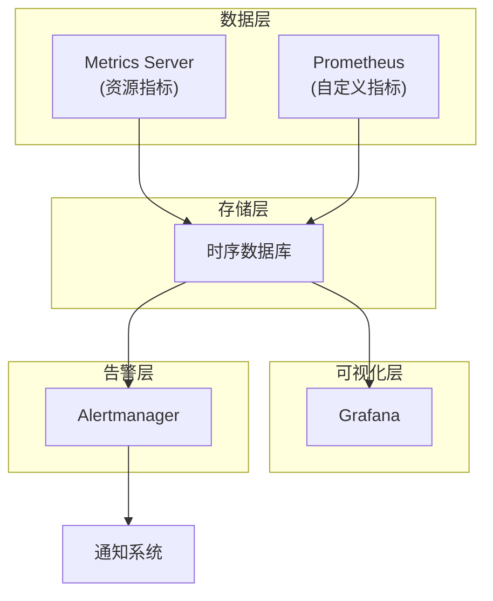
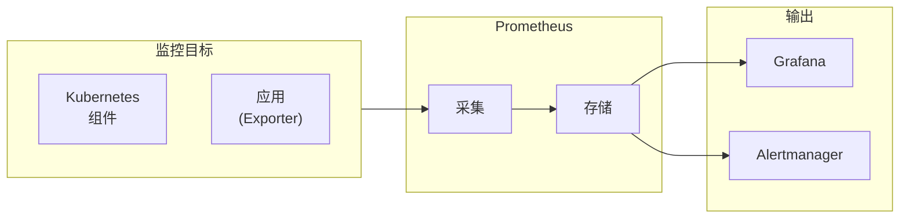

# Kubernetes 监控

你的集群运行着 100 个 Pod，突然 CPU 使用率飙升。你怎么知道是哪个应用的问题？

**Kubernetes 监控让你能够观测集群和应用的运行状态。**

## 监控架构



## Metrics Server

### 概述

Metrics Server 是 Kubernetes 核心指标采集组件，提供：

- Pod 和节点的 CPU、内存指标
- 支持 `kubectl top` 命令
- 用于 HPA 的指标来源

### 安装

```bash
# 安装 Metrics Server
kubectl apply -f https://github.com/kubernetes-sigs/metrics-server/releases/latest/download/components.yaml

# 或使用 Helm
helm repo add metrics-server https://kubernetes-sigs.github.io/metrics-server
helm install metrics-server metrics-server/metrics-server
```

### 配置

```yaml title="metrics-server.yaml"
apiVersion: v1
kind: ServiceAccount
metadata:
  name: metrics-server
  namespace: kube-system
---
apiVersion: apps/v1
kind: Deployment
metadata:
  name: metrics-server
  namespace: kube-system
spec:
  template:
    spec:
      containers:
      - name: metrics-server
        image: registry.k8s.io/metrics-server/metrics-server:v0.7.0
        args:
        - --kubelet-insecure-tls
        - --kubelet-preferred-address-types=InternalIP
```

### 使用

```bash
# 查看节点指标
kubectl top nodes
# NAME       CPU(cores)   CPU%   MEMORY(bytes)   MEMORY%
# node-1     500m        25%    2048Mi          50%
# node-2     300m        15%    1536Mi          40%

# 查看 Pod 指标
kubectl top pods
# NAME                    CPU(cores)   MEMORY(bytes)
# nginx-7ff6fb8c58-x4r2z  50m         128Mi

# 查看特定命名空间
kubectl top pods -n production

# 查看特定 Pod 的所有容器
kubectl top pod <pod-name> --containers
```

## Prometheus

### 概述

Prometheus 是 CNCF 项目，用于采集和存储时序指标。

### 架构



### 安装

```bash
# 使用 Helm 安装 kube-prometheus-stack
helm repo add prometheus-community https://prometheus-community.github.io/helm-charts
helm repo update

helm install prometheus prometheus-community/kube-prometheus-stack \
  --namespace monitoring \
  --create-namespace \
  --set grafana.adminPassword='your-password'
```

### Prometheus Operator

```yaml title="servicemonitor.yaml"
apiVersion: monitoring.coreos.com/v1
kind: ServiceMonitor
metadata:
  name: nginx
  labels:
    release: prometheus
spec:
  selector:
    matchLabels:
      app: nginx
  endpoints:
  - port: metrics
    interval: 30s
    path: /metrics
```

### 常用 PromQL

```text
# CPU 使用率
sum(rate(container_cpu_usage_seconds_total{namespace="production"}[5m])) by (pod)

# 内存使用量
container_memory_usage_bytes{namespace="production"}

# 请求率
sum(rate(http_requests_total{service="api"}[5m])) by (status_code)

# Pod 重启次数
kube_pod_container_status_restarts_total

# Pod 运行时间
time() - kube_pod_start_time{pod=~"api-.*"}
```

## Grafana

### 安装

```bash
# 通过 kube-prometheus-stack 安装
helm install grafana prometheus-community/grafana \
  --namespace monitoring \
  --set adminPassword='your-password'

# 获取密码
kubectl get secret --namespace monitoring grafana -o jsonpath='{.data.admin-password}' | base64 -d
```

### 访问

```bash
# 端口转发
kubectl port-forward -n monitoring svc/grafana 3000:80

# 或通过 Ingress 暴露
```

### 常用 Dashboard

| Dashboard ID | 说明 |
| --- | --- |
| 6417 | Kubernetes Cluster |
| 7249 | Kubernetes Views |
| 13332 | kube-prometheus-stack Overview |
| 15857 | Kubernetes Deployment |

## Alertmanager

### 配置

```yaml title="alertmanager-config.yaml"
apiVersion: v1
kind: Secret
metadata:
  name: alertmanager-main
  namespace: monitoring
stringData:
  alertmanager.yml: |
    global:
      resolve_timeout: 5m
    route:
      group_by: ['alertname']
      group_wait: 10s
      group_interval: 10s
      repeat_interval: 1h
      receiver: 'default'
      routes:
      - match:
          severity: critical
        receiver: 'critical'
    receivers:
    - name: 'default'
    - name: 'critical'
      webhook_configs:
      - url: 'http://alert-webhook:5000/alerts'
```

### 告警规则

```yaml title="prometheusrule.yaml"
apiVersion: monitoring.coreos.com/v1
kind: PrometheusRule
metadata:
  name: example-alerts
  namespace: monitoring
spec:
  groups:
  - name: kubernetes-apps
    rules:
    - alert: PodMemoryUsageHigh
      expr: |
        (sum(container_memory_working_set_bytes{job="kubelet", metrics_path="/metrics/cadvisor"})
        by (pod, namespace) / sum(label_join(kube_pod_container_resource_limits{job="kube-state-metrics", resource="memory"}, "container", "", "container"))
        by (pod, namespace)) > 0.9
      for: 5m
      labels:
        severity: warning
      annotations:
        summary: "Pod {{ $labels.pod }} memory usage is above 90%"
        description: "Memory usage is {{ $value | humanizePercentage }}"
```

## 自定义指标

### 应用暴露指标

```go title="app_metrics.go"
package main

import (
    "net/http"

    "github.com/prometheus/client_golang/prometheus"
    "github.com/prometheus/client_golang/prometheus/promhttp"
)

var (
    httpRequestsTotal = prometheus.NewCounterVec(
        prometheus.CounterOpts{
            Name: "http_requests_total",
            Help: "Total number of HTTP requests",
        },
        []string{"method", "path", "status"},
    )

    httpRequestDuration = prometheus.NewHistogramVec(
        prometheus.HistogramOpts{
            Name:    "http_request_duration_seconds",
            Help:    "HTTP request duration",
            Buckets: prometheus.DefBuckets,
        },
        []string{"method", "path"},
    )
)

func init() {
    prometheus.MustRegister(httpRequestsTotal, httpRequestDuration)
}

func handler(w http.ResponseWriter, r *http.Request) {
    // ... 业务逻辑
    httpRequestsTotal.WithLabelValues(r.Method, r.URL.Path, "200").Inc()
}
```

### Python 应用

```python title="app_metrics.py"
from prometheus_client import Counter, Histogram
import random

REQUEST_COUNT = Counter(
    'http_requests_total',
    'Total HTTP requests',
    ['method', 'endpoint']
)

REQUEST_LATENCY = Histogram(
    'http_request_latency_seconds',
    'HTTP request latency',
    ['method', 'endpoint']
)

@app.route("/api/data")
def get_data():
    with REQUEST_LATENCY.labels(method='GET', endpoint='/api/data').time():
        # 业务逻辑
        pass
    REQUEST_COUNT.labels(method='GET', endpoint='/api/data').inc()
    return jsonify({"data": "value"})
```

## 常见问题

### Metrics Server 不工作

```bash
# 检查 Metrics Server 日志
kubectl logs -n kube-system -l k8s-app=metrics-server

# 常见原因：
# - kubelet 证书问题（使用 --kubelet-insecure-tls）
# - 网络不通
# - Metrics API 未启用
```

### Prometheus 不采集指标

```bash
# 检查 ServiceMonitor
kubectl get servicemonitor

# 检查 Prometheus 目标
kubectl exec -it prometheus-prometheus-node-exporter -n monitoring -- wget -qO- localhost:9100/metrics

# 检查 prometheus 抓取配置
kubectl get prometheus -n monitoring -o yaml
```

### 告警不触发

```bash
# 检查告警规则
kubectl get prometheusrule -n monitoring

# 检查 Alertmanager 配置
kubectl get secret alertmanager-main -n monitoring -o yaml
```

## 最佳实践

### 1. 资源监控

```yaml
# 为 Prometheus 设置资源限制
prometheus:
  prometheusSpec:
    resources:
      requests:
        cpu: 200m
        memory: 256Mi
      limits:
        cpu: 1000m
        memory: 1Gi
```

### 2. 指标保留策略

```yaml
prometheus:
  prometheusSpec:
    retention: 30d
    retentionSize: 50GB
```

### 3. 高可用

```yaml
prometheus:
  prometheusSpec:
    replicas: 2
    replicaExternalLabelName: ""
    externalLabels:
      cluster: production
```

## 延伸思考

Kubernetes 监控是确保系统可靠性的关键：

1. **基础设施监控**：节点、组件健康状态
2. **应用监控**：业务指标、性能指标
3. **告警系统**：及时发现和响应问题

但监控数据本身也需要保护：

1. **访问控制**：限制谁可以查看指标
2. **数据保护**：敏感业务指标需要脱敏
3. **成本控制**：存储和采集成本

## 延伸阅读

- [三大支柱](/observability/three-pillars/overview)：Metrics、Logging、Tracing
- [Prometheus 详解](/observability/metrics/overview)：指标系统
- [告警与仪表盘](/observability/alerting/overview)：告警配置
