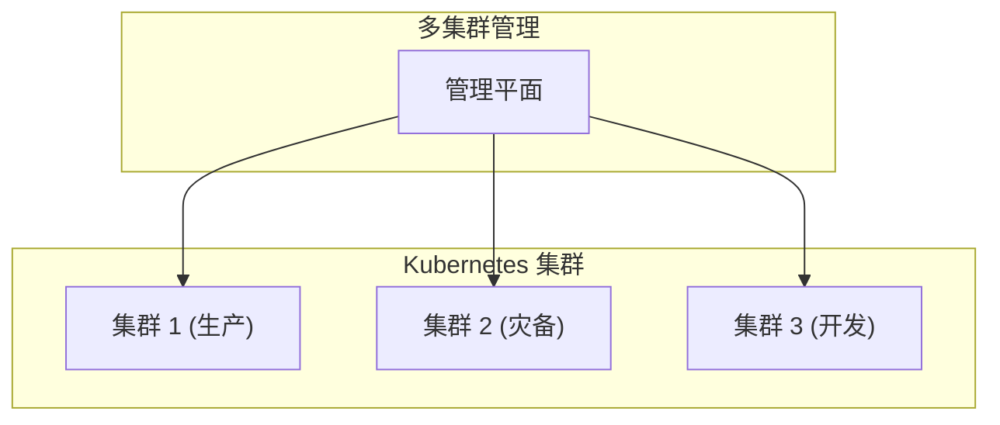
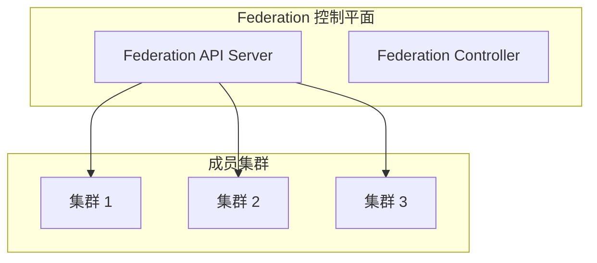
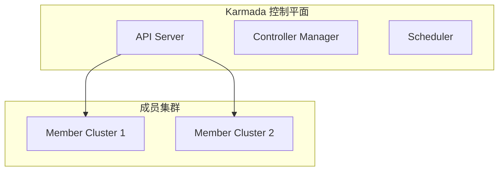
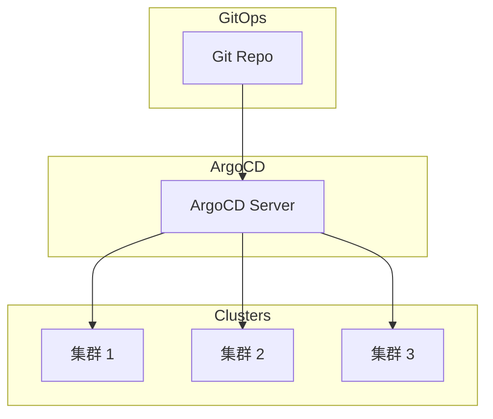
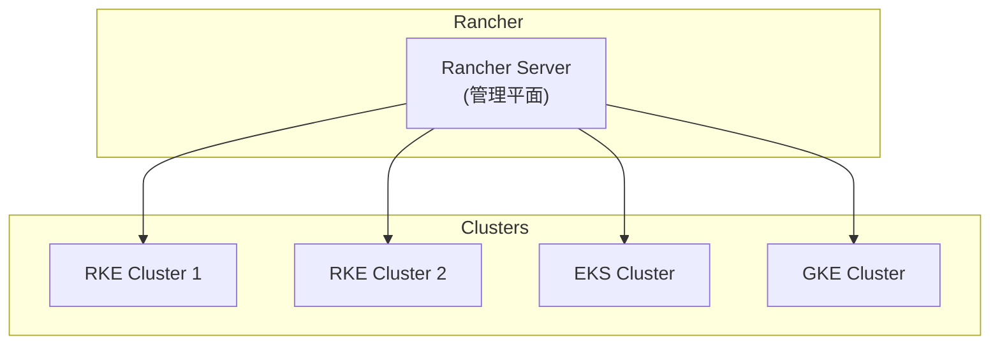
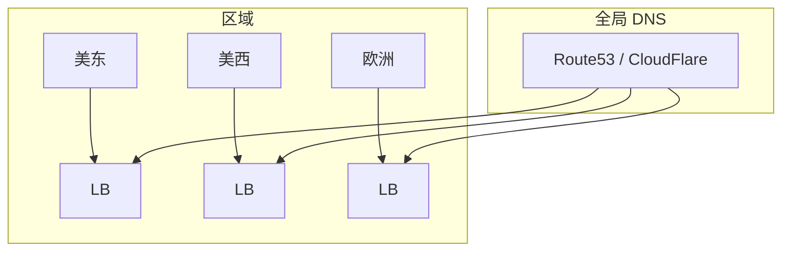

# 多集群管理

你的应用运行在多个集群上：生产集群、开发集群，还有灾备集群。怎么统一管理它们？

**多集群管理让你能够跨集群协调工作负载。**

## 多集群概述

### 为什么需要多集群

| 场景 | 说明 |
| --- | --- |
| **多环境** | dev、staging、production |
| **多区域** | us-east、us-west、eu-central |
| **多云** | AWS、Azure、GCP |
| **灾备** | 主集群 + 灾备集群 |
| **隔离** | 不同团队/业务隔离 |

### 架构模式



## Kubernetes Federation

### 概述

Federation（KubeFed）是 Kubernetes 官方提供的多集群管理方案。



### 安装 KubeFed

```bash
# 安装 KubeFed
VERSION=$(curl -s https://api.github.com/repos/kubernetes-sigs/kubefed/releases/latest | grep tag_name | cut -d '"' -f 4)
kubectl create namespace kube-federation-system
kubectl apply -f "https://github.com/kubernetes-sigs/kubefed/releases/download/${VERSION}/cluster scoped resources.yaml"
kubectl apply -f "https://github.com/kubernetes-sigs/kubefed/releases/download/${VERSION}/namespace scoped resources.yaml"
```

### 加入集群

```bash
# 在 host 集群执行
kubefedctl join cluster1 --cluster-context cluster1 --host-cluster-context host
kubefedctl join cluster2 --cluster-context cluster2 --host-cluster-context host

# 查看集群
kubectl -n kube-federation-system get clusters
```

### 联邦资源

```yaml title="federateddeployment.yaml"
apiVersion: types.kubefed.io/v1beta1
kind: FederatedDeployment
metadata:
  name: nginx
  namespace: production
spec:
  template:
    metadata:
      labels:
        app: nginx
    spec:
      replicas: 3
      selector:
        matchLabels:
          app: nginx
      template:
        spec:
          containers:
          - name: nginx
            image: nginx:1.25
  placement:
    clusters:
    - name: cluster1
    - name: cluster2
  overrides:
  - clusterName: cluster2
    clusterOverrides:
    - path: "/spec/replicas"
      value: 5
```

## Karmada

### 概述

Karmada 是华为开源的多集群 Kubernetes 管理平台，基于 Federation v2。



### 安装 Karmada

```bash
# 使用 kind 创建测试集群
kind create cluster --name Karmada-host

# 安装 Karmada
export VERSION=Tag
# 在 Karmada-host 集群安装控制平面
kubectl apply -f https://github.com/karmada-io/karmada/releases/download/${VERSION}/karmada-installer.yaml

# 加入成员集群
karmadactl join member1 --cluster-kubeconfig=/path/to/member1.kubeconfig
```

### 传播策略

```yaml title="propagationpolicy.yaml"
apiVersion: policy.karmada.io/v1alpha1
kind: PropagationPolicy
metadata:
  name: nginx-propagation
  namespace: production
spec:
  resourceSelectors:
  - apiVersion: apps/v1
    kind: Deployment
    name: nginx
  placement:
    clusterAffinity:
      clusterNames:
      - member1
      - member2
    replicaScheduling:
      replicaSchedulingType: Duplicated
      replicaDivisionPreference: Averaged
```

### 集群联邦调度

```yaml title="affinity-policy.yaml"
spec:
  placement:
    clusterAffinity:
      clusterNames:
      - member1
    replicaScheduling:
      replicaSchedulingType: Divided
      replicaDivisionPreference: Weighted
      weightPreference:
        staticWeightList:
        - targetCluster:
            clusterNames:
            - member1
          weight: 3
        - targetCluster:
            clusterNames:
            - member2
          weight: 1
```

## ArgoCD Multi-Cluster

### 概述

ArgoCD 支持管理多个 Kubernetes 集群的 GitOps 部署。



### 配置集群

```bash
# 添加集群到 ArgoCD
argocd cluster add cluster1 --name cluster1
argocd cluster add cluster2 --name cluster2

# 或通过 ArgoCD UI 添加
```

### 应用配置

```yaml title="argocd-app.yaml"
apiVersion: argoproj.io/v1alpha1
kind: Application
metadata:
  name: nginx
  namespace: argocd
spec:
  project: default
  source:
    repoURL: https://github.com/example/manifests.git
    targetRevision: main
    path: nginx
  destination:
    server: https://kubernetes.default.svc
    namespace: production
```

### 多集群应用

```yaml title="argocd-multi-cluster-app.yaml"
apiVersion: argoproj.io/v1alpha1
kind: ApplicationSet
metadata:
  name: nginx-multicluster
spec:
  generators:
  - clusters:
      values:
        environment: production
  template:
    spec:
      project: default
      source:
        repoURL: https://github.com/example/manifests.git
        targetRevision: main
        path: nginx
      destination:
        server: '{{server}}'
        namespace: production
      syncPolicy:
        automated:
          prune: true
          selfHeal: true
```

## Rancher Multi-Cluster

### 概述

Rancher 提供统一的界面管理多个 Kubernetes 集群。



## 多集群网络

### 集群间服务发现

```yaml title="service-export.yaml"
apiVersion: multicluster.x-k8s.io/v1alpha1
kind: ServiceExport
metadata:
  name: nginx
  namespace: production
```

```yaml title="service-import.yaml"
apiVersion: multicluster.x-k8s.io/v1alpha1
kind: ServiceImport
metadata:
  name: nginx
  namespace: production
spec:
  type: ClusterSetIP
  clusters:
  - cluster: member1
```

### 全球负载均衡



## 常见问题

### 集群一致性问题

```bash
# 检查集群状态
kubectl get clusters -A

# 检查同步状态
kubectl get federateddeployment -A
```

### 网络连通性

```bash
# 检查 VPN/直连
ping <member-cluster-ip>

# 检查 DNS 解析
nslookup <service>.<cluster>.clusterset.local
```

### 故障转移

```bash
# 手动故障转移
kubectl label cluster member1 cluster.karmada.io/demigration=member2
```

## 最佳实践

### 1. 统一配置管理

```bash
# 使用 GitOps 管理所有集群配置
# ArgoCD / Flux / Rancher Fleet
```

### 2. 标准化集群配置

```yaml
# 基础配置标准化
- RBAC 策略
- NetworkPolicy
- ResourceQuota
- LimitRange
```

### 3. 监控多集群

```yaml
# 统一监控
# kube-prometheus-stack + Thanos
# 或: Grafana Cloud
```

### 4. 自动化测试

```bash
# 在每个集群运行冒烟测试
kubectl run smoke-test --image=curlimages/curl -- \
  curl -s http://<service> | grep expected
```

## 选型指南

| 方案 | 特点 | 适用场景 |
| --- | --- | --- |
| **KubeFed** | 官方方案，功能全面 | 大型企业 |
| **Karmada** | 云原生，扩展性好 | 多云环境 |
| **Rancher** | 统一界面，易用性好 | 统一管理 |
| **ArgoCD** | GitOps 优先 | 自动化部署 |
| **Fleet** | Rancher 子项目 | GitOps |

## 延伸思考

多集群管理是云原生时代的必然选择：

1. **隔离与安全**：不同环境、不同业务的隔离
2. **高可用**：跨区域、跨云容灾
3. **资源优化**：根据需求分配集群
4. **运维效率**：统一管理减少重复工作

但多集群也带来复杂性：

1. **网络**：集群间通信
2. **一致性**：配置和数据同步
3. **监控**：跨集群可观测性
4. **成本**：多集群的运维成本

## 延伸阅读

- [Kubernetes 概述与架构](./overview)：Kubernetes 基础
- [服务网格](/cloud-native/service-mesh/overview)：多集群服务网格
- [GitOps](/cloud-native/cicd/gitops)：GitOps 实践
