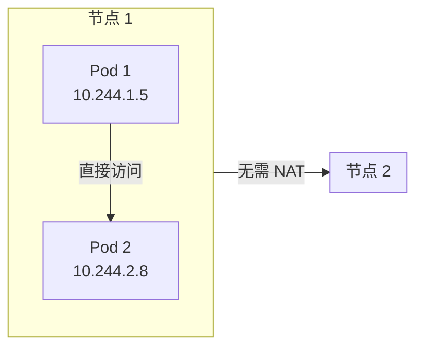
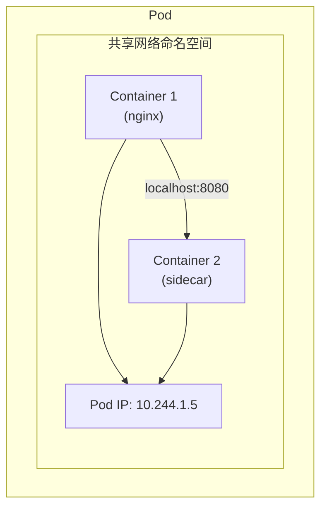
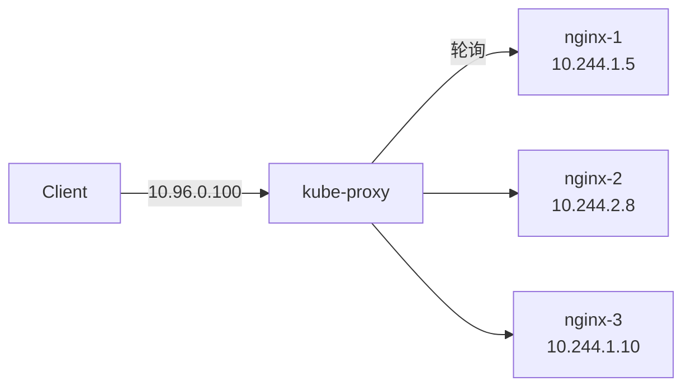
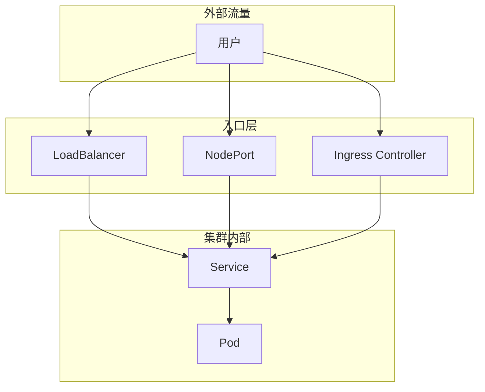

# Kubernetes 网络模型

Pod 在 Kubernetes 中拥有自己的 IP 地址。这个 IP 地址是**扁平的**，不同节点上的 Pod 可以直接通信，不需要 NAT。

这个设计背后，隐藏着 Kubernetes 对网络的核心要求。

## Kubernetes 网络基础

### 核心要求

Kubernetes 要求所有网络实现必须满足以下三个原则：

1. **Pod 间通信无需 NAT**：所有 Pod 可以直接通过 IP 互相访问
2. **节点与 Pod 通信无需 NAT**：节点可以直接访问 Pod IP
3. **Pod 看到的 IP 与其他 Pod 看到的相同**：IP 是真实的，不经过转换



### 四种网络流量

| 类型 | 说明 |
| --- | --- |
| **Pod to Pod** | 同一节点或不同节点上 Pod 之间的通信 |
| **Pod to Service** | Pod 到 Service 的通信（通过 kube-proxy） |
| **Intra-node** | 同一节点内 Pod 之间的通信 |
| **External to Service** | 集群外部到 Service 的通信 |

## Pod 网络

### Pod IP 分配

每个 Pod 获得一个唯一的 IP 地址，这个 IP 由 CNI 插件分配：

```bash
# 查看 Pod IP
kubectl get pods -o wide
# NAME       READY   STATUS    IP           NODE
# nginx-abc  1/1     Running   10.244.1.5   node-1
# nginx-def  1/1     Running   10.244.2.8   node-2
```

### 同一 Pod 内容器通信

同一 Pod 内的容器共享网络命名空间：

```bash
# 进入容器查看网络命名空间
kubectl exec -it nginx -- cat /etc/hosts
# 127.0.0.1   localhost
# 10.244.1.5  nginx-abc
```



### Pause 容器

Pause 容器（Infra 容器）用于维持网络命名空间：

```bash
# 查看 pause 容器
docker ps | grep pause
# CONTAINER ID   IMAGE         COMMAND   CREATED
# abc123         k8s.gcr.io/pause:3.9   /pause   2 hours ago
```

## Service 网络

### ClusterIP

Service 获得一个虚拟 IP（ClusterIP），用于集群内部访问：

```bash
kubectl get svc kubernetes
# NAME         TYPE        CLUSTER-IP   PORT(S)   AGE
# kubernetes   ClusterIP   10.96.0.1    443/TCP   30d
```

### kube-proxy 与 Service

kube-proxy 维护 iptables 或 IPVS 规则，实现负载均衡：



### DNS

CoreDNS 为 Service 提供 DNS 解析：

```bash
# 查看 CoreDNS
kubectl get pods -n kube-system -l k8s-app=kube-dns

# DNS 记录格式
# <service>.<namespace>.svc.<cluster-domain>
# nginx.default.svc.cluster.local
```

## 网络隔离

### 命名空间隔离

不同命名空间的 Service 可以有相同的名称，通过命名空间区分：

```bash
# 命名空间 prod
kubectl get svc -n prod
# NAME   TYPE        CLUSTER-IP    PORT(S)
# nginx  ClusterIP   10.96.0.100  80/TCP

# 命名空间 staging
kubectl get svc -n staging
# NAME   TYPE        CLUSTER-IP    PORT(S)
# nginx  ClusterIP   10.96.0.101  80/TCP
```

### 网络策略（NetworkPolicy）

使用 NetworkPolicy 控制 Pod 之间的流量：

```yaml title="networkpolicy.yaml"
apiVersion: networking.k8s.io/v1
kind: NetworkPolicy
metadata:
  name: api-network-policy
  namespace: production
spec:
  podSelector:
    matchLabels:
      app: api
  policyTypes:
  - Ingress
  - Egress
  ingress:
  - from:
    - podSelector:
        matchLabels:
          role: frontend
    ports:
    - protocol: TCP
      port: 8080
```

详细内容请参考 [NetworkPolicy 网络策略](./network-policy)。

## 入口流量

### 流量进入集群的方式



详细内容请参考 [Ingress 与 Ingress Controller](./ingress)。

## 常见网络配置

### hostNetwork

Pod 使用宿主机的网络命名空间：

```yaml
spec:
  hostNetwork: true
  # Pod 的端口直接绑定到节点端口
  # 端口冲突风险
```

### hostPort

容器端口映射到宿主机端口：

```yaml
containers:
- name: nginx
  image: nginx
  ports:
  - containerPort: 80
    hostPort: 8080  # 映射到节点的 8080 端口
```

### DNS 配置

```yaml
spec:
  dnsPolicy: ClusterFirst  # 默认，优先使用集群 DNS
  # dnsPolicy: Default      # 使用节点的 DNS 配置
  # dnsPolicy: ClusterFirstWithHostNet  # 配合 hostNetwork 使用
  # dnsPolicy: None        # 自定义 DNS 配置
  dnsConfig:
    nameservers:
    - 8.8.8.8
    searches:
    - ns1.svc.cluster.local
    options:
    - name: ndots
      value: "2"
```

## 常见问题

### Pod 无法访问 Service

```bash
# 检查 DNS 解析
kubectl exec -it <pod-name> -- nslookup <service-name>

# 检查 kube-proxy 状态
kubectl get pods -n kube-system -l k8s-app=kube-proxy

# 查看 iptables 规则
kubectl exec -it <node> -- iptables -L -t nat | grep KUBE-SVC
```

### Pod 无法访问外部网络

```bash
# 检查 CNI 插件状态
kubectl get pods -n kube-system -l k8s-app=calico-node

# 检查节点网络配置
kubectl get nodes -o wide
```

### Service 无法访问

```bash
# 检查 Endpoint
kubectl get endpoints <service-name>

# 检查 Pod 选择器
kubectl describe svc <service-name>
```

## 延伸思考

Kubernetes 的网络模型基于几个核心设计原则：

1. **IP-per-Pod**：每个 Pod 有唯一 IP，避免端口冲突
2. **扁平网络**：Pod 之间可以直接通信，简化架构
3. **Service 抽象**：提供稳定的访问入口

但这种模型也带来了挑战：

1. **网络复杂性**：需要 CNI 插件实现网络
2. **性能开销**：kube-proxy 的负载均衡有开销
3. **调试困难**：网络问题排查复杂

理解网络模型是深入 Kubernetes 的关键。

## 延伸阅读

- [CNI 插件对比](./cni)：Flannel、Calico、Cilium
- [Service 详解](./service)：Service 网络实现
- [NetworkPolicy 网络策略](./network-policy)：流量控制
