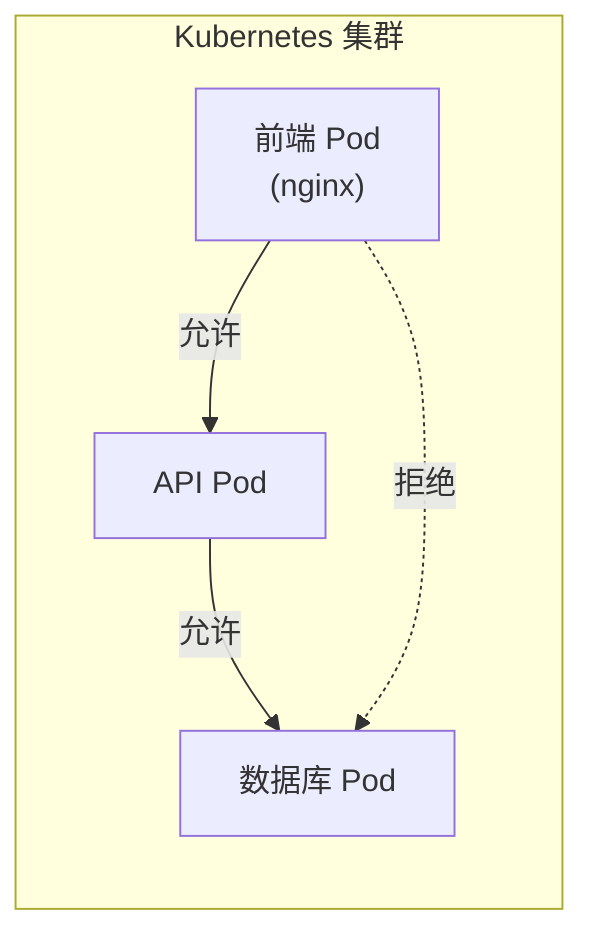
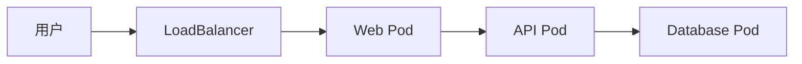
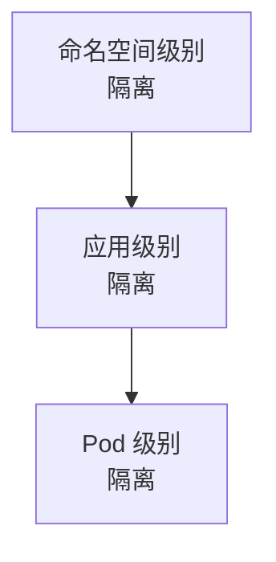

# NetworkPolicy 网络策略

默认情况下，Kubernetes 集群内的 Pod 可以自由通信。但这在生产环境中可能是安全隐患。

**NetworkPolicy 让你可以为 Pod 定义入站和出站规则，实现微隔离。**

## 什么是 NetworkPolicy？

NetworkPolicy 是 Kubernetes 的一种资源，用于**声明式**地定义 Pod 之间的网络访问规则。



```yaml title="db-networkpolicy.yaml"
apiVersion: networking.k8s.io/v1
kind: NetworkPolicy
metadata:
  name: db-policy
  namespace: production
spec:
  podSelector:
    matchLabels:
      app: database
  policyTypes:
  - Ingress
  - Egress
  ingress:
  - from:
    - podSelector:
        matchLabels:
          app: api
    ports:
    - protocol: TCP
      port: 5432
  egress:
  - to:
    - podSelector: {}
```

## 基本结构

### 字段说明

```yaml
spec:
  podSelector: {}          # 选择受策略影响的 Pod
  policyTypes:             # 策略类型
  - Ingress
  - Egress
  ingress: []              # 入站规则
  egress: []               # 出站规则
```

| 字段 | 说明 |
| --- | --- |
| `podSelector` | 选择受策略影响的 Pod |
| `policyTypes` | 声明策略类型（Ingress/Egress） |
| `ingress` | 入站白名单规则 |
| `egress` | 出站白名单规则 |

## 策略类型

### Ingress（入站规则）

```yaml
spec:
  podSelector:
    matchLabels:
      app: web
  policyTypes:
  - Ingress
  ingress:
  # 允许来自带 frontend 标签的 Pod
  - from:
    - podSelector:
        matchLabels:
          role: frontend
    ports:
    - protocol: TCP
      port: 8080

  # 允许来自任意命名空间的带 monitoring 标签的 Pod
  - from:
    - namespaceSelector:
        matchLabels:
          purpose: monitoring
      podSelector:
        matchLabels:
          app: prometheus
    ports:
    - protocol: TCP
      port: 9090
```

### Egress（出站规则）

```yaml
spec:
  podSelector:
    matchLabels:
      app: api
  policyTypes:
  - Egress
  egress:
  # 允许访问数据库
  - to:
    - podSelector:
        matchLabels:
          app: database
    ports:
    - protocol: TCP
      port: 5432

  # 允许访问 DNS
  - to:
    - namespaceSelector:
        matchLabels:
          kubernetes.io/metadata.name: kube-system
      podSelector:
        matchLabels:
          k8s-app: kube-dns
    ports:
    - protocol: UDP
      port: 53
    - protocol: TCP
      port: 53
```

### Ingress + Egress

```yaml
spec:
  podSelector:
    matchLabels:
      app: web
  policyTypes:
  - Ingress
  - Egress
  ingress:
  - from:
    - namespaceSelector: {}
    ports:
    - protocol: TCP
      port: 80
  egress:
  - to:
    - podSelector:
        matchLabels:
          app: api
    ports:
    - protocol: TCP
      port: 8080
```

## 命名空间隔离

### 限制整个命名空间的入站

```yaml title="default-deny.yaml"
apiVersion: networking.k8s.io/v1
kind: NetworkPolicy
metadata:
  name: default-deny-ingress
spec:
  podSelector: {}
  policyTypes:
  - Ingress
```

### 允许同一命名空间内通信

```yaml title="allow-same-namespace.yaml"
apiVersion: networking.k8s.io/v1
kind: NetworkPolicy
metadata:
  name: allow-same-namespace
spec:
  podSelector: {}
  policyTypes:
  - Ingress
  ingress:
  - from:
    - podSelector: {}
```

### 允许特定命名空间

```yaml
ingress:
# 允许来自 monitoring 命名空间的流量
- from:
  - namespaceSelector:
      matchLabels:
        name: monitoring
```

## IP Block

### 基于 IP CIDR 的规则

```yaml
ingress:
# 允许来自 192.168.0.0/16 的流量
- from:
  - ipBlock:
      cidr: 192.168.0.0/16

egress:
# 允许访问外部 DNS
- to:
  - ipBlock:
      cidr: 8.8.8.8/32
  ports:
  - protocol: TCP
    port: 53
```

### 排除特定 IP

```yaml
ingress:
- from:
  - ipBlock:
      cidr: 10.0.0.0/8
      except:     # 排除 10.0.0.0/24
      - 10.0.0.0/24
```

## 端口和协议

```yaml
ports:
# TCP 端口
- protocol: TCP
  port: 80

# UDP 端口
- protocol: UDP
  port: 53

# 命名端口（引用容器中定义的端口）
- protocol: TCP
  port: http

# 端口范围
- protocol: TCP
  port: 8000
  end: 9000
```

## 完整示例

### Web 应用三层架构



```yaml title="web-networkpolicies.yaml"
---
# 1. 默认拒绝所有入站
apiVersion: networking.k8s.io/v1
kind: NetworkPolicy
metadata:
  name: default-deny-all
  namespace: production
spec:
  podSelector: {}
  policyTypes:
  - Ingress
  - Egress
---
# 2. Web 层：允许 LoadBalancer 和 API 层
apiVersion: networking.k8s.io/v1
kind: NetworkPolicy
metadata:
  name: web-policy
  namespace: production
spec:
  podSelector:
    matchLabels:
      tier: web
  policyTypes:
  - Ingress
  - Egress
  ingress:
  - from:
    - namespaceSelector: {}
    ports:
    - protocol: TCP
      port: 80
    - protocol: TCP
      port: 443
  egress:
  - to:
    - podSelector:
        matchLabels:
          tier: api
    ports:
    - protocol: TCP
      port: 8080
  - to:
    - namespaceSelector:
        matchLabels:
          kubernetes.io/metadata.name: kube-system
      podSelector:
        matchLabels:
          k8s-app: kube-dns
    ports:
    - protocol: UDP
      port: 53
---
# 3. API 层：允许 Web 层和数据库
apiVersion: networking.k8s.io/v1
kind: NetworkPolicy
metadata:
  name: api-policy
  namespace: production
spec:
  podSelector:
    matchLabels:
      tier: api
  policyTypes:
  - Ingress
  - Egress
  ingress:
  - from:
    - podSelector:
        matchLabels:
          tier: web
    ports:
    - protocol: TCP
      port: 8080
  egress:
  - to:
    - podSelector:
        matchLabels:
          tier: database
    ports:
    - protocol: TCP
      port: 5432
  - to:
    - namespaceSelector:
        matchLabels:
          kubernetes.io/metadata.name: kube-system
      podSelector:
        matchLabels:
          k8s-app: kube-dns
    ports:
    - protocol: UDP
      port: 53
---
# 4. 数据库层：只允许 API 层
apiVersion: networking.k8s.io/v1
kind: NetworkPolicy
metadata:
  name: database-policy
  namespace: production
spec:
  podSelector:
    matchLabels:
      tier: database
  policyTypes:
  - Ingress
  - Egress
  ingress:
  - from:
    - podSelector:
        matchLabels:
          tier: api
    ports:
    - protocol: TCP
      port: 5432
  egress: []
```

## CNI 支持

### NetworkPolicy 支持情况

| CNI | NetworkPolicy 支持 |
| --- | --- |
| **Calico** | ✓ 原生支持 |
| **Cilium** | ✓ 原生支持（L7 策略） |
| **Flannel** | ✗ 不支持（需要配合其他插件） |
| **Weave** | ✓ 部分支持 |

### Flannel 环境下的替代方案

如果使用 Flannel，可以考虑：

1. **升级到 Calico**：Calico 可以与 Flannel 共存
2. **使用 OPA Gatekeeper**：基于策略的访问控制
3. **使用服务网格**：Istio 的 AuthorizationPolicy

## 常见问题

### Policy 不生效

```bash
# 1. 确认 CNI 支持 NetworkPolicy
kubectl get pods -n kube-system -l k8s-app=kube-proxy

# 2. 确认 NetworkPolicy 已应用
kubectl describe networkpolicy <name>

# 3. 查看命名空间标签
kubectl get namespaces --show-labels
```

### 规则冲突

```yaml
# 多个 NetworkPolicy 会合并
# 但如果规则冲突，可能导致意外行为
```

### DNS 访问被阻止

```yaml
# 必须允许访问 DNS
egress:
- to:
  - namespaceSelector:
      matchLabels:
        kubernetes.io/metadata.name: kube-system
    podSelector:
      matchLabels:
        k8s-app: kube-dns
  ports:
  - protocol: UDP
    port: 53
  - protocol: TCP
    port: 53
```

## 最佳实践

### 1. 默认拒绝

始终在命名空间中创建默认拒绝策略：

```yaml
apiVersion: networking.k8s.io/v1
kind: NetworkPolicy
metadata:
  name: default-deny
spec:
  podSelector: {}
```

### 2. 分层设计



### 3. 最小权限

```yaml
# 只开放必要的端口
ports:
- protocol: TCP
  port: 8080    # 不要开放 8000-9000
```

### 4. 测试验证

```bash
# 使用 kubectl 插件测试
kubectl networkpolicy-validate

# 或者手动测试
kubectl exec -it frontend-pod -- curl api-service:8080
```

## 延伸思考

NetworkPolicy 是 Kubernetes 实现零信任网络的基础：

1. **声明式安全**：你声明需要的流量，剩余都被拒绝
2. **微分段**：实现 Pod 级别的隔离
3. **与 CNI 集成**：依赖 CNI 插件实现

但 NetworkPolicy 也有局限：

1. **不加密流量**：只控制允许/拒绝，不做加密
2. **不验证身份**：依赖网络层标识，不验证应用身份
3. **覆盖不完整**：某些 CNI 插件支持有限

对于更高级的安全需求，可以考虑服务网格（如 Istio）的 AuthorizationPolicy。

## 延伸阅读

- [Kubernetes 网络模型](./network-model)：网络基础
- [CNI 插件对比](./cni)：不同 CNI 的 NetworkPolicy 支持
