# 工作节点组件

当你在笔记本上运行 Docker 容器时，Docker daemon 负责拉取镜像、创建容器、管理网络。这个工作简单直接。但当你在 Kubernetes 集群中运行容器时，情况就复杂得多——你可能有几十上百个节点，每个节点运行着不同的 Pod，不同的容器需要不同的配置，网络需要相互隔离，存储需要动态挂载。

**工作节点上的组件，就是负责把这些复杂性封装起来，让 Pod 能够「无感知」地运行。**

## 工作节点概述

工作节点是 Kubernetes 集群中实际运行 Pod 的机器。每个工作节点上都运行着三个核心组件：

| 组件 | 作用 |
| --- | --- |
| **kubelet** | 节点 Agent，负责管理 Pod 的生命周期 |
| **kube-proxy** | 网络代理，维护节点上的网络规则 |
| **Container Runtime** | 容器运行时，实际运行容器 |

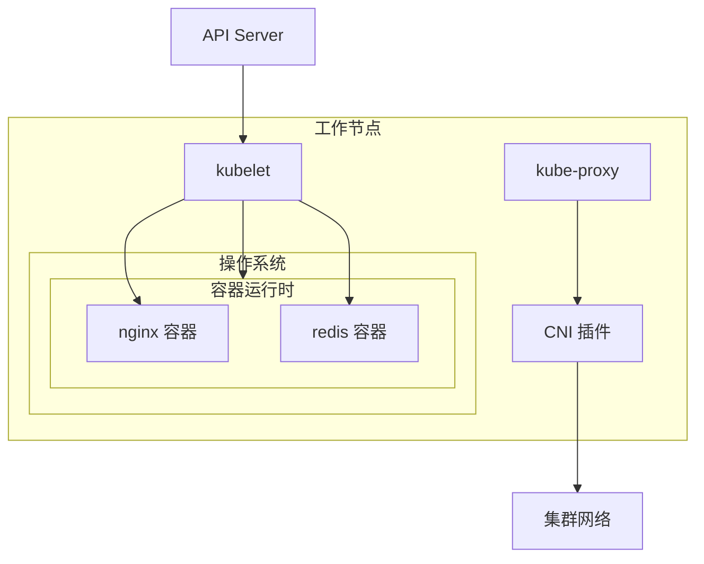

## kubelet

### kubelet 是什么？

kubelet 是**运行在每个工作节点上的 Agent**，负责向 API Server 注册节点，并确保节点上的 Pod 按预期运行。

:::info
kubelet 的名字来源于「Kubernetes process」，但更形象的理解是：kubelet 是 Kubernetes 派驻在每个节点上的「管理员」，它负责执行控制平面下达的指令。
:::

### 核心职责

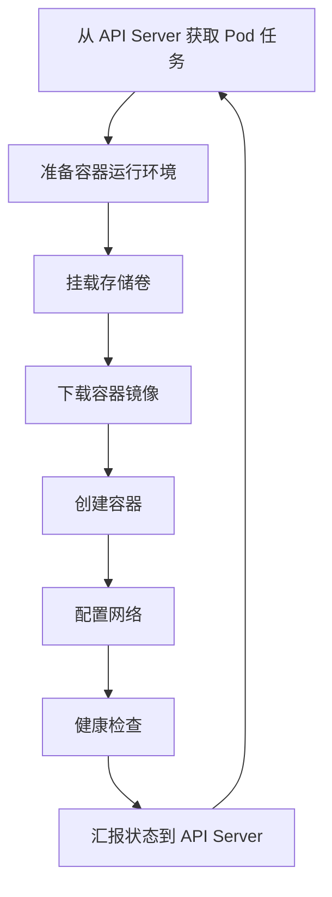

1. **向 API Server 注册节点**：kubelet 启动时会向 API Server 注册节点信息
2. **同步 Pod 状态**：监听分配到自己节点的 Pod，确保实际状态等于期望状态
3. **监控容器健康**：执行探针（liveness/readiness），重启不健康的容器
4. **收集资源使用**：向 API Server 汇报节点资源使用情况
5. **挂载存储卷**：将 PersistentVolume 挂载到 Pod

### Pod 创建流程

当 kubelet 收到创建 Pod 的指令时，它会执行以下步骤：

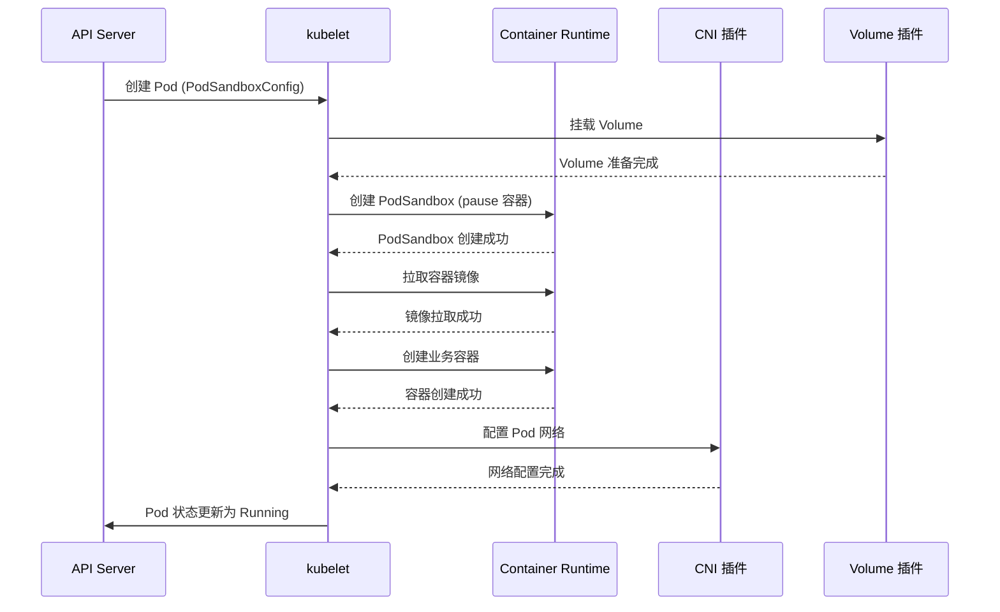

### kubelet 与 API Server 通信

kubelet 通过 **Watch + Patch** 机制与 API Server 通信：

```go title="kubelet sync pod 伪代码"
func (kl *Kubelet) syncPod(pod *v1.Pod) error {
    // 1. 同步 Pod 到本地状态
    podStatus := kl.generatePodStatus(pod)

    // 2. 创建/更新容器
    if err := kl.computePodContainerChanges(pod); err != nil {
        return err
    }

    // 3. 启动容器
    if err := kl.startContainer(pod); err != nil {
        return err
    }

    // 4. 更新 Pod 状态到 API Server
    kl.statusManager.SetPodStatus(pod, podStatus)
    return nil
}
```

### 容器状态同步

kubelet 维护着 Pod 的期望状态和实际状态：

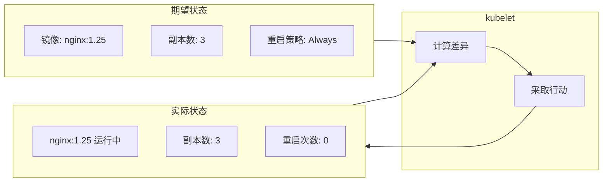

### 镜像垃圾回收

kubelet 会自动清理未使用的镜像：

| 配置项 | 说明 | 默认值 |
| --- | --- | --- |
| `image-gc-high-threshold` | 触发垃圾回收的磁盘使用率 | 85% |
| `image-gc-low-threshold` | 停止垃圾回收的磁盘使用率 | 80% |

```bash
# 查看 kubelet 配置
cat /var/lib/kubelet/config.yaml

# 手动触发镜像垃圾回收
kubectl drain node-1 --delete-emptydir-data --ignore-daemonsets
```

## Container Runtime Interface (CRI)

### 什么是 CRI？

CRI 是 Kubernetes 定义的**容器运行时接口**，允许 kubelet 不绑定特定的容器运行时实现。只要实现了 CRI 接口，就可以作为 Kubernetes 的容器运行时。

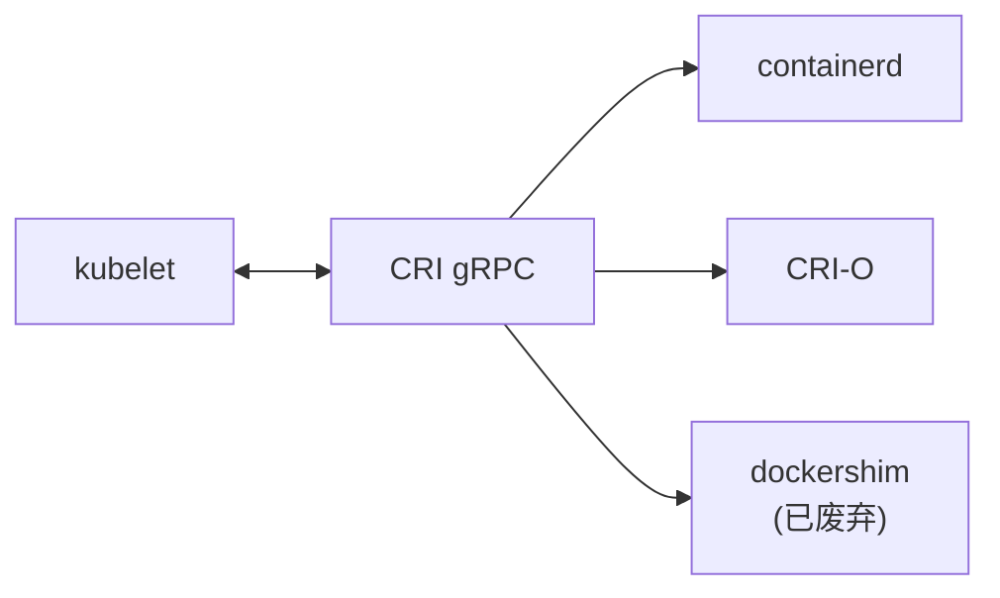

:::warning
dockershim 在 Kubernetes 1.24 中已被移除。如果你使用的是 Docker Desktop 或 kubeadm 安装的集群，需要确保使用支持的容器运行时（如 containerd 或 CRI-O）。
:::

### 主要容器运行时

| 运行时 | 说明 | 适用场景 |
| --- | --- | --- |
| **containerd** | CNCF 项目，最流行 | 生产环境首选 |
| **CRI-O** | 红帽主导，K8s 友好 | OpenShift |
| **Docker Engine** | 通过 dockershim | 已废弃，不推荐 |
| **gVisor** | Google 安全容器 | 隔离要求高的场景 |
| **Kata Containers** | 硬件虚拟化 | 高安全场景 |

### containerd 架构

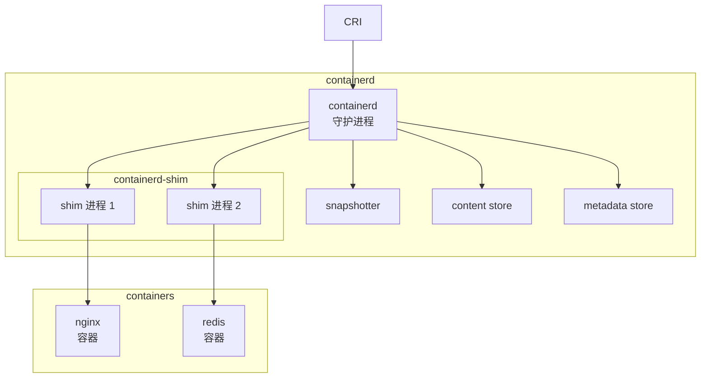

containerd 的设计亮点是 **shim 进程**：

- 每个容器都有一个独立的 shim 进程
- shim 负责管理容器的生命周期
- 即使 containerd 重启，容器也不会受影响

## kube-proxy

### kube-proxy 是什么？

kube-proxy 是运行在每个节点上的**网络代理**，负责维护节点上的网络规则，实现 Service 的负载均衡。

:::info
kube-proxy 的名字来源于「Kubernetes service proxy」，但它的作用远不止「代理」这么简单——它是 Kubernetes Service 网络模型的关键实现。
:::

### 服务发现机制

在深入 kube-proxy 之前，需要理解 Kubernetes 的服务发现问题：

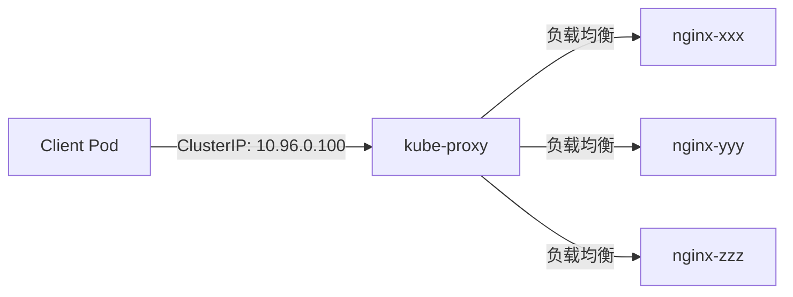

当 Client Pod 访问 `http://10.96.0.100` 时：

1. 流量首先经过 kube-proxy
2. kube-proxy 根据负载均衡策略选择一个后端 Pod
3. 流量被转发到选中的 Pod

### 代理模式

kube-proxy 支持三种代理模式：

#### userspace 模式（已废弃）

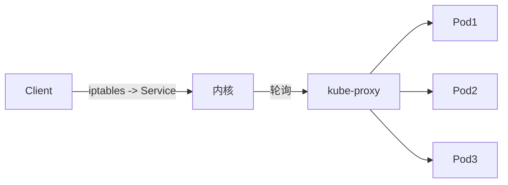

流量经过用户空间的 kube-proxy 进程转发，性能较差。

#### iptables 模式（默认）

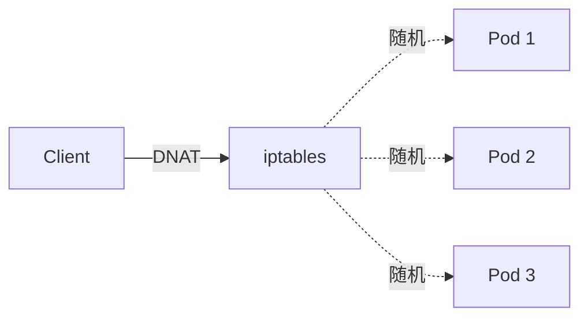

kube-proxy 通过配置 iptables 规则实现负载均衡：

```bash
# 查看 iptables 规则
iptables -t nat -L KUBE-SERVICES -n
iptables -t nat -L KUBE-SVC-XXX -n
```

| 优点 | 缺点 |
| --- | --- |
| 内核空间处理，性能好 | 规则过多时性能下降 |
| 配置简单 | 不支持负载均衡算法（只支持随机） |
| 成熟稳定 | 更新规则时可能丢包 |

#### IPVS 模式（推荐）

```bash
# 查看 IPVS 规则
ipvsadm -L -n
```

IPVS（IP Virtual Server）是 Linux 内核的负载均衡模块，比 iptables 性能更好：

| 模式 | 说明 |
| --- | --- |
| `rr` | 轮询 |
| `wrr` | 加权轮询 |
| `lc` | 最少连接 |
| `wlc` | 加权最少连接 |
| `sh` | 源哈希 |
| `dh` | 目标哈希 |

```bash
# 启用 IPVS 模式
kube-proxy --proxy-mode=ipvs
```

:::tip
在大型集群（超过 1000 个节点或 Service）中，建议使用 IPVS 模式，可以显著提升 Service 负载均衡性能。
:::

### 网络规则更新

kube-proxy 监听 Service 和 Endpoint 的变更，动态更新网络规则：

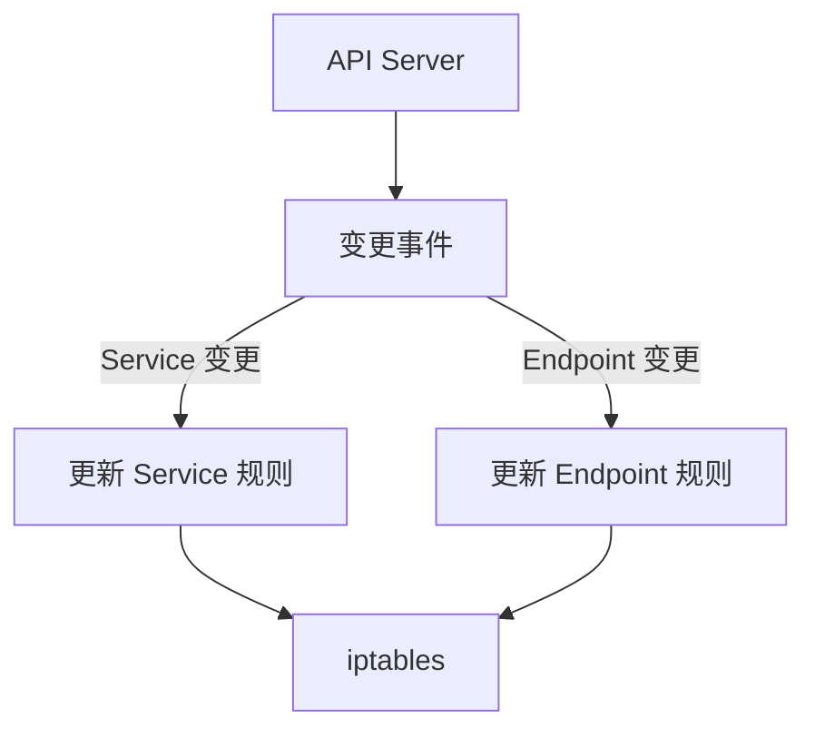

```bash
# 查看当前节点的 Service
kubectl get svc --all-namespaces -o wide

# 查看某个 Service 的 Endpoint
kubectl get endpoints nginx -n default
```

## CNI 插件

### 什么是 CNI？

CNI（Container Network Interface）是 **Container Networking Interface** 的缩写，是容器网络接口的标准化方案。CNI 插件负责为容器配置网络，实现 Pod 之间的通信。

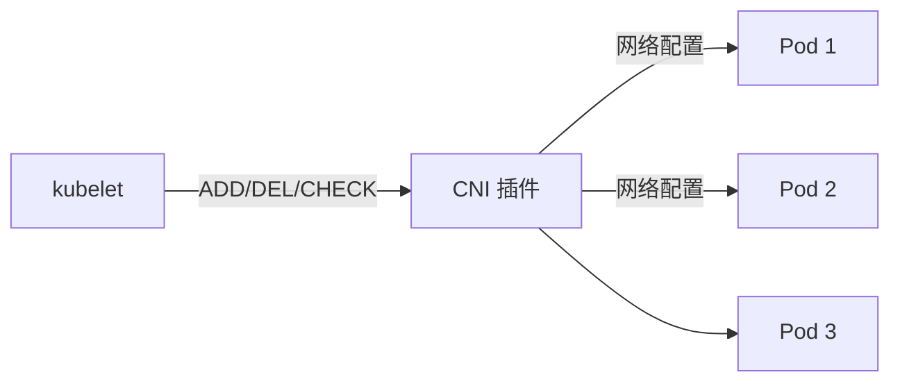

### 常见 CNI 插件对比

| 插件 | 类型 | 特点 |
| --- | --- | --- |
| **Flannel** | 覆盖网络 | 简单易用，适合小规模集群 |
| **Calico** | 路由 + BGP | 性能好，支持网络策略 |
| **Cilium** | eBPF | 性能极佳，深度可观测性 |
| **Weave** | 覆盖网络 | 简单，支持加密 |
| **Macvlan** | 负载网络 | 性能最好，需要底层网络支持 |

详细内容请参考 [CNI 插件对比](./cni)。

## 节点维护

### 驱逐 Pod

在维护节点之前，需要先驱逐节点上的 Pod：

```bash
# 标记节点为不可调度（但不驱逐已有 Pod）
kubectl cordon node-1

# 驱逐节点上的 Pod
kubectl drain node-1 --delete-emptydir-data --ignore-daemonsets --force
```

```bash
# 参数说明
--delete-emptydir-data    # 允许删除 emptyDir 卷
--ignore-daemonsets       # 忽略 DaemonSet Pod（会自动在其他节点创建）
--force                   # 强制驱逐独立 Pod（不受 ReplicaSet 等控制器管理）
--grace-period            # 优雅终止时间
--timeout                 # 超时时间
```

### 节点状态

```bash
# 查看所有节点状态
kubectl get nodes

# 查看节点详情
kubectl describe node node-1
```

节点状态：

| 状态 | 说明 |
| --- | --- |
| `Ready` | 节点正常，可以调度 Pod |
| `NotReady` | 节点不可用，不调度新 Pod |
| `SchedulingDisabled` | 节点已被 cordon，不调度新 Pod |
| `Unknown` | 无法与 API Server 通信 |

## 常见问题

### Pod 无法启动

可能原因：

1. **镜像拉取失败**：检查镜像仓库配置、凭证
2. **资源不足**：节点资源被其他 Pod 耗尽
3. **挂载 Volume 失败**：PV 未正确绑定
4. **网络配置失败**：CNI 插件异常

```bash
# 查看 Pod 事件
kubectl describe pod <pod-name>

# 查看节点资源
kubectl describe node <node-name>
```

### 节点 NotReady

可能原因：

1. **kubelet 进程异常**：检查 kubelet 日志
2. **网络不通**：节点无法访问 API Server
3. **磁盘空间不足**：kubelet 无法写入状态
4. **证书过期**：kubelet 与 API Server 通信失败

```bash
# 查看 kubelet 日志
journalctl -u kubelet -n 100

# 检查磁盘空间
df -h
```

## 延伸思考

工作节点组件的设计体现了几个重要的工程原则：

1. **关注点分离**：kubelet、kube-proxy、容器运行时各自负责不同的职责
2. **接口抽象**：CRI、CNI 等接口设计，使得 Kubernetes 可以与多种实现解耦
3. **本地决策**：尽可能在节点本地做决策，减少控制平面的压力

但这种设计也带来了复杂性——当 Pod 运行异常时，需要检查多个组件（kubelet、容器运行时、CNI）才能定位问题。这也是 Kubernetes 学习曲线较陡的原因之一。

## 延伸阅读

- [Pod 深度解析](./pod)：Pod 的生命周期和管理
- [Service 详解](./service)：Kubernetes 服务发现机制
- [CNI 插件对比](./cni)：不同 CNI 插件的特点和选型
- [Kubernetes 故障排查](./troubleshooting)：常见问题的排查方法
