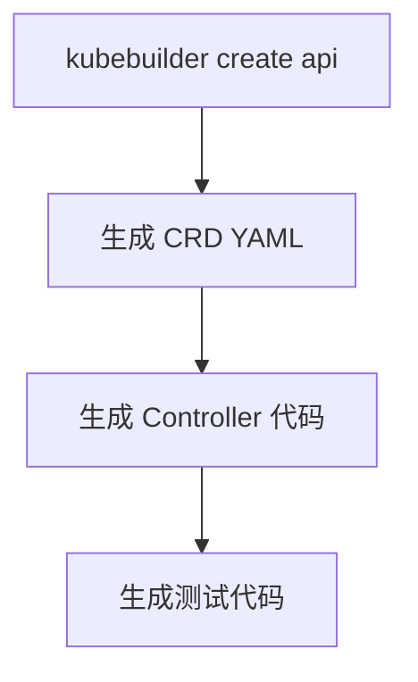

# Operator 开发实战

现在你已经理解了 Operator 的概念，接下来让我们亲手开发一个 Operator。

我们将使用 **Kubebuilder**，这是 CNCF 官方推荐的 Operator 开发框架。

## 环境准备

### 安装工具

```bash
# 安装 kubebuilder
curl -L -o /usr/local/bin/kubebuilder https://go.kubebuilder.io/dl/latest/$(go env GOOS)/$(go env GOARCH)
chmod +x /usr/local/bin/kubebuilder

# 安装 kustomize（用于生成 YAML）
brew install kustomize

# 验证安装
kubebuilder version
```

### 创建项目

```bash
# 初始化项目
mkdir -p $HOME/go/src/github.com/example
cd $HOME/go/src/github.com/example
kubebuilder init --domain example.com --repo github.com/example/cache-operator

# 查看项目结构
tree .
```

## 开发步骤

### 1. 创建 API

```bash
# 创建 CRD 和 Controller
kubebuilder create api --group cache --version v1 --kind RedisCache --namespaced
```



### 2. 定义 CRD Schema

```go title="api/v1/rediscache_types.go"
package v1

import (
    metav1 "k8s.io/apimachinery/pkg/apis/meta/v1"
)

// RedisCacheSpec 定义 Redis 集群的规格
type RedisCacheSpec struct {
    // Redis 版本
    Version string `json:"version,omitempty"`

    // 副本数
    Replicas int32 `json:"replicas,omitempty"`

    // Master 配置
    MasterConfig RedisConfig `json:"masterConfig,omitempty"`

    // Slave 配置
    SlaveConfig RedisConfig `json:"slaveConfig,omitempty"`

    // 持久化配置
    Persistence *PersistenceSpec `json:"persistence,omitempty"`
}

// RedisConfig Redis 配置
type RedisConfig struct {
    // CPU 和内存限制
    Resources corev1.ResourceRequirements `json:"resources,omitempty"`

    // 自定义配置
    Config map[string]string `json:"config,omitempty"`
}

// PersistenceSpec 持久化配置
type PersistenceSpec struct {
    Enabled        bool   `json:"enabled,omitempty"`
    StorageClassName string `json:"storageClassName,omitempty"`
    Capacity       string `json:"capacity,omitempty"`
}

// RedisCacheStatus 定义 Redis 集群的状态
type RedisCacheStatus struct {
    // Phase 表示集群当前状态
    Phase string `json:"phase,omitempty"`

    // Master Pod 名称
    Master string `json:"master,omitempty"`

    // 当前副本数
    Replicas int32 `json:"replicas,omitempty"`

    // 条件状态
    Conditions []metav1.Condition `json:"conditions,omitempty"`
}

// RedisCache 是 Redis 缓存集群的 CRD
type RedisCache struct {
    metav1.TypeMeta   `json:",inline"`
    metav1.ObjectMeta `json:"metadata,omitempty"`

    Spec   RedisCacheSpec   `json:"spec,omitempty"`
    Status RedisCacheStatus `json:"status,omitempty"`
}
```

### 3. 生成 CRD 文件

```bash
# 生成 CRD 和 DeepCopy 方法
make generate

# 生成 Kubernetes YAML 文件
make manifests
```

### 4. 实现 Controller

```go title="controllers/rediscache_controller.go"
package controllers

import (
   "context"
    "fmt"

    appsv1 "k8s.io/api/apps/v1"
    corev1 "k8s.io/api/core/v1"
    "k8s.io/apimachinery/pkg/api/resource"
    metav1 "k8s.io/apimachinery/pkg/apis/meta/v1"
    "k8s.io/apimachinery/pkg/runtime"
    ctrl "sigs.k8s.io/controller-runtime"
    "sigs.k8s.io/controller-runtime/pkg/client"
    "sigs.k8s.io/controller-runtime/pkg/log"

    cachev1 "github.com/example/cache-operator/api/v1"
)

const (
    redisImage     = "redis:%s"
    finalizerName  = "rediscache.cache.example.com/finalizer"
)

// RedisCacheReconciler reconciles a RedisCache object
type RedisCacheReconciler struct {
    client.Client
    Scheme *runtime.Scheme
}

//+kubebuilder:rbac:groups=cache.example.com,resources=rediscaches,verbs=get;list;watch;create;update;patch;delete
//+kubebuilder:rbac:groups=cache.example.com,resources=rediscaches/status,verbs=get;update;patch
//+kubebuilder:rbac:groups=cache.example.com,resources=rediscaches/finalizers,verbs=update
//+kubebuilder:rbac:groups=apps,resources=statefulsets,verbs=get;list;watch;create;update;patch;delete
//+kubebuilder:rbac:groups=core,resources=services;configmaps;persistentvolumeclaims,verbs=get;list;watch;create;update;patch;delete

// Reconcile 是核心的控制循环
func (r *RedisCacheReconciler) Reconcile(ctx context.Context, req ctrl.Request) (ctrl.Result, error) {
    logger := log.FromContext(ctx)
    logger.Info("Reconciling RedisCache", "name", req.Name, "namespace", req.Namespace)

    // 1. 获取 RedisCache 资源
    redisCache := &cachev1.RedisCache{}
    if err := r.Get(ctx, req.NamespacedName, redisCache); err != nil {
        return ctrl.Result{}, client.IgnoreNotFound(err)
    }

    // 2. 处理删除逻辑
    if !redisCache.DeletionTimestamp.IsZero() {
        if containsString(redisCache.Finalizers, finalizerName) {
            // 执行清理逻辑
            if err := r.cleanupResources(ctx, redisCache); err != nil {
                return ctrl.Result{}, err
            }
            // 移除 finalizer
            redisCache.Finalizers = removeString(redisCache.Finalizers, finalizerName)
            if err := r.Update(ctx, redisCache); err != nil {
                return ctrl.Result{}, err
            }
        }
        return ctrl.Result{}, nil
    }

    // 3. 添加 finalizer
    if !containsString(redisCache.Finalizers, finalizerName) {
        redisCache.Finalizers = append(redisCache.Finalizers, finalizerName)
        if err := r.Update(ctx, redisCache); err != nil {
            return ctrl.Result{}, err
        }
    }

    // 4. 创建或更新 StatefulSet
    if err := r.reconcileStatefulSet(ctx, redisCache); err != nil {
        return ctrl.Result{}, err
    }

    // 5. 创建或更新 Service
    if err := r.reconcileService(ctx, redisCache); err != nil {
        return ctrl.Result{}, err
    }

    // 6. 更新状态
    if err := r.updateStatus(ctx, redisCache); err != nil {
        return ctrl.Result{}, err
    }

    // 7. 重新入队，等待下一次调度
    return ctrl.Result{RequeueAfter: 30 * time.Second}, nil
}

// reconcileStatefulSet 创建或更新 StatefulSet
func (r *RedisCacheReconciler) reconcileStatefulSet(ctx context.Context, rc *cachev1.RedisCache) error {
    logger := log.FromContext(ctx)

    // 计算副本数
    replicas := rc.Spec.Replicas
    if replicas <= 0 {
        replicas = 1
    }

    // 创建 StatefulSet
    sts := &appsv1.StatefulSet{
        ObjectMeta: metav1.ObjectMeta{
            Name:      rc.Name,
            Namespace: rc.Namespace,
        },
        Spec: appsv1.StatefulSetSpec{
            ServiceName: rc.Name,
            Replicas:    &replicas,
            Selector: &metav1.LabelSelector{
                MatchLabels: map[string]string{
                    "app":       "redis",
                    "redis_cr":  rc.Name,
                },
            },
            Template: corev1.PodTemplateSpec{
                ObjectMeta: metav1.ObjectMeta{
                    Labels: map[string]string{
                        "app":      "redis",
                        "redis_cr": rc.Name,
                    },
                },
                Spec: corev1.PodSpec{
                    Containers: []corev1.Container{
                        {
                            Name:  "redis",
                            Image: fmt.Sprintf(redisImage, rc.Spec.Version),
                            Ports: []corev1.ContainerPort{
                                {ContainerPort: 6379, Name: "redis"},
                            },
                            Resources: rc.Spec.MasterConfig.Resources,
                            VolumeMounts: []corev1.VolumeMount{
                                {Name: "data", MountPath: "/data"},
                            },
                        },
                    },
                },
            },
            VolumeClaimTemplates: []corev1.PersistentVolumeClaim{
                {
                    ObjectMeta: metav1.ObjectMeta{
                        Name: "data",
                    },
                    Spec: corev1.PersistentVolumeClaimSpec{
                        AccessModes: []corev1.PersistentVolumeAccessMode{
                            corev1.ReadWriteOnce,
                        },
                        Resources: corev1.ResourceRequirements{
                            Requests: corev1.ResourceList{
                                corev1.ResourceStorage: resource.MustParse("1Gi"),
                            },
                        },
                    },
                },
            },
        },
    }

    // 设置 OwnerReference
    if err := ctrl.SetControllerReference(rc, sts, r.Scheme); err != nil {
        return err
    }

    // 创建或更新
    found := &appsv1.StatefulSet{}
    err := r.Get(ctx, client.ObjectKey{Name: sts.Name, Namespace: sts.Namespace}, found)
    if err != nil && client.IsNotFound(err) {
        logger.Info("Creating StatefulSet", "name", sts.Name)
        return r.Create(ctx, sts)
    } else if err != nil {
        return err
    }

    // 更新现有 StatefulSet
    logger.Info("Updating StatefulSet", "name", sts.Name)
    found.Spec = sts.Spec
    return r.Update(ctx, found)
}

// reconcileService 创建或更新 Service
func (r *RedisCacheReconciler) reconcileService(ctx context.Context, rc *cachev1.RedisCache) error {
    logger := log.FromContext(ctx)

    svc := &corev1.Service{
        ObjectMeta: metav1.ObjectMeta{
            Name:      rc.Name,
            Namespace: rc.Namespace,
        },
        Spec: corev1.ServiceSpec{
            ClusterIP: corev1.ClusterIPNone,  // Headless Service
            Selector: map[string]string{
                "app":      "redis",
                "redis_cr": rc.Name,
            },
            Ports: []corev1.ServicePort{
                {Port: 6379, Name: "redis"},
            },
        },
    }

    if err := ctrl.SetControllerReference(rc, svc, r.Scheme); err != nil {
        return err
    }

    found := &corev1.Service{}
    err := r.Get(ctx, client.ObjectKey{Name: svc.Name, Namespace: svc.Namespace}, found)
    if err != nil && client.IsNotFound(err) {
        logger.Info("Creating Service", "name", svc.Name)
        return r.Create(ctx, svc)
    } else if err != nil {
        return err
    }

    return nil
}

// updateStatus 更新资源状态
func (r *RedisCacheReconciler) updateStatus(ctx context.Context, rc *cachev1.RedisCache) error {
    sts := &appsv1.StatefulSet{}
    if err := r.Get(ctx, client.ObjectKey{Name: rc.Name, Namespace: rc.Namespace}, sts); err != nil {
        return err
    }

    rc.Status.Phase = "Running"
    rc.Status.Replicas = sts.Status.Replicas

    if sts.Status.ReadyReplicas > 0 {
        rc.Status.Master = fmt.Sprintf("%s-0.%s.%s.svc.cluster.local", rc.Name, rc.Name, rc.Namespace)
        rc.Status.Conditions = []metav1.Condition{
            {
                Type:   "Ready",
                Status: metav1.ConditionTrue,
                Reason: "StatefulSetReady",
            },
        }
    }

    return r.Status().Update(ctx, rc)
}

// cleanupResources 清理资源
func (r *RedisCacheReconciler) cleanupResources(ctx context.Context, rc *cachev1.RedisCache) error {
    logger := log.FromContext(ctx)
    logger.Info("Cleaning up resources", "name", rc.Name)
    // 这里可以添加自定义的清理逻辑
    return nil
}

// Helper 函数
func containsString(slice []string, s string) bool {
    for _, item := range slice {
        if item == s {
            return true
        }
    }
    return false
}

func removeString(slice []string, s string) []string {
    var newSlice []string
    for _, item := range slice {
        if item != s {
            newSlice = append(newSlice, item)
        }
    }
    return newSlice
}
```

### 5. 启动 Controller

```go title="main.go"
package main

import (
    "os"

    "k8s.io/apimachinery/pkg/runtime"
    utilruntime "k8s.io/apimachinery/pkg/util/runtime"
    clientgoscheme "k8s.io/client-go/kubernetes/scheme"
    ctrl "sigs.k8s.io/controller-runtime"
    "sigs.k8s.io/controller-runtime/pkg/healthz"
    "sigs.k8s.io/controller-runtime/pkg/log/zap"

    cachev1 "github.com/example/cache-operator/api/v1"
    "github.com/example/cache-operator/controllers"
)

var (
    scheme   = runtime.NewScheme()
    setupLog = ctrl.Log.WithName("setup")
)

func init() {
    utilruntime.Must(clientgoscheme.AddToScheme(scheme))
    utilruntime.Must(cachev1.AddToScheme(scheme))
}

func main() {
    // 解析命令行参数
    opts := zap.Options{
        Development: true,
    }
    opts.BindFlags(flag.CommandLine)
    flag.Parse()

    // 创建 Manager
    mgr, err := ctrl.NewManager(ctrl.GetConfigOrDie(), ctrl.Options{
        Scheme:                 scheme,
        HealthProbeBindAddress: ":8081",
        Port:                   9443,
    })
    if err != nil {
        setupLog.Error(err, "unable to start manager")
        os.Exit(1)
    }

    // 注册 Controller
    if err := (&controllers.RedisCacheReconciler{
        Client: mgr.GetClient(),
        Scheme: mgr.GetScheme(),
    }).SetupWithManager(mgr); err != nil {
        setupError(err)
    }

    // 启动 Manager
    if err := mgr.Start(ctrl.SetupSignalHandler()); err != nil {
        setupError(err)
    }
}

func setupError(err error) {
    setupLog.Error(err, "unable to create controller")
    os.Exit(1)
}
```

## 测试

### 单元测试

```go title="controllers/rediscache_controller_test.go"
package controllers

import (
    "context"
    "testing"

    . "github.com/onsi/ginkgo"
    . "github.com/onsi/gomega"
    "k8s.io/apimachinery/pkg/runtime"
    "sigs.k8s.io/controller-runtime/pkg/client"
    "sigs.k8s.io/controller-runtime/pkg/envtest"
)

var (
    k8sClient client.Client
    testEnv  *envtest.Environment
)

func TestRedisCacheReconciler(t *testing.T) {
    RegisterFailHandler(Fail)
    RunSpecsWithDefaultAndCustomReporters(t, "Controller Suite", nil)
}

var _ = BeforeSuite(func() {
    cfg, err := envtest.Start()
    Expect(err).NotTo(HaveOccurred())

    k8sClient, err = client.New(cfg, client.Options{Scheme: runtime.NewScheme()})
    Expect(err).NotTo(HaveOccurred())
})

var _ = AfterSuite(func() {
    envtest.Stop()
})

var _ = Describe("RedisCache", func() {
    It("should create StatefulSet", func() {
        // 测试代码
    })
})
```

### 本地运行

```bash
# 启动 kind 集群
kind create cluster

# 运行 Controller
make install
make run
```

### 部署到集群

```bash
# 构建镜像
make docker-build IMG=docker.io/example/cache-operator:v1.0.0

# 推送到仓库
make docker-push IMG=docker.io/example/cache-operator:v1.0.0

# 部署到集群
make deploy IMG=docker.io/example/cache-operator:v1.0.0
```

## 使用 Operator

```yaml title="rediscache.yaml"
apiVersion: cache.example.com/v1
kind: RedisCache
metadata:
  name: production
spec:
  version: "7.0"
  replicas: 3
  masterConfig:
    resources:
      requests:
        cpu: "100m"
        memory: "256Mi"
      limits:
        cpu: "500m"
        memory: "512Mi"
  persistence:
    enabled: true
    capacity: "10Gi"
```

```bash
# 部署 RedisCache
kubectl apply -f rediscache.yaml

# 查看状态
kubectl get rediscache
kubectl describe rediscache production

# 查看创建的 StatefulSet
kubectl get statefulset production
```

## 项目结构

```
cache-operator/
├── api/
│   └── v1/
│       ├── groupversion_info.go
│       └── rediscache_types.go
├── bin/
│   └── manager
├── config/
│   ├── crd/
│   │   └── kustomization.yaml
│   ├── manager/
│   │   ├── kustomization.yaml
│   │   └── manager.yaml
│   ├── prometheus/
│   ├── rbac/
│   │   ├── role.yaml
│   │   └── role_binding.yaml
│   └── samples/
│       └── cache_v1_rediscache.yaml
├── controllers/
│   ├── rediscache_controller.go
│   └── suite_test.go
├── hack/
├── main.go
├── Makefile
└── PROJECT
```

## 延伸思考

Kubebuilder 大大简化了 Operator 的开发：

1. **标准化**：遵循 Kubernetes 最佳实践
2. **代码生成**：减少样板代码
3. **测试友好**：集成 envtest 便于测试

但 Operator 开发仍有挑战：

1. **测试复杂度**：需要模拟各种 Kubernetes 场景
2. **错误处理**：边界情况需要仔细处理
3. **性能优化**：避免过度调用 API Server

建议从简单的 Operator 开始，逐步增加复杂度。

## 延伸阅读

- [Operator 模式深度解析](./operator)：Operator 概念
- [CRD（自定义资源定义）](./crd)：自定义资源
- [Kubebuilder 官方文档](https://book.kubebuilder.io/)：详细开发指南
