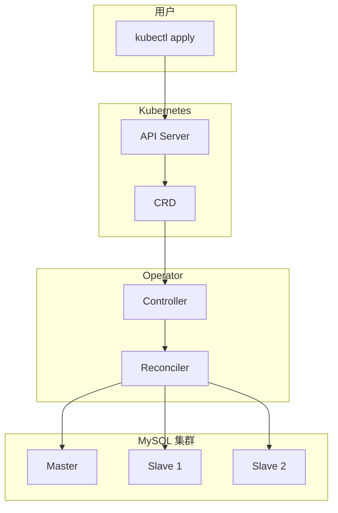

# Operator 模式深度解析

你已经学会了用 Deployment 部署应用，用 StatefulSet 管理有状态服务。但对于复杂的分布式系统呢？

比如一个 MySQL 集群，需要：
- 主从自动切换
- 备份自动化
- 故障自动恢复
- 配置自动更新

**Operator 模式，让 Kubernetes 能够「理解」这些复杂的业务逻辑。**

## 什么是 Operator？

Operator 是一种在 Kubernetes 上**自动化运维复杂应用**的模式。它通过 CRD 扩展 Kubernetes API，并通过控制器（Controller）实现应用的自动化管理。



## Operator vs 普通控制器

| 特性 | 普通控制器 | Operator |
| --- | --- | --- |
| 资源类型 | 原生资源（Deployment等） | CRD 自定义资源 |
| 业务逻辑 | 通用（副本管理、健康检查） | 领域特定（数据库、消息队列等） |
| 配置复杂度 | 简单 | 复杂 |
| 运维能力 | 基础 | 高级（备份、故障恢复等） |

## 核心概念

### 控制循环（Reconciliation Loop）

Operator 的核心是控制循环：

```go title="reconcile.go"
func (r *MySQLReconciler) Reconcile(ctx context.Context, req ctrl.Request) (ctrl.Result, error) {
    // 1. 获取资源
    mysql := &mysqldb.example.com/v1alpha1.MySQL{}
    if err := r.Get(ctx, req.NamespacedName, mysql); err != nil {
        return ctrl.Result{}, client.IgnoreNotFound(err)
    }

    // 2. 观测当前状态
    // - 获取 Master 和 Slave 状态
    // - 检查复制延迟
    // - 检查备份状态

    // 3. 分析期望状态与当前状态的差异
    // - 需要扩容吗？
    // - 需要故障转移吗？
    // - 需要备份吗？

    // 4. 采取行动
    // - 创建/删除 Pod
    // - 更新配置
    // - 执行备份

    // 5. 更新资源状态
    mysql.Status.Phase = "Running"
    mysql.Status.Replicas = mysql.Spec.Replicas
    r.Status().Update(ctx, mysql)

    return ctrl.Result{RequeueAfter: 30 * time.Second}, nil
}
```

### Finalizer

确保资源删除时的清理工作：

```go
if !mysql.DeletionTimestamp.IsZero() {
    // 执行清理
    if err := r.cleanup(mysql); err != nil {
        return ctrl.Result{}, err
    }
    // 移除 finalizer
    mysql.Finalizers = remove(mysql.Finalizers, finalizerName)
    r.Update(ctx, mysql)
}
```

### 状态管理

```yaml title="mysql-status.yaml"
apiVersion: mysqldb.example.com/v1alpha1
kind: MySQL
metadata:
  name: production
spec:
  replicas: 3
  version: "8.0"
status:
  phase: Running
  master: mysql-production-0
  replicas: 3
  conditions:
  - type: Ready
    status: "True"
    message: "All pods are running"
  - type: Healthy
    status: "True"
    message: "Replication is healthy"
  backup:
    lastBackup: "2024-01-15T02:00:00Z"
    status: "Success"
```

## 常用 Operator 框架

### 1. Kubebuilder

CNCF 官方推荐的 Operator 开发框架：

```bash
# 安装 kubebuilder
curl -L -o kubebuilder https://go.kubebuilder.io/dl/latest/linux/amd64
chmod +x kubebuilder && mv kubebuilder /usr/local/bin/

# 创建项目
kubebuilder init --domain example.com --repo github.com/example/mysql-operator

# 创建 API
kubebuilder create api --group mysqldb --version v1alpha1 --kind MySQL
```

### 2. Operator SDK

Red Hat 主导的 Operator 开发框架：

```bash
# 安装 operator-sdk
brew install operator-sdk

# 创建项目
operator-sdk init --domain example.com --repo github.com/example/mysql-operator

# 创建 API
operator-sdk create api --group mysqldb --version v1alpha1 --kind MySQL --resource --controller
```

### 3. Kopf (Python)

Python 开发者可以选择 Kopf：

```python title="mysql_operator.py"
import kopf
import kubernetes.client as k8s

@kopf.on.create('mysql', 'v1alpha1')
def create_mysql(spec, name, namespace, logger, **kwargs):
    logger.info(f"Creating MySQL {name} in {namespace}")

    # 创建 ConfigMap
    configmap = k8s.V1ConfigMap(
        metadata=k8s.V1ObjectMeta(name=f"{name}-config"),
        data={"my.cnf": "..."}
    )
    k8s.CoreV1Api().create_namespaced_config_map(namespace, configmap)

    # 创建 Service
    service = k8s.V1Service(
        metadata=k8s.V1ObjectMeta(name=name),
        spec=k8s.V1ServiceSpec(
            selector={"app": "mysql", "mysql": name},
            ports=[k8s.V1ServicePort(port=3306)]
        )
    )
    k8s.CoreV1Api().create_namespaced_service(namespace, service)

    return {"master": f"{name}-0", "replicas": spec.get("replicas", 1)}

@kopf.on.update('mysql', 'v1alpha1')
def update_mysql(spec, status, old, new, logger, **kwargs):
    logger.info(f"Updating MySQL {name}")

@kopf.on.delete('mysql', 'v1alpha1')
def delete_mysql(name, namespace, logger, **kwargs):
    logger.info(f"Cleaning up MySQL {name}")
```

## 常见 Operator 示例

### 1. Prometheus Operator

```yaml title="prometheus.yaml"
apiVersion: monitoring.coreos.com/v1
kind: Prometheus
metadata:
  name: prometheus
spec:
  replicas: 2
  retention: 30d
  serviceAccountName: prometheus
  serviceMonitorSelector:
    matchLabels:
      team: frontend
```

### 2. cert-manager

```yaml title="certificate.yaml"
apiVersion: cert-manager.io/v1
kind: ClusterIssuer
metadata:
  name: letsencrypt-prod
spec:
  acme:
    server: https://acme-v02.api.letsencrypt.org/directory
    email: admin@example.com
    privateKeySecretRef:
      name: letsencrypt-prod
    solvers:
    - http01:
        ingress:
          class: nginx
---
apiVersion: cert-manager.io/v1
kind: Certificate
metadata:
  name: myapp-tls
spec:
  secretName: myapp-tls
  issuerRef:
    name: letsencrypt-prod
    kind: ClusterIssuer
  dnsNames:
  - myapp.example.com
```

### 3. Rook Ceph

```yaml title="ceph-cluster.yaml"
apiVersion: ceph.rook.io/v1
kind: CephCluster
metadata:
  name: rook-ceph
  namespace: rook-ceph
spec:
  cephVersion:
    image: ceph/ceph:v17.2.6
  dataDirHostPath: /var/lib/ceph
  mon:
    count: 3
  storage:
    useAllNodes: true
    useAllDevices: true
```

## Operator 开发最佳实践

### 1. 错误处理

```go
// 使用聚合错误
var allErrs []error
for _, pod := range pods {
    if err := r.checkPod(pod); err != nil {
        allErrs = append(allErrs, err)
    }
}
if len(allErrs) > 0 {
    return ctrl.Result{}, kerrors.NewAggregate(allErrs)
}
```

### 2. 日志记录

```go
log := r.Log.WithValues("mysql", req.NamespacedName)
log.Info("Reconciling MySQL")
log.V(1).Info("Current replicas", "replicas", mysql.Status.Replicas)
```

### 3. 指标暴露

```go
import (
    "github.com/prometheus/client_golang/prometheus"
    "sigs.k8s.io/controller-runtime/pkg/metrics"
)

var (
    mysqlReplicas = prometheus.NewGaugeVec(
        prometheus.GaugeOpts{
            Name: "mysql_replicas_total",
            Help: "Total number of MySQL replicas",
        },
        []string{"name", "namespace"},
    )
)

func init() {
    metrics.Registry.MustRegister(mysqlReplicas)
}
```

### 4. 健康检查

```go
// Leader 选举，确保只有一个 Operator 处理资源
func (r *MySQLReconciler) SetupWithManager(mgr manager.Manager) error {
    return ctrl.NewControllerManagedBy(mgr).
        For(&mysqldbv1alpha1.MySQL{}).
        WithEventFilter(controllerpredicate.ResourceVersionChangedPredicate{}).
        Complete(r)
}
```

## 何时使用 Operator

### 应该使用 Operator 的场景

1. **复杂的有状态应用**：数据库、消息队列、分布式存储
2. **需要自动化运维**：备份、恢复、故障转移
3. **领域特定知识**：特定配置需要专家经验
4. **长期运行的集群**：需要持续维护和升级

### 不需要 Operator 的场景

1. **简单的无状态应用**：Deployment 已经足够
2. **一次性任务**：Job/CronJob 已经足够
3. **简单的配置管理**：ConfigMap/Secret 已经足够

## 常见 Operator 生态

| 类别 | Operator | 说明 |
| --- | --- | --- |
| **数据库** | TiDB Operator | TiDB 分布式数据库 |
| **数据库** | MySQL Operator | MySQL 高可用集群 |
| **数据库** | PostgreSQL Operator | PostgreSQL 管理 |
| **消息队列** | Strimzi | Apache Kafka on K8s |
| **服务网格** | Istio Operator | Istio 服务网格 |
| **监控** | Prometheus Operator | Prometheus 管理 |
| **存储** | Rook Ceph | Ceph 分布式存储 |
| **证书** | cert-manager | TLS 证书自动化 |

## 延伸思考

Operator 模式将 Kubernetes 的自动化能力提升到了新高度：

1. **领域知识编码**：将专家运维经验编码到软件中
2. **GitOps 友好**：声明式配置 + 自动化执行
3. **云原生优先**：原生地运行在 Kubernetes 上

但 Operator 开发也有挑战：

1. **开发复杂度**：需要理解 Kubernetes 内部机制
2. **测试困难**：需要模拟各种故障场景
3. **运维负担**：Operator 本身也需要维护

对于大多数场景，建议先使用成熟的 Operator（如 Prometheus Operator、Rook 等）。只有当现有 Operator 无法满足需求时，才考虑自己开发。

## 延伸阅读

- [CRD（自定义资源定义）](./crd)：自定义资源类型
- [Operator 开发实战](./operator-development)：使用 Kubebuilder 开发
- [服务网格概述](/cloud-native/service-mesh/overview)：Istio Operator 等
