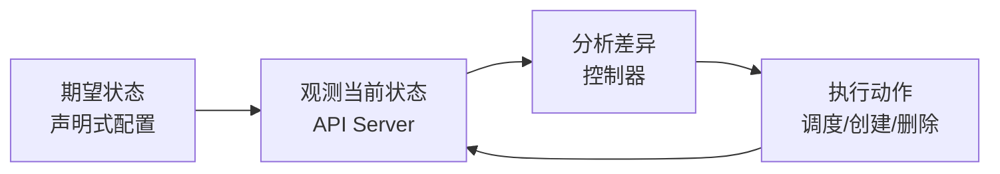
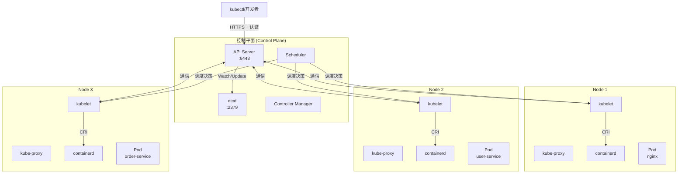

2015 年年初，你所在公司的 DevOps 团队刚刚用 Docker Swarm 搭建好了测试环境。Swarm 确实好用——上手快、概念简单、命令和 Docker CLI 几乎一样。团队庆祝完第一次「一键部署」后，你以为容器化的问题已经解决了。

然而，随着业务快速增长，问题开始暴露：Swarm 无法优雅地处理节点故障，扩缩容需要写脚本串联多个命令，滚动更新时无法控制流量比例，Stateful 应用（比如有状态的中间件）根本没有好的部署方案。

你开始想：**如果有一套系统，能像管理单机进程一样管理整个集群中的应用，同时又具备生产级的高可用和扩展能力，那该多好。**

同年 7 月，Google 将内部运行了十几年的 Borg 系统经验开源，发布了 Kubernetes。这个新工具迅速解决了上述所有问题，并在接下来的几年里成为容器编排领域的事实标准。

## 为什么是 Kubernetes？

在 Kubernetes 出现之前，业界已经有了多种容器编排方案：Docker Swarm、Apache Mesos、HashiCorp Nomad。它们各有特点，但 Kubernetes 最终胜出，靠的不是某一个功能点，而是一套**完整的设计哲学**。

:::tip
**Kubernetes（简称 K8s）** 来自希腊语「舵手」。Google 选择这个名字，是因为项目最初代号是「Project Seven」，加上 Borg 的 Logo 是一个七轴舵轮。
:::

**声明式配置 vs 命令式操作**

传统运维是命令式的：「先执行 A，再执行 B，最后执行 C」。声明式配置则是：「我只关心最终状态，系统自己想办法达到这个状态」。

```yaml title="nginx-deployment.yaml"
apiVersion: apps/v1
kind: Deployment
metadata:
  name: nginx
spec:
  replicas: 3
  selector:
    matchLabels:
      app: nginx
  template:
    metadata:
      labels:
        app: nginx
    spec:
      containers:
      - name: nginx
        image: nginx:1.25
        ports:
        - containerPort: 80
```

上面这段配置声明了「我希望有 3 个 nginx 副本运行」，但没有指定在哪个节点运行、没有指定创建顺序、没有指定如何监控。Kubernetes 会自动处理这些细节，持续确保实际状态与期望状态一致。

**自愈能力**

当 Pod 崩溃时，Kubernetes 会自动创建新的 Pod。当节点不可用时，Kubernetes 会将 Pod 调度到其他节点。这种能力被称为**自愈（Self-Healing）**，是 Kubernetes 区别于传统脚本式部署的核心优势。

**核心设计：控制循环**

Kubernetes 的每一个组件都遵循控制循环的设计模式：



控制循环的核心是**持续调和（Continuous Reconciliation）**：控制器不断比较当前状态与期望状态，发现差异后采取行动，直到两者一致。

## 核心概念

Kubernetes 的核心概念构成了整个系统的基石。理解这些概念，就像理解操作系统中的进程、线程、文件描述符一样重要。

### Master 与 Node

传统架构中，我们需要区分「管理节点」和「工作节点」。Kubernetes 沿用了这个概念，但术语更精确：

**控制平面（Control Plane）** 负责管理整个集群，如同集群的「大脑」。它不运行用户应用，只负责决策：哪个 Pod 应该调度到哪个节点、什么时候需要扩缩容、节点故障时如何处理。

**工作节点（Worker Node）** 是实际运行 Pod 的机器，可以是物理服务器、虚拟机或云上的实例。节点的数量决定了集群的计算能力上限。

:::info
一个常见的误解是「Master 节点不能运行用户 Pod」。技术上完全可以，但生产环境中通常不建议这样做。Master 节点需要处理大量控制平面任务，如果再承担用户负载，可能会影响集群稳定性。
:::

### Pod：最小的调度单元

Pod 是 Kubernetes 中**最小的可部署单元**。但这个定义容易让人误解——Pod 不是容器，而是**一组共享网络和存储的容器**。

```yaml title="pod.yaml"
apiVersion: v1
kind: Pod
metadata:
  name: my-app
  labels:
    app: my-app
spec:
  containers:
  - name: app
    image: my-app:v1
    ports:
    - containerPort: 8080
  - name: log-agent
    image: fluentd:v1
```

这个 Pod 包含两个容器：主应用容器和日志收集容器。它们共享同一个网络命名空间（可以通过 localhost 互相访问）和进程命名空间（可以看到对方的进程）。

**Pod 的本质是协作**：Kubernetes 调度的最小单位是 Pod，而不是容器。同一个 Pod 中的容器始终调度到同一个节点，共享相同的生命周期。

### Service：稳定的访问入口

Pod 的 IP 地址是动态的——Pod 重建后 IP 会变化。这带来了一个问题：如果订单服务依赖用户服务，订单服务如何找到用户服务的最新地址？

答案是 Service。Service 为一组 Pod 提供稳定的虚拟 IP 和 DNS 名称，屏蔽了底层 Pod 的动态性：

```yaml title="service.yaml"
apiVersion: v1
kind: Service
metadata:
  name: user-service
spec:
  selector:
    app: user  # 标签选择器
  ports:
  - port: 80        # Service 端口
    targetPort: 8080  # 转发到 Pod 的端口
  type: ClusterIP
```

无论后端有多少个 Pod 副本、无论它们如何调度，订单服务只需要访问 `user-service`，Kubernetes 会自动将请求负载均衡到健康的 Pod。

## 整体架构



### 控制平面组件

**API Server** 是整个集群的 HTTP API 入口。所有组件之间的通信、用户通过 kubectl 发起的操作，都经过 API Server。它是唯一一个与 etcd 直接交互的组件，其他组件都通过 API Server 间接操作集群状态。

**etcd** 是高可用的键值存储，保存集群所有数据：Pod 定义、Service 配置、节点信息、认证信息等。etcd 采用 Raft 共识算法保证数据一致性，是 Kubernetes 最核心的存储后端。

**Scheduler** 负责监听新创建的 Pod，为它们选择合适的节点。调度决策考虑的因素包括：资源请求量、节点亲和性、污点容忍、taint 标签等。

**Controller Manager** 运行多个控制器进程，每个控制器负责维护某种资源的期望状态。例如，Deployment Controller 维护 Deployment 的副本数，ReplicaSet Controller 维护 Pod 的数量。

### 工作节点组件

**kubelet** 是运行在每个节点上的 Agent，负责向 API Server 注册节点、监听分配到本节点的 Pod、维护容器生命周期、与容器运行时通信。

**kube-proxy** 维护节点上的网络规则，实现 Service 的负载均衡和 Service 到 Pod 的流量转发。在 iptables 模式下，它根据 Service 创建相应的 iptables 规则；在 IPVS 模式下，使用内核 IPVS 模块实现更高效的负载均衡。

**Container Runtime** 是实际运行容器的软件。Kubernetes 通过 CRI（Container Runtime Interface）与容器运行时解耦，支持 containerd、CRI-O 等多种实现。

## 权衡矩阵

| 维度 | Kubernetes | Docker Swarm | 物理机/VM 直接部署 |
| --- | --- | --- | --- |
| **学习曲线** | 陡峭 | 平缓 | 平缓 |
| **功能完整性** | 丰富 | 基础 | 无 |
| **弹性伸缩** | 原生支持 | 需脚本 | 手动 |
| **自愈能力** | 强 | 弱 | 无 |
| **生态系统** | 庞大 | 一般 | 依赖自建 |
| **资源开销** | 中等（Master 占用） | 低 | 无 |
| **适用规模** | 中大型 | 小型 | 小型 |
| **运维复杂度** | 高 | 低 | 高 |

## 常见误区

### 把 Pod 当作容器

Pod 不是容器，而是一组共享资源的容器。很多人写 YAML 时把 `containers` 写错当成 `container`（单数），说明没有理解这个区别。

**正确理解**：Pod 是「胖容器」模型，同一 Pod 内的容器共享网络命名空间（可以用 localhost 互相通信）、UTS 命名空间（共享主机名）、IPC 命名空间。它们像在一台机器上的不同进程，但又是独立打包和部署的。

### 忽视资源限制

初学者经常忘记为 Pod 设置资源请求和限制：

```yaml title="pod-with-resources.yaml"
spec:
  containers:
  - name: app
    image: my-app:v1
    resources:
      requests:
        memory: "128Mi"
        cpu: "250m"
      limits:
        memory: "256Mi"
        cpu: "500m"
```

如果不设置资源限制，Kubernetes 调度器无法准确评估节点容量，可能导致节点资源耗尽或调度失衡。

### 过度使用 default命名空间

命名空间不仅是逻辑隔离，更是资源配额和权限控制的基础。生产环境应该根据环境（dev/staging/prod）或团队划分命名空间，避免「一锅粥」式管理。

## 延伸思考

Kubernetes 的设计哲学是「让机器管理机器」。但这并不意味着运维工作消失了，而是运维工作的重心从「管理具体操作」转移到「管理配置和策略」。

当你写出 `replicas: 3` 时，你不需要关心这 3 个副本具体调度到哪些节点、不需要关心它们如何健康检查、不需要关心节点故障时的迁移。这些都是 Kubernetes 自动处理的。

但这种自动化是有代价的：系统的复杂度提升了，理解 Kubernetes 的成本提高了。在决定是否使用 Kubernetes 之前，需要评估团队是否具备维护 Kubernetes 集群的能力。

**下一个问题**：如果 Kubernetes 负责调度和自愈，那这些决策是怎么做出的？控制平面的各个组件是如何协作的？

请继续阅读 [控制平面组件详解](./control-plane)，深入理解 API Server、etcd、Scheduler、Controller Manager 的工作原理。
