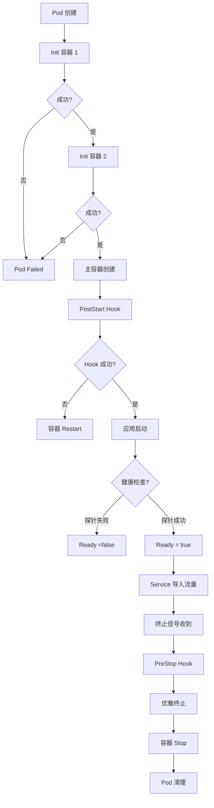
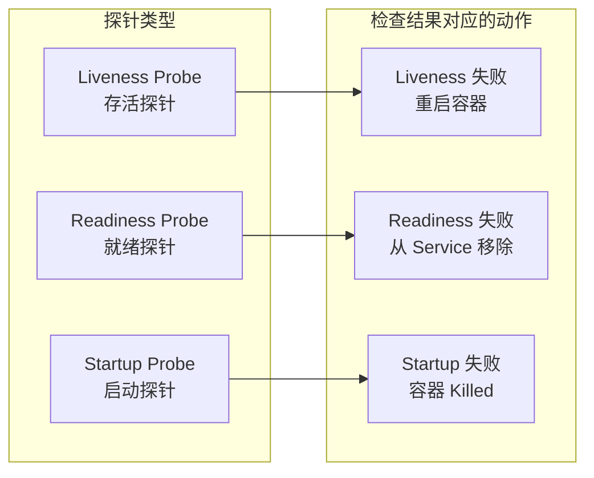
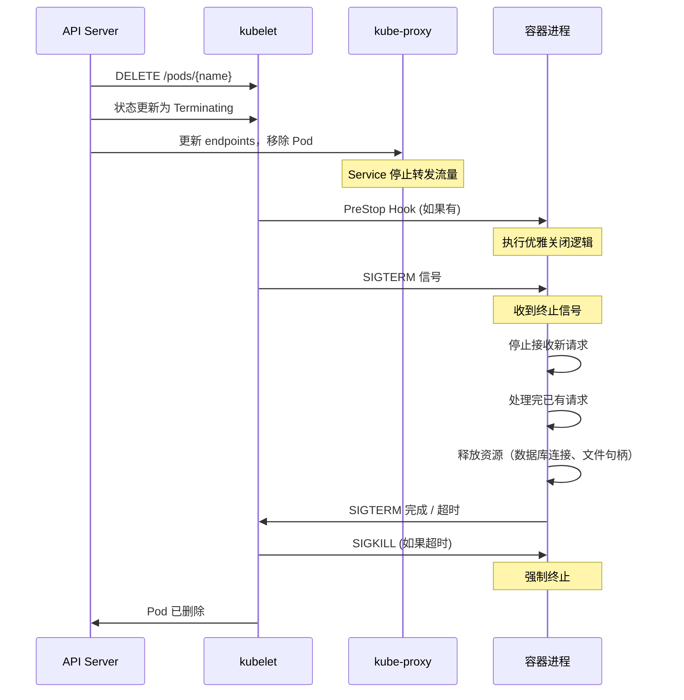

你的微服务 Pod 终于成功启动了。部署流水线显示「Deploy Successful」，监控系统显示「Pod Running」，一切看起来都很美好。

但就在这时，用户开始抱怨：部署期间有部分请求返回 502 错误。你查看日志，发现是负载均衡器在新 Pod 还未就绪时就导入了流量，导致请求失败。

这个场景揭示了一个关键问题：**Pod 的「启动」不是一个瞬间状态，而是一个包含多个阶段的过程。Init Container、容器钩子、探针、优雅终止——这些机制共同构成了 Pod 的完整生命周期。理解它们，是构建高可用服务的基础。

## Pod 生命周期完整流程



## Init Container

Init 容器在 Pod 主容器启动之前运行，用于完成初始化任务。它们具有以下特点：

- **串行执行**：Init 容器必须按顺序一个接一个运行
- **必须成功**：如果任何 Init 容器失败，Pod 不会启动主容器
- **独立镜像**：每个 Init 容器可以使用不同的基础镜像

### 典型使用场景

**等待依赖服务就绪**：

```yaml title="pod-with-init.yaml"
apiVersion: v1
kind: Pod
metadata:
  name: my-app
spec:
  initContainers:
  - name: wait-for-db
    image: busybox:1.36
    command:
    - sh
    - -c
    - |
      echo "等待数据库就绪..."
      until nc -z db-service 5432; do
        echo "数据库未就绪，继续等待..."
        sleep 2
      done
      echo "数据库已就绪"

  - name: migrate-db
    image: my-app-migrate:1.0
    env:
    - name: DB_HOST
      value: "db-service"
    command:
    - /migrate.sh

  containers:
  - name: my-app
    image: my-app:1.0
    ports:
    - containerPort: 8080
```

**准备配置文件或密钥**：

```yaml title="pod-with-config-init.yaml"
spec:
  initContainers:
  - name: prepare-config
    image: busybox:1.36
    command:
    - sh
    - -c
    - |
      # 从远程配置中心拉取配置
      curl -s http://config-center/api/config > /config/app.conf

      # 如果有加密密钥，先解密
      if [ -f /secrets/encrypted.key ]; then
        openssl aes-256-cbc -d -in /secrets/encrypted.key -out /config/secret.key
      fi

      # 修改配置文件权限
      chmod 600 /config/app.conf
    volumeMounts:
    - name: config
      mountPath: /config
    - name: secrets
      mountPath: /secrets

  containers:
  - name: app
    image: my-app:1.0
    volumeMounts:
    - name: config
      mountPath: /app/config
```

### Init Container 与 sidecar 的对比

| 特性 | Init Container | Sidecar 容器 |
| --- | --- | --- |
| 执行时机 | 主容器之前 | 与主容器同时运行 |
| 数量 | 多个（串行） | 多个（并行） |
| 失败处理 | Pod 不启动主容器 | 主容器继续运行 |
| 生命周期 | 短暂 | 与主容器相同 |
| 适用场景 | 初始化、等待依赖 | 日志收集、监控 |

## 容器钩子

容器钩子允许在容器生命周期事件发生时执行自定义逻辑。

### PostStart Hook

PostStart 钩子在容器创建后立即执行。但**不保证在容器主进程启动之前执行**。

```yaml title="poststart-hook.yaml"
spec:
  containers:
  - name: nginx
    image: nginx:1.25
    lifecycle:
      postStart:
        exec:
          command:
          - /bin/sh
          - -c
          - |
            # 注册到服务发现
            curl -X POST http://consul-agent:8500/v1/agent/service/register \
              -d '{"name":"nginx","address":"'$(hostname -I)'","port":80}'

            # 设置健康检查回调
            echo "容器已启动，PostStart 钩子执行完成"
```

### PreStop Hook

PreStop 钩子在容器终止之前执行，常用于优雅关闭。

```yaml title="prestop-hook.yaml"
spec:
  containers:
  - name: nginx
    image: nginx:1.25
    lifecycle:
      preStop:
        exec:
          command:
          - /bin/sh
          - -c
          - |
            # 通知负载均衡器移除本节点
            nginx -s QUIT
            sleep 5
```

:::warning
**PreStop 与优雅终止的关系**：PreStop 钩子执行完成后，kubelet 才会发送 SIGTERM 信号给容器。因此，PreStop 的执行时间是计入优雅终止超时时间的。
:::

### HTTP GET 钩子

除了 exec，HTTP GET 钩子可以直接调用容器的 HTTP 端点：

```yaml title="http-hook.yaml"
spec:
  containers:
  - name: app
    image: my-app:1.0
    ports:
    - containerPort: 8080
    lifecycle:
      postStart:
        httpGet:
          path: /ready
          port: 8080
          scheme: HTTP
      preStop:
        httpGet:
          path: /shutdown
          port: 8080
          scheme: HTTP
```

## 探针类型

探针（Probe）是 kubelet 对容器健康状态的主动检查机制。Kubernetes 有三种探针：



### Liveness Probe（存活探针）

存活探针检测容器是否存活。如果失败，kubelet 会**重启容器**。

适用场景：检测应用程序是否卡死或进入不可恢复的错误状态。

```yaml title="liveness-probe.yaml"
spec:
  containers:
  - name: nginx
    image: nginx:1.25
    livenessProbe:
      httpGet:
        path: /healthz
        port: 80
      initialDelaySeconds: 15    # 启动后 15 秒开始检测
      periodSeconds: 10         # 每 10 秒检测一次
      timeoutSeconds: 3         # 超时 3 秒视为失败
      failureThreshold: 3       # 连续 3 次失败触发重启
      successThreshold: 1       # 成功 1 次即恢复
```

### Readiness Probe（就绪探针）

就绪探针检测容器是否准备好接收流量。如果失败，kubelet 会将 Pod 从 Service 的**端点列表中移除**。

适用场景：检测应用程序是否已完成启动、依赖是否就绪、配置是否加载完成。

```yaml title="readiness-probe.yaml"
spec:
  containers:
  - name: app
    image: my-app:1.0
    readinessProbe:
      httpGet:
        path: /ready
        port: 8080
      initialDelaySeconds: 5
      periodSeconds: 5
      timeoutSeconds: 2
      failureThreshold: 3
      successThreshold: 1
```

### Startup Probe（启动探针）

启动探针用于**慢启动容器**。在启动探针成功之前，其他探针（liveness、readiness）不会执行。

适用场景：应用程序启动时间较长（如 JVM 热身、依赖加载）。

```yaml title="startup-probe.yaml"
spec:
  containers:
  - name: spring-boot-app
    image: my-spring-boot-app:1.0
    startupProbe:
      httpGet:
        path: /actuator/health/liveness
        port: 8080
      failureThreshold: 30      # 30 * 10s = 5 分钟超时
      periodSeconds: 10
    livenessProbe:
      httpGet:
        path: /actuator/health/liveness
        port: 8080
      initialDelaySeconds: 30   # 等待 startupProbe 完成
      periodSeconds: 10
    readinessProbe:
      httpGet:
        path: /actuator/health/readiness
        port: 8080
      initialDelaySeconds: 5
      periodSeconds: 5
```

### 探针对比

| 探针 | 检测目的 | 失败后果 | 使用场景 |
| --- | --- | --- | --- |
| **Liveness** | 容器是否存活 | 重启容器 | 检测死锁、无响应 |
| **Readiness** | 是否接收流量 | 从 Service 移除 | 检测启动、依赖缺失 |
| **Startup** | 是否完成启动 | 杀死容器 | 慢启动应用 |

### 探针实现方式

```yaml title="probe-types.yaml"
spec:
  containers:
  - name: app
    image: my-app:1.0

    # HTTP GET 探针
    livenessProbe:
      httpGet:
        path: /healthz
        port: 8080
        httpHeaders:
        - name: X-Custom-Header
          value: "Probe"

    # TCP Socket 探针
    readinessProbe:
      tcpSocket:
        port: 5432
      initialDelaySeconds: 5

    # Exec 探针
    startupProbe:
      exec:
        command:
        - cat
        - /tmp/healthy
      failureThreshold: 30
```

## 优雅终止

Pod 终止是一个涉及多个步骤的协作过程：



### 终止宽限期

```yaml title="termination-grace.yaml"
spec:
  terminationGracePeriodSeconds: 60  # 默认 30 秒
  containers:
  - name: app
    image: my-app:1.0
```

**终止流程时间线**：

1. `t=0s`：API Server 收到删除请求，Pod 标记为 `Terminating`
2. `t=0s`：Endpoints 更新，kube-proxy 从 iptables 移除 Pod
3. `t=0s~`：`preStop` 钩子执行（计入 terminationGracePeriodSeconds）
4. `t=0s`：发送 SIGTERM 信号给容器
5. `t=0s~60s`：容器处理终止逻辑
6. `t=60s`：如果容器未退出，发送 SIGKILL 强制终止

### 应用优雅关闭

应用需要正确处理 SIGTERM 信号才能实现真正的优雅关闭：

```java title="SpringBootGracefulShutdown.java"
@RestController
public class ShutdownController {

    private final AtomicBoolean shuttingDown = new AtomicBoolean(false);

    @PostConstruct
    public void init() {
        // 注册关闭钩子
        Runtime.getRuntime().addShutdownHook(new Thread(() -> {
            shuttingDown.set(true);
            // 可以在这里做清理工作
            cleanupResources();
        }));
    }

    @GetMapping("/healthz")
    public ResponseEntity<String> health() {
        if (shuttingDown.get()) {
            return ResponseEntity.status(503).body("Shutting down");
        }
        return ResponseEntity.ok("OK");
    }

    @GetMapping("/ready")
    public ResponseEntity<String> ready() {
        if (shuttingDown.get()) {
            return ResponseEntity.status(503).body("Not ready");
        }
        return ResponseEntity.ok("Ready");
    }
}
```

```go title="GoGracefulShutdown.go"
package main

import (
    "context"
    "net/http"
    "os"
    "os/signal"
    "syscall"
    "time"
)

func main() {
    server := &http.Server{
        Addr: ":8080",
    }

    // 启动服务器
    go server.ListenAndServe()

    // 等待信号
    sigChan := make(chan os.Signal, 1)
    signal.Notify(sigChan, syscall.SIGTERM, syscall.SIGINT)

    <-sigChan

    // 收到 SIGTERM，开始优雅关闭
    ctx, cancel := context.WithTimeout(context.Background(), 30*time.Second)
    defer cancel()

    // 停止接收新请求
    if err := server.Shutdown(ctx); err != nil {
        // 处理超时
    }
}
```

## 常见问题与反模式

### 探针配置不当

**错误 1**：initialDelaySeconds 设置过短

```yaml title="probe-error-1.yaml"
# 错误配置
livenessProbe:
  httpGet:
    path: /health
    port: 8080
  initialDelaySeconds: 0  # 容器还没启动就开始检测
  periodSeconds: 1
```

如果应用启动需要 10 秒，而 initialDelaySeconds 是 0，会导致容器在启动期间被误判为不健康并重启。

**正确做法**：根据应用的平均启动时间设置 initialDelaySeconds，通常设置为启动时间 + 安全缓冲。

**错误 2**：探针与应用的健康检查混淆

```yaml title="probe-error-2.yaml"
# 错误：liveness 探针检查了太多依赖
livenessProbe:
  exec:
    command:
    - sh
    - -c
    - |
      # 检查数据库连接
      mysql -h db -e "SELECT 1"
      # 检查 Redis 连接
      redis-cli -h redis ping
      # 检查外部 API
      curl -f http://external-api/health
```

Liveness 探针应该只检查「进程是否存活」，而不应该检查外部依赖。如果数据库挂了，容器应该继续运行（等待数据库恢复），而不是重启。

**正确做法**：
- Liveness：只检查进程状态（如 `/healthz/live`）
- Readiness：检查依赖和配置（如 `/ready` 检查数据库、Redis、配置加载）

### 优雅终止时间不足

```yaml title="termination-error.yaml"
# 错误配置
spec:
  terminationGracePeriodSeconds: 5  # 太短
  containers:
  - name: app
    image: my-app:1.0
    # 容器内部关闭逻辑需要 10 秒
```

如果应用关闭逻辑需要 10 秒，但 terminationGracePeriodSeconds 只有 5 秒，会导致容器被 SIGKILL 强制终止，可能丢失正在处理的请求。

**正确做法**：terminationGracePeriodSeconds 应该大于应用关闭逻辑所需时间。最好预留 10-15 秒的缓冲。

### PreStop 钩子阻塞终止

```yaml title="prestop-error.yaml"
# 错误：PreStop 钩子执行时间过长
lifecycle:
  preStop:
    exec:
      command:
      - sh
      - -c
      - |
        # 这个操作可能需要 60 秒
        kubectl drain node --ignore-daemonsets
```

PreStop 钩子会阻塞容器终止。如果 PreStop 钩子执行时间过长，会导致容器无法及时关闭。

**正确做法**：PreStop 钩子应该只执行快速的操作，如发送信号、调用 API。耗时操作应该放在应用内部处理。

## 权衡矩阵

| 机制 | 用途 | 失败处理 | 性能开销 |
| --- | --- | --- | --- |
| **Init Container** | 初始化 | Pod 不启动 | 低 |
| **PostStart Hook** | 容器启动后处理 | 容器可能重启 | 中 |
| **PreStop Hook** | 容器终止前处理 | 终止延迟 | 低 |
| **Liveness Probe** | 存活检测 | 重启容器 | 高（频繁检查） |
| **Readiness Probe** | 就绪检测 | 移除流量 | 高（频繁检查） |
| **Startup Probe** | 启动检测 | 杀死容器 | 可配置 |

## 延伸思考

Pod 生命周期的设计体现了 Kubernetes 的一个核心原则：**分离关注点**。

- Init Container 处理「应用启动前的准备工作」
- 探针处理「应用健康状态的持续监控」
- 钩子处理「生命周期事件的回调处理」
- 优雅终止处理「有序的资源释放」

每个机制各司其职，通过标准接口连接。这使得 Kubernetes 可以支持各种不同类型的应用（Java、Go、Python、Node.js），而无需修改 Kubernetes 本身。

但这也带来了复杂性：**正确配置探针和终止逻辑需要深入了解应用的特性**。一个配置不当的 livenessProbe 可能导致应用在启动阶段就被反复重启；一个太短的 terminationGracePeriodSeconds 可能导致请求被强制中断。

在实际项目中，建议：
1. 为每个应用编写「健康检查 API」
2. 测量应用的启动时间、关闭时间
3. 根据实测数据配置探针参数
4. 在非生产环境验证终止行为

**下一个问题**：Pod 提供了运行容器的能力，但如何让 Pod 被集群内部或外部访问？Service 是如何实现的？

请继续阅读 [Service 详解](./service)，深入理解 Kubernetes 的服务发现与负载均衡机制。
