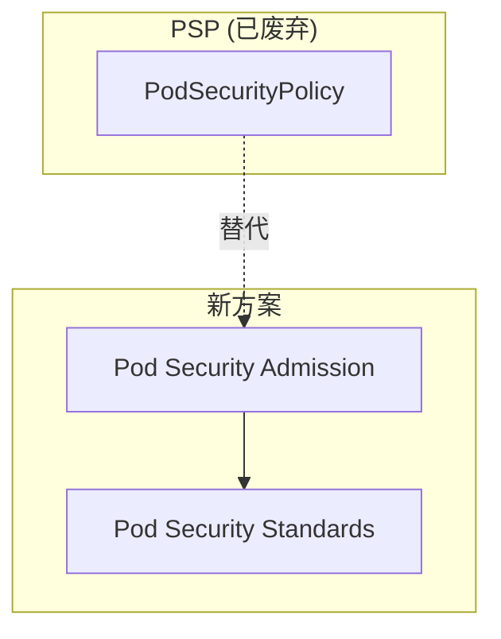

# Pod 安全策略

Pod 是 Kubernetes 的基本调度单元，Pod 的安全直接关系到整个集群的安全。

**Pod 安全策略让你能够定义 Pod 运行时的安全标准。**

## Pod 安全背景

从 Kubernetes 1.21 开始，PodSecurityPolicy（PSP）被废弃，取而代之的是 **Pod Security Admission（PSA）** 和 **Pod Security Standards（PSS）**。



## Pod Security Standards (PSS)

PSS 定义了三种安全级别：

| 级别 | 说明 |
| --- | --- |
| **Privileged** | 不受限，完全权限 |
| **Baseline** | 最小限制，防止已知风险 |
| **Restricted** | 严格限制，遵循最佳实践 |

### Baseline（基线级别）

允许基本的 Pod 配置，但阻止已知的安全风险：

```yaml
# 允许的配置
spec:
  securityContext:
    runAsNonRoot: false  # 或不设置
  containers:
  - name: app
    securityContext:
      allowPrivilegeEscalation: false
```

### Restricted（限制级别）

遵循 Kubernetes 安全最佳实践：

```yaml
# 要求
spec:
  securityContext:
    runAsNonRoot: true
    runAsUser: MustRunAsNonRoot
  containers:
  - name: app
    securityContext:
      allowPrivilegeEscalation: false
      capabilities:
        drop:
        - ALL
      readOnlyRootFilesystem: true
```

## Pod Security Admission (PSA)

### 启用 PSA

```yaml title="namespace-label.yaml"
apiVersion: v1
kind: Namespace
metadata:
  name: production
  labels:
    pod-security.kubernetes.io/enforce: baseline
    pod-security.kubernetes.io/enforce-version: latest
    pod-security.kubernetes.io/warn: restricted
    pod-security.kubernetes.io/warn-version: latest
```

### 命名空间标签

| 标签 | 说明 |
| --- | --- |
| `pod-security.kubernetes.io/enforce` | 强制执行的级别 |
| `pod-security.kubernetes.io/enforce-version` | 强制执行的版本 |
| `pod-security.kubernetes.io/warn` | 警告的级别 |
| `pod-security.kubernetes.io/audit` | 审计的级别 |

### 三个级别

```yaml
# 强制（Enforce）：拒绝不符合的 Pod
pod-security.kubernetes.io/enforce: restricted

# 警告（Warn）：显示警告但不拒绝
pod-security.kubernetes.io/warn: restricted

# 审计（Audit）：记录到审计日志
pod-security.kubernetes.io/audit: restricted
```

## 安全上下文详解

### Pod 级别

```yaml
spec:
  securityContext:
    # 运行用户
    runAsUser: 1000
    # 运行组
    runAsGroup: 1000
    # 辅助组
    supplementalGroups: [2000]
    # 文件系统组
    fsGroup: 2000
    # 必须以非 root 用户运行
    runAsNonRoot: true
    # SELinux 选项
    seLinuxOptions:
      level: "s0:c123,c456"
    # Seccomp 配置
    seccompProfile:
      type: RuntimeDefault
```

### 容器级别

```yaml
spec:
  containers:
  - name: app
    securityContext:
      # 允许权限提升
      allowPrivilegeEscalation: false
      # Capabilities
      capabilities:
        drop:
        - ALL
        add:
        - NET_BIND_SERVICE
      # 只读文件系统
      readOnlyRootFilesystem: true
      # 特权模式
      privileged: false
      # 运行用户（覆盖 Pod 级别）
      runAsUser: 1000
```

## 常见配置场景

### 场景一：非 root 用户运行

```yaml
spec:
  securityContext:
    runAsNonRoot: true
    runAsUser: 1000
  containers:
  - name: app
    securityContext:
      allowPrivilegeEscalation: false
```

### 场景二：只读文件系统

```yaml
spec:
  containers:
  - name: app
    securityContext:
      readOnlyRootFilesystem: true
    volumeMounts:
    - name: tmp
      mountPath: /tmp
  volumes:
  - name: tmp
    emptyDir: {}
```

### 场景三：丢弃所有 Capabilities

```yaml
spec:
  containers:
  - name: app
    securityContext:
      capabilities:
        drop:
        - ALL
```

### 场景四：使用 Seccomp

```yaml
spec:
  securityContext:
    seccompProfile:
      type: RuntimeDefault  # 使用容器运行时的默认配置
```

## OPA Gatekeeper

对于更复杂的策略，可以使用 OPA Gatekeeper：

```yaml title="constraint-template.yaml"
apiVersion: templates.gatekeeper.sh/v1
kind: ConstraintTemplate
metadata:
  name: k8srequirenamespace
spec:
  crd:
    spec:
      names:
        kind: K8sRequireNamespace
      validation:
        openAPIV3Schema:
          properties:
            namespace:
              type: string
```

```yaml title="constraint.yaml"
apiVersion: constraints.gatekeeper.sh/v1beta1
kind: K8sRequireNamespace
metadata:
  name: must-have-namespace
spec:
  match:
    kinds:
    - apiGroups: [""]
      kinds: ["Pod"]
  parameters:
    namespace: production
```

## Kyverno

Kyverno 是另一个流行的策略引擎：

```yaml title="require-non-root.yaml"
apiVersion: kyverno.io/v1
kind: ClusterPolicy
metadata:
  name: require-non-root
spec:
  validationFailureAction: enforce
  rules:
  - name: check-runasnonroot
    match:
      resources:
        kinds:
        - Pod
    validate:
      pattern:
        spec:
          securityContext:
            runAsNonRoot: true
```

```yaml title="deny-privileged.yaml"
apiVersion: kyverno.io/v1
kind: ClusterPolicy
metadata:
  name: deny-privileged-pods
spec:
  validationFailureAction: enforce
  rules:
  - name: check-privileged
    match:
      resources:
        kinds:
        - Pod
    validate:
      message: "Privileged pods are not allowed."
      pattern:
        spec:
          containers:
          - name: "*"
            securityContext:
              privileged: "false"
```

## PSP vs PSA

| 特性 | PSP（已废弃） | PSA |
| --- | --- | --- |
| **启用方式** | API Server 参数 | 命名空间标签 |
| **强制执行** | Admission Controller | Built-in Admission |
| **策略数量** | 多个 PSP | 3 个级别 |
| **灵活性** | 高 | 中 |
| **维护状态** | 废弃 | 活跃 |

## 常见问题

### Pod 创建被拒绝

```bash
# 查看拒绝原因
kubectl describe pod <name>

# 常见原因
# - runAsNonRoot: true 但镜像以 root 运行
# - privileged: true 被拒绝
# - capabilities 未丢弃 ALL
```

### 镜像以 root 运行

```dockerfile
# 创建非 root 用户
FROM alpine
RUN addgroup -g 1000 appgroup && \
    adduser -u 1000 -G appgroup -s /bin/sh -D appuser
USER appuser
```

### Seccomp 配置错误

```yaml
# 错误：未知配置
securityContext:
  seccompProfile:
    type: Unconfined

# 正确：使用 RuntimeDefault
securityContext:
  seccompProfile:
    type: RuntimeDefault
```

## 最佳实践

### 1. 使用限制级别

```yaml
# 在命名空间上强制执行限制级别
apiVersion: v1
kind: Namespace
metadata:
  name: production
  labels:
    pod-security.kubernetes.io/enforce: restricted
```

### 2. 显式声明安全上下文

```yaml
spec:
  securityContext:
    runAsNonRoot: true
    runAsUser: 1000
  containers:
  - name: app
    securityContext:
      allowPrivilegeEscalation: false
      readOnlyRootFilesystem: true
      capabilities:
        drop:
        - ALL
```

### 3. 使用最小权限镜像

```dockerfile
# 使用 distroless 或 alpine
FROM gcr.io/distroless/static:nonroot
COPY --from=build /app /app
USER nonroot:nonroot
```

### 4. 定期审计

```bash
# 检查命名空间安全级别
kubectl get ns -A -l 'pod-security.kubernetes.io/enforce'

# 检查 Pod 配置
kubectl get pods -o jsonpath='{range .items[*]}{.metadata.name}{"\t"}{.spec.securityContext.runAsNonRoot}{"\n"}{end}'
```

## 延伸思考

Pod 安全是 Kubernetes 安全的第一道防线：

1. **从源头做起**：在构建镜像时就不使用 root
2. **最小权限**：只授予必要的权限
3. **持续监控**：审计和监控异常行为
4. **自动执行**：使用策略引擎强制执行

但安全不是一次性的工作：

1. **定期更新策略**：适应新的威胁
2. **测试验证**：确保策略不会阻止正常功能
3. **多层防御**：不要依赖单一安全机制

## 延伸阅读

- [Kubernetes 安全](./security)：RBAC 和认证授权
- [NetworkPolicy 网络策略](./network-policy)：网络隔离
