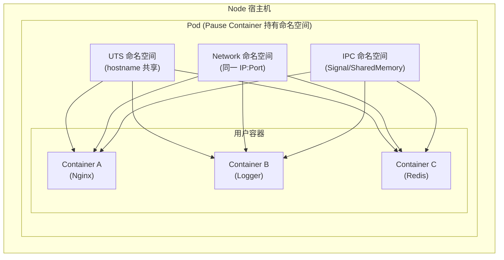
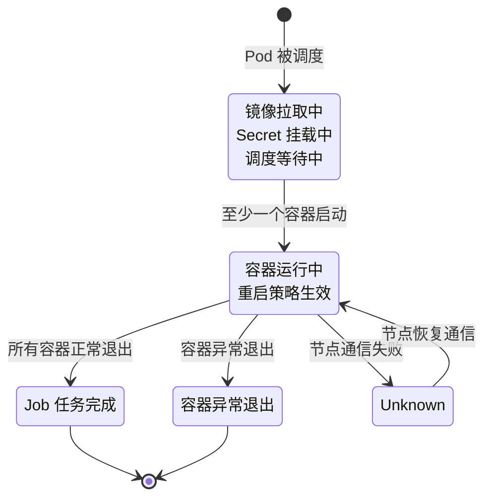
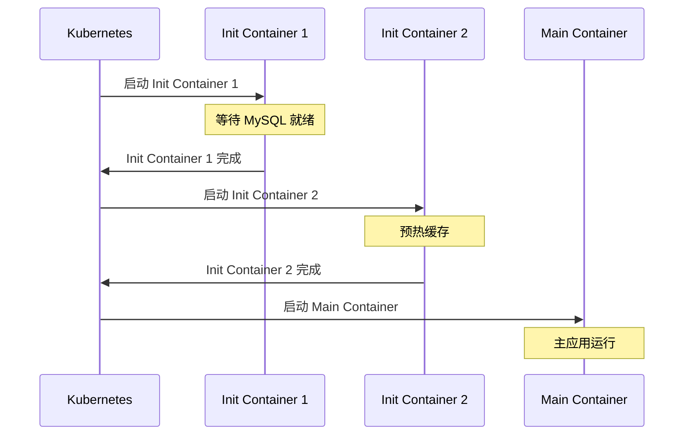
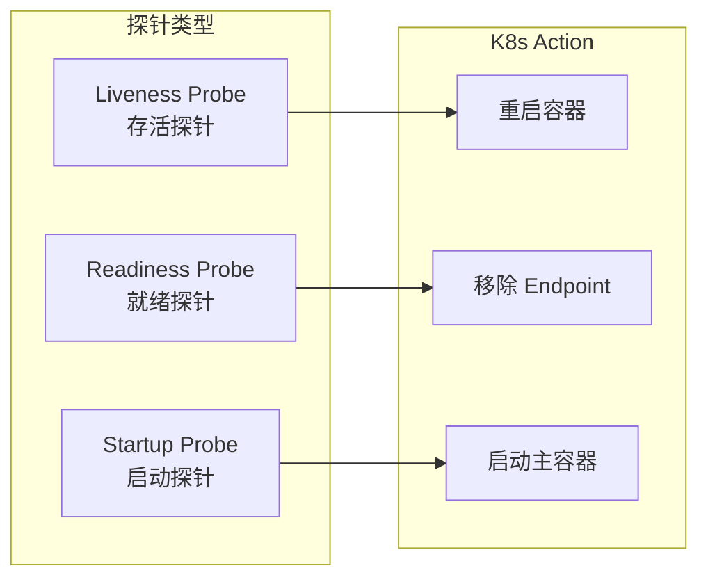
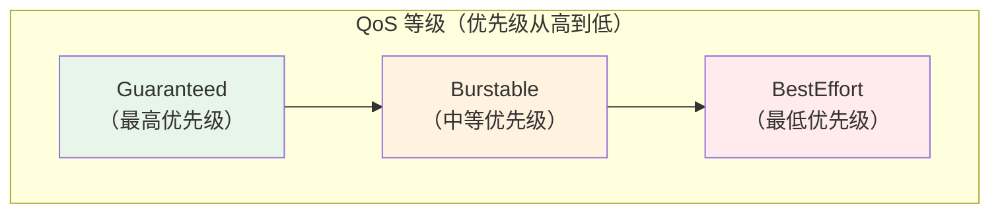
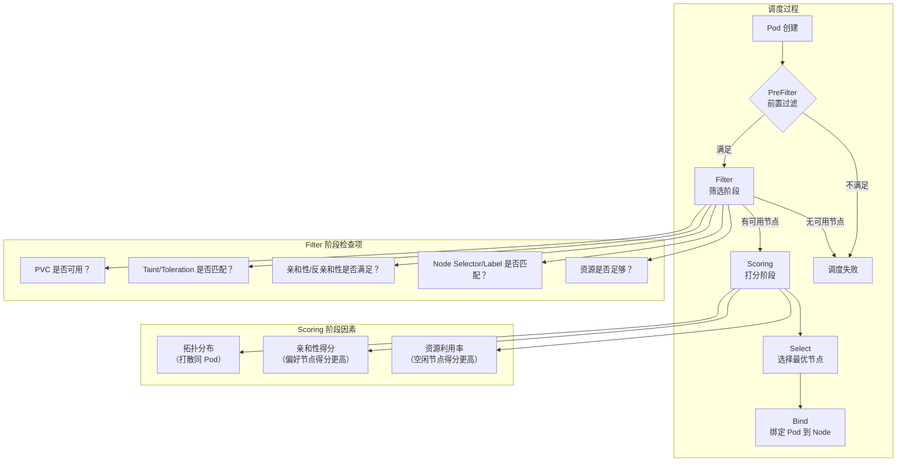

凌晨 2 点，你正在发布一个新版本的应用。Deployment 已经更新，RollingUpdate 正在进行，一切都看起来很顺利。直到监控面板上出现了一连串红色告警：新启动的 Pod 反复重启，CrashLoopBackOff。日志里显示的是 OOMKilled，但奇怪的是，同一个镜像在本地测试时明明只需要 512MB 内存。

你开始调高内存限制——Pod 确实不 OOM 了，但新的问题出现了：其他 Pod 开始出现内存压力。一台 8 核 16GB 的 Node 上，原本运行得好好的几个 Pod，突然开始出现卡顿。

这不是简单的资源问题。这是**你对 Pod 的理解还不够深入**。

Pod 是 Kubernetes 中最核心的概念。它不仅是「容器」的包装器，更是一种**设计哲学**的体现：为什么 Pod 要这样设计？Init Container 和 Sidecar 有什么区别？探针到底该怎么配？资源限额和 QoS 是什么关系？这些问题，贯穿了每一个 Kubernetes 使用者的日常工作。

## Pod 的本质：命名空间共享

Pod 不是一个容器，而是一个**共享命名空间的容器组**。

在 Linux 中，每个容器都有自己独立的：
- **PID 命名空间**：容器内的进程有独立的 PID 1 和进程树
- **Network 命名空间**：容器有独立的 IP 地址和网络栈
- **UTS 命名空间**：容器有独立的主机名和域名
- **Mount 命名空间**：容器有独立的文件系统视图
- **IPC 命名空间**：容器有独立的进程间通信资源

**Pod 的核心设计是：让同一个 Pod 内的所有容器共享 UTS、Network、IPC 命名空间，但保留 PID 和 Mount 的隔离**。



### Pause 容器：无名英雄

每个 Pod 启动时，第一个创建的容器叫 **Pause 容器**（也叫 Infra 容器，镜像名通常是 `k8s.gcr.io/pause`）。

Pause 容器的唯一职责是**持有命名空间**。它是 Pod 内所有其他容器的「根容器」：

```yaml title="pause-container-lifecycle"
# Pod 创建时，Pause 容器首先启动
# Pause 容器的 PID 1 进程持续运行，保持命名空间活跃

apiVersion: v1
kind: Pod
metadata:
  name: my-app-pod
spec:
  containers:
  # 用户容器依赖于 Pause 容器持有的命名空间
  - name: nginx
    image: nginx:1.25
    ports:
    - containerPort: 80
```

如果 Pause 容器退出，Kubernetes 会认为整个 Pod 终止。这就是为什么 Pause 容器虽然不做任何业务工作，却不可或缺。

:::info
**为什么需要共享命名空间？**

共享 Network 意味着同一个 Pod 内的容器可以通过 `localhost` 互相通信，无需经过 Service 或 ServiceMesh。共享 UTS 意味着它们有相同的主机名，监控和日志系统可以「透过」容器边界，看到整个 Pod 的视图。
:::

## Pod 的生命周期

Pod 从创建到终止，经历以下阶段：



### 容器状态与重启策略

```yaml title="restart-policy-demo.yaml"
apiVersion: v1
kind: Pod
metadata:
  name: restart-policy-demo
spec:
  # RestartPolicy: Always | OnFailure | Never
  restartPolicy: OnFailure
  containers:
  - name: my-container
    image: myapp:1.0
```

| 重启策略 | 适用场景 | 行为 |
| --- | --- | --- |
| **Always** | Web 服务等长期运行的应用 | 容器退出后总是重启 |
| **OnFailure** | Job、批处理任务 | 只有异常退出时才重启 |
| **Never** | 一次性任务 | 容器退出后不重启 |

:::warning
**重启策略与控制器的关系**：Deployment/StatefulSet/DaemonSet 的 Pod 模板必须使用 `Always`，否则控制器无法正常工作。Job/CronJob 使用 `OnFailure` 或 `Never`。
:::

## Init Container 与 Sidecar

### Init Container

Init Container 在主容器启动前运行，常用于：

- 等待某个依赖服务就绪
- 预下载配置或初始化数据
- 注册到某个服务发现系统

```yaml title="init-container-demo.yaml"
apiVersion: v1
kind: Pod
metadata:
  name: myapp-with-init
spec:
  initContainers:
  # 等待 MySQL 就绪
  - name: wait-for-mysql
    image: mysql:8.0
    command: ['sh', '-c', 'until mysql -h mysql-service -u root -p$MYSQL_ROOT_PASSWORD -e "SELECT 1"; do echo "Waiting for MySQL..."; sleep 5; done']

  # 预热缓存
  - name: warm-cache
    image: redis:7.0
    command: ['redis-cli', '-h', 'redis-service', 'CONFIG', 'SET', 'save', '""']

  containers:
  - name: myapp
    image: myapp:1.0
```



### Sidecar Container

Sidecar 是与主容器**同时运行**的辅助容器，常用于：

- 日志收集（Filebeat、Fluentd）
- 代理流量（Envoy、Istio sidecar）
- 服务网格数据平面
- 配置热更新

```yaml title="sidecar-demo.yaml"
apiVersion: v1
kind: Pod
metadata:
  name: myapp-with-sidecar
spec:
  containers:
  # 主容器
  - name: myapp
    image: myapp:1.0
    ports:
    - containerPort: 8080

  # Sidecar：日志收集器
  - name: log-collector
    image: fluent/fluentd:v1.16
    volumeMounts:
    - name: logs
      mountPath: /var/log/myapp
    - name: fluentd-config
      mountPath: /etc/fluent/config.d

  # Sidecar：Envoy 代理（服务网格）
  - name: envoy
    image: envoyproxy/envoy:v1.28
    ports:
    - containerPort: 15001
      name: envoy-http
    - containerPort: 15000
      name: envoy-admin
```

:::tip
**Init Container vs Sidecar 的区别**

| 特性 | Init Container | Sidecar Container |
| --- | --- | --- |
| 运行时机 | 主容器之前 | 与主容器同时 |
| 生命周期 | 完成后退出 | 与 Pod 同生命周期 |
| 并行性 | 串行执行（按顺序） | 并行运行 |
| 重启策略 | 不可配置，总是运行 | 遵循 Pod 的重启策略 |
| 典型用途 | 初始化、等待依赖 | 日志、代理、监控 |
:::

## 探针机制

Kubernetes 提供三种探针来管理容器的健康状态：



### 三种探针的对比

```yaml title="probe-demo.yaml"
apiVersion: v1
kind: Pod
metadata:
  name: probe-demo
spec:
  containers:
  - name: myapp
    image: myapp:1.0

    # 启动探针：慢启动应用的保护
    startupProbe:
      httpGet:
        path: /healthz/startup
        port: 8080
      initialDelaySeconds: 0    # 容器启动后等待 0 秒开始探测
      periodSeconds: 10          # 每 10 秒探测一次
      failureThreshold: 30        # 连续失败 30 次后判定为失败（最长等待 5 分钟）

    # 存活探针：判断容器是否需要重启
    livenessProbe:
      httpGet:
        path: /healthz
        port: 8080
      initialDelaySeconds: 15    # 容器启动 15 秒后再开始探测
      periodSeconds: 10           # 每 10 秒探测一次
      failureThreshold: 3         # 连续失败 3 次后重启容器
      successThreshold: 1        # 成功 1 次即恢复

    # 就绪探针：判断容器是否可以接收流量
    readinessProbe:
      httpGet:
        path: /ready
        port: 8080
      initialDelaySeconds: 5
      periodSeconds: 5
      failureThreshold: 3
      successThreshold: 1
```

| 探针类型 | 作用 | 失败后果 | 典型使用场景 |
| --- | --- | --- | --- |
| **Startup Probe** | 判断应用是否启动完成 | 期间不执行其他探针 | 老旧应用、依赖多的应用 |
| **Liveness Probe** | 判断容器是否存活 | 重启容器 | 需要保持运行的进程 |
| **Readiness Probe** | 判断容器是否可以接收流量 | 从 Service Endpoint 移除 | 有预热需求的服务 |

:::warning
**探针配置的常见陷阱**

1. **initialDelaySeconds 太短**：应用启动需要 30 秒，但 initialDelaySeconds 只设置了 10 秒，探针会误判为失败并重启容器
2. **livenessProbe 检查太多**：如果探针路径依赖数据库或缓存，依赖不可用时会错误重启
3. **Readiness 和 Liveness 混淆**：只有需要从流量中移除的场景才用 Readiness，不要什么都上 Liveness
4. **periodSeconds 太频繁**：每次探测都有开销，10-30 秒的间隔对大多数应用足够
:::

### 探测方式

```yaml
# HTTP GET 探测
livenessProbe:
  httpGet:
    path: /healthz
    port: 8080
    httpHeaders:
    - name: X-Custom-Header
      value: Awesome

# TCP Socket 探测
readinessProbe:
  tcpSocket:
    port: 3306

# Exec 探测
livenessProbe:
  exec:
    command:
    - cat
    - /tmp/healthy
```

## 资源管理

### 资源请求与限制

```yaml title="resource-demo.yaml"
apiVersion: v1
kind: Pod
metadata:
  name: resource-demo
spec:
  containers:
  - name: myapp
    image: myapp:1.0

    resources:
      requests:
        # 调度时使用的资源量
        memory: "256Mi"
        cpu: "250m"          # 0.25 核
      limits:
        # 运行时硬限制
        memory: "512Mi"
        cpu: "500m"           # 0.5 核
```

:::info
**requests vs limits 的区别**

- **requests**：调度时使用。Scheduler 根据 requests 来决定 Pod 应该调度到哪个 Node。「你承诺需要这么多资源」
- **limits**：运行时硬限制。超过 limits，Kubernetes 会 throttle CPU（限制 CPU 时间）或 kill 容器并 OOM（内存）。「你最多只能用这么多」
:::

### QoS 等级

Kubernetes 根据 requests 和 limits 的配置，将 Pod 划分为三个 QoS 等级：



| QoS 等级 | 条件 | 调度影响 | OOM 优先级 |
| --- | --- | --- | --- |
| **Guaranteed** | 所有容器同时设置了 CPU/Memory 的 requests 和 limits，且两者相等 | 优先调度 | 最后被 kill |
| **Burstable** | 至少一个容器设置了 requests，但不符合 Guaranteed | 根据 requests 调度 | 中间被 kill |
| **BestEffort** | 所有容器都没有设置 requests/limits | 最后调度（空余资源） | 最先被 kill |

```yaml title="qos-examples.yaml"
# Guaranteed: requests == limits（且都设置了）
containers:
- name: critical-app
  resources:
    requests:
      memory: "1Gi"
      cpu: "500m"
    limits:
      memory: "1Gi"    # requests == limits
      cpu: "500m"      # requests == limits

# Burstable: 设置了 requests 但不满足 Guaranteed
containers:
- name: normal-app
  resources:
    requests:
      memory: "256Mi"
      cpu: "100m"
    limits:            # 没设置 limits，或 limits != requests

# BestEffort: 什么都没设置
containers:
- name: low-priority-app
  resources: {}        # 完全不设置
```

:::danger
**QoS 的实际影响**

当 Node 内存压力过大时，kubelet 会按 QoS 等级 kill Pod。BestEffort 最先被 kill，但如果你依赖 BestEffort Pod 来做「弹性扩容」，可能会在关键时刻失去这些容量。**核心业务 Pod 不要依赖 BestEffort**。
:::

## 调度机制

Pod 的调度是一个多阶段决策过程：



### 调度相关配置

```yaml title="scheduling-demo.yaml"
apiVersion: v1
kind: Pod
metadata:
  name: scheduled-pod
spec:
  # 节点亲和性：prefer 表示软偏好
  affinity:
    nodeAffinity:
      preferredDuringSchedulingIgnoredDuringExecution:
      - weight: 100
        preference:
          matchExpressions:
          - key: topology.kubernetes.io/zone
            operator: In
            values:
            - zone-a

    # Pod 亲和性：不要和某些 Pod 调度到同一节点
    podAntiAffinity:
      requiredDuringSchedulingIgnoredDuringExecution:
      - labelSelector:
          matchLabels:
            app: redis
        topologyKey: kubernetes.io/hostname

  # 容忍：容忍节点的 Taint
  tolerations:
  - key: "node.kubernetes.io/not-ready"
    operator: "Exists"
    effect: "NoSchedule"
    tolerationSeconds: 300

  # 节点选择器
  nodeSelector:
    disktype: ssd

  # 调度到指定节点（绕过调度器）
  nodeName: node-1

  # 优先级调度
  priorityClassName: high-priority
```

## 常见问题与反模式

### 1. 不设置资源限制

这是最常见的反模式。「反正 Node 有资源，让它随便用」——这种想法会导致：

- 单个 Pod 耗尽 Node 资源，影响同 Node 上的其他 Pod
- Pod 申请不到足够内存时会被 OOM Kill
- 调度器无法准确决策，导致资源碎片化

**正确做法**：为每个容器设置合理的 requests 和 limits。

### 2. 探针路径依赖外部服务

```yaml
# 错误示例：Liveness Probe 检查数据库连接
livenessProbe:
  httpGet:
    path: /healthz
    port: 8080
```

如果 `/healthz` 返回的是「数据库连接正常」的状态，当数据库不可用时，探针失败，容器重启。但这并不能解决数据库问题，反而造成了不必要的重启。

**正确做法**：Liveness Probe 应该检查进程本身是否存活，而不是依赖外部依赖。检查 `/healthz/live` 而不是 `/healthz/db`。

### 3. 忽略 Init Container 的失败策略

Init Container 失败后，Pod 会一直处于 `Pending` 状态，直到 Init Container 成功或 Pod 被删除。如果 Init Container 的启动逻辑没有 timeout，可能会永久卡住。

**正确做法**：为 Init Container 添加合理的 timeout，并确保退出码正确反映成功/失败状态。

### 4. Sidecar 容器消耗太多资源

Sidecar 容器（如日志收集器、监控代理）会消耗 CPU 和内存。如果 Sidecar 的 limits 没有正确设置，可能会抢占主容器资源。

**正确做法**：为 Sidecar 设置明确的资源限制，并确保主容器的资源需求得到优先保障。

## 权衡矩阵

| 场景 | 推荐配置 | 不推荐配置 |
| --- | --- | --- |
| Web 服务（长期运行） | `restartPolicy: Always` + Liveness + Readiness | 没有探针 |
| 批处理 Job | `restartPolicy: OnFailure` 或 `Never` | `restartPolicy: Always` |
| 有初始化依赖的应用 | Init Container 等待 + Startup Probe | 没有 Startup Probe |
| 日志收集 | Sidecar 模式 | 直接在主容器内写日志 |
| 核心交易服务 | Guaranteed QoS + 明确 limits | BestEffort |

## 延伸思考

Pod 是 Kubernetes 的原子调度单位，但它的设计引出了一个更深层的问题：**Pod 的生命周期到底应该多长？**

- 太短的 Pod（如 Job）：每次启动有冷启动开销，Service 端点变化频繁
- 太长的 Pod（如 NeverRestart 的有状态应用）：更新困难，故障恢复时间长
- Pod 的扩缩容是「新建 vs 缩容」还是「保持 vs 冻结」？

理解 Pod 的本质，有助于你更好地设计应用架构。但 Pod 终究只是 Kubernetes 的一部分——它如何与其他资源（如 Service、Deployment、StatefulSet）配合，才能真正发挥 Kubernetes 的威力。
