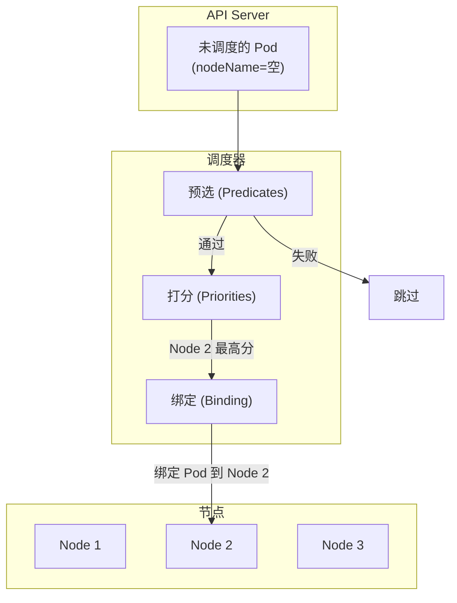
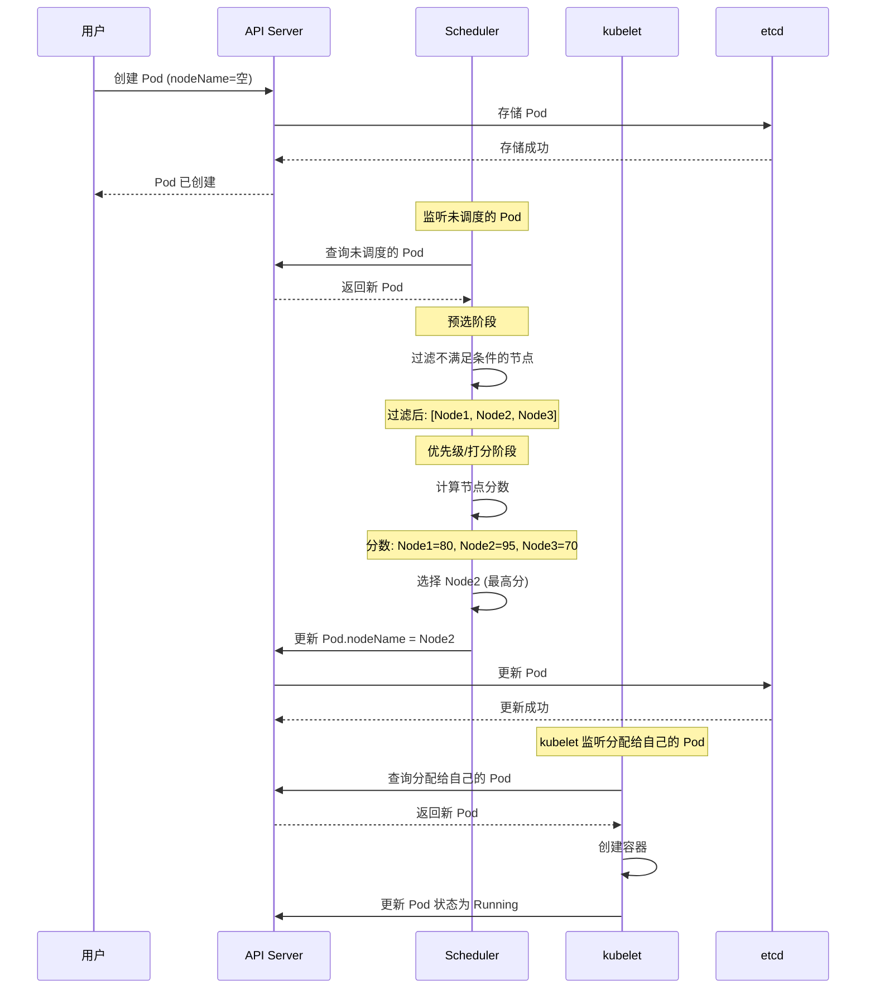

# Kubernetes 调度器原理

当你创建一个 Pod 时，是谁决定它应该运行在哪个节点上？

**Kubernetes 调度器（Scheduler）负责这个关键决策。**

## 调度器概述

调度器监听**未调度的 Pod**，通过评分算法选择最合适的节点，然后将 Pod 绑定到该节点。



## 调度流程

### 完整流程



## 预选（Predicates）

预选阶段过滤掉**不满足基本要求**的节点。

### 常用预选规则

| 规则 | 说明 |
| --- | --- |
| **PodFitsResources** | 节点有足够的 CPU 和内存 |
| **PodFitsHostPorts** | 节点没有冲突的端口 |
| **HostName** | Pod 指定了 nodeName |
| **MatchNodeSelector** | Pod 有节点选择器 |
| **NoDiskConflict** | Pod 的 Volume 不冲突 |
| **MaxEBSVolumeCount** | EBS 卷数量不超过限制 |
| **MaxGCEPDVolumeCount** | GCE PD 卷数量不超过限制 |
| **AzureDiskVolumeLimits** | Azure 磁盘数量限制 |

### 禁用预选规则

```bash
# kube-scheduler 配置
kube-scheduler --disable-preemption
```

## 优先级（Priorities）

通过预选的节点进入打分阶段。调度器使用多个优先级函数计算综合分数。

### 常用优先级函数

| 优先级 | 说明 |
| --- | --- |
| **SelectorSpreadPriority** | 优先将 Pod 分散到不同拓扑域 |
| **InterPodAffinityPriority** | 考虑 Pod 亲和性/反亲和性 |
| **LeastRequestedPriority** | 优先调度到资源使用率低的节点 |
| **MostRequestedPriority** | 优先调度到资源使用率高的节点 |
| **NodeAffinityPriority** | 考虑节点亲和性 |
| **ImageLocalityPriority** | 优先调度到镜像已缓存的节点 |
| **BalancedResourceAllocation** | 平衡 CPU 和内存使用率 |

### 分数计算

```go
// LeastRequestedPriority 计算公式
score = (cpu((capacity-sum(requested)) * 10 / capacity) + memory((capacity-sum(requested)) * 10 / capacity)) / 2
```

## 绑定（Binding）

选择最优节点后，调度器将 Pod 绑定到该节点：

```go
// 调度器绑定 Pod
binding := &v1.Binding{
    ObjectMeta: metav1.ObjectMeta{
        Name:      pod.Name,
        Namespace: pod.Namespace,
    },
    Target: v1.ObjectReference{
        Kind: "Node",
        Name: selectedNode,
    },
}
client.CoreV1().Bindings(pod.Namespace).Create(context.Background(), binding)
```

## 自定义调度

### 指定调度器

```yaml title="custom-scheduler-pod.yaml"
spec:
  schedulerName: my-custom-scheduler
```

### 配置调度策略

```yaml title="scheduler-config.yaml"
apiVersion: kubescheduler.config.k8s.io/v1beta3
kind: KubeSchedulerConfiguration
profiles:
- schedulerName: default-scheduler
  plugins:
    preFilter:
      enabled:
      - name: NodeResources
      - name: PodTopologySpread
    filter:
      enabled:
      - name: NodeUnschedulable
    score:
      enabled:
      - name: SelectorSpread
      - name: InterPodAffinity
      - name: LeastRequested
```

## 亲和性与反亲和性

### 节点亲和性

```yaml
spec:
  affinity:
    nodeAffinity:
      requiredDuringSchedulingIgnoredDuringExecution:
        nodeSelectorTerms:
        - matchExpressions:
          - key: topology.kubernetes.io/zone
            operator: In
            values:
            - us-east-1a
      preferredDuringSchedulingIgnoredDuringExecution:
      - weight: 1
        preference:
          matchExpressions:
          - key: disktype
            operator: In
            values:
            - ssd
```

详细内容请参考 [调度策略与亲和性](./affinity)。

### Pod 亲和性与反亲和性

```yaml
spec:
  affinity:
    podAffinity:
      requiredDuringSchedulingIgnoredDuringExecution:
      - labelSelector:
          matchExpressions:
          - key: app
            operator: In
            values:
            - web
        topologyKey: kubernetes.io/hostname
    podAntiAffinity:
      preferredDuringSchedulingIgnoredDuringExecution:
      - weight: 100
        podAffinityTerm:
          labelSelector:
            matchExpressions:
            - key: app
              operator: In
              values:
              - cache
          topologyKey: kubernetes.io/hostname
```

## 污点与容忍

### 污点

```bash
# 添加污点
kubectl taint nodes node1 dedicated=postgres:NoSchedule

# 移除污点
kubectl taint nodes node1 dedicated-
```

### 容忍

```yaml
spec:
  tolerations:
  - key: dedicated
    operator: Equal
    value: postgres
    effect: NoSchedule
```

详细内容请参考 [污点与容忍](./taint-toleration)。

## 调度扩展

### Scheduler Framework

从 Kubernetes 1.19 开始，支持 Scheduler Framework 扩展调度器：

```go title="sample_plugin.go"
package sample

import (
    "context"
    "fmt"

    "k8s.io/apimachinery/pkg/runtime"
    "k8s.io/klog/v2"
    "sigs.k8s.io/scheduler-plugins/pkg/apis/scheduling/v1alpha1"
    "sigs.k8s.io/scheduler-plugins/pkg/generated/clientset/versioned"
)

type Sample struct {
    args   *v1alpha1.SampleArgs
    handle framework.Handle
}

func (s *Sample) Filter(ctx context.Context, state *framework.CycleState, pod *v1.Pod, nodeInfo *framework.NodeInfo) *framework.Status {
    // 自定义过滤逻辑
    if !s.isNodeSuitable(nodeInfo.Node()) {
        return framework.NewStatus(framework.Unschedulable, "node not suitable")
    }
    return nil
}

func (s *Sample) Score(ctx context.Context, state *framework.CycleState, pod *v1.Pod, nodeName string) (int64, *framework.Status) {
    // 自定义打分逻辑
    score := calculateScore(nodeName)
    return score, nil
}
```

## 常见问题

### Pod 一直 Pending

```bash
# 查看调度失败原因
kubectl describe pod <pod-name> | grep -A 10 "Events:"

# 常见原因：
# - 资源不足
# - 节点选择器不匹配
# - 污点无容忍
# - 存储无法挂载
```

### 调度缓慢

```bash
# 查看调度器日志
kubectl logs -n kube-system -l component=kube-scheduler

# 常见原因：
# - 节点数量过多
# - 自定义预选规则复杂
# - 预选规则冲突
```

### 调度不均衡

```bash
# 查看节点资源使用
kubectl top nodes

# 检查调度策略
kubectl describe pod <pod-name> | grep -A 5 "Tolerations"
```

## 调度优化

### 1. 资源请求

```yaml
spec:
  containers:
  - resources:
      requests:
        memory: "128Mi"
        cpu: "250m"
      limits:
        memory: "256Mi"
        cpu: "500m"
```

### 2. 拓扑分布

```yaml
spec:
  topologySpreadConstraints:
  - maxSkew: 1
    topologyKey: topology.kubernetes.io/zone
    whenUnsatisfiable: DoNotSchedule
    labelSelector:
      matchLabels:
        app: nginx
```

### 3. 优先级配置

```yaml
apiVersion: kubescheduler.config.k8s.io/v1beta3
kind: KubeSchedulerConfiguration
profiles:
- schedulerName: default-scheduler
  pluginConfig:
  - name: NodeResourcesFit
    args:
      scoringStrategy:
        strategy: LeastAllocated
        resources:
        - name: cpu
          weight: 1
        - name: memory
          weight: 1
```

## 延伸思考

Kubernetes 调度器是集群资源分配的核心：

1. **资源优化**：尽可能合理分配资源
2. **高可用**：将 Pod 分散到不同节点
3. **策略灵活**：支持多种调度策略

但调度器也有局限：

1. **局部最优**：启发式算法不能保证全局最优
2. **静态视角**：基于当前状态做决策
3. **不支持预测**：不能预测未来负载

对于更复杂的调度需求，可以考虑 Volcano、Kube-batch 等批处理调度器。

## 延伸阅读

- [调度策略与亲和性](./affinity)：亲和性详解
- [污点与容忍](./taint-toleration)：污点管理
- [Pod 资源管理](./pod)：资源配置
