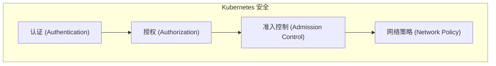
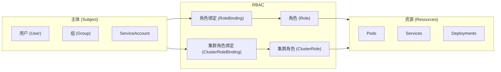

# Kubernetes 安全

你有没有想过，你的应用在 Kubernetes 集群中可以访问什么？

如果没有适当的安全控制，应用可能：
- 访问其他命名空间的敏感数据
- 修改集群配置
- 窃取密钥和证书

**Kubernetes 安全机制让你能够精细控制每个组件的访问权限。**

## 安全概述

Kubernetes 安全需要关注四个层面：



| 层面 | 机制 | 说明 |
| --- | --- | --- |
| **认证** | 谁在访问？ | 用户、ServiceAccount |
| **授权** | 允许做什么？ | RBAC、ABAC |
| **准入控制** | 请求是否允许？ | Mutating/Validating |
| **网络策略** | 网络访问控制 | Ingress/Egress 规则 |

## 认证（Authentication）

### 用户认证

| 类型 | 说明 |
| --- | --- |
| **证书认证** | X509 客户端证书 |
| **静态 Token** | Bearer Token |
| **OIDC** | OpenID Connect |
| **Webhook** | 外部认证服务 |

### ServiceAccount

每个 Pod 都有一个 ServiceAccount，用于 Pod 访问 API Server：

```yaml title="pod-with-sa.yaml"
apiVersion: v1
kind: Pod
metadata:
  name: my-app
spec:
  serviceAccountName: my-app-sa
  containers:
  - name: app
    image: my-app:1.0
```

```bash
# 查看 ServiceAccount
kubectl get sa
# NAME              SECRETS   AGE
# default           0         30d
# my-app-sa         0         5m
```

### Token 挂载

```yaml
spec:
  serviceAccountName: my-app-sa
  automountServiceAccountToken: false  # 禁用自动挂载
```

## RBAC（基于角色的访问控制）

### 核心概念



### Role 与 ClusterRole

```yaml title="role.yaml"
apiVersion: rbac.authorization.k8s.io/v1
kind: Role
metadata:
  name: pod-reader
  namespace: default
rules:
- apiGroups: [""]
  resources: ["pods"]
  verbs: ["get", "list", "watch"]
```

```yaml title="clusterrole.yaml"
apiVersion: rbac.authorization.k8s.io/v1
kind: ClusterRole
metadata:
  name: node-reader
rules:
- apiGroups: [""]
  resources: ["nodes"]
  verbs: ["get", "list", "watch"]
```

### RoleBinding 与 ClusterRoleBinding

```yaml title="rolebinding.yaml"
apiVersion: rbac.authorization.k8s.io/v1
kind: RoleBinding
metadata:
  name: pod-reader-binding
  namespace: default
subjects:
- kind: ServiceAccount
  name: my-app-sa
  namespace: default
- kind: User
  name: john@example.com
roleRef:
  kind: Role
  name: pod-reader
  apiGroup: rbac.authorization.k8s.io
```

```yaml title="clusterrolebinding.yaml"
apiVersion: rbac.authorization.k8s.io/v1
kind: ClusterRoleBinding
metadata:
  name: node-reader-binding
subjects:
- kind: ServiceAccount
  name: monitor-sa
  namespace: monitoring
roleRef:
  kind: ClusterRole
  name: node-reader
  apiGroup: rbac.authorization.k8s.io
```

### 常用动词

| 动词 | 说明 | 对应 HTTP 方法 |
| --- | --- | --- |
| `get` | 读取单个资源 | GET |
| `list` | 列出资源 | GET |
| `watch` | 监听资源变更 | GET (WebSocket) |
| `create` | 创建资源 | POST |
| `update` | 更新资源 | PUT |
| `patch` | 部分更新资源 | PATCH |
| `delete` | 删除资源 | DELETE |
| `deletecollection` | 批量删除 | DELETE |

## 常用角色示例

### 只读访问

```yaml title="read-only-role.yaml"
apiVersion: rbac.authorization.k8s.io/v1
kind: Role
metadata:
  name: readonly
  namespace: production
rules:
- apiGroups: [""]
  resources: ["pods", "services", "configmaps"]
  verbs: ["get", "list", "watch"]
- apiGroups: ["apps"]
  resources: ["deployments", "replicasets"]
  verbs: ["get", "list", "watch"]
```

### Deployment 管理

```yaml title="deploy-role.yaml"
apiVersion: rbac.authorization.k8s.io/v1
kind: Role
metadata:
  name: deploy-manager
  namespace: production
rules:
- apiGroups: ["apps"]
  resources: ["deployments", "replicasets"]
  verbs: ["get", "list", "watch", "create", "update", "patch", "delete"]
- apiGroups: [""]
  resources: ["pods"]
  verbs: ["get", "list", "watch"]
```

### Secret 访问

```yaml title="secret-role.yaml"
apiVersion: rbac.authorization.k8s.io/v1
kind: Role
metadata:
  name: secret-reader
rules:
- apiGroups: [""]
  resources: ["secrets"]
  verbs: ["get", "list", "watch"]
```

## 聚合 ClusterRole

```yaml title="aggregate-clusterrole.yaml"
# 通过标签聚合到默认的 admin 角色
apiVersion: rbac.authorization.k8s.io/v1
kind: ClusterRole
metadata:
  name: custom-admin
  labels:
    rbac.example.com/aggregate-to-admin: "true"
rules:
- apiGroups: ["custom.example.com"]
  resources: ["customresources"]
  verbs: ["*"]
```

## 最佳实践

### 1. 最小权限原则

```yaml
# 错误：过于宽泛
rules:
- apiGroups: ["*"]
  resources: ["*"]
  verbs: ["*"]

# 正确：精确指定
rules:
- apiGroups: [""]
  resources: ["pods"]
  verbs: ["get", "list"]
```

### 2. 命名空间隔离

```yaml
# 使用 Role 而不是 ClusterRole
kind: Role
metadata:
  name: pod-reader
  namespace: production  # 限制在特定命名空间
```

### 3. ServiceAccount 专用

```yaml
# 为每个应用创建专用 ServiceAccount
apiVersion: v1
kind: ServiceAccount
metadata:
  name: my-app-sa
  namespace: production
---
# 只授予必要的权限
apiVersion: rbac.authorization.k8s.io/v1
kind: RoleBinding
metadata:
  name: my-app-binding
  namespace: production
subjects:
- kind: ServiceAccount
  name: my-app-sa
  namespace: production
roleRef:
  kind: Role
  name: my-app-role
```

### 4. 禁用默认 Token

```yaml
# 不需要访问 API Server 的 Pod
spec:
  automountServiceAccountToken: false
```

## 安全上下文

### Pod 安全上下文

```yaml title="security-context-pod.yaml"
spec:
  securityContext:
    runAsNonRoot: true
    runAsUser: 1000
    runAsGroup: 1000
    fsGroup: 2000
    supplementalGroups: [3000]
    seLinuxOptions:
      level: "s0:c123,c456"
```

### 容器安全上下文

```yaml
spec:
  containers:
  - name: app
    securityContext:
      allowPrivilegeEscalation: false
      readOnlyRootFilesystem: true
      capabilities:
        drop:
        - ALL
        add:
        - NET_BIND_SERVICE
```

## 网络安全

### NetworkPolicy

```yaml title="networkpolicy.yaml"
apiVersion: networking.k8s.io/v1
kind: NetworkPolicy
metadata:
  name: api-policy
  namespace: production
spec:
  podSelector:
    matchLabels:
      app: api
  policyTypes:
  - Ingress
  - Egress
  ingress:
  - from:
    - podSelector:
        matchLabels:
          app: frontend
    ports:
    - protocol: TCP
      port: 8080
  egress:
  - to:
    - podSelector:
        matchLabels:
          app: database
    ports:
    - protocol: TCP
      port: 5432
```

## 常见问题

### RoleBinding 不生效

```bash
# 检查绑定
kubectl describe rolebinding <name> -n <namespace>

# 检查主体是否存在
kubectl get sa <name> -n <namespace>
kubectl get user <name>
```

### 权限不足

```bash
# 检查用户权限
kubectl auth can-i <verb> <resource> --as=<user>

# 示例
kubectl auth can-i get pods --as=john@example.com
# yes

kubectl auth can-i delete pods --as=john@example.com
# no
```

### ServiceAccount Token 泄露

```bash
# 检查 Token 挂载
kubectl describe pod <name> | grep -A 5 "Mounts"

# 禁用 Token 挂载
kubectl patch pod <name> -p '{"spec":{"automountServiceAccountToken":false}}'
```

## 安全审计

### 审计日志

```yaml title="audit-policy.yaml"
apiVersion: audit.k8s.io/v1
kind: Policy
rules:
# 不记录只读请求
- level: None
  resources:
  - group: ""
    resources: ["pods"]
    verbs: ["get", "list", "watch"]

# 记录对 Secret 的访问
- level: Metadata
  resources:
  - group: ""
    resources: ["secrets"]

# 记录对 Deployment 的修改
- level: RequestResponse
  resources:
  - group: "apps"
    resources: ["deployments"]
```

## 延伸思考

Kubernetes 安全是一个多层次的系统：

1. **身份认证**：确认谁在访问
2. **权限控制**：限制可以做什么
3. **网络隔离**：控制网络访问
4. **资源限制**：防止资源滥用

但安全不是一次性的工作：

1. **定期审计**：检查权限配置
2. **最小权限**：避免权限过大
3. **监控告警**：发现异常访问
4. **持续更新**：应对新的威胁

## 延伸阅读

- [Pod 安全策略](./pod-security)：Pod 安全配置
- [NetworkPolicy 网络策略](./network-policy)：网络隔离
