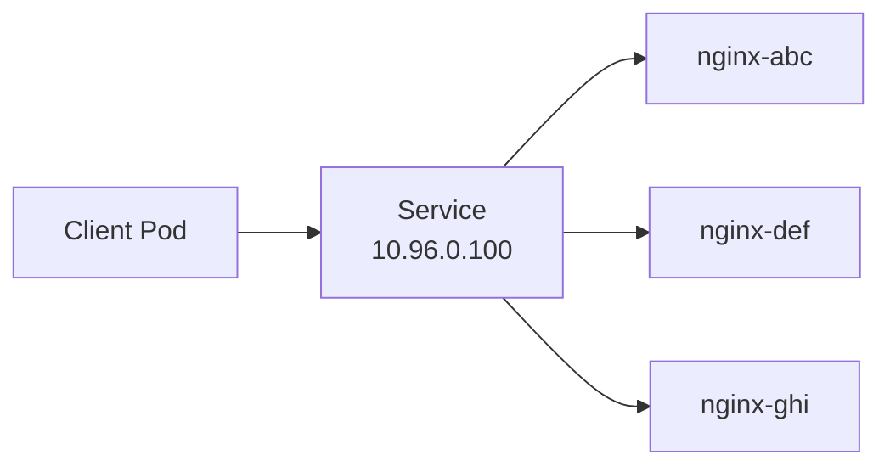
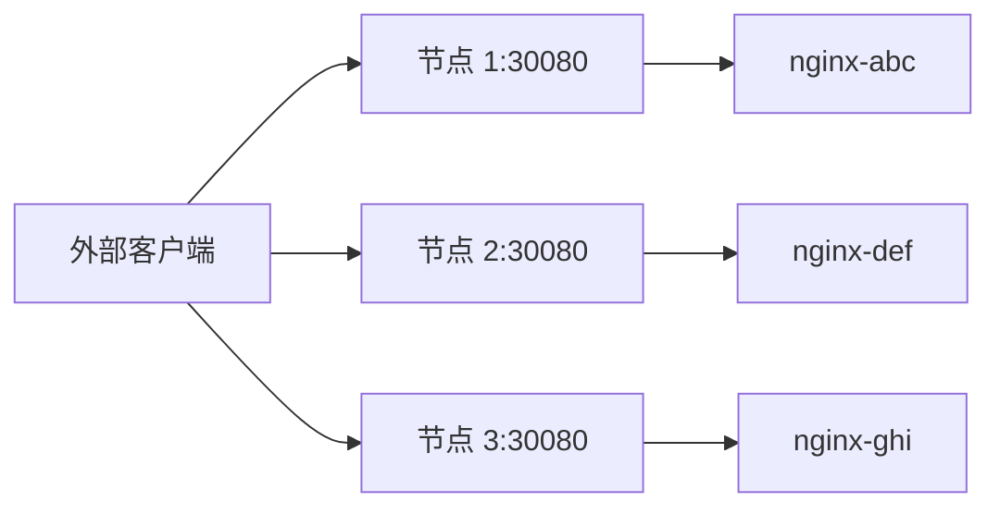
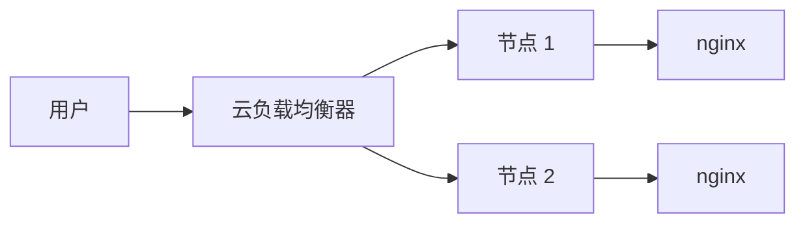
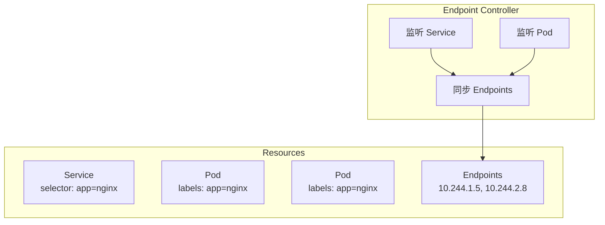
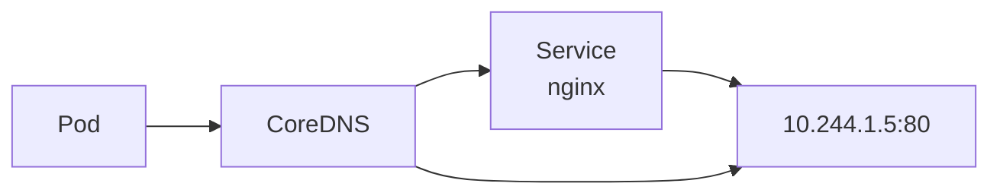
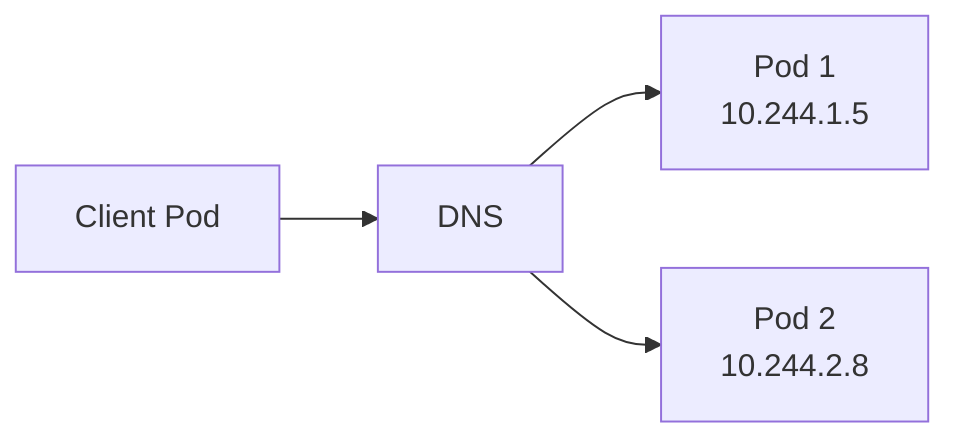

# Service 详解

你部署了 3 个 nginx 副本，每个副本有自己的 IP 地址。现在的问题是：**客户端怎么知道该访问哪个 IP？**

手动维护 IP 列表不现实——Pod 可能会重启、漂移、数量会变化。**Kubernetes Service 就是来解决这个问题的。**

Service 提供了一个稳定的 IP 地址和 DNS 名称，将请求负载均衡到一组 Pod 上。无论后端 Pod 怎么变化，Service 的 IP 始终不变。

## Service 是什么？

Service 是 Kubernetes 的**服务发现**抽象。它定义了一组 Pod 的访问方式，提供：

1. **稳定的虚拟 IP**（ClusterIP）：集群内部可以访问的固定地址
2. **DNS 名称**：通过域名访问服务
3. **负载均衡**：自动将请求分发到后端 Pod
4. **健康检查**：自动剔除不健康的 Pod



## Service 类型

Kubernetes 提供了 4 种 Service 类型：

| 类型 | 说明 | 访问范围 |
| --- | --- | --- |
| **ClusterIP** | 分配集群内部 IP（默认） | 仅集群内部 |
| **NodePort** | 在每个节点上开放端口 | 集群内部 + 节点 IP |
| **LoadBalancer** | 云厂商负载均衡器 | 外部访问 |
| **ExternalName** | CNAME 映射 | 仅 DNS |

### ClusterIP（默认）

ClusterIP 是最基础的 Service 类型，只在集群内部可访问：

```yaml title="clusterip-service.yaml"
apiVersion: v1
kind: Service
metadata:
  name: nginx-service
spec:
  type: ClusterIP
  selector:
    app: nginx
  ports:
  - name: http
    protocol: TCP
    port: 80          # Service 端口
    targetPort: 80   # Pod 端口
  - name: https
    protocol: TCP
    port: 443
    targetPort: 443
```

```bash
# 创建 Service
kubectl apply -f clusterip-service.yaml

# 查看 Service
kubectl get svc nginx-service
# NAME            TYPE        CLUSTER-IP      PORT(S)    AGE
# nginx-service   ClusterIP   10.96.0.100     80/TCP     5m

# 查看 Service 详情
kubectl describe svc nginx-service
```

### NodePort

NodePort 在每个节点的 IP 上开放一个端口（30000-32767），可以通过 `节点IP:NodePort` 访问：

```yaml title="nodeport-service.yaml"
apiVersion: v1
kind: Service
metadata:
  name: nginx-nodeport
spec:
  type: NodePort
  selector:
    app: nginx
  ports:
  - name: http
    protocol: TCP
    port: 80
    targetPort: 80
    nodePort: 30080  # 可选，不指定则随机分配
```

```bash
# 访问方式
# http://<node-ip>:30080/
```



:::tip
NodePort 的优势是简单，不需要额外的负载均衡器。缺点是端口范围有限（30000-32767），且每个节点都会开放端口。
:::

### LoadBalancer

LoadBalancer 使用云厂商的负载均衡器，通常用于暴露服务到外部：

```yaml title="loadbalancer-service.yaml"
apiVersion: v1
kind: Service
metadata:
  name: nginx-lb
spec:
  type: LoadBalancer
  selector:
    app: nginx
  ports:
  - name: http
    protocol: TCP
    port: 80
    targetPort: 80
  - name: https
    protocol: TCP
    port: 443
    targetPort: 443
```

```bash
# 查看 Service
kubectl get svc nginx-lb
# NAME       TYPE           CLUSTER-IP      PORT(S)        AGE
# nginx-lb   LoadBalancer   10.96.0.101     80:32000/TCP   2m

# 查看外部 IP（云厂商分配）
kubectl get svc nginx-lb -o jsonpath='{.status.loadBalancer.ingress[0].ip}'
```



:::info
LoadBalancer 类型的 Service 需要云厂商支持。在本地环境（如 minikube、kind）中，LoadBalancer 会显示为 `<pending>` 状态。可以使用 `minikube tunnel` 命令暴露 LoadBalancer 服务。
:::

### ExternalName

ExternalName 将 Service 映射到外部域名：

```yaml title="externalname-service.yaml"
apiVersion: v1
kind: Service
metadata:
  name: mysql-external
spec:
  type: ExternalName
  externalName: mysql.prod.example.com
```

```bash
# 访问
# mysql://mysql-external.default.svc.cluster.local
# 会解析到 mysql.prod.example.com
```

## Service 的工作原理

### Endpoints

Service 的后端 Pod 列表由 **Endpoints** 资源维护：

```bash
# 查看 Service 对应的 Endpoints
kubectl get endpoints nginx-service
# NAME            ENDPOINTS                        AGE
# nginx-service   10.244.1.5:80,10.244.2.8:80     5m

# 查看 Endpoints 详情
kubectl describe endpoints nginx-service
```

```yaml title="endpoints.yaml"
apiVersion: v1
kind: Endpoints
metadata:
  name: nginx-service
subsets:
- addresses:
  - ip: 10.244.1.5
    targetRef:
      kind: Pod
      name: nginx-abc
      namespace: default
  - ip: 10.244.2.8
    targetRef:
      kind: Pod
      name: nginx-def
      namespace: default
  ports:
  - port: 80
    protocol: TCP
```

### Endpoint 控制器

Endpoint 控制器（Endpoint Controller）自动维护 Endpoints：



:::tip
如果 Pod 有 `publishNotReadyAddresses: true` 注解，Endpoint 控制器会立即将 Pod 加入 Endpoints，即使 Pod 还未 Ready。这对于需要预热的场景很有用。
:::

### kube-proxy 与 Service

kube-proxy 监听 Service 和 Endpoints 的变更，配置网络规则实现负载均衡：

```bash
# 查看 iptables 规则（iptables 模式）
iptables -t nat -L KUBE-SERVICES -n
iptables -t nat -L KUBE-SVC-XXX -n

# 查看 IPVS 规则（IPVS 模式）
ipvsadm -L -n | grep 10.96.0.100
```

## 服务发现

### DNS

Kubernetes 提供集群内部的 DNS 服务（通常是 CoreDNS 或 kube-dns）：



Service 的 DNS 记录格式：

| FQDN | 说明 |
| --- | --- |
| `nginx.default.svc.cluster.local` | 完全限定域名 |
| `nginx.default.svc` | 同命名空间，可简写 |
| `nginx.default` | 同命名空间 |
| `nginx` | 同 Pod |

### 环境变量

kubelet 为每个容器注入环境变量：

```bash
# 容器内查看
printenv | grep NGINX
# NGINX_SERVICE_HOST=10.96.0.100
# NGINX_SERVICE_PORT=80
```

:::warning
环境变量在容器启动时注入。如果 Service 在 Pod 启动后才创建，Pod 不会自动获得新的环境变量。DNS 方式更可靠。
:::

## Headless Service

Headless Service 是 `clusterIP: None` 的 Service，不会分配 ClusterIP：

```yaml title="headless-service.yaml"
apiVersion: v1
kind: Service
metadata:
  name: nginx-headless
spec:
  clusterIP: None  # 关键配置
  selector:
    app: nginx
  ports:
  - port: 80
    targetPort: 80
```

Headless Service 的 DNS 解析会**直接返回 Pod IP**：

```bash
# DNS 解析
nslookup nginx-headless.default.svc.cluster.local
# Server:    10.96.0.2
# Address:   10.96.0.2#53
# Name:      nginx-headless.default.svc.cluster.local
# Address:   10.244.1.5
# Address:   10.244.2.8
```



Headless Service 常用于：

1. **有状态应用**：StatefulSet 需要稳定的网络标识
2. **客户端负载均衡**：客户端自己选择要访问的 Pod
3. **服务发现**：需要获取所有 Pod IP 的场景

## 多端口 Service

Service 可以暴露多个端口：

```yaml title="multi-port-service.yaml"
apiVersion: v1
kind: Service
metadata:
  name: multi-port-service
spec:
  type: ClusterIP
  selector:
    app: webapp
  ports:
  - name: http
    protocol: TCP
    port: 80
    targetPort: 8080
  - name: admin
    protocol: TCP
    port: 9090
    targetPort: 9090
  - name: metrics
    protocol: TCP
    port: 9100
    targetPort: 9100
```

## 外部服务

### 手动管理 Endpoints

可以手动创建 Endpoints，指向集群外部的服务：

```yaml title="external-endpoints.yaml"
apiVersion: v1
kind: Service
metadata:
  name: external-mysql
spec:
  ports:
  - port: 3306
---
apiVersion: v1
kind: Endpoints
metadata:
  name: external-mysql
subsets:
- addresses:
  - ip: 192.168.1.100
  - ip: 192.168.1.101
  ports:
  - port: 3306
```

### externalIPs

```yaml
spec:
  externalIPs:
  - 192.168.1.200
  ports:
  - port: 3306
```

:::warning
`externalIPs` 需要手动维护，且没有健康检查。推荐使用 Endpoints 手动管理或 Cloud Provider 的 LoadBalancer。
:::

## 会话亲和性

可以通过 `sessionAffinity` 实现会话保持：

```yaml
spec:
  sessionAffinity: ClientIP
  sessionAffinityConfig:
    clientIP:
      timeoutSeconds: 10800  # 3 小时
```

:::warning
会话亲和性使用源 IP 做哈希，同一个客户端的请求会路由到同一个 Pod。但如果 Pod 数量变化，之前路由到某个 Pod 的请求可能会路由到其他 Pod。
:::

## 常见问题

### Service 无法访问

排查步骤：

```bash
# 1. 确认 Service 存在
kubectl get svc nginx-service

# 2. 确认 Endpoints 有后端 Pod
kubectl get endpoints nginx-service

# 3. 确认 Pod 正在运行
kubectl get pods -l app=nginx

# 4. 确认 Pod readinessProbe 通过
kubectl describe pod <pod-name> | grep -A 5 "Conditions"
```

### Endpoint 为空

常见原因：

1. **Service 的 selector 与 Pod 的 labels 不匹配**
2. **Pod 还未 Ready**
3. **所有 Pod 都在 terminating 状态**

```bash
# 检查 selector
kubectl get svc nginx-service -o jsonpath='{.spec.selector}'
kubectl get pods --show-labels -l app=nginx
```

### 负载不均衡

在 iptables 模式下，负载均衡使用随机选择，不是严格轮询。如果需要更均衡的分布：

1. 使用 IPVS 模式
2. 减少 Pod 数量变化（避免 Endpoint 频繁更新）
3. 考虑客户端负载均衡

## 延伸思考

Service 的设计体现了分布式系统的核心问题：**如何让客户端找到服务端？**

传统的做法是客户端配置服务端 IP，但 Pod 的 IP 是动态的。Service 通过引入一个稳定的中间层（固定 IP + DNS），解决了这个问题。

但 Service 也有局限：

1. **Layer 4 负载均衡**：Service 是四层代理，不理解七层协议（HTTP）
2. **不支持灰度发布**：无法基于请求内容做路由
3. **不支持自动 HTTPS**：无法自动管理证书

对于这些场景，Ingress Controller 是更好的选择。

## 延伸阅读

- [Ingress 与 Ingress Controller](./ingress)：七层负载均衡和路由
- [Kubernetes 网络模型](./network-model)：深入理解 Service 的网络实现
- [Deployment 与 ReplicaSet](./deployment)：Pod 的编排管理
