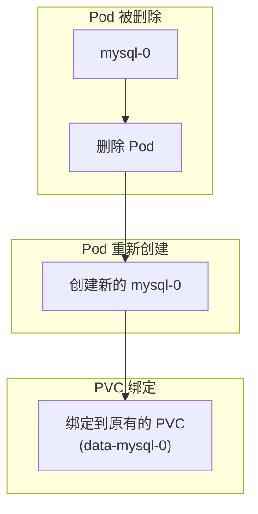
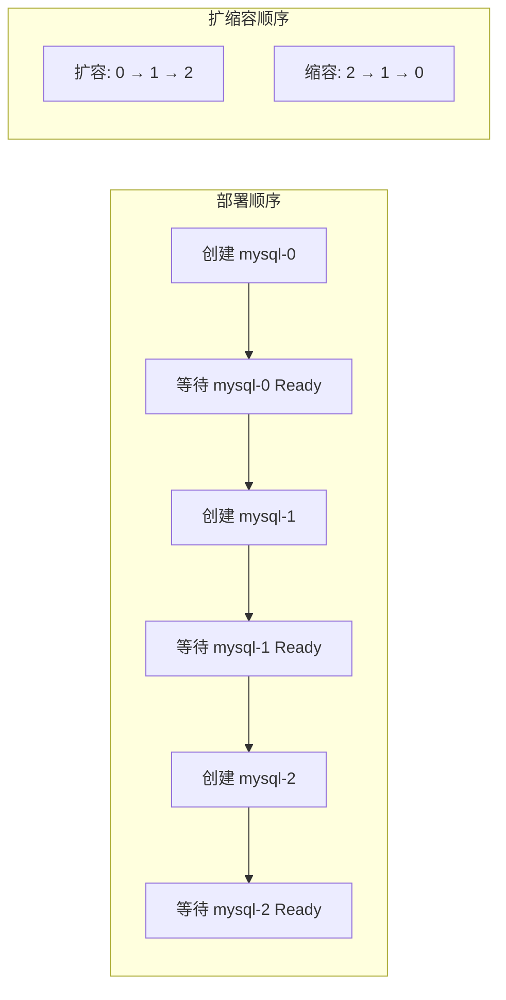

# StatefulSet 有状态应用

Deployment 解决了无状态应用的部署问题。但对于有状态应用呢？

- **数据库**：MySQL 主从集群，需要固定的 hostnames
- **消息队列**：Kafka 分区与消费者的对应关系需要稳定
- **分布式存储**：Ceph、MinIO 的节点需要有持久化的身份

**StatefulSet 就是为这些场景设计的。**

## StatefulSet vs Deployment

| 特性 | Deployment | StatefulSet |
| --- | --- | --- |
| **Pod 标识** | 随机 ID | 稳定序号（0, 1, 2...） |
| **网络标识** | 无 | 稳定的主机名 |
| **存储** | 共享或无 | 独立持久存储 |
| **部署顺序** | 并行 | 顺序（从 0 到 N） |
| **扩缩容顺序** | 并行 | 逆序（N 到 0） |

```mermaid
flowchart LR
    subgraph Deployment["Deployment"]
        P1D["nginx-abc"]
        P2D["nginx-def"]
        P3D["nginx-ghi"]
    end

    subgraph StatefulSet["StatefulSet"]
        P0["mysql-0"]
        P1["mysql-1"]
        P2["mysql-2"]
    end

    P0 -.->|固定主机名| "mysql-0.default.svc.cluster.local"
    P1 -.->|固定主机名| "mysql-1.default.svc.cluster.local"
    P2 -.->|固定主机名| "mysql-2.default.svc.cluster.local"
```

## 创建 StatefulSet

```yaml title="statefulset.yaml"
apiVersion: apps/v1
kind: StatefulSet
metadata:
  name: mysql
spec:
  serviceName: mysql-headless
  replicas: 3
  selector:
    matchLabels:
      app: mysql
  template:
    metadata:
      labels:
        app: mysql
    spec:
      terminationGracePeriodSeconds: 30
      containers:
      - name: mysql
        image: mysql:8.0
        ports:
        - containerPort: 3306
          name: mysql
        env:
        - name: MYSQL_ROOT_PASSWORD
          valueFrom:
            secretKeyRef:
              name: mysql-secret
              key: password
        volumeMounts:
        - name: data
          mountPath: /var/lib/mysql
  volumeClaimTemplates:
  - metadata:
      name: data
    spec:
      accessModes: ["ReadWriteOnce"]
      storageClassName: "standard"
      resources:
        requests:
          storage: 10Gi
```

## StatefulSet 核心特性

### 稳定网络标识

StatefulSet Pod 的主机名格式为：`{statefulset-name}-{ordinal}`。

例如，名为 `mysql` 的 StatefulSet，其 Pod 名称为 `mysql-0`、`mysql-1`、`mysql-2`。

```bash
# 查看 StatefulSet Pod
kubectl get pods -l app=mysql
# NAME     READY   STATUS    RESTARTS   AGE
# mysql-0  1/1     Running   0          5m
# mysql-1  1/1     Running   0          4m
# mysql-2  1/1     Running   0          3m

# Pod 的 DNS 记录
# mysql-0.mysql-headless.default.svc.cluster.local
# mysql-1.mysql-headless.default.svc.cluster.local
# mysql-2.mysql-headless.default.svc.cluster.local
```

### Headless Service

StatefulSet 通常需要配合 Headless Service 使用：

```yaml title="headless-service.yaml"
apiVersion: v1
kind: Service
metadata:
  name: mysql-headless
spec:
  clusterIP: None  # 关键：设为 None
  selector:
    app: mysql
  ports:
  - name: mysql
    port: 3306
```

Headless Service 的 DNS 解析会直接返回 Pod IP：

```bash
# DNS 查询
nslookup mysql-headless.default.svc.cluster.local
# Server:    10.96.0.2
# Address:   10.96.0.2#53
# Name:      mysql-headless.default.svc.cluster.local
# Address:   10.244.1.10  (mysql-0)
# Address:   10.244.2.8   (mysql-1)
# Address:   10.244.1.15  (mysql-2)
```

### 稳定存储

StatefulSet 使用 `volumeClaimTemplates` 为每个 Pod 创建独立的 PVC：

```bash
# 查看自动创建的 PVC
kubectl get pvc
# NAME               STATUS   VOLUME                                     CAPACITY
# data-mysql-0       Bound    pvc-xxx                                   10Gi
# data-mysql-1       Bound    pvc-yyy                                   10Gi
# data-mysql-2       Bound    pvc-zzz                                   10Gi
```

即使 Pod 被删除并重新调度，相同的 PVC 会被重新绑定（如果存在）：



### 有序部署与扩缩容



| 操作 | 行为 |
| --- | --- |
| **部署** | 从 ordinal 0 开始，逐个创建 Pod，每个 Pod 完全 Ready 后才创建下一个 |
| **删除** | 从 ordinal N-1 开始，逐个删除 Pod |
| **扩容** | 从 ordinal N-1 开始，逐个创建新 Pod |
| **缩容** | 从 ordinal N-1 开始，逐个删除 Pod |

## Pod 管理策略

### OrderedReady（默认）

```yaml
spec:
  podManagementPolicy: OrderedReady
```

Pod 按照 ordinal 顺序创建/删除，每个 Pod 必须 Ready 后才能进行下一个操作。

### Parallel

```yaml
spec:
  podManagementPolicy: Parallel
```

Pod 并行创建/删除，不等待前一个 Pod Ready。适用于可以容忍乱序的场景。

## 更新策略

StatefulSet 支持三种更新策略：

| 策略 | 说明 |
| --- | --- |
| **OnDelete** | 只有手动删除 Pod 时才更新（不自动更新） |
| **RollingUpdate** | 滚动更新（默认），按逆序更新 |
| **Partitions** | 分批更新，用于金丝雀发布 |

```yaml
spec:
  updateStrategy:
    type: RollingUpdate
    rollingUpdate:
      partition: 2  # 只更新 ordinal >= 2 的 Pod
```

## 扩缩容

```bash
# 扩容到 5 个副本
kubectl scale statefulset mysql --replicas=5

# 缩容到 2 个副本（会先删除 mysql-4, mysql-3）
kubectl scale statefulset mysql --replicas=2
```

:::danger
缩容 StatefulSet 不会删除 PVC，数据仍然保留。但如果扩容时原来的 PVC 已被其他应用使用，可能导致问题。
:::

### 分步缩容

对于有状态应用，建议手动分步缩容：

```bash
# 1. 先删除一个 Pod
kubectl delete pod mysql-4

# 2. 等待数据同步完成
# 3. 继续删除
kubectl scale statefulset mysql --replicas=3
```

## 常见使用场景

### MySQL 主从复制

```yaml title="mysql-statefulset.yaml"
apiVersion: apps/v1
kind: StatefulSet
metadata:
  name: mysql
spec:
  serviceName: mysql
  replicas: 3
  selector:
    matchLabels:
      app: mysql
  template:
    metadata:
      labels:
        app: mysql
    spec:
      initContainers:
      - name: init-mysql
        image: mysql:8.0
        command:
        - bash
        - "-c"
        - |
          # 根据 ordinal 决定是 master 还是 slave
          if [[ $HOSTNAME =~ -([0-9]+)$ ]]; then
            ordinal=${BASH_REMATCH[1]}
            if [[ $ordinal -eq 0 ]]; then
              echo "Initializing as master..."
            else
              echo "Waiting for master to be ready..."
              until mysql -h mysql-0 -uroot -p$MYSQL_ROOT_PASSWORD -e "SELECT 1"; do
                sleep 5
              done
              echo "Initializing as slave..."
            fi
          fi
        env:
        - name: MYSQL_ROOT_PASSWORD
          valueFrom:
            secretKeyRef:
              name: mysql-secret
              key: password
      containers:
      - name: mysql
        image: mysql:8.0
        ports:
        - containerPort: 3306
          name: mysql
        env:
        - name: MYSQL_ROOT_PASSWORD
          valueFrom:
            secretKeyRef:
              name: mysql-secret
              key: password
        volumeMounts:
        - name: data
          mountPath: /var/lib/mysql
  volumeClaimTemplates:
  - metadata:
      name: data
    spec:
      accessModes: ["ReadWriteOnce"]
      storageClassName: "ssd"
      resources:
        requests:
          storage: 100Gi
```

### Kafka 集群

```yaml title="kafka-statefulset.yaml"
apiVersion: apps/v1
kind: StatefulSet
metadata:
  name: kafka
spec:
  serviceName: kafka-headless
  replicas: 3
  selector:
    matchLabels:
      app: kafka
  template:
    spec:
      containers:
      - name: kafka
        image: confluentinc/cp-kafka:7.5.0
        ports:
        - containerPort: 9092
          name: kafka
        - containerPort: 9093
          name: internal
        env:
        - name: BROKER_ID
          valueFrom:
            fieldRef:
              fieldPath: metadata.annotations['statefulset.kubernetes.io/pod-name']
        - name: KAFKA_ZOOKEEPER_CONNECT
          value: zookeeper:2181
        - name: KAFKA_LOG_DIRS
          value: /opt/kafka/data
        volumeMounts:
        - name: data
          mountPath: /opt/kafka/data
  volumeClaimTemplates:
  - metadata:
      name: data
    spec:
      accessModes: ["ReadWriteOnce"]
      storageClassName: "fast"
      resources:
        requests:
          storage: 50Gi
```

## 常见问题

### Pod 无法启动

```bash
# 查看 Pod 事件
kubectl describe pod mysql-0

# 常见原因：
# - 持久卷未准备好
# - Init 容器失败
# - 资源不足
```

### PVC 无法绑定

```bash
# 查看 PVC 状态
kubectl get pvc
kubectl describe pvc data-mysql-0

# 常见原因：
# - StorageClass 不存在
# - 拓扑限制不满足
# - 存储配额不足
```

### 数据丢失

缩容 StatefulSet 时：

1. **确保数据已备份**：缩容前备份重要数据
2. **手动缩容**：逐个删除 Pod，确保数据安全
3. **保留 PVC**：缩容后 PVC 不会自动删除，数据仍然保留

## 最佳实践

### 1. 使用合理的副本数

- 最小化部署：1 个副本（测试环境）
- 高可用部署：至少 3 个副本

### 2. 配置持久存储

```yaml
volumeClaimTemplates:
- metadata:
    name: data
  spec:
    accessModes: ["ReadWriteOnce"]
    storageClassName: "ssd"
    resources:
      requests:
        storage: 100Gi
```

### 3. 设置合适的终止gracePeriod

```yaml
spec:
  terminationGracePeriodSeconds: 60
```

### 4. 配置健康检查

```yaml
readinessProbe:
  exec:
    command:
    - mysqladmin
    - ping
    - -h
    - localhost
  initialDelaySeconds: 30
  periodSeconds: 10
```

## 延伸思考

StatefulSet 是 Kubernetes 处理有状态应用的基础抽象。它的设计哲学是：

1. **稳定性优先**：网络标识和存储的稳定比什么都重要
2. **有序操作**：确保数据一致性的关键
3. **独立存储**：每个 Pod 都有自己的存储空间

但 StatefulSet 也有局限性：

1. **不支持自动故障转移**：如果某个 Pod 崩溃，不会自动在新节点上创建
2. **不支持分片**：需要应用自己处理数据分片
3. **运维复杂**：备份、恢复、升级都需要额外考虑

对于更复杂的有状态应用，可以考虑 Operator 模式，如 Prometheus Operator、Cassandra Operator 等。

## 延伸阅读

- [Deployment 与 ReplicaSet](./deployment)：无状态应用的部署
- [Volume 与 PVC/PV](./volume)：持久化存储
- [Operator 模式深度解析](./operator)：如何管理复杂的有状态应用
