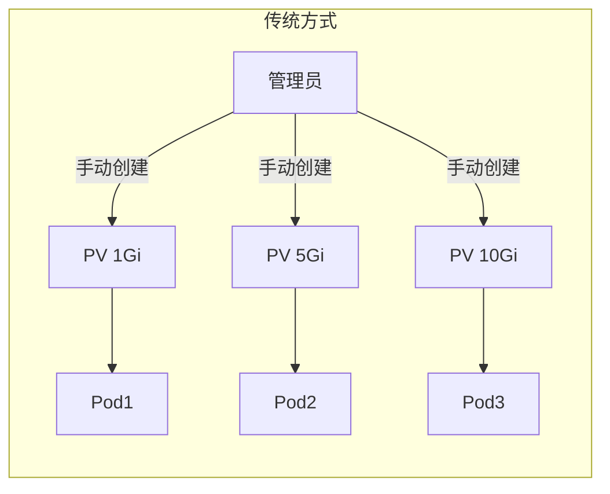
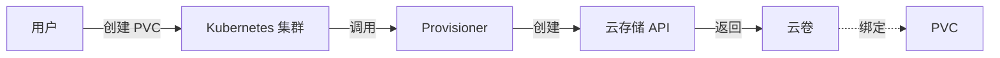
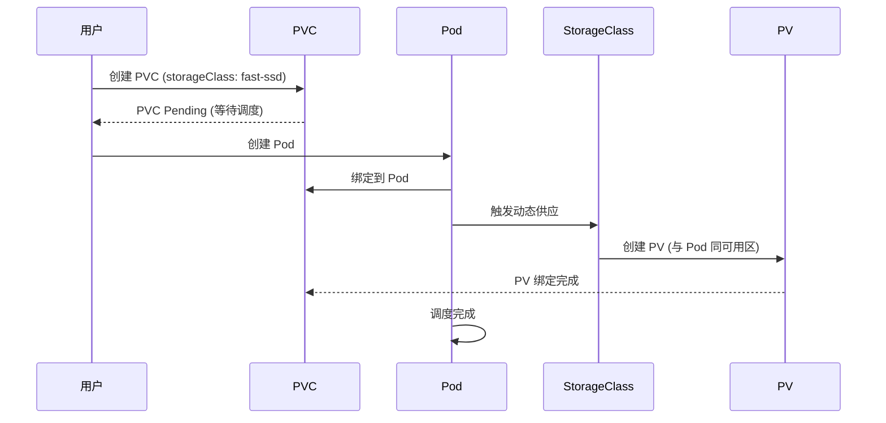

# StorageClass 动态存储

想象一个场景：你需要为 100 个开发人员每人创建一个持久化存储。

手动创建 PV？不可能。
预先创建大量 PV？浪费资源。

**StorageClass 的动态卷供应机制，让这一切变得简单。**

## 为什么需要 StorageClass？

### 传统存储管理的问题

在没有 StorageClass 的时代，存储管理需要：

1. **管理员手动创建 PV**：每个存储请求都需要管理员介入
2. **预先准备大量 PV**：无法预测用户需要多少存储
3. **存储与 Pod 耦合**：Pod 必须知道具体的 PV 名称



### StorageClass 的解决方案

StorageClass 实现了**动态卷供应**：

1. 用户创建 PVC 指定 StorageClass
2. StorageClass 的 Provisioner 自动创建 PV
3. PVC 与 PV 自动绑定



## StorageClass 详解

### 基本结构

```yaml title="storageclass-basic.yaml"
apiVersion: storage.k8s.io/v1
kind: StorageClass
metadata:
  name: standard
provisioner: kubernetes.io/aws-ebs
parameters:
  type: gp3
  fsType: ext4
reclaimPolicy: Delete
allowVolumeExpansion: true
volumeBindingMode: WaitForFirstConsumer
mountOptions:
  - debug
```

### 核心字段

| 字段 | 说明 | 必需 |
| --- | --- | --- |
| `provisioner` | 卷供应商 | 是 |
| `parameters` | 供应商特定参数 | 否 |
| `reclaimPolicy` | 回收策略（Delete/Retain） | 否（默认 Delete） |
| `allowVolumeExpansion` | 是否允许扩展 | 否（默认 false） |
| `volumeBindingMode` | 绑定模式 | 否（默认 Immediate） |
| `mountOptions` | 挂载选项 | 否 |
| `allowedTopologies` | 允许的拓扑 | 否 |

## 云存储 StorageClass

### AWS EBS

```yaml title="storageclass-aws.yaml"
apiVersion: storage.k8s.io/v1
kind: StorageClass
metadata:
  name: gp3
provisioner: ebs.csi.aws.com
parameters:
  type: gp3
  # gp2: 通用 SSD
  # gp3: 通用 SSD v2，性能更稳定
  # io1: IOPS 密集型 SSD
  # io2: IOPS 密集型 SSD v2
  # st1: 吞吐量优化 HDD
  # sc1: 冷存储 HDD
  csi.storage.k8s.io/fstype: xfs
  encrypted: "true"
  kmsKeyId: alias/aws/ebs
reclaimPolicy: Delete
allowVolumeExpansion: true
volumeBindingMode: WaitForFirstConsumer
```

### GCE Persistent Disk

```yaml title="storageclass-gce.yaml"
apiVersion: storage.k8s.io/v1
kind: StorageClass
metadata:
  name: standard
provisioner: pd.csi.storage.gke.io
parameters:
  type: pd-standard
  # pd-standard: 标准盘
  # pd-ssd: SSD
  # pd-balanced: 平衡性能与成本
reclaimPolicy: Delete
allowVolumeExpansion: true
volumeBindingMode: WaitForFirstConsumer
```

### Azure Disk

```yaml title="storageclass-azure.yaml"
apiVersion: storage.k8s.io/v1
kind: StorageClass
metadata:
  name: standard
provisioner: disk.csi.azure.com
parameters:
  storageAccountType: Standard_LRS
  # Standard_LRS: 本地冗余
  # Standard_GRS: 地理冗余
  # Premium_LRS: 本地冗余 SSD
  # Premium_ZRS: 本地冗余 SSD (Zone)
reclaimPolicy: Delete
allowVolumeExpansion: true
volumeBindingMode: WaitForFirstConsumer
```

## 网络存储 StorageClass

### NFS

```yaml title="storageclass-nfs.yaml"
apiVersion: storage.k8s.io/v1
kind: StorageClass
metadata:
  name: nfs
provisioner: nfs.subvolumes.csi.x-k8s.io
parameters:
  server: nfs-server.default.svc.cluster.local
  share: /data
reclaimPolicy: Retain  # NFS 通常建议使用 Retain
allowVolumeExpansion: true
volumeBindingMode: Immediate
mountOptions:
  - hard
  - nfsvers=4.1
```

### CephFS (CSI)

```yaml title="storageclass-cephfs.yaml"
apiVersion: storage.k8s.io/v1
kind: StorageClass
metadata:
  name: cephfs
provisioner: cephfs.csi.ceph.com
parameters:
  clusterID: rook-ceph
  fsName: myfs
  pool: myfs-replicated
  # ceph 用户权限
  # csi.storage.k8s.io/provisioner-secret-name: rook-csi-cephfs-provisioner
  # csi.storage.k8s.io/provisioner-secret-namespace: rook-ceph
reclaimPolicy: Delete
allowVolumeExpansion: true
volumeBindingMode: Immediate
mountOptions:
  - debug
```

### MinIO / Longhorn (本地存储)

```yaml title="storageclass-longhorn.yaml"
apiVersion: storage.k8s.io/v1
kind: StorageClass
metadata:
  name: longhorn
provisioner: driver.longhorn.io
parameters:
  numberOfReplicas: "3"
  # 数据副本数，建议 >= 3
  staleReplicaTimeout: "2880"
  fromBackup: ""
  # 存储类型
  type: gp2
  fsType: ext4
  # 回收策略
  reclaimPolicy: Delete
allowVolumeExpansion: true
volumeBindingMode: Immediate
```

## 默认 StorageClass

### 设置默认 StorageClass

```bash
# 通过注解设置默认 StorageClass
kubectl patch storageclass gp3 -p '{"metadata":{"annotations":{"storageclass.kubernetes.io/is-default-class":"true"}}}'

# 查看默认 StorageClass
kubectl get storageclass
# NAME          PROVISIONER             RECLAIMPOLICY   VOLUMEBINDINGMODE
# gp3 *         ebs.csi.aws.com         Delete          WaitForFirstConsumer
# standard      kubernetes.io/aws-ebs   Delete          Immediate
```

### 使用默认 StorageClass

创建 PVC 时可以不指定 `storageClassName`，会使用默认的：

```yaml title="pvc-default-sc.yaml"
apiVersion: v1
kind: PersistentVolumeClaim
metadata:
  name: app-storage
spec:
  accessModes:
  - ReadWriteOnce
  resources:
    requests:
      storage: 10Gi
  # 不指定 storageClassName，使用默认的
```

:::tip
建议明确指定 `storageClassName`，而不是依赖默认 StorageClass。明确的配置更容易维护和迁移。
:::

## 回收策略

### Delete vs Retain

| 策略 | PVC 删除时 | 适用场景 |
| --- | --- | --- |
| **Delete** | 自动删除 PV 和底层存储 | 开发环境、非关键数据 |
| **Retain** | 保留 PV 和数据，手动清理 | 生产环境、重要数据 |

```yaml title="storageclass-retain.yaml"
apiVersion: storage.k8s.io/v1
kind: StorageClass
metadata:
  name: production
provisioner: ebs.csi.aws.com
parameters:
  type: gp3
reclaimPolicy: Retain  # 重要数据使用 Retain
allowVolumeExpansion: true
volumeBindingMode: WaitForFirstConsumer
```

### Retain 后的数据恢复

```bash
# PVC 删除后，PV 状态变为 Released
kubectl get pv
# NAME      CAPACITY   ACCESS MODES   RECLAIM POLICY   STATUS   CLAIM
# pv-xxx    10Gi       RWO            Retain           Released default/app-storage

# 手动恢复数据
# 1. 修改 PV 的 reclaimPolicy
kubectl patch pv pv-xxx -p '{"spec":{"persistentVolumeReclaimPolicy":"Retain"}}'

# 2. 创建新的 PVC 绑定到这个 PV
kubectl create pvc app-storage-new --claimRef=pv-xxx

# 3. 或者直接修改 PV 的 claimRef
kubectl patch pv pv-xxx -p '{"spec":{"claimRef":{"name":"app-storage-new","namespace":"default"}}}'
```

## 卷扩展

### 启用扩展

```yaml
allowVolumeExpansion: true
```

### 在线扩展

从 Kubernetes 1.24 开始，支持在线扩展（不需要重启 Pod）：

```bash
# 修改 PVC 大小
kubectl patch pvc app-storage -p '{"spec":{"resources":{"requests":{"storage":"50Gi"}}}}'

# 查看扩展进度
kubectl describe pvc app-storage
# Events:
# Type    Reason              Age   From                         Message
# ----    ------              ----  ----                         -------
# Normal  FileSystemResizePending  1m   volume_expand               waiting for external resizer to expand
```

### CSI 卷扩展限制

某些 CSI 驱动可能不支持在线扩展或某些文件系统：

| 存储类型 | 在线扩展 | 需要 Pod 重启 |
| --- | --- | --- |
| AWS EBS (gp3) | 是 | 否 |
| GCE PD | 是 | 否 |
| Azure Disk | 是 | 否 |
| NFS | 是 | 否 |
| CephFS | 是 | 否 |

## 拓扑感知调度

### WaitForFirstConsumer

`WaitForFirstConsumer` 模式会延迟 PV 的绑定，直到 Pod 被调度：

```yaml
volumeBindingMode: WaitForFirstConsumer
```



:::tip
`WaitForFirstConsumer` 避免了跨可用区存储带来的延迟和成本。建议生产环境使用此模式。
:::

### 拓扑限制

某些存储只能在特定拓扑中使用：

```yaml title="storageclass-topology.yaml"
apiVersion: storage.k8s.io/v1
kind: StorageClass
metadata:
  name: fast-ssd
provisioner: pd.csi.storage.gke.io
parameters:
  type: pd-ssd
allowedTopologies:
# 只允许在以下可用区创建卷
- matchLabelExpressions:
  - key: topology.kubernetes.io/zone
    values:
    - us-east-1a
    - us-east-1b
```

## 存储配额

### 资源配额

```yaml title="storage-quota.yaml"
apiVersion: v1
kind: ResourceQuota
metadata:
  name: storage-quota
spec:
  hard:
    persistentvolumeclaims: "10"
    requests.storage: "100Gi"
    # 按 StorageClass 的配额
    gold.storageclass.storage.k8s.io/requests.storage: "50Gi"
    silver.storageclass.storage.k8s.io/requests.storage: "100Gi"
```

## 常见问题

### StorageClass 创建失败

检查 Provisioner 是否正确安装：

```bash
# 查看 StorageClass
kubectl get storageclass

# 查看 CSI Driver
kubectl get csidrivers
kubectl get csinodes

# 查看 StorageClass 事件
kubectl describe storageclass <name>
```

### PVC 无法绑定

常见原因：

1. **没有匹配的 StorageClass**
2. **拓扑限制不满足**（节点不在允许的可用区）
3. **存储配额不足**
4. **PVC 请求的容量超过 PV 可用容量**

```bash
# 查看 PVC 详情
kubectl describe pvc <name>

# 查看 StorageClass 参数
kubectl get storageclass <name> -o yaml
```

### 卷扩展失败

```bash
# 查看 PVC 扩展状态
kubectl describe pvc <name>

# 查看 CSI Controller 日志
kubectl logs -n kube-system -l app=csi-provisioner -c csi-provisioner
```

## 最佳实践

### 生产环境建议

1. **使用 `WaitForFirstConsumer`**：避免跨可用区访问
2. **启用卷扩展**：方便后期扩容
3. **使用 `Retain` 策略**：重要数据不要自动删除
4. **明确指定 StorageClass**：不要依赖默认
5. **配置合适的副本数**：根据数据重要性选择

### 多环境配置

```yaml title="storageclass-prod.yaml"
apiVersion: storage.k8s.io/v1
kind: StorageClass
metadata:
  name: prod-ssd
provisioner: ebs.csi.aws.com
parameters:
  type: gp3
  encrypted: "true"
reclaimPolicy: Retain
allowVolumeExpansion: true
volumeBindingMode: WaitForFirstConsumer
mountOptions:
  - noatime
  - nodiratime
```

## 延伸思考

StorageClass 将存储管理从手动操作变成了自动化流程：

1. **按需供应**：用户无需等待管理员创建存储
2. **资源优化**：只创建实际需要的存储
3. **环境一致性**：不同环境可以使用相同的配置

但 StorageClass 也带来了一些挑战：

1. **存储选型复杂**：需要根据业务需求选择合适的存储类型
2. **成本管理**：动态供应可能导致存储快速增长
3. **数据安全**：删除 PVC 时数据是否真的被删除？

建议生产环境建立存储监控和成本控制机制，避免存储资源的无序增长。

## 延伸阅读

- [Volume 与 PVC/PV](./volume)：存储基础概念
- [StatefulSet 有状态应用](./statefulset)：有状态应用的存储管理
- [CSI 插件对比](./cni)：不同 CSI 驱动的特点
