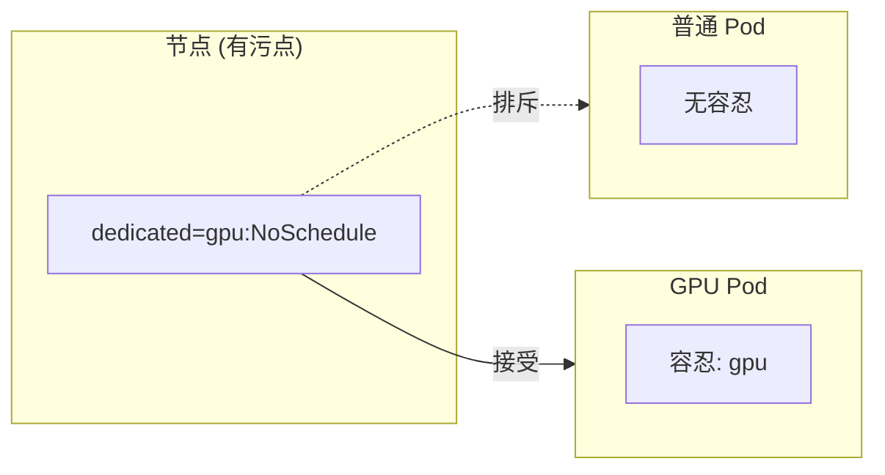

# 污点与容忍

想象一个场景：你有一些 GPU 计算节点，只想运行机器学习任务。但普通的 Pod 也可能被调度到这些节点上。

**污点（Taint）和容忍（Toleration）机制，让你能够「排斥」某些 Pod 到特定节点。**

## 污点与容忍概述

污点应用于节点，表示这些节点「排斥」某些 Pod。

容忍应用于 Pod，表示 Pod 能够「容忍」节点的污点。



## 污点（Taint）

### 添加污点

```bash
# 语法：kubectl taint nodes <node> <key>=<value>:<effect>
kubectl taint nodes node1 dedicated=postgres:NoSchedule

# 多个值
kubectl taint nodes node1 dedicated=postgres:NoExecute

# 简化写法
kubectl taint nodes node1 gpu=true:NoSchedule
kubectl taint nodes node1 node-type=compute:NoSchedule
```

### 污点效果（Effect）

| 效果 | 说明 |
| --- | --- |
| **NoSchedule** | 不调度新 Pod，但不影响已运行的 Pod |
| **NoExecute** | 不调度新 Pod，并驱逐已运行的 Pod（可选配置） |
| **PreferNoSchedule** | 尽量不调度，但不强制 |

### 移除污点

```bash
# 移除污点
kubectl taint nodes node1 dedicated-

# 查看节点污点
kubectl describe node node1 | grep Taints
```

### 常见使用场景

| 场景 | 污点配置 |
| --- | --- |
| 专用数据库节点 | `dedicated=database:NoSchedule` |
| GPU 计算节点 | `gpu=true:NoSchedule` |
| 临时节点 | `node-type=ephemeral:NoSchedule` |
| 维护中的节点 | `node.kubernetes.io/unschedulable:NoSchedule` |

## 容忍（Toleration）

### 基本语法

```yaml
spec:
  tolerations:
  - key: dedicated
    operator: Equal
    value: postgres
    effect: NoSchedule
```

| 字段 | 说明 |
| --- | --- |
| `key` | 污点键 |
| `operator` | 操作符：`Equal` 或 `Exists` |
| `value` | 污点值（当 operator 为 `Equal` 时） |
| `effect` | 污点效果 |
| `tolerationSeconds` | 容忍时间（仅用于 NoExecute） |

### 操作符

```yaml
# Equal：值必须相等
tolerations:
- key: dedicated
  operator: Equal
  value: postgres
  effect: NoSchedule

# Exists：只检查键存在
tolerations:
- key: dedicated
  operator: Exists
  effect: NoSchedule

# Exists（不检查值）
tolerations:
- key: dedicated
  operator: Exists
```

### 匹配所有污点

```yaml
# 容忍所有污点
tolerations:
- operator: Exists  # 不指定 key 表示匹配所有

# 容忍所有 NoSchedule 污点
tolerations:
- key: ""
  operator: Exists
  effect: NoSchedule
```

### NoExecute 容忍时间

```yaml
tolerations:
- key: dedicated
  operator: Equal
  value: postgres
  effect: NoExecute
  tolerationSeconds: 300  # 300 秒后被驱逐
```

## 实际应用

### 场景一：数据库专用节点

```bash
# 标记节点为数据库专用
kubectl label nodes node1 node-type=database
kubectl taint nodes node1 dedicated=database:NoSchedule
```

```yaml title="database-pod.yaml"
spec:
  tolerations:
  - key: dedicated
    operator: Equal
    value: database
    effect: NoSchedule
  nodeSelector:
    node-type: database
```

### 场景二：GPU 计算节点

```bash
# 标记 GPU 节点
kubectl taint nodes gpu-node1 nvidia.com/gpu:NoSchedule
```

```yaml title="gpu-training-pod.yaml"
spec:
  tolerations:
  - key: nvidia.com/gpu
    operator: Exists
    effect: NoSchedule
  containers:
  - name: training
    image: tensorflow/tensorflow:2.12-gpu
    resources:
      limits:
        nvidia.com/gpu: 1
```

### 场景三：临时扩展节点

```bash
# 标记临时节点
kubectl taint nodes spot-node temporary=spot:NoExecute
kubectl taint nodes spot-node temporary=spot:NoSchedule
```

```yaml title="tolerations-pod.yaml"
spec:
  tolerations:
  - key: temporary
    operator: Equal
    value: spot
    effect: NoSchedule
    tolerationSeconds: 3600  # Spot 中断后容忍 1 小时
```

## 内置污点

Kubernetes 提供了一些内置污点：

| 污点 | 说明 |
| --- | --- |
| `node.kubernetes.io/not-ready` | 节点未就绪 |
| `node.kubernetes.io/unreachable` | 节点不可达 |
| `node.kubernetes.io/memory-pressure` | 节点内存压力 |
| `node.kubernetes.io/disk-pressure` | 节点磁盘压力 |
| `node.kubernetes.io/pid-pressure` | 节点 PID 压力 |
| `node.kubernetes.io/network-unavailable` | 节点网络不可用 |
| `node.kubernetes.io/unschedulable` | 节点不可调度 |
| `node.cloudprovider.kubernetes.io/uninitialized` | 云节点初始化 |

### DaemonSet 自动容忍

DaemonSet 的 Pod 自动容忍所有污点：

```yaml
# DaemonSet Pod 的容忍（自动添加）
tolerations:
- key: node.kubernetes.io/not-ready
  operator: Exists
  effect: NoExecute
  tolerationSeconds: 300
- key: node.kubernetes.io/unreachable
  operator: Exists
  effect: NoExecute
  tolerationSeconds: 300
```

## Master 节点隔离

### 默认污点

Master 节点默认有污点，防止用户 Pod 调度到 Master：

```bash
kubectl describe node master-node | grep Taints
# Taints:             node-role.kubernetes.io/control-plane:NoSchedule
```

### 自定义 Master 污点

```bash
# 添加污点
kubectl taint nodes master node-role.kubernetes.io/control-plane:NoSchedule

# 移除污点（允许用户 Pod 调度到 Master）
kubectl taint nodes master node-role.kubernetes.io/control-plane:NoSchedule-
```

## 常见问题

### Pod 仍然调度到污点节点

```bash
# 检查污点是否正确应用
kubectl describe node <node-name> | grep Taints

# 检查容忍是否正确配置
kubectl describe pod <pod-name> | grep Tolerations
```

### 污点与亲和性冲突

```yaml
# 节点污点
kubectl taint nodes node1 dedicated=gpu:NoSchedule

# Pod 亲和性（想要调度到特定节点）
spec:
  affinity:
    nodeAffinity:
      requiredDuringSchedulingIgnoredDuringExecution:
        nodeSelectorTerms:
        - matchExpressions:
          - key: dedicated
            operator: Exists

# Pod 容忍
spec:
  tolerations:
  - key: dedicated
    operator: Equal
    value: gpu
    effect: NoSchedule
```

### NoExecute 驱逐问题

```bash
# 检查驱逐配置
kubectl describe node <node-name>

# NoExecute 容忍配置
spec:
  tolerations:
  - key: dedicated
    operator: Exists
    effect: NoExecute
    tolerationSeconds: 600  # 600 秒后被驱逐
```

## 最佳实践

### 1. 使用有意义的键名

```bash
# 推荐
kubectl taint nodes node1 dedicated=database:NoSchedule
kubectl taint nodes node1 env=production:NoSchedule

# 不推荐
kubectl taint nodes node1 t1=v1:NoSchedule
kubectl taint nodes node1 key=value:NoSchedule
```

### 2. 配合节点标签使用

```bash
# 污点 + 标签，双重保障
kubectl label nodes node1 dedicated=database
kubectl taint nodes node1 dedicated=database:NoSchedule
```

### 3. 合理设置 NoExecute 容忍时间

```yaml
# 对于不能中断的任务
tolerations:
- key: dedicated
  operator: Exists
  effect: NoExecute
  tolerationSeconds: 0  # 立即驱逐

# 对于可以容忍的任务
tolerations:
- key: dedicated
  operator: Exists
  effect: NoExecute
  tolerationSeconds: 3600  # 容忍 1 小时
```

### 4. 记录污点用途

```bash
# 使用注解记录原因
kubectl annotate node node1 \
  taint.kubernetes.io/dedicated="Database server - 2024-01-15"
```

## 污点 vs 亲和性

| 特性 | 污点/容忍 | 亲和性/反亲和性 |
| --- | --- | --- |
| **方向** | 从节点角度 | 从 Pod 角度 |
| **作用** | 排斥特定 Pod | 吸引/排斥 Pod |
| **适用场景** | 专用节点 | 相关 Pod 共置 |
| **灵活性** | 较简单 | 较复杂 |

## 延伸思考

污点和容忍是 Kubernetes 资源隔离的重要机制：

1. **节点专用化**：让特定节点运行特定工作负载
2. **故障隔离**：防止不稳定 Pod 影响核心组件
3. **成本优化**：利用 Spot/Preemptible 节点

但也要避免滥用：

1. **过多的污点**：可能导致调度困难
2. **复杂的容忍**：增加运维复杂度
3. **忽视 NoExecute**：可能导致意外驱逐

## 延伸阅读

- [调度策略与亲和性](./affinity)：亲和性机制
- [Kubernetes 调度器原理](./scheduler)：调度器内部
- [Node 组件](./node-components)：节点管理
