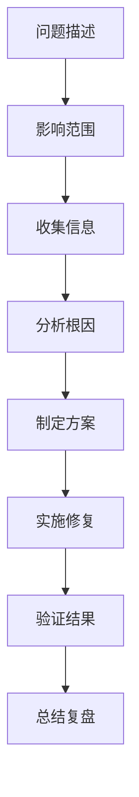
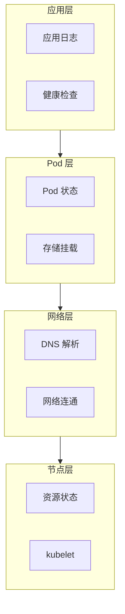

# Kubernetes 故障排查

凌晨 3 点，你被告警叫醒：「生产环境 Pod 无法启动」。你登录 kubectl，开始排查。

**系统化的故障排查方法，能让你快速定位问题。**

## 故障排查方法论

### 通用流程



### 自底向上排查



## Pod 故障排查

### Pod 状态解读

```bash
# 获取 Pod 状态
kubectl get pods -n production

# 查看 Pod 详情
kubectl describe pod <pod-name> -n production

# 查看最近事件
kubectl get events -n production --sort-by='.lastTimestamp'
```

### 常见 Pod 状态

| 状态 | 说明 | 排查方向 |
| --- | --- | --- |
| **Pending** | Pod 未调度 | 资源不足、调度限制 |
| **ContainerCreating** | 容器创建中 | 镜像拉取、配置错误 |
| **Running** | 运行中 | 健康检查、应用日志 |
| **CrashLoopBackOff** | 容器反复崩溃 | 应用错误、资源不足 |
| **ImagePullBackOff** | 镜像拉取失败 | 仓库配置、凭证 |
| **ErrImagePull** | 镜像拉取错误 | 镜像名称、网络 |
| **Terminating** | 终止中 | Finalizer、优雅终止 |
| **Unknown** | 节点失联 | 节点网络、kubelet |

### Pod 一直 Pending

```bash
# 查看详细原因
kubectl describe pod <pod-name>

# 输出示例
# Events:
#   Type     Reason            Age   From               Message
#   ----     ------            ----  ----               -------
#   Warning  FailedScheduling  2m    default-scheduler  0/3 nodes are available: 1 Insufficient memory, 2 node(s) had taints.
```

排查步骤：

1. 检查节点资源
```bash
kubectl describe nodes | grep -A 5 "Allocated resources"
kubectl top nodes
```

2. 检查污点
```bash
kubectl get nodes -o jsonpath='{range .items[*]}{.metadata.name}{"\t"}{.spec.taints}[{"end":"\n"}]'
```

3. 检查亲和性
```bash
kubectl describe pod <pod-name> | grep -A 10 "Affinity"
```

### CrashLoopBackOff

```bash
# 查看容器日志
kubectl logs <pod-name> --previous

# 查看应用日志
kubectl exec -it <pod-name> -- cat /var/log/app.log

# 检查资源限制
kubectl describe pod <pod-name> | grep -A 5 "Limits"
```

常见原因：

1. **应用配置错误**：环境变量、配置文件错误
2. **资源不足**：OOM Kill
3. **依赖不可用**：数据库连接失败

### ImagePullBackOff

```bash
# 检查镜像名称
kubectl describe pod <pod-name> | grep -A 5 "Containers"

# 检查镜像是否存在
crictl images | grep <image-name>

# 检查 Secret（私有仓库凭证）
kubectl get secret -n production
kubectl describe secret <secret-name>
```

### Pod 无法终止

```bash
# 检查 Finalizer
kubectl get pod <pod-name> -o jsonpath='{.metadata.finalizers}'

# 检查 Terminating 原因
kubectl describe pod <pod-name>
```

## Service 故障排查

### Service 无法访问

```bash
# 检查 Service 存在
kubectl get svc -n production

# 检查 Endpoint
kubectl get endpoints <service-name>

# 检查 Selector 匹配
kubectl describe svc <service-name>
```

### Endpoint 为空

```bash
# 检查 Pod 是否存在
kubectl get pods -l app=<selector>

# 检查 Pod 是否 Ready
kubectl get pods -l app=<selector> -o wide

# 检查 Pod IP
kubectl get pods -l app=<selector> -o jsonpath='{range .items[*]}{.status.podIP}{"\n"}{end}'
```

### DNS 解析失败

```bash
# 测试 DNS
kubectl run -it --rm debug --image=busybox --restart=Never -- nslookup <service-name>

# 进入 Pod 测试
kubectl exec -it <pod-name> -- sh
nslookup kubernetes.default
nslookup <service-name>
```

## 节点故障排查

### 节点 NotReady

```bash
# 查看节点状态
kubectl get nodes

# 查看 kubelet 状态
systemctl status kubelet

# 查看 kubelet 日志
journalctl -u kubelet -n 100

# 检查证书
openssl x509 -in /var/lib/kubelet/pki/kubelet.crt -noout -dates
```

### 节点资源不足

```bash
# 查看资源使用
kubectl top nodes

# 查看资源请求
kubectl describe node <node-name> | grep -A 10 "Allocated resources"

# 查看 Kubelet 配置
cat /var/lib/kubelet/config.yaml
```

## 网络故障排查

### Pod 间通信失败

```bash
# 进入调试 Pod
kubectl run -it --rm debug --image=busybox -- sh

# 测试连通性
wget -qO- http://<service-name>
ping <pod-ip>

# 检查 CNI 插件
kubectl get pods -n kube-system -l k8s-app=calico-node
kubectl logs -n kube-system -l k8s-app=calico-node --tail=100
```

### 网络策略导致

```bash
# 检查 NetworkPolicy
kubectl get networkpolicy -n production

# 检查命名空间默认策略
kubectl describe networkpolicy -n production
```

## 控制平面故障排查

### API Server 不可用

```bash
# 检查 API Server Pod
kubectl get pods -n kube-system -l component=kube-apiserver

# 检查 etcd
kubectl exec -it -n kube-system etcd-<node-name> -- etcdctl endpoint health

# 检查证书
openssl x509 -in /etc/kubernetes/pki/apiserver.crt -noout -dates
```

### 调度器异常

```bash
# 检查调度器
kubectl get pods -n kube-system -l component=kube-scheduler

# 查看调度器日志
kubectl logs -n kube-system -l component=kube-scheduler
```

## 存储故障排查

### PVC 一直 Pending

```bash
# 查看 PVC 状态
kubectl get pvc -n production

# 查看 StorageClass
kubectl get storageclass

# 检查 Provisioner
kubectl get pods -n kube-system | grep provisioner
```

### Volume 挂载失败

```bash
# 检查 PV
kubectl get pv

# 查看挂载详情
kubectl describe pvc <pvc-name>

# 检查节点挂载
kubectl exec -it <pod-name> -- mount | grep <volume-name>
```

## 常用排查命令

```bash
# 1. 获取资源状态
kubectl get all -n production
kubectl get events -n production --sort-by='.lastTimestamp'

# 2. 查看资源详情
kubectl describe <resource> <name> -n <namespace>

# 3. 查看日志
kubectl logs <pod-name> -n <namespace> --tail=100 -f
kubectl logs <pod-name> -n <namespace> --previous

# 4. 进入容器
kubectl exec -it <pod-name> -n <namespace> -- /bin/sh

# 5. 转发端口调试
kubectl port-forward <pod-name> 8080:80 -n <namespace>

# 6. 复制文件
kubectl cp <namespace>/<pod-name>:/path/to/file ./local-file

# 7. 检查指标
kubectl top pod -n <namespace>
kubectl top node
```

## 常见问题速查

| 问题 | 排查命令 |
| --- | --- |
| Pod 无法启动 | `kubectl describe pod` |
| 容器反复重启 | `kubectl logs --previous` |
| Service 无法访问 | `kubectl get endpoints` |
| Pod 无法调度 | `kubectl describe pod` + 事件 |
| 节点 NotReady | `journalctl -u kubelet` |
| PVC 无法绑定 | `kubectl describe pvc` |
| 网络不通 | `kubectl exec` + `ping/telnet` |
| DNS 解析失败 | `nslookup` + `/etc/resolv.conf` |

## 故障复盘模板

```markdown
# 故障复盘报告

## 基本信息
- 时间：
- 影响范围：
- 持续时间：
- 严重程度：

## 问题描述
（发生了什么？）

## 时间线
- HH:MM 发现问题
- HH:MM 定位原因
- HH:MM 实施修复
- HH:MM 恢复服务

## 根因分析
（为什么会发生？）

## 改进措施
1.
2.
3.

## 后续跟踪
- [ ] 措施 1
- [ ] 措施 2
```

## 延伸思考

故障排查是运维的核心能力：

1. **系统化**：遵循固定流程，避免遗漏
2. **信息收集**：证据先行，猜测在后
3. **分层排查**：从底向上或从上到下
4. **复盘改进**：每次故障都是学习机会

## 延伸阅读

- [Kubernetes 监控](./monitoring)：指标监控
- [Kubernetes 日志收集](./logging)：日志分析
- [HPA（水平自动伸缩）](./hpa)：自动恢复能力
