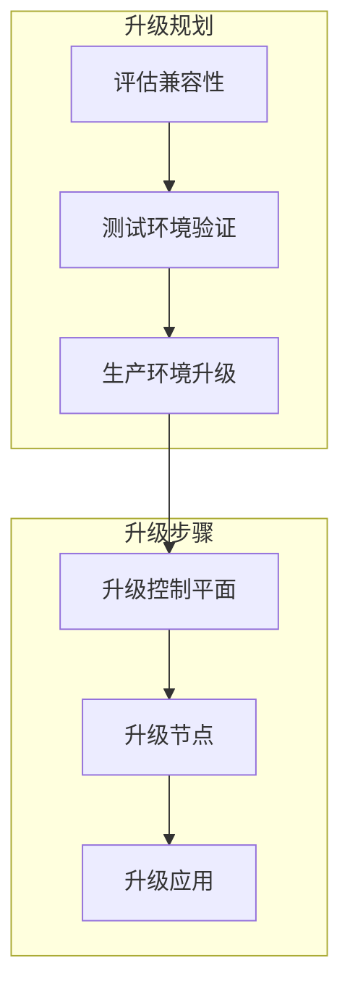
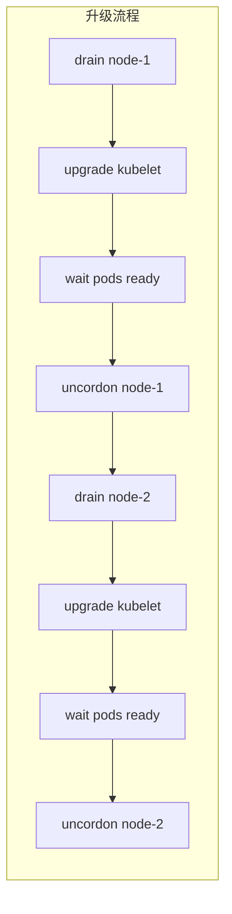

# K8s 升级与版本管理

Kubernetes 每季度发布一个新版本，一年有三个次版本。你的集群该怎么升级？

**Kubernetes 升级需要精心规划，确保业务不中断。**

## 版本概述

### Kubernetes 版本规则

```bash
# 版本格式: major.minor.patch
v1.25.3

# Kubernetes 支持窗口
# 当前版本 N, N-1, N-2, N-3
```

| 版本 | 支持状态 |
| --- | --- |
| 1.28 | 当前稳定 |
| 1.27 | 维护中 |
| 1.26 | 维护中 |
| 1.25 | 仅安全更新 |

### 升级策略



## 升级前准备

### 1. 兼容性检查

```bash
# 检查当前版本
kubectl version --short
kubectl version

# 检查 API 版本废弃
kubectl deprecated --api-removed-release=1.26
```

### 2. 备份

```bash
# 备份 etcd
ETCDCTL_API=3 etcdctl snapshot save backup.db \
  --endpoints=https://127.0.0.1:2379 \
  --cacert=/etc/kubernetes/pki/etcd/ca.crt \
  --cert=/etc/kubernetes/pki/etcd/server.crt \
  --key=/etc/kubernetes/pki/etcd/server.key

# 备份 Kubernetes 配置
kubectl get all -A -o yaml > resources-backup.yaml
```

### 3. 检查资源

```bash
# 检查命名空间
kubectl get namespaces

# 检查节点
kubectl get nodes -o wide

# 检查持久卷
kubectl get pv
kubectl get pvc -A
```

## kubeadm 升级

### 升级控制平面

```bash
# 步骤 1: 升级 kubeadm
apt-get update && apt-get install -y kubeadm=1.28.x-*

# 步骤 2: 验证升级计划
kubeadm upgrade plan v1.28.x

# 步骤 3: 升级控制平面
sudo kubeadm upgrade apply v1.28.x

# 步骤 4: 升级 kubelet
apt-get install -y kubelet=1.28.x-* kubectl=1.28.x-*
sudo systemctl daemon-reload
sudo systemctl restart kubelet
```

### 升级工作节点

```bash
# 在控制平面节点执行：标记节点不可调度
kubectl drain <node-name> --ignore-daemonsets --delete-emptydir-data

# 在工作节点执行：升级 kubelet
apt-get update && apt-get install -y kubeadm=1.28.x-* kubelet=1.28.x-*
sudo systemctl daemon-reload
sudo systemctl restart kubelet

# 在控制平面节点执行：恢复节点调度
kubectl uncordon <node-name>
```

## 滚动升级

### 节点升级策略



### 注意事项

1. **保持高可用**：确保至少有一个节点可用
2. **资源预留**：预留足够资源给新 Pod
3. **滚动升级**：一次升级一个节点

## kubeadm 配置文件升级

### 升级配置版本

```yaml title="kubeadm-config.yaml"
apiVersion: kubeadm.k8s.io/v1beta3
kind: ClusterConfiguration
kubernetesVersion: v1.28.0
networking:
  podSubnet: 10.244.0.0/16
---
apiVersion: kubelet.config.k8s.io/v1beta1
kind: KubeletConfiguration
```

## 常见问题

### 升级失败回滚

```bash
# etcd 快照恢复
ETCDCTL_API=3 etcdctl snapshot restore backup.db \
  --data-dir=/var/lib/etcd
```

### API 版本废弃

```bash
# 检查废弃的 API
kubectl api-resources | grep -i deprecated

# 升级应用配置
# 例如: rbac.authorization.k8s.io/v1beta1 -> rbac.authorization.k8s.io/v1
```

### 证书过期

```bash
# 检查证书过期时间
kubeadm certs check-expiration

# 更新证书
kubeadm certs renew all
```

## 版本兼容性矩阵

| 组件 | 支持范围 |
| --- | --- |
| kube-apiserver | N, N-1, N-2, N-3 |
| kubelet | N-1, N-2, N-3 |
| kube-controller-manager | N-1, N-2 |
| kube-scheduler | N-1, N-2 |
| kubectl | N, N-1 |

## 最佳实践

### 1. 小版本渐进升级

```bash
# 1.26 -> 1.27 -> 1.28
# 不要跨版本升级
```

### 2. 测试环境验证

```bash
# 生产升级前，在测试环境验证
kind create cluster --name test --image kindest/node:v1.28.0
```

### 3. 监控升级过程

```bash
# 监控组件状态
watch kubectl get nodes
watch kubectl get pods -n kube-system
```

### 4. 文档记录

```markdown
# Kubernetes 升级记录

## 升级版本
- 从: v1.26.x
- 到: v1.28.x

## 升级时间
- 开始: 2024-01-15 10:00
- 完成: 2024-01-15 12:30

## 步骤
1. 备份 etcd
2. 升级控制平面
3. 升级工作节点

## 问题与解决
- 问题: xxx
- 解决: xxx

## 验证结果
- API Server: OK
- Nodes: OK
- Pods: OK
```

## 自动升级

### Kubernetes 自动升级（EKS/GKE）

```bash
# EKS
aws eks update-cluster-version \
  --name my-cluster \
  --kubernetes-version 1.28

# GKE
gcloud container clusters upgrade my-cluster \
  --master \
  --cluster-version 1.28
```

### Cluster API

```yaml title="upgrade-plan.yaml"
apiVersion: cluster.x-k8s.io/v1beta1
kind: Cluster
metadata:
  name: my-cluster
spec:
  version: v1.28.0
```

## 延伸思考

Kubernetes 升级是运维的重要工作：

1. **规划先行**：充分准备，避免意外
2. **小步快跑**：逐版本升级，降低风险
3. **自动化**：使用工具减少人工错误
4. **验证**：每个步骤后验证

升级不是终点，而是持续改进的一部分。

## 延伸阅读

- [Kubernetes 概述与架构](./overview)：Kubernetes 基础
- [控制平面组件](./control-plane)：控制平面详解
- [故障排查](./troubleshooting)：升级问题排查
