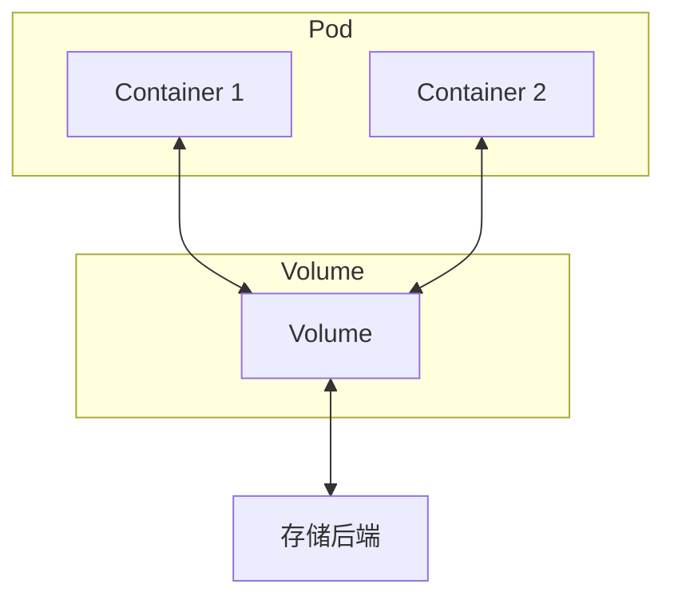
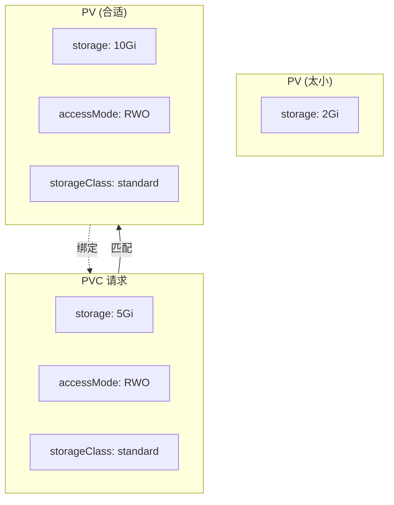
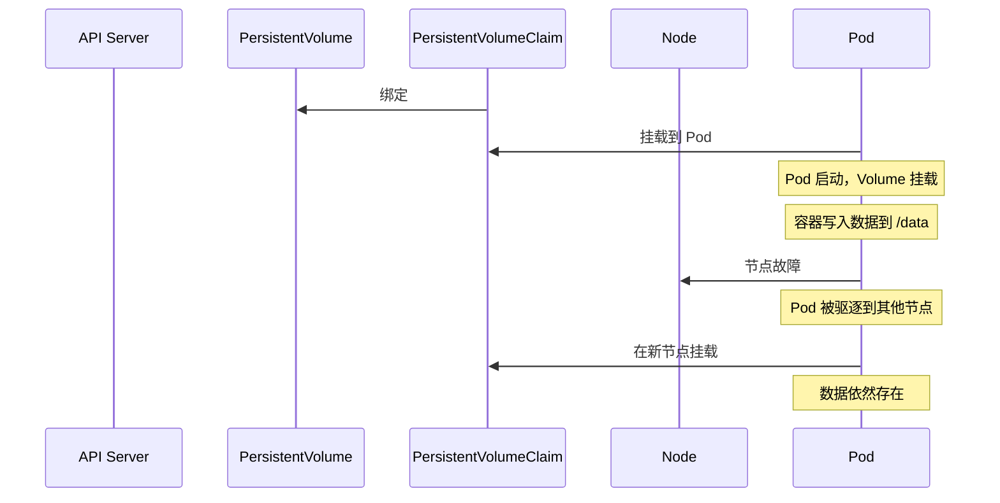
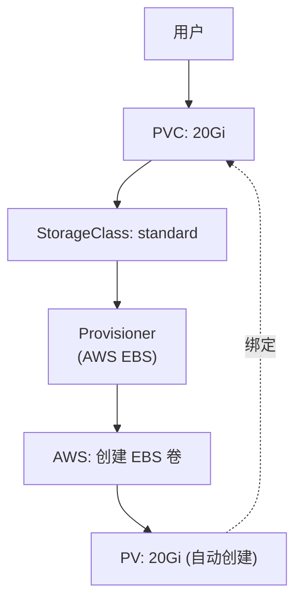
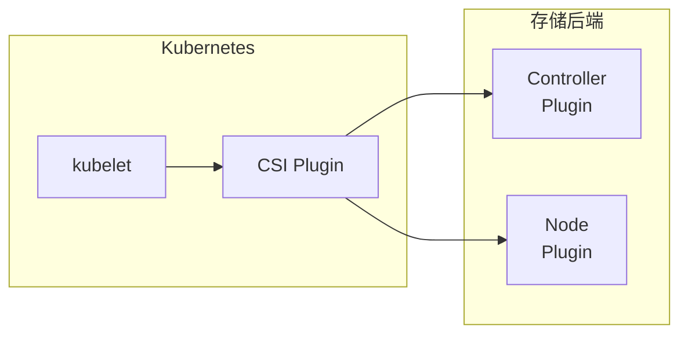

# Volume 与 PVC/PV

容器默认是无状态的。当容器重启或被删除时，容器内的文件会丢失。对于需要持久化数据的应用，这是个问题。

**Kubernetes 的 Volume 机制解决了这个问题。**

## Volume 概述

Volume 是 Pod 与外部存储的桥梁。Pod 中的容器可以挂载 Volume，像访问本地目录一样访问存储。



### Volume 的生命周期

Kubernetes 支持两种生命周期的 Volume：

| 类型 | 生命周期 | 说明 |
| --- | --- | --- |
| **临时存储** | 与 Pod 相同 | Pod 删除时 Volume 也删除 |
| **持久存储** | 独立于 Pod | Pod 删除后数据仍然保留 |

## 临时存储 Volume

### emptyDir

`emptyDir` 是最简单的 Volume 类型，从字面理解就是「空目录」。它主要用于：

- 临时空间（如排序、合并文件）
- 多容器共享数据
- 崩溃恢复时的数据暂存

```yaml title="emptydir-pod.yaml"
apiVersion: v1
kind: Pod
metadata:
  name: app-with-emptydir
spec:
  containers:
  - name: app
    image: app:1.0
    volumeMounts:
    - name: cache
      mountPath: /tmp/cache

  - name: logger
    image: logger:1.0
    volumeMounts:
    - name: cache
      mountPath: /var/log

  volumes:
  - name: cache
    emptyDir:
      medium: Memory    # 存储在内存中（tmpfs）
      sizeLimit: 100Mi # 大小限制
```

:::tip
`emptyDir.medium: Memory` 会将 Volume 存储在内存中，性能好但会占用容器内存配额。适用于需要高性能临时存储的场景。
:::

### 其他临时存储

| 类型 | 存储位置 | 用途 |
| --- | --- | --- |
| **emptyDir** | 节点磁盘或内存 | 临时共享存储 |
| **configMap** | 内存 | 配置文件 |
| **secret** | 内存 | 敏感数据 |
| **downwardAPI** | 内存 | Pod 元数据 |
| **serviceAccountToken** | 内存 | ServiceAccount 凭证 |

## PersistentVolume (PV)

### 什么是 PV？

PersistentVolume（持久卷，简称 PV）是集群级别的存储资源，由管理员或 StorageClass 自动创建。

PV 的特点：

1. **独立于 Pod**：Pod 删除后数据仍然存在
2. **集群级别**：可以被任何命名空间的 Pod 使用
3. **多种后端**：支持 NFS、云存储、本地存储等多种类型

```yaml title="persistentvolume.yaml"
apiVersion: v1
kind: PersistentVolume
metadata:
  name: pv-nfs-1
spec:
  capacity:
    storage: 10Gi
  accessModes:
  - ReadWriteMany    # 多个节点可读写
  persistentVolumeReclaimPolicy: Retain  # 删除后的处理策略
  mountOptions:
  - hard
  - nfsvers=4.1
  nfs:
    path: /data/nfs
    server: nfs-server.default.svc.cluster.local
```

### 访问模式

| 模式 | 说明 |
| --- | --- |
| **ReadWriteOnce (RWO)** | 单节点读写（最常用） |
| **ReadOnlyMany (ROX)** | 多节点只读 |
| **ReadWriteMany (RWX)** | 多节点读写 |
| **ReadWriteOncePod (RWOP)** | 单 Pod 独占读写（K8s 1.22+） |

:::warning
不是所有存储后端都支持所有访问模式。例如 AWS EBS 只支持 RWO，GCE PD 支持 RWO 和 ROX，NFS 支持所有模式。选择存储类型时需要考虑访问模式。
:::

### 回收策略

| 策略 | 说明 | 适用场景 |
| --- | --- | --- |
| **Retain** | 保留数据，手动清理 | 重要数据，需要保留 |
| **Delete** | 删除存储资源 | 云存储（自动清理） |
| **Recycle** | 删除数据但保留 PV（已废弃） | 不推荐使用 |

## PersistentVolumeClaim (PVC)

### 什么是 PVC？

PersistentVolumeClaim（持久卷声明，简称 PVC）是用户对存储的请求。PVC 声明需要的存储大小和访问模式，Kubernetes 会找到匹配的 PV 并绑定。

```yaml title="pvc.yaml"
apiVersion: v1
kind: PersistentVolumeClaim
metadata:
  name: app-storage
spec:
  accessModes:
  - ReadWriteOnce
  resources:
    requests:
      storage: 5Gi
  # 可选：指定 StorageClass
  storageClassName: standard
  # 可选：指定 PV
  volumeName: pv-nfs-1
```

```bash
# 创建 PVC
kubectl apply -f pvc.yaml

# 查看 PVC
kubectl get pvc
# NAME         STATUS   VOLUME    CAPACITY   ACCESS MODES   STORAGECLASS
# app-storage  Bound    pv-nfs-1  10Gi       RWO           standard

# 查看 PV
kubectl get pv
# NAME      CAPACITY   ACCESS MODES   RECLAIM POLICY   STATUS   CLAIM
# pv-nfs-1  10Gi       RWO            Retain           Bound    default/app-storage
```

### 在 Pod 中使用 PVC

```yaml title="pod-with-pvc.yaml"
apiVersion: v1
kind: Pod
metadata:
  name: app
spec:
  containers:
  - name: app
    image: app:1.0
    volumeMounts:
    - name: app-data
      mountPath: /data
  volumes:
  - name: app-data
    persistentVolumeClaim:
      claimName: app-storage
```

### 绑定机制



## Volume 与 Pod 的生命周期

### 挂载时机



### 迁移行为

| Volume 类型 | Pod 迁移时行为 |
| --- | --- |
| **本地存储（如 hostPath）** | 数据丢失（除非使用 Local PV） |
| **块存储（如 AWS EBS）** | 自动 detach/attach |
| **网络存储（如 NFS）** | 直接在新节点挂载 |
| **共享存储（如 CephFS）** | 直接在新节点挂载 |

:::info
Pod 被驱逐到新节点时，Kubernetes 会先 Unmount Volume，然后在新节点 Mount。对于某些不支持多节点同时挂载的存储（如 AWS EBS），控制器会自动处理 detach 和 attach 操作。
:::

## StorageClass

### 什么是 StorageClass？

StorageClass 是存储的「类」，定义了存储的类型、配置和供应商。管理员创建 StorageClass，用户通过 PVC 指定 StorageClass 来请求存储。

```yaml title="storageclass.yaml"
apiVersion: storage.k8s.io/v1
kind: StorageClass
metadata:
  name: standard
provisioner: kubernetes.io/aws-ebs
parameters:
  type: gp3
  fsType: ext4
  replication-type: regional-pd
reclaimPolicy: Delete
mountOptions:
- debug
volumeBindingMode: WaitForFirstConsumer
allowVolumeExpansion: true
```

### 动态卷供应

StorageClass 最大的价值是**动态卷供应**。当用户创建 PVC 时，StorageClass 的 provisioner 会自动创建对应的 PV：

```yaml title="dynamic-pvc.yaml"
apiVersion: v1
kind: PersistentVolumeClaim
metadata:
  name: dynamic-storage
spec:
  accessModes:
  - ReadWriteOnce
  resources:
    requests:
      storage: 20Gi
  storageClassName: standard
```



### 卷绑定模式

| 模式 | 说明 |
| --- | --- |
| **Immediate** | PVC 创建时立即绑定 PV（默认） |
| **WaitForFirstConsumer** | 等待 Pod 调度后才绑定 PV |

```yaml
volumeBindingMode: WaitForFirstConsumer  # 推荐使用
```

:::tip
`WaitForFirstConsumer` 模式下，PV 会选择与 Pod 调度到同一可用区的存储，避免跨可用区访问带来的延迟和成本。
:::

### 常用 Provisioner

| Provisioner | 存储类型 |
| --- | --- |
| `kubernetes.io/aws-ebs` | AWS EBS |
| `kubernetes.io/gce-pd` | GCP Persistent Disk |
| `kubernetes.io/azure-disk` | Azure Disk |
| `kubernetes.io/nfs` | NFS |
| `kubernetes.io/host-path` | Host Path |
| `csi.io/aws-efs` | AWS EFS（CSI） |
| `csi.io/cephfs` | CephFS（CSI） |
| `csi.io/rook-ceph` | Rook Ceph（CSI） |

## CSI (Container Storage Interface)

### 什么是 CSI？

CSI 是容器存储接口的标准，允许第三方存储厂商开发自己的存储插件，无需修改 Kubernetes 核心代码。



### CSI 安装

```bash
# 使用 Helm 安装 AWS EBS CSI Driver
helm repo add aws-ebs-csi-driver https://kubernetes.github.io/aws-eks-charts
helm install aws-ebs-csi-driver aws-ebs-csi-driver/aws-ebs-csi-driver \
  --namespace kube-system \
  --set region=us-east-1
```

## 扩展卷

从 Kubernetes 1.24 开始，所有 CSI 驱动的卷都支持在线扩展：

```bash
# 修改 PVC 大小
kubectl patch pvc app-storage -p '{"spec":{"resources":{"requests":{"storage":"30Gi"}}}}'

# 查看 PVC 状态
kubectl get pvc app-storage
# NAME         STATUS   VOLUME   CAPACITY   ACCESS MODE   STORAGECLASS
# app-storage  Bound    pv-xxx   30Gi       RWO          standard
```

```yaml title="allowVolumeExpansion-storageclass.yaml"
allowVolumeExpansion: true  # 必须设置为 true
```

## 常见问题

### PVC 一直处于 Pending

常见原因：

1. **没有匹配的 PV**：检查是否有符合要求的 PV 或 StorageClass
2. **存储资源不足**：云存储配额不足
3. **拓扑限制**：某些存储有可用区限制

```bash
# 查看 PVC 详情
kubectl describe pvc app-storage

# 查看 StorageClass
kubectl get storageclass
```

### Volume 无法挂载

常见原因：

1. **节点没有对应的存储插件**
2. **挂载选项不兼容**
3. **卷已被其他 Pod 占用（RWO）**

```bash
# 查看 Pod 事件
kubectl describe pod app

# 查看 PVC 事件
kubectl describe pvc app-storage
```

### 数据持久性问题

如果 Pod 迁移后数据丢失，检查：

1. **是否使用持久存储**：emptyDir 存储在 Pod 重启后会丢失
2. **访问模式是否正确**：RWO 卷不能被多个 Pod 同时挂载
3. **是否使用错误的存储类型**：某些存储不支持跨节点迁移

## 延伸思考

Volume 的设计体现了 Kubernetes 对存储的统一抽象能力：

1. **声明式存储**：用户声明需要多少存储，Kubernetes 负责找到或创建合适的存储
2. **存储与计算分离**：存储可以独立于 Pod 生命周期
3. **插件化架构**：CSI 使得任何存储都可以接入 Kubernetes

但存储管理仍然是最复杂的部分之一：

1. **性能差异大**：本地 SSD vs 网络存储 vs 云存储，性能差异可达 100 倍
2. **可用性要求不同**：数据库需要高可用存储，日志存储可以容忍单副本
3. **成本考量**：SSD 成本高，但性能好

选择存储时，需要综合考虑性能、可用性、成本三个维度。

## 延伸阅读

- [StorageClass 动态存储](./storageclass)：存储类详解
- [StatefulSet 有状态应用](./statefulset)：有状态应用的存储管理
- [Volume 快照](/cloud-native/container/storage)：存储的高级特性
