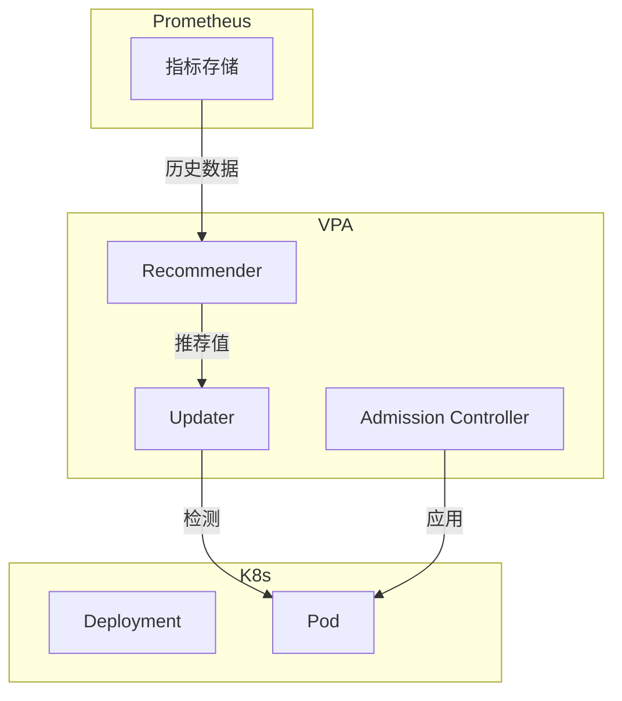
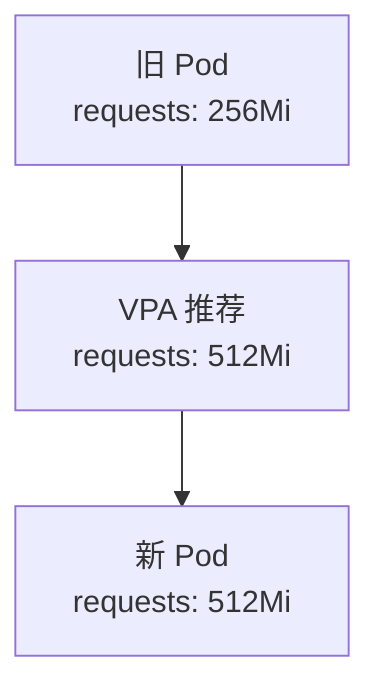

# VPA（垂直自动伸缩）

你部署了一个 Java 应用，内存从 512Mi 开始。随着业务增长，内存逐渐不够用。你手动调整了 requests 和 limits，但什么时候调？调多少合适？

**VPA（Vertical Pod Autoscaler）可以帮你自动做这件事。**

## VPA 是什么？

VPA 是 Kubernetes 的垂直 Pod 自动伸缩控制器。它分析 Pod 的实际资源使用情况，自动调整 Pod 的资源 requests 和 limits。

与 HPA 的区别：

| 特性 | HPA | VPA |
| --- | --- | --- |
| 方向 | 水平（副本数） | 垂直（资源配额） |
| 触发条件 | 指标超过阈值 | 资源使用超出当前配置 |
| Pod 变化 | 副本数变化 | 单 Pod 资源配置变化 |
| 重建 | 通常不需要 | **需要重建 Pod** |

## VPA 工作模式

VPA 有四种工作模式：

| 模式 | 说明 |
| --- | --- |
| **Off** | 只分析，不自动更新 |
| **Initial** | 仅在新 Pod 时应用推荐值 |
| **Recreate** | Pod 每次更新时应用推荐值（会重建 Pod） |
| **Auto** | 自动更新，Pod 重建（生产环境慎用） |

## 安装 VPA

```bash
# 使用 Helm 安装
helm repo add cowboysysop https://cowboysysop.github.io/charts
helm install vpa cowboysysop/vertical-pod-autoscaler -n kube-system
```

```yaml title="vpa-install.yaml"
apiVersion: autoscaling.k8s.io/v1
kind: VerticalPodAutoscaler
metadata:
  name: my-app-vpa
  namespace: default
spec:
  targetRef:
    apiVersion: "apps/v1"
    kind: Deployment
    name: my-app
  updatePolicy:
    updateMode: "Off"  # 或 "Auto", "Recreate", "Initial"
```

## 创建 VPA

### Off 模式（推荐生产使用）

```yaml title="vpa-off.yaml"
apiVersion: autoscaling.k8s.io/v1
kind: VerticalPodAutoscaler
metadata:
  name: my-app-vpa
spec:
  targetRef:
    apiVersion: apps/v1
    kind: Deployment
    name: my-app
  updatePolicy:
    updateMode: Off
  resourcePolicy:
    containerPolicies:
    - containerName: my-app
      minAllowed:
        cpu: 50m
        memory: 64Mi
      maxAllowed:
        cpu: 4
        memory: 8Gi
```

### Auto 模式

```yaml title="vpa-auto.yaml"
apiVersion: autoscaling.k8s.io/v1
kind: VerticalPodAutoscaler
metadata:
  name: my-app-vpa
spec:
  targetRef:
    apiVersion: apps/v1
    kind: Deployment
    name: my-app
  updatePolicy:
    updateMode: Auto
  resourcePolicy:
    containerPolicies:
    - containerName: '*'
      minAllowed:
        cpu: 50m
        memory: 64Mi
```

```bash
# 查看 VPA 推荐值
kubectl get vpa my-app-vpa -o yaml

# 状态示例
status:
  conditions:
  - status: "True"
    type: "RecommendationProvided"
  recommendation:
    containerRecommendations:
    - containerName: my-app
      lowerBound:
        cpu: 100m
        memory: 128Mi
      target:
        cpu: 250m
        memory: 256Mi
      uncappedTarget:
        cpu: 250m
        memory: 256Mi
      upperBound:
        cpu: 2
        memory: 2Gi
```

## VPA 组件

VPA 由三个组件组成：

| 组件 | 说明 |
| --- | --- |
| **Recommender** | 分析资源使用，生成推荐值 |
| **Updater** | 检测需要更新的 Pod |
| **Admission Controller** | 在 Pod 创建时应用推荐值 |



## 资源边界

### 最小/最大限制

```yaml
resourcePolicy:
  containerPolicies:
  - containerName: my-app
    minAllowed:
      cpu: 50m
      memory: 64Mi
    maxAllowed:
      cpu: 8
      memory: 32Gi
```

### 按容器配置

```yaml
resourcePolicy:
  containerPolicies:
  - containerName: app
    mode: Auto
    minAllowed:
      cpu: 100m
      memory: 128Mi
  - containerName: sidecar
    mode: Off  # sidecar 不参与 VPA
```

## 与 HPA 对比

VPA 和 HPA 可以一起使用：

```yaml title="combined-hpa-vpa.yaml"
---
apiVersion: autoscaling/v2
kind: HorizontalPodAutoscaler
metadata:
  name: my-app-hpa
spec:
  scaleTargetRef:
    apiVersion: apps/v1
    kind: Deployment
    name: my-app
  minReplicas: 2
  maxReplicas: 10
  metrics:
  - type: Resource
    resource:
      name: cpu
      target:
        type: Utilization
        averageUtilization: 70
---
apiVersion: autoscaling.k8s.io/v1
kind: VerticalPodAutoscaler
metadata:
  name: my-app-vpa
spec:
  targetRef:
    apiVersion: apps/v1
    kind: Deployment
    name: my-app
  updatePolicy:
    updateMode: "Off"
```

| 场景 | HPA | VPA | 组合 |
| --- | --- | --- | --- |
| 流量突增 | 扩容副本 | - | ✓ |
| 资源不足 | - | 增加配额 | ✓ |
| 资源过剩 | 缩副本 | 减少配额 | ✓ |
| 两者皆有 | 扩容 + 调整配额 | - | ✓ |

## 常见问题

### VPA 与 HPA 冲突

如果同时使用 VPA (Auto) 和 HPA，VPA 可能会干扰 HPA：

```bash
# VPA 调整 requests 可能导致调度失败
# 导致 HPA 无法扩容
```

:::warning
生产环境建议 VPA 使用 `Off` 模式，只作为参考。
:::

### Pod 重建

VPA (Auto/Recreate) 会导致 Pod 重建：



### 不支持所有资源

VPA 有以下限制：

1. **不支持 DaemonSet**：DaemonSet 需要在每个节点运行
2. **不支持 Job/CronJob**：短生命周期任务
3. **不支持 `terminationGracePeriodSeconds = 0`**：需要优雅终止时间
4. **不支持本地存储**：emptyDir 等

## 使用建议

### 1. 生产环境使用 Off 模式

```yaml
updatePolicy:
  updateMode: Off  # 只提供推荐值，不自动应用
```

### 2. 配合 Prometheus 使用

```yaml
spec:
  metrics:
  - type: External
    external:
      metricSelector:
        matchLabels:
          resource.metrics.k8s.io/pod: my-app
```

### 3. 设置合理的边界

```yaml
resourcePolicy:
  containerPolicies:
  - containerName: '*'
    minAllowed:
      cpu: 50m
      memory: 64Mi
    maxAllowed:
      cpu: 8
      memory: 16Gi
```

## 延伸思考

VPA 解决了资源配置的「拍脑袋」问题：

1. **数据驱动**：基于实际使用情况调整
2. **自动化**：无需人工干预
3. **成本优化**：避免资源浪费

但 VPA 也有局限性：

1. **Pod 重建**：应用必须有优雅重启能力
2. **冷启动**：资源变化后需要重新适应
3. **资源碎片**：可能导致节点资源利用率下降

对于大多数应用，HPA 已经足够。如果确实遇到资源配额难题，再考虑 VPA。

## 延伸阅读

- [HPA（水平自动伸缩）](./hpa)：副本数的水平调整
- [资源管理](./pod)：Pod 资源配置详解
- [Metrics Server](./monitoring)：指标收集
