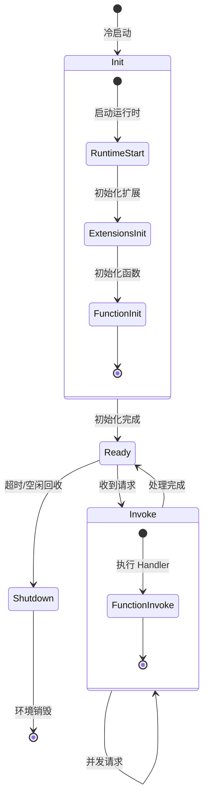
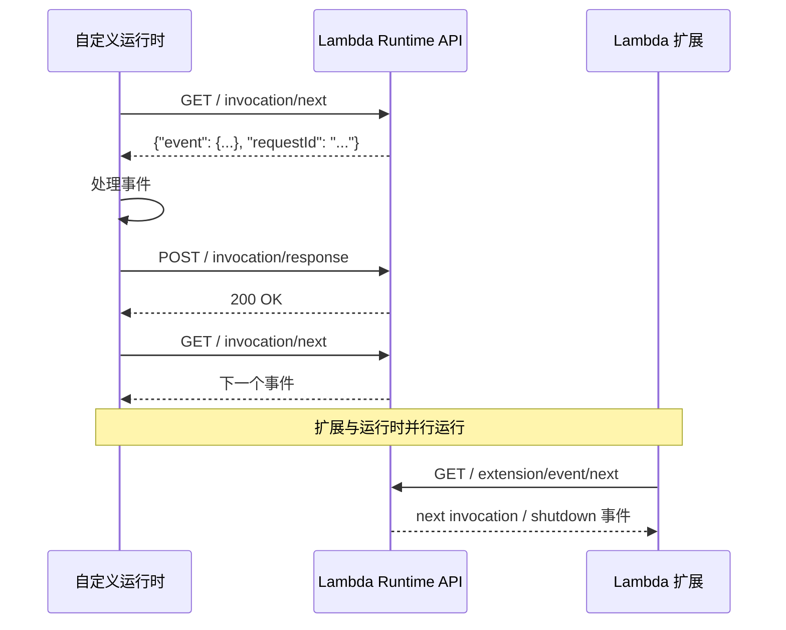
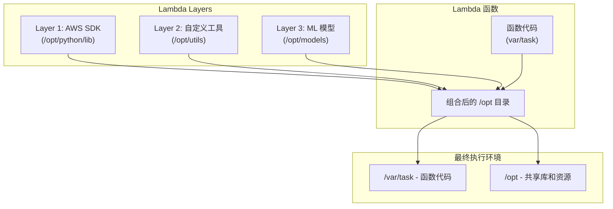
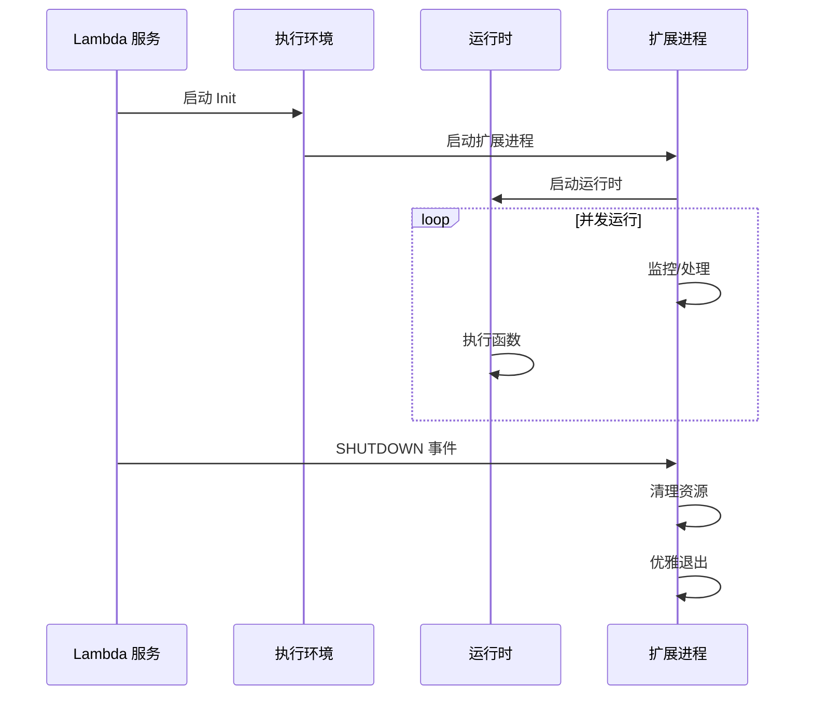

你已经在生产环境使用了 AWS Lambda 函数处理 S3 上传事件。一段时间后发现：每次代码更新都需要重新上传依赖库，导致部署包过大、更新时间长。更糟糕的是，多个函数需要使用相同的 AI 模型，但每个函数的部署包里都包含了一份模型文件，造成大量存储浪费。

Lambda 的 Layers 机制正是为解决这类问题而设计的。但 Lambda 的能力远不止 Layers ——从执行环境的生命周期到运行时 API，从扩展机制到 VPC 网络，Lambda 的内部原理比表面看起来复杂得多。

## Lambda 执行环境

理解 Lambda 的执行环境是深入掌握 Lambda 的基础。每个 Lambda 函数都在一个隔离的安全沙箱中运行。

### 执行环境的生命周期



### Init 阶段详解

Init 阶段是冷启动延迟的主要来源，包括：

| 子阶段 | 耗时 | 可优化性 |
| --- | --- | --- |
| 运行时启动 | 50-500ms（视语言而定） | 部分 |
| Extensions 初始化 | 2-100ms | 可优化 |
| 函数初始化代码 | 0-500ms | 可优化 |

```python title="initialization_timing.py"
import time

# 这些代码在 Init 阶段执行
print("=== Init 阶段开始 ===")
init_start = time.time()

# 模拟依赖加载（约 100-300ms）
import boto3  # 约 50-100ms
import numpy as np  # 约 50-150ms
import pandas as pd  # 约 100-200ms

# 模拟业务初始化（约 50-100ms）
config = load_config()  # 从 SSM/Secrets Manager 加载
client = boto3.client('s3')

init_end = time.time()
print(f"=== Init 阶段结束，耗时: {(init_end - init_start) * 1000:.2f}ms ===")

def lambda_handler(event, context):
    # Handler 代码在 Invoke 阶段执行
    print(f"Handler 执行，当前环境 ID: {context.aws_request_id[:8]}")
    return {'statusCode': 200}
```

### 环境变量与配置

Lambda 通过环境变量向函数传递配置：

```python title="environment_variables.py"
import os
import json

def lambda_handler(event, context):
    # AWS 提供的基础环境变量
    region = os.environ['AWS_REGION']
    function_name = os.environ['AWS_LAMBDA_FUNCTION_NAME']
    memory = os.environ['AWS_LAMBDA_FUNCTION_MEMORY_SIZE']

    # 自定义环境变量（在 Lambda 配置中设置）
    db_endpoint = os.environ['DB_ENDPOINT']
    cache_ttl = int(os.environ.get('CACHE_TTL', '300'))

    # Secrets Manager 密文（通过 KMS 加密）
    api_key = os.environ['API_KEY']

    return {
        'region': region,
        'function_name': function_name,
        'memory': memory
    }
```

```bash title="设置环境变量"
# AWS CLI 设置环境变量
aws lambda update-function-configuration \
    --function-name my-function \
    --environment "Variables={DB_ENDPOINT=prod.db.internal,API_KEY=my-secret-key}"

# 通过 CloudFormation 设置
# Lambda:
#   Type: AWS::Lambda::Function
#   Properties:
#     Environment:
#       Variables:
#         DB_ENDPOINT: !Sub "${DBCluster.Endpoint}"
```

## 运行时 API

Lambda 运行时 API 允许开发者实现自定义运行时，处理自定义事件源。

### 运行时 API 的工作原理



### 实现自定义运行时

```bash title="bootstrap 脚本"
#!/bin/sh

# 自定义运行时的入口脚本（必须是 /var/runtime/bootstrap 或 /opt/bootstrap）

RUNTIME_API="${AWS_LAMBDA_RUNTIME_API}"
HANDLER="${_HANDLER}"

while true; do
    # 从运行时 API 获取下一个调用
    HEADERS="$(mktemp)"

    # 获取事件
    EVENT_RESPONSE=$(curl -s -D "$HEADERS" -X GET \
        "http://${RUNTIME_API}/2018-06-01/runtime/invocation/next")

    # 提取请求 ID
    REQUEST_ID=$(grep -i Lambda-Runtime-Aws-Request-Id "$HEADERS" | awk '{print $2}' | tr -d '\r')
    rm "$HEADERS"

    # 提取事件内容
    EVENT=$(echo "$EVENT_RESPONSE" | jq -c '.')

    # 调用处理器
    RESPONSE=$(echo "$EVENT" | /var/task/handler.py)

    # 返回响应
    curl -X POST \
        "http://${RUNTIME_API}/2018-06-01/runtime/invocation/${REQUEST_ID}/response" \
        -d "$RESPONSE"
done
```

```python title="handler.py"
import json

def handler(event):
    """自定义处理器"""
    action = event.get('action', 'unknown')

    if action == 'process':
        return {
            'statusCode': 200,
            'body': json.dumps({
                'message': f'Processed: {event.get("data")}'
            })
        }
    elif action == 'health':
        return {
            'statusCode': 200,
            'body': json.dumps({'status': 'healthy'})
        }
    else:
        return {
            'statusCode': 400,
            'body': json.dumps({'error': 'Unknown action'})
        }
```

## Lambda Layers

Layers 是 Lambda 最强大的特性之一，允许跨函数共享代码和依赖。

### Layers 的工作原理



### 创建 Layer

```bash title="create_layer.sh"
#!/bin/bash

# 创建 Layer 包
mkdir -p python/lib
cd python/lib

# 安装需要的依赖
pip install boto3 -t .  # 只安装需要的部分
pip install pandas -t .

# 返回上层目录
cd ../..

# 创建 Layer 包
zip -r my-custom-layer.zip python/

# 发布 Layer
aws lambda publish-layer-version \
    --layer-name my-custom-layer \
    --zip-file fileb://my-custom-layer.zip \
    --compatible-runtimes python3.11 \
    --description "包含 boto3 和 pandas 的自定义层"
```

### 使用 Layer

```yaml title="serverless.yml"
service: my-service

provider:
  name: aws
  runtime: python3.11

layers:
  awsSDK:
    path: layers/aws-sdk
    compatibleRuntimes:
      - python3.11
  customUtils:
    path: layers/utils
    compatibleRuntimes:
      - python3.11

functions:
  processOrder:
    handler: handler.process_order
    layers:
      - !GetAtt awsSDKLayer.Arn
      - !GetAtt customUtilsLayer.Arn
    events:
      - sqs:
          arn: !GetAtt orderQueue.Arn
```

```python title="layer_usage.py"
import os

def lambda_handler(event, context):
    # Layer 中的包可以直接 import
    import boto3
    import pandas as pd

    # Layer 中的脚本可以直接执行
    # 假设 Layer 中有 /opt/utils/logging.py
    # 可以在代码中引用

    # 查看 Layer 路径
    opt_path = os.environ.get('LAMBDA_TASK_ROOT', '/opt')
    print(f"Layer 路径: {opt_path}")

    # 加载 Layer 中的自定义模块
    import sys
    sys.path.insert(0, '/opt/utils')
    from custom_utils import process_data

    return {'statusCode': 200}
```

:::tip
**Layer 的叠加顺序**：多个 Layer 按从下到上的顺序叠加，后面的 Layer 会覆盖前面的同名文件。系统 Layer（如 AWS SDK）优先级最低，自定义 Layer 优先级最高。
:::

## Lambda 扩展

Lambda 扩展是 Lambda 执行环境的一部分，允许在函数运行期间拦截指标、日志和调用。

### 扩展的工作原理



### 自定义扩展实现

```bash title="extension/bootstrap"
#!/bin/sh

# 扩展的入口脚本

EXTENSION_NAME="my-monitoring-extension"
RUNTIME_API="${AWS_LAMBDA_RUNTIME_API}"

# 注册扩展
curl -X POST "http://${RUNTIME_API}/2020-01-01/extension/register" \
    -H "Content-Type: application/json" \
    -d "{\"events\": [\"INVOKE\", \"SHUTDOWN\"], \"extensionName\": \"${EXTENSION_NAME}\"}"

# 进入事件循环
while true; do
    EVENT=$(curl -s -X GET "http://${RUNTIME_API}/2020-01-01/extension/event/next")

    EVENT_TYPE=$(echo "$EVENT" | jq -r '.eventType')
    REQUEST_ID=$(echo "$EVENT" | jq -r '.requestId')

    if [ "$EVENT_TYPE" = "INVOKE" ]; then
        # 处理调用事件
        handle_invoke "$REQUEST_ID"
    elif [ "$EVENT_TYPE" = "SHUTDOWN" ]; then
        # 处理关闭事件
        handle_shutdown
        exit 0
    fi
done
```

### 预置扩展

AWS 提供多种预置扩展，与流行监控工具集成：

| 扩展 | 集成工具 | 功能 |
| --- | --- | --- |
| Datadog | Datadog | 指标、追踪、日志 |
| New Relic | New Relic | APM、性能监控 |
| Sentry | Sentry | 错误追踪 |
| HashiCorp | Vault | 密钥管理 |
| AWS AppConfig | AppConfig | 动态配置 |

```yaml title="extension_config.yml"
# CloudFormation 中的扩展配置
Resources:
  MyFunction:
    Type: AWS::Lambda::Function
    Properties:
      Layers:
        # Datadog 扩展
        - !Sub "arn:aws:lambda:${AWS::Region}:464622532012:layer:Datadog-Extension:50"
      Environment:
        Variables:
          DD_API_KEY: !Ref DatadogApiKey
          DD_SITE: datadoghq.com
```

## VPC 访问

Lambda 默认运行在 AWS 管理的 VPC 中，可以直接访问互联网和 AWS 服务。配置 VPC 访问后，Lambda 会加入你的私有网络。

### VPC 配置架构

```mermaid
flowchart TB
    subgraph VPC["客户 VPC"]
        subgraph Subnets["子网"]
            Sub1[Subnet 1\n(私有 AZ-1)]
            Sub2[Subnet 2\n(私有 AZ-2)]
        end

        Lambda[Lambda 函数]
        RDS[(RDS 数据库)]
        Redis[ElastiCache]

        Lambda --> Sub1
        Lambda --> Sub2
        Lambda --> RDS
        Lambda --> Redis
    end

    subgraph AWS["AWS 服务"]
        S3[(S3)]
        DynamoDB[(DynamoDB)]
    end

    subgraph ENI["弹性网络接口"]
        ENI1[ENI 1]
        ENI2[ENI 2]
    end

    Lambda --> ENI1
    Lambda --> ENI2
    ENI1 --> Sub1
    ENI2 --> Sub2

    Lambda --> S3
    Lambda --> DynamoDB

    style VPC fill:#fff3e0
    style ENI fill:#e3f2fd
```

### VPC 配置

```python title="vpc_config.py"
import boto3

lambda_client = boto3.client('lambda')

def configure_vpc(function_name: str, subnet_ids: list, security_group_ids: list):
    """配置 Lambda 函数访问 VPC"""

    try:
        response = lambda_client.update_function_configuration(
            FunctionName=function_name,
            VpcConfig={
                'SubnetIds': subnet_ids,
                'SecurityGroupIds': security_group_ids
            }
        )

        print(f"VPC 配置成功:")
        print(f"  子网: {subnet_ids}")
        print(f"  安全组: {security_group_ids}")

        # VPC 配置需要几分钟生效
        print("注意: VPC 配置可能需要几分钟生效，期间函数可能无法访问 VPC 资源")

    except lambda_client.exceptions.InvalidParameterValueException as e:
        print(f"参数无效: {e}")
```

```yaml title="vpc_cloudformation.yml"
AWSTemplateFormatVersion: '2010-09-09'
Resources:
  # 安全组
  LambdaSecurityGroup:
    Type: AWS::EC2::SecurityGroup
    Properties:
      GroupDescription: Lambda 函数安全组
      VpcId: !Ref VPCId
      SecurityGroupEgress:
        - IpProtocol: -1
          CidrIp: 0.0.0.0/0

  # Lambda 函数
  VpcLambdaFunction:
    Type: AWS::Lambda::Function
    Properties:
      FunctionName: vpc-lambda-function
      Runtime: python3.11
      Handler: handler.lambda_handler
      VpcConfig:
        SubnetIds:
          - !Sub "${PrivateSubnet1}"
          - !Sub "${PrivateSubnet2}"
        SecurityGroupIds:
          - !Ref LambdaSecurityGroup
```

:::warning
**VPC 配置的冷启动影响**：Lambda 加入 VPC 后，每次冷启动需要创建弹性网络接口（ENI），这会增加 5-10 秒的冷启动延迟。建议使用以下方案优化：

1. **预置 ENI**：通过配置预留并发，让 ENI 保持活跃
2. **NAT 网关**：确保私有子网可通过 NAT 访问互联网
3. **VPC Endpoints**：通过 VPC Endpoints 访问 S3、DynamoDB 等服务，避免绕道公网
:::

## 配额与限制

Lambda 有多种配额限制，了解这些限制有助于系统设计。

### 执行期限制

| 限制类型 | 默认值 | 可调整 |
| --- | --- | --- |
| **最大执行时间** | 900 秒（15 分钟） | 否 |
| **内存** | 128MB - 10,240MB | 否 |
| **临时存储 `/tmp`** | 512MB - 10,240MB | 部分 |
| **并发执行数** | 1000/区域 | 是 |
| **每个函数调用 Payload** | 6MB（同步）、256KB（异步） | 否 |

### 部署期限制

| 限制类型 | 限制值 | 说明 |
| --- | --- | --- |
| **部署包大小** | 50MB（压缩） | 直接上传 |
| **部署包大小** | 250MB（解压后） | 直接上传 |
| **部署包大小** | 3GB | 使用 S3 上传 |
| **Layer 数量** | 5 个/函数 | 每个最多 50MB |
| **环境变量大小** | 4KB | Key + Value |
| **Layer 总大小** | 10GB/区域 | 所有 Layer |

### 超限处理策略

```python title="handle_limits.py"
import os

def lambda_handler(event, context):
    # 检查当前配额
    remaining_time = context.get_remaining_time_in_millis()
    max_memory = os.environ.get('AWS_LAMBDA_FUNCTION_MEMORY_SIZE')

    # 处理大数据集
    if event.get('large_payload'):
        # 超出 Payload 限制时的处理
        return handle_large_payload_via_s3(event)

    # 处理长时间任务
    if event.get('long_running'):
        # 分片处理，避免超时
        return handle_long_task分期(event, context)

    # 内存敏感操作
    if event.get('memory_intensive'):
        # 流式处理，避免内存溢出
        return handle_memory_intensive(event)

    return {'statusCode': 200}

def handle_large_payload_via_s3(event):
    """通过 S3 处理大 Payload"""
    s3_key = event['s3_key']
    # 从 S3 读取数据，而不是从 event 中
    return {'processed': True}

def handle_long_task分期(event, context):
    """分片处理长时间任务"""
    # 检查剩余时间
    remaining = context.get_remaining_time_in_millis()

    if remaining < 60000:  # 少于 1 分钟
        # 保存检查点，下次继续
        save_checkpoint(event)
        return {'status': 'checkpoint', 'resume': True}

    # 正常处理
    result = process_batch(event)

    # 如果还没完成，保存检查点
    if not is_complete(result):
        save_checkpoint(event)
        return {'status': 'partial', 'resume': True}

    return {'status': 'complete'}
```

## 权衡矩阵

| 场景 | 推荐配置 | 不推荐配置 | 原因 |
| --- | --- | --- | --- |
| 共享依赖库 | Lambda Layers | 每个函数单独打包 | 减少包体积、统一版本 |
| VPC 访问 | VPC Endpoints + 预置并发 | 直接公网访问 | 安全 + 性能 |
| 自定义运行时 | Runtime API | 不使用 | 需要特殊语言/版本 |
| 监控扩展 | Datadog/New Relic | 无监控 | 可观测性 |
| 大文件处理 | S3 中转 | 直接 Payload | Payload 限制 6MB |

## 常见问题与反模式

### 误区 1：Layer 依赖未版本化

**问题**：Layer 更新后，所有函数立即使用新版本，导致意外的行为变化。

**正确做法**：使用带版本号的 Layer ARN，或通过别名引用固定版本。

### 误区 2：VPC 配置缺少 NAT

**问题**：Lambda 加入 VPC 后无法访问互联网，包括 AWS API（除 S3、DynamoDB）。

**正确做法**：配置 NAT 网关或 VPC Endpoints。

### 误区 3：忽略 ENI 创建延迟

**问题**：VPC Lambda 的冷启动增加 5-10 秒，影响用户体验。

**正确做法**：配置足够的预留并发，保持 ENI 活跃。

### 误区 4：Layer 与函数打包重复

**问题**：函数包里包含了 Layer 中已有的依赖，导致版本冲突。

**正确做法**：Layer 中已包含的包不要在函数包中重复打包。

## 延伸思考

Lambda 的设计哲学是「简单」——开发者只需要关注业务逻辑。但「简单」的表象下隐藏着复杂的运行时机制。深入理解这些机制，有助于：

1. **性能优化**：冷启动、内存配置、VPC 访问的取舍
2. **成本控制**：Layer 复用、按需付费的实现细节
3. **安全加固**：VPC 配置、IAM 角色、环境变量加密
4. **可观测性**：日志格式、追踪上下文、性能指标

Lambda 不是银弹。在选择 Lambda 之前，需要评估它是否适合你的场景。下一篇文章将讨论 AWS Lambda 的最佳实践，帮助你在实际项目中做出正确的架构决策。
