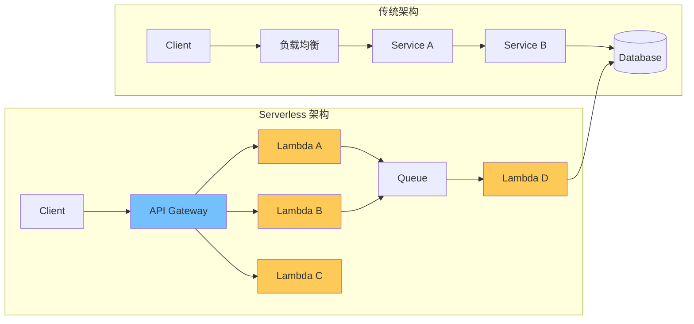
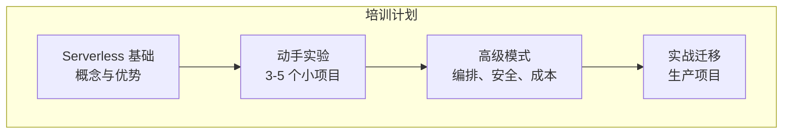
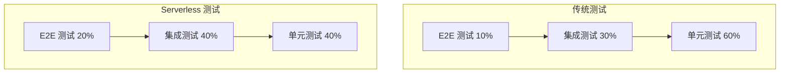

你的团队用了 6 个月时间，成功把 10 个微服务迁移到 Lambda。功能正常，性能达标，但 CTO 在季度评审时问了三个问题：

1. 为什么部署流程变复杂了？
2. 为什么调试问题更难了？
3. 为什么运维成本没有降低？

**「Serverless 的承诺很美好，但落地过程中的挑战往往被低估。」** 本文整理了企业 Serverless 转型中最常见的挑战，以及经过验证的应对策略。

## 技术挑战

### 挑战一：调试与可观测性



**问题表现**：

- 一个 API 请求可能在 5-10 个 Lambda 函数间流转
- 日志分散在不同的 CloudWatch Log Streams
- 跨函数的请求追踪困难
- 错误定位需要手动关联多个日志流

**应对策略**：

1. **统一追踪上下文**：使用 X-Ray 或 OpenTelemetry，确保所有函数传递同一个 trace ID

```typescript title="trace-context.ts")
import { TraceContext, propagation } from '@opentelemetry/api';

export const handler = async (event: any, context: any) => {
  // 从 API Gateway 提取 trace ID
  const traceId = event.requestContext?.requestId || event.headers?.['x-trace-id'];

  // 传递给下游
  const downstreamEvent = {
    ...event,
    traceId,
    timestamp: Date.now(),
  };

  await invokeLambda('downstream-function', downstreamEvent);
};
```

2. **结构化日志规范**：所有函数使用统一的日志格式

```json title="unified-log-format.json")
{
  "schema": "1.0",
  "timestamp": "2024-01-15T10:30:00.000Z",
  "level": "INFO",
  "service": "order-service",
  "version": "v2.1.0",
  "traceId": "abc123",
  "requestId": "def456",
  "userId": "user-789",
  "message": "Order created",
  "data": {
    "orderId": "order-12345",
    "amount": 199.99
  }
}
```

3. **构建日志聚合平台**：使用 Elasticsearch + Kibana 或 OpenSearch Dashboards

### 挑战二：冷启动延迟

**问题表现**：

- 用户第一次访问等待 2-5 秒
- 移动端体验尤其糟糕
- 定时任务无法接受冷启动时间

**应对策略**：

| 策略 | 成本影响 | 效果 |
| --- | --- | --- |
| Provisioned Concurrency | 中 | 最稳定 |
| 定期预热 | 低 | 一般 |
| 精简代码包 | 无 | 中 |
| Go/Node.js 运行时 | 无 | 好 |
| 保持最小实例数 | 低 | 好 |

### 挑战三：Vendor Lock-in

**问题表现**：

- 代码与云平台 SDK 深度耦合
- 迁移到其他平台需要重写
- 担心被云厂商绑定

**应对策略**：

1. **使用抽象层**

```typescript title="abstraction-layer.ts")
// 定义接口
interface MessageQueue {
  send(message: any): Promise<void>;
  receive(): Promise<any[]>;
}

// AWS 实现
class SQSQueue implements MessageQueue {
  async send(message: any) { /* AWS SDK */ }
  async receive() { /* AWS SDK */ }
}

// Azure 实现
class ServiceBusQueue implements MessageQueue {
  async send(message: any) { /* Azure SDK */ }
  async receive() { /* Azure SDK */ }
}

// 使用
const queue: MessageQueue = new SQSQueue();
await queue.send({ type: 'order.created', data });
```

2. **容器化 + Knative**：使用标准的容器镜像，可以在任何 K8s 环境运行

3. **渐进式迁移**：保持核心逻辑与平台特定代码分离

## 组织挑战

### 挑战四：团队技能缺口

**问题表现**：

- 团队熟悉传统的微服务架构
- Serverless 的编程模型需要新思维
- 调试和测试方式完全不同

**应对策略**：



1. **分阶段培训**：不要一次性全面培训，选择试点团队
2. **建立最佳实践库**：整理内部的成功和失败案例
3. **建立支持机制**：Slack/Teams 频道，答疑时间

### 挑战五：测试策略

**问题表现**：

- 难以在本地模拟 Lambda 环境
- 集成测试依赖云资源
- 端到端测试复杂

**应对策略**：

1. **本地测试**：使用 LocalStack/Sam CLI Local

```bash
# SAM CLI 本地测试
sam local invoke MyFunction -e event.json
sam local start-api
```

2. **测试金字塔重构**



3. **Contract Testing**：验证事件源和消费者之间的契约

### 挑战六：CI/CD 复杂性

**问题表现**：

- 部署流程需要协调多个组件
- 回滚涉及多个资源
- 环境差异难以管理

**应对策略**：

```yaml title="cicd-pipeline.yaml")
# GitHub Actions CI/CD
name: Serverless Deploy

on:
  push:
    branches: [main]

jobs:
  test:
    runs-on: ubuntu-latest
    steps:
      - uses: actions/checkout@v4
      - name: Run Tests
        run: |
          npm test
          npm run integration-test

  deploy-staging:
    needs: test
    environment: staging
    steps:
      - name: Deploy
        run: |
          serverless deploy --stage staging

  deploy-production:
    needs: deploy-staging
    environment: production
    steps:
      - name: Deploy
        run: |
          serverless deploy --stage production
      - name: Smoke Test
        run: |
          curl -f https://api.production.example.com/health
```

## 合规与安全挑战

### 挑战七：安全审计

**问题表现**：

- Lambda 函数可以访问任意资源
- IAM 策略配置复杂易错
- 敏感信息容易泄露

**应对策略**：

1. **最小权限原则**

```json title="iam-policy.json")
{
  "Version": "2012-10-17",
  "Statement": [{
    "Effect": "Allow",
    "Action": [
      "dynamodb:GetItem",
      "dynamodb:PutItem"
    ],
    "Resource": "arn:aws:dynamodb:*:*:table/${env:TABLE_NAME}"
  }]
}
```

2. **扫描工具集成**

```yaml title="security-scan.yml")
- name: Security Scan
  run: |
    checkov -d . --framework terraform
    tfsec .
    npm audit
```

3. **Secret 管理**：使用 Secrets Manager/Vault，不要在环境变量中存储敏感信息

### 挑战八：合规要求

**问题表现**：

- 金融/医疗行业有严格的审计要求
- 数据必须存储在特定区域
- 需要完整的操作日志

**应对策略**：

1. **启用 CloudTrail**：记录所有 API 调用
2. **配置 VPC**：Lambda 在 VPC 内运行，满足数据隔离要求
3. **定期审计**：使用 AWS Config Rules

## 运维挑战

### 挑战九：成本失控

**问题表现**：

- 调用量突增导致账单爆炸
- 难以追踪哪个函数消耗最多
- 没有成本预警机制

**应对策略**：

```bash
# 设置月度预算告警
aws budgets create-budget \
  --account-id 123456789012 \
  --budget '{
    "BudgetName": "Lambda Monthly Budget",
    "BudgetLimit": {"Amount": "1000", "Unit": "USD"},
    "TimeUnit": "MONTHLY",
    "CostTypes": {"IncludeSupportCosts": true}
  }' \
  --notifications-with-subscribers '[
    {"Notification": {"Threshold": 80, "ComparisonOperator": "GREATER_THAN"}, "Subscribers": [{"Address": "email@example.com"}]}
  ]'
```

### 挑战十：Vendor 故障影响

**问题表现**：

- 2021 年 AWS us-east-1 故障影响大量 Lambda
- 单点故障风险
- 业务连续性挑战

**应对策略**：

1. **多区域部署**：Lambda + DynamoDB Global Tables
2. **降级策略**：功能开关，允许优雅降级
3. **缓存策略**：LocalStack + DynamoDB Accelerator (DAX)

## 成功落地的关键因素

### 组织层面

| 因素 | 重要性 | 说明 |
| --- | --- | --- |
| **高层支持** | 关键 | 需要资源投入和方向认可 |
| **渐进式采用** | 关键 | 不要全面替换现有系统 |
| **技能培训** | 高 | 团队能力是成功的基础 |
| **文化转变** | 高 | 从运维服务器到运维代码 |

### 技术层面

| 实践 | 投入 | 回报 |
| --- | --- | --- |
| **可观测性平台** | 高 | 快速定位问题 |
| **自动化测试** | 高 | 减少回归风险 |
| **IaC 管理** | 中 | 版本控制和可审计 |
| **成本监控** | 低 | 防止账单超支 |

### 项目选择

| 类型 | 适合迁移 | 原因 |
| --- | --- | --- |
| **事件驱动** | ✓ | Lambda 天然适合 |
| **Webhook/回调** | ✓ | 按需运行优势明显 |
| **定时任务** | ✓ | 替代 Cron 服务器 |
| **复杂状态应用** | △ | 需要额外架构 |
| **实时游戏后端** | ✗ | 延迟要求高 |

## 常见反模式

### 反模式一：把所有东西都 Lambda 化

```
症状：把所有微服务都迁移到 Lambda，包括实时聊天、实时游戏等
问题：Lambda 的冷启动和最大执行时间限制不适合这些场景
解决：保持适合的场景使用传统架构
```

### 反模式二：忽视测试投入

```
症状：快速迁移上线，但测试覆盖率不足
问题：线上故障频发，回滚频繁
解决：在迁移前建立完整的测试策略
```

### 反模式三：没有成本意识

```
症状：调用量不监控，成本月月超支
问题：没有建立成本预警和优化机制
解决：设置月度预算告警，定期分析成本报告
```

## 延伸思考

Serverless 企业落地的本质不是技术问题，而是**组织能力问题**。技术可以快速学会，但组织文化、流程、技能的转变需要时间。

成功的 Serverless 转型通常有以下特征：

1. **从小开始**：选择 1-2 个非关键项目作为试点
2. **建立平台**：投资可观测性、CI/CD、安全扫描等基础设施
3. **培养团队**：培训、实战、建立内部最佳实践
4. **持续优化**：根据监控数据不断调整架构

最核心的问题是：**Serverless 真的适合你的业务场景吗？** 不是所有场景都适合 Serverless，有时候「传统」的方案反而更稳定、更划算。