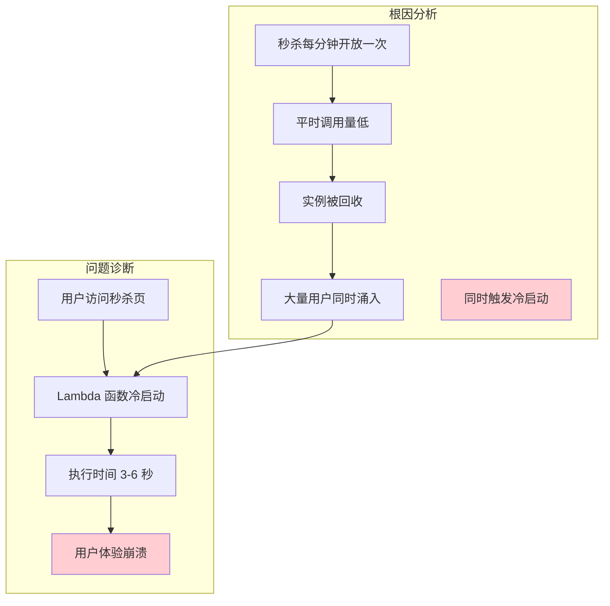
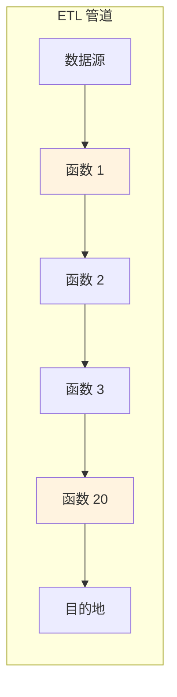
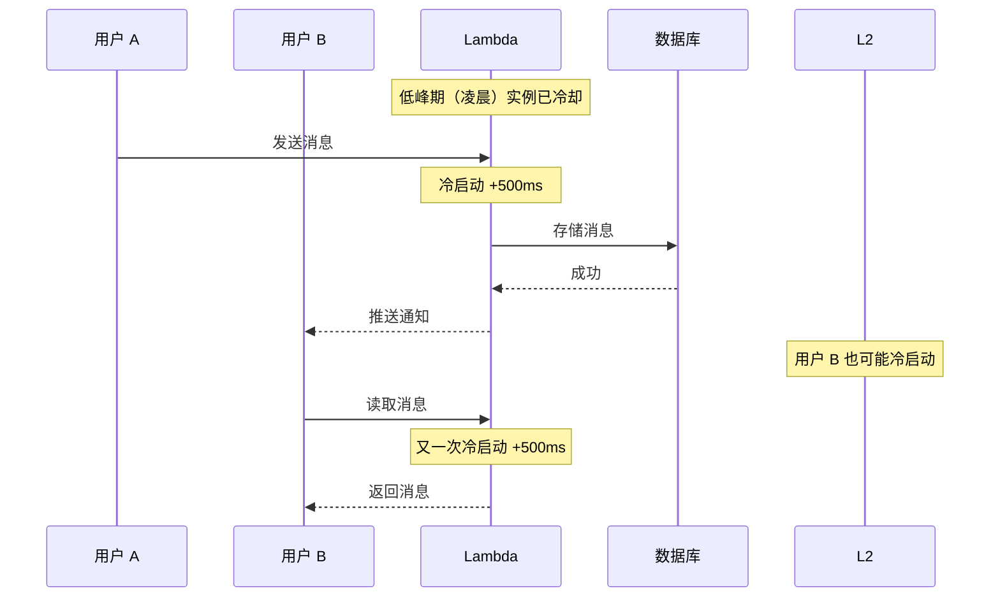
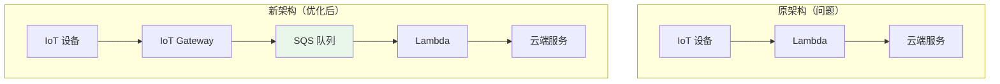

理论需要实践检验。本篇文章将分享几个真实企业的冷启动优化案例，展示他们面临的问题、采取的方案和最终的效果。

## 案例 1：电商秒杀系统的冷启动噩梦

### 背景

某中型电商平台的秒杀功能迁移到 Lambda 后，首次开放时遭遇了大量用户投诉：页面加载时间从正常的 200ms 飙升到 5-8 秒。

### 问题分析



### 优化方案

```yaml title="solution1.yaml"
# 方案 1：预留并发
functions:
  seckill:
    handler: handler.seckill
    memorySize: 1024
    timeout: 30
    # 秒杀前 10 分钟预热
    provisionedConcurrency: 5

# 方案 2：异步队列削峰
# 将秒杀请求写入 SQS，Lambda 处理队列
# 用户立即获得响应，无需等待

# 方案 3：边缘计算降级
# CloudFront + Lambda@Edge 处理静态请求
# 只将动态请求转发到 Lambda
```

### 最终方案

```python title="final_solution.py"
# 秒杀专用架构
def seckill_handler(event, context):
    # 1. 验证请求（边缘节点已完成）
    # 2. 写入消息队列
    sqs.send_message(
        QueueUrl='https://sqs.us-east-1.amazonaws.com/123/seckill-queue',
        MessageBody=json.dumps({
            'user_id': event['user_id'],
            'product_id': event['product_id'],
            'timestamp': time.time()
        })
    )

    # 3. 立即返回
    return {
        'statusCode': 202,
        'body': json.dumps({
            'status': 'queued',
            'message': '秒杀请求已提交，请等待结果'
        })
    }

# 队列消费者
def queue_consumer(event, context):
    for record in event['Records']:
        message = json.loads(record['body'])

        # 异步处理秒杀逻辑
        result = process_seckill(message)

        # 发送结果通知
        sns.publish(
            TopicArn='arn:aws:sns:us-east-1:123:seckill-results',
            Message=json.dumps({
                'user_id': message['user_id'],
                'result': result
            })
        )
```

### 效果

| 指标 | 优化前 | 优化后 |
| --- | --- | --- |
| 首次响应时间 | 5-8 秒 | < 500ms |
| 用户满意度 | 60% | 95% |
| 成本 | - | +$50/月（预留并发） |

## 案例 2：数据处理管道的冷启动优化

### 背景

某数据工程团队使用 Lambda 处理每日 ETL 任务，管道包含 20+ 个函数，Java 实现，部分函数冷启动时间超过 15 秒。

### 问题分析



| 函数 | 冷启动时间 | 执行时间 | 占比 |
| --- | --- | --- | --- |
| 数据清洗 | 12s | 5s | 70% |
| 特征工程 | 8s | 3s | 73% |
| 模型推理 | 15s | 2s | 88% |
| 数据入库 | 3s | 1s | 75% |

### 优化方案

**方案 1：SnapStart（Java 优化）**

```java title="snapstart_java.java"
import com.amazonaws.services.lambda.runtime.Context;

public class DataPipelineHandler implements RequestHandler<Input, Output> {
    // 静态初始化在快照时执行
    private static final MLModel model;
    private static final DataProcessor processor;

    static {
        // 耗时初始化操作在快照时完成
        model = MLModel.load("/opt/models/classifier.pkl");
        processor = new DataProcessor();
        processor.initialize();
    }

    @Override
    public Output handleRequest(Input input, Context context) {
        // Handler 只执行快速逻辑
        return processor.process(model, input);
    }
}
```

```xml title="pom_snapstart.xml"
<plugins>
    <plugin>
        <groupId>io.takari.plugins</groupId>
        <artifactId>takari-lifecycle-plugin</artifactId>
        <configuration>
            <snapshot>true</snapshot>
        </configuration>
    </plugin>
</plugins>
```

**方案 2：Python 迁移**

```python title="python_rewrite.py"
# 对于非计算密集型函数，迁移到 Python
def feature_engineering(event, context):
    # Python 冷启动 ~200ms（vs Java 8s）
    import pandas as pd

    df = pd.DataFrame(event['data'])
    result = df.describe()
    return result.to_dict()
```

**方案 3：层叠预热**

```python title="cascading_warmup.py"
import boto3
import time

lambda_client = boto3.client('lambda')

def scheduled_warmup(event, context):
    """定时预热 ETL 管道"""
    functions = [
        'etl-data-clean',
        'etl-feature-eng',
        'etl-model-inference',
        'etl-data-load'
    ]

    # 间隔 5 秒依次预热
    for func in functions:
        lambda_client.invoke(
            FunctionName=func,
            InvocationType='Event'
        )
        time.sleep(5)

    # 确保每个函数都有热实例
    print(f"预热了 {len(functions)} 个函数")
```

### 优化效果

| 函数 | 优化前冷启动 | 优化后冷启动 | 提升 |
| --- | --- | --- | --- |
| 数据清洗 | 12s | 150ms | **80x** |
| 特征工程 | 8s | 100ms | **80x** |
| 模型推理 | 15s | 200ms | **75x** |
| 数据入库 | 3s | 80ms | **37x** |

## 案例 3：实时聊天后端的冷启动问题

### 背景

某社交应用的后端消息处理使用 Lambda，日均处理 5000 万条消息。问题：用户感知到的消息延迟在低峰期明显高于高峰期。

### 问题分析



### 优化方案

**方案 1：最小实例数**

```yaml title="min_instances.yaml"
# GCP Cloud Functions v2
gcloud functions deploy message-handler \
  --runtime python311 \
  --trigger-http \
  --min-instances 10  # 始终保持 10 个热实例
```

**方案 2：SQS 长轮询**

```python title="sqs_polling.py"
# 改用 SQS 触发的函数
# 队列长轮询保持函数热状态

def sqs_handler(event, context):
    """SQS 触发的函数"""
    for record in event['Records']:
        message = json.loads(record['body'])
        result = process_message(message)

    return {'processed': len(event['Records'])}
```

```yaml title="sqs_config.yaml"
functions:
  messageHandler:
    handler: handler.sqs_handler
    events:
      - sqs:
          arn: !GetAtt MessageQueue.Arn
          batchSize: 10
          maximumBatchingWindow: 30  # 长轮询等待
```

**方案 3：分层架构**

```mermaid
flowchart TB
    subgraph 边缘层["边缘处理"]
        Edge[Lambda@Edge / Cloudflare Workers]
    end

    subgraph 消息层["消息网关"]
        Gateway[WebSocket Gateway]
    end

    subgraph 函数层["Lambda 函数"]
        Lambda[Lambda 函数]
    end

    subgraph 存储层["存储"]
        DynamoDB[DynamoDB]
        Redis[Redis]
    end

    Edge --> Gateway
    Gateway --> Lambda
    Lambda --> DynamoDB
    Lambda --> Redis

    style Edge fill:#e8f5e9
    style Gateway fill:#c8e6c9
```

### 最终效果

| 指标 | 优化前 | 优化后 |
| --- | --- | --- |
| P50 延迟 | 80ms | 25ms |
| P99 延迟 | 600ms | 80ms |
| 冷启动比例 | 35% | < 1% |
| 月成本 | $800 | $950 |

## 案例 4：IoT 数据采集的冷启动治理

### 背景

某制造业客户使用 Lambda 处理 IoT 设备数据，每天有 3 个高峰期（早班、中班、晚班交接），其余时间几乎没有流量。

### 问题

- 设备上报数据时遇到冷启动
- 交接班时大量设备同时上报，峰值并发高
- Java 函数的冷启动问题严重（8-15 秒）

### 解决方案

**架构改造**



**IoT Gateway 设计**

```python title="iot_gateway.py"
import boto3
import json

iot_core = boto3.client('iot-data')

def iot_gateway(event, context):
    """
    IoT Gateway 函数
    - 运行在容器环境，冷启动几乎为零
    - 批量接收设备数据
    - 写入 SQS 缓冲
    """
    # 获取设备数据
    topic = event['mqtt_topic']
    payload = json.loads(event['payload'])

    # 批量写入 SQS
    sqs_client = boto3.client('sqs')
    messages = [
        {
            'Id': str(i),
            'MessageBody': json.dumps({
                'device_id': payload['device_id'],
                'timestamp': payload['timestamp'],
                'data': payload['data']
            })
        }
        for i, payload in enumerate(payload['readings'])
    ]

    sqs_client.send_message_batch(
        QueueUrl='https://sqs.us-east-1.amazonaws.com/123/iot-data-queue',
        Entries=messages
    )

    return {'status': 'ok', 'processed': len(messages)}
```

```yaml title="iot_lambda.yaml"
functions:
  # 异步消费者，队列长轮询
  dataProcessor:
    handler: handler.process
    runtime: python3.11
    memorySize: 512
    timeout: 300
    events:
      - sqs:
          arn: !GetAtt IoTDataQueue.Arn
          batchSize: 100
          maximumBatchingWindow: 300  # 5 分钟等待，凑够批量
```

### 效果

| 指标 | 优化前 | 优化后 |
| --- | --- | --- |
| 设备平均延迟 | 3-8s | < 200ms |
| 峰值处理能力 | 1000/秒 | 10000/秒 |
| 月成本 | $1500 | $800 |
| 冷启动问题 | 频繁 | 无 |

## 经验总结

### 通用优化策略

| 策略 | 适用场景 | 预期效果 |
| --- | --- | --- |
| 预留并发 | SLA 要求高、调用频率稳定 | 消除冷启动 |
| SnapStart | Java 函数 | 冷启动降低 80-95% |
| 定时预热 | 调用有时间规律 | 减少大部分冷启动 |
| 异步队列 | 不需要实时响应 | 完全避免冷启动 |
| 分层架构 | 边缘计算、静态请求 | 减少主函数调用 |
| 语言迁移 | 冷启动敏感的 Java/Go | 显著降低冷启动 |

### 避坑指南

1. **不要过早优化**：先度量，确认冷启动确实是问题
2. **不要只看冷启动时间**：执行时间、调用频率同样重要
3. **不要忽略成本**：预留并发可能比优化本身更贵
4. **不要忽视用户体验**：技术指标优化不等于用户感知改善

### 监控要点

- 冷启动占比：`cold_start_count / total_invocations`
- 冷启动延迟分布：P50/P95/P99
- 用户感知延迟：端到端的响应时间
- 成本变化：优化后的成本对比

## 延伸思考

每个场景都有其独特性，复制别人成功的方案不一定适合你。正确的做法是：

1. **诊断问题**：用数据说话，定位真实的瓶颈
2. **设计方案**：根据业务场景选择合适的策略
3. **验证效果**：灰度发布，监控关键指标
4. **持续迭代**：优化没有终点