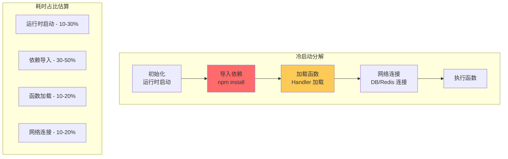

你的 API 用户在社交媒体上抱怨：「点击购买按钮后，等了整整 4 秒才有响应。」你查了监控，发现问题不在数据库，不在网络，而是 Lambda 函数的冷启动。

4 秒。这个数字在移动端几乎等于用户流失。

**「冷启动不是 bug，是特性。」** 理解冷启动的根源并系统性地优化它，是 Serverless 开发者的必修课。

## 冷启动的代价

冷启动耗时从哪里来？



以 Node.js 函数为例，一个典型的冷启动分布：

| 阶段 | 耗时（估算） | 优化空间 |
| --- | --- | --- |
| 运行时初始化 | 50-100ms | 有限 |
| 依赖导入 | 200-500ms | 高 |
| 连接池建立 | 50-200ms | 高 |
| 总计 | 300-800ms | |

## 优化策略一：精简依赖

### 分析打包体积

```bash
# 分析 bundle 体积
npx bundle-analyzer
# 或
npm run build && npx size-limit

# 使用 webpack-bundle-analyzer
npx webpack-bundle-analyzer ./dist/stats.json
```

### 排除不必要的依赖

```javascript title="esbuild.config.js"
// esbuild.config.js
module.exports = {
  entryPoints: ['src/handler.ts'],
  bundle: true,
  minify: true,
  external: [
    'aws-sdk',           // Lambda 原生支持
    '@aws-sdk/*',        // AWS SDK v3 模块化
  ],
  // 排除非运行时依赖
  // 不要把 devDependencies 打包进去
}
```

### 使用轻量替代

| 重型依赖 | 轻量替代 | 体积节省 |
| --- | --- | --- |
| `moment` | `dayjs` | ~300KB |
| `lodash` | `lodash-es` + tree-shake | ~90% |
| `mongoose` | `@aws-sdk/client-dynamodb` | ~90% |
| `axios` | `fetch` (Node 18+) | ~50KB |

```typescript title="before.ts"
import { parse, format } from 'date-fns';
import { debounce, cloneDeep } from 'lodash';
import axios from 'axios';

// Bundle: date-fns + lodash + axios = ~150KB
```

```typescript title="after.ts"
// 使用原生 API
const parse = (date: string) => new Date(date);
const format = (date: Date) => date.toISOString();

// 使用原生 fetch (Node 18+)
// Bundle: ~0KB (无额外依赖)
```

## 优化策略二：连接复用

### 避免在 Handler 中创建连接

**错误做法**：

```typescript
// 不要这样做 - 每次调用都创建连接
export const handler = async (event: APIGatewayProxyEvent) => {
  const client = new DynamoDBClient({});
  const command = new GetItemCommand({...});
  const response = await client.send(command);
  return response;
};
```

**正确做法**：使用模块级连接

```typescript title="lib/dynamodb.ts"
import { DynamoDBClient } from '@aws-sdk/client-dynamodb';
import { DynamoDBDocumentClient, GetCommand } from '@aws-sdk/lib-dynamodb';

// 连接在模块初始化时创建，整个容器生命周期复用
const client = new DynamoDBClient({});
const docClient = DynamoDBDocumentClient.from(client);

// 预热连接
const warmup = async () => {
  await docClient.send(new GetCommand({
    TableName: 'dummy',
    Key: { pk: 'warmup' }
  }));
};
// 不要导出 warmup，在模块加载时调用
```

```typescript title="handler.ts"
import { docClient } from './lib/dynamodb';

// 每次调用复用同一个连接
export const handler = async (event: APIGatewayProxyEvent) => {
  const response = await docClient.send(new GetCommand({
    TableName: process.env.TABLE_NAME!,
    Key: { pk: event.pathParameters?.id }
  }));
  return response;
};
```

### 连接池配置

```typescript title="lib/database.ts"
import mysql from 'mysql2/promise';

const pool = mysql.createPool({
  host: process.env.DB_HOST,
  user: process.env.DB_USER,
  password: process.env.DB_PASSWORD,
  database: process.env.DB_NAME,
  // 连接复用配置
  waitForConnections: true,
  connectionLimit: 10,
  queueLimit: 0,
  enableKeepAlive: true,
  keepAliveInitialDelay: 10000,
});

export const query = async (sql: string, params: any[]) => {
  const [rows] = await pool.execute(sql, params);
  return rows;
};
```

## 优化策略三：预热机制

### 定期 Ping 预热

```typescript title="scripts/warmup.ts"
import { LambdaClient, InvokeCommand } from '@aws-sdk/client-lambda';

const client = new LambdaClient({});
const functions = [
  'user-service-prod',
  'order-service-prod',
  'payment-service-prod',
];

export const scheduledWarmup = async () => {
  await Promise.all(
    functions.map(fn => client.send(new InvokeCommand({
      FunctionName: fn,
      InvocationType: 'Event',  // 异步调用，不等待响应
    }))
  ));
};
```

### CloudWatch Events 触发器

```json title="cloudformation-events.yml"
Resources:
  WarmupScheduler:
    Type: AWS::Events::Rule
    Properties:
      ScheduleExpression: "rate(5 minutes)"
      Targets:
        - Arn: !GetAtt WarmupFunction.Arn
          Id: WarmupTarget

  WarmupPermission:
    Type: AWS::Lambda::Permission
    Properties:
      FunctionName: !Ref WarmupFunction
      Action: lambda:InvokeFunction
      Principal: events.amazonaws.com
      SourceArn: !GetAtt WarmupScheduler.Arn
```

### SnapStart（Java 专用）

如果使用 Java，SnapStart 可以显著减少冷启动：

```yaml title="template.yaml"
Resources:
  MyFunction:
    Type: AWS::Serverless::Function
    Properties:
      Handler: com.example.App::handleRequest
      Runtime: java17
      MemorySize: 1024
      # 启用 SnapStart
      ProvisionedConcurrency: 0
      SnapStart:
        ApplyOn: PublishedVersions
```

SnapStart 的工作原理：

```
                    ┌─────────────────┐
                    │   发布函数       │
                    └────────┬────────┘
                             │
                             ▼
                    ┌─────────────────┐
                    │  初始化执行     │  ← 在发布时执行一次
                    └────────┬────────┘
                             │
                             ▼
                    ┌─────────────────┐
                    │  快照加密存储   │
                    └────────┬────────┘
                             │
                    调用时恢复快照
                             │
                             ▼
                    ┌─────────────────┐
                    │   快速恢复       │  ← ms 级
                    └─────────────────┘
```

## 优化策略四：Provisioned Concurrency

对于延迟敏感的应用，Provisioned Concurrency 是最直接的解决方案：

```typescript title="scripts/set-provisioned.ts"
import { LambdaClient, PutFunctionConcurrencyCommand } from '@aws-sdk/client-lambda';

const client = new LambdaClient({});

await client.send(new PutFunctionConcurrencyCommand({
  FunctionName: 'production-api',
  // 保持 5 个实例始终热状态
  ProvisionedConcurrencyConfig: {
    ProvisionedConcurrentExecutions: 5,
  },
}));
```

### 自动扩缩容

```typescript title="autoscale-concurrency.ts"
import { CloudWatchClient, GetMetricDataCommand } from '@aws-sdk/client-cloudwatch';

const client = new CloudWatchClient({});

export const autoScaleConcurrency = async () => {
  // 获取过去 5 分钟的并发请求数
  const metrics = await client.send(new GetMetricDataCommand({
    MetricDataQueries: [{
      Id: 'concurrentReqs',
      MetricStat: {
        Metric: {
          Namespace: 'AWS/Lambda',
          MetricName: 'ConcurrentExecutions',
          Dimensions: [{ Name: 'FunctionName', Value: 'production-api' }]
        },
        Period: 300,
        Stat: 'Average',
      },
    }],
    ScanBy: 'TimestampDescending',
    StartTime: new Date(Date.now() - 300000),
    EndTime: new Date(),
  }));

  const avgConcurrent = metrics.MetricDataResults?.[0]?.Values?.[0] || 0;
  const target = Math.max(2, Math.ceil(avgConcurrent * 1.2));

  // 更新并发配置
  await client.send(new PutFunctionConcurrencyCommand({
    FunctionName: 'production-api',
    ProvisionedConcurrencyConfig: {
      ProvisionedConcurrentExecutions: target,
    },
  }));
};
```

:::tip
**Provisioned Concurrency 成本**：每个并发实例按配置的内存和时间计费。如果函数一直在运行，成本可能比按需高 2-3 倍。适用于延迟敏感且调用频率稳定的场景。
:::

## 优化策略五：运行时选择

| 运行时 | 冷启动时间（估算） | 适用场景 |
| --- | --- | --- |
| **Node.js** | 50-200ms | 轻量逻辑、API |
| **Python** | 100-300ms | 数据处理、ML |
| **Java** | 1-5s（无 SnapStart） | 企业应用 |
| **Go** | 10-50ms | 高性能、微服务 |
| **Custom Runtime** | 依赖实现 | 特殊需求 |

### Go 函数示例

```go title="main.go"
package main

import (
    "context"
    "json"
    "github.com/aws/aws-lambda-go/lambda"
)

type Event struct {
    Name string `json:"name"`
}

func HandleRequest(ctx context.Context, event Event) (string, error) {
    return json.Marshal(map[string]string{
        "message": "Hello, " + event.Name,
    })
}

func main() {
    lambda.Start(HandleRequest)
}
```

```bash title="build.sh"
# 编译为 Linux x86_64 无依赖二进制
GOOS=linux GOARCH=amd64 go build -ldflags="-s -w" -o bootstrap main.go
zip bootstrap.zip bootstrap
```

## 优化策略六：分层打包

Lambda Layers 允许你共享依赖，独立于函数代码更新：

```typescript title="layers/nodejs/layer/nodejs/lib/shared.ts"
// 共享代码，不打入每个函数 bundle
export const heavyComputation = (input: string) => {
  // 复杂计算
  return result;
};
```

```typescript title="my-function/index.ts"
import { heavyComputation } from '/opt/nodejs/lib/shared';

export const handler = async (event: any) => {
  return heavyComputation(event.input);
};
```

### CloudFormation 定义 Layers

```yaml title="template.yaml"
Resources:
  SharedLayer:
    Type: AWS::Lambda::LayerVersion
    Properties:
      ContentUri: s3://my-bucket/layers/shared.zip
      CompatibleRuntimes:
        - nodejs18.x
      LayerName: shared-utils

  MyFunction:
    Type: AWS::Serverless::Function
    Properties:
      Handler: index.handler
      Layers:
        - !Ref SharedLayer
```

## 优化策略七：架构调整

### 分离初始化与处理

```typescript title="lib/heavy-init.ts"
// 重量级初始化（连接池、缓存等）
// 在模块顶层执行，容器启动时执行一次

export const initServices = async () => {
  await Promise.all([
    initDatabase(),
    initCache(),
    initMLModel(),
  ]);
};

let servicesInitialized = false;

export const withServices = async <T>(
  handler: () => Promise<T>
): Promise<T> => {
  if (!servicesInitialized) {
    await initServices();
    servicesInitialized = true;
  }
  return handler();
};
```

```typescript title="handler.ts"
export const handler = async (event: any) => {
  return withServices(async () => {
    // 每次调用执行的业务逻辑
    return processEvent(event);
  });
};
```

### 异步消息架构

对于不紧急的任务，使用消息队列解耦：

```typescript title="sync-api.ts"
// API 响应快速返回
export const handler = async (event: APIGatewayProxyEvent) => {
  // 快速响应用户
  await sqs.send(new SendMessageCommand({
    QueueUrl: process.env.QUEUE_URL!,
    MessageBody: JSON.stringify(event),
  }));

  return {
    statusCode: 202,
    body: JSON.stringify({ message: "Request accepted" }),
  };
};
```

```typescript title="async-worker.ts"
// 后台处理
export const handler = async (event: SQSEvent) => {
  for (const record of event.Records) {
    await processMessage(JSON.parse(record.body));
  }
};
```

## 监控与诊断

### 冷启动监控

```typescript title="lib/metrics.ts"
import { CloudWatchClient, PutMetricDataCommand } from '@aws-sdk/client-cloudwatch';

const client = new CloudWatchClient({});

export const recordColdStart = async (functionName: string, duration: number) => {
  await client.send(new PutMetricDataCommand({
    Namespace: 'Serverless/Perf',
    MetricData: [{
      MetricName: 'ColdStartDuration',
      Dimensions: [{ Name: 'FunctionName', Value: functionName }],
      Value: duration,
      Unit: 'Milliseconds',
    }],
  }));
};

// 在函数开头记录开始时间
const startTime = Date.now();

// 在函数返回前计算并上报
process.on('beforeExit', () => {
  const duration = Date.now() - startTime;
  if (duration > 100) {  // 只记录超过 100ms 的冷启动
    recordColdStart(process.env.AWS_LAMBDA_FUNCTION_NAME!, duration);
  }
});
```

### CloudWatch Dashboard

```json
{
  "widgets": [
    {
      "type": "metric",
      "properties": {
        "metrics": [
          ["Serverless/Perf", "ColdStartDuration", "FunctionName", "production-api"],
          [".", "Avg", ".", "."],
          [".", "P99", ".", "."]
        ],
        "period": 300,
        "stat": "Average"
      }
    }
  ]
}
```

## 权衡矩阵

| 优化策略 | 投入成本 | 效果 | 适用场景 |
| --- | --- | --- | --- |
| 精简依赖 | 中 | 高 | 所有场景 |
| 连接复用 | 低 | 高 | 数据库/API 调用 |
| 预热 | 低 | 中 | 稳定调用量 |
| Provisioned | 高 | 最高 | 延迟敏感核心路径 |
| Go 运行时 | 中 | 高 | 新项目、性能关键 |
| Layers | 中 | 中 | 多函数共享代码 |

## 延伸思考

冷启动优化的本质是**把初始化成本从「每次调用」摊平到「容器生命周期」**。不同的业务场景需要不同的优化策略组合。

但更重要的是：**用户真的需要亚秒级响应吗？** 对于非核心路径（如后台任务），接受 1-2 秒的冷启动可能更划算。把优化精力放在真正影响用户体验的地方。

另一个思路是：**Serverless 适合这个场景吗？** 如果你的业务需要稳定的低延迟（如高频交易、游戏后端），可能需要考虑 Always-On 的容器架构。