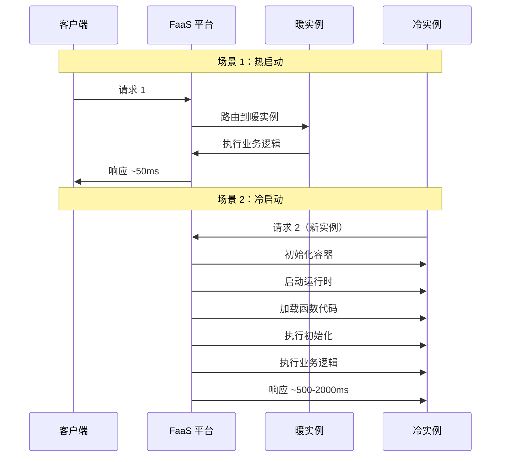
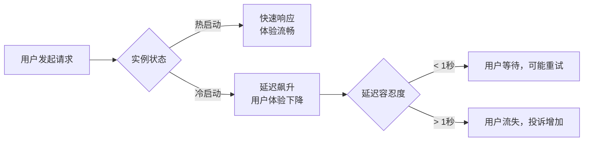

凌晨 2 点，你的秒杀系统准时开放。前 100 个用户点击购买按钮，页面秒开，购买流程顺畅无比。但从第 101 个用户开始，页面开始转圈，加载时间从 200ms 飙升到 3 秒。用户抱怨、投诉、甚至直接退出。

这背后就是 Serverless 最头疼的问题：**冷启动（Cold Start）**。

当函数第一次执行，或者空闲实例被销毁后再次调用时，平台需要从头启动一个函数实例。这个过程需要时间——可能是几百毫秒，也可能是几秒。对于延迟敏感的业务，这几秒就是灾难。

## 冷启动的定义

冷启动是指函数在没有预热实例的情况下，从收到请求到开始执行业务逻辑之间的时间间隔。

与冷启动对应的是**热启动（Warm Start）**：函数使用已经就绪的实例处理请求，几乎没有额外开销。



## 冷启动的三个阶段

一次完整的冷启动由以下阶段组成：

### 阶段 1：容器初始化

平台从资源池中分配一个容器实例。这包括：

- 分配计算资源（CPU、内存）
- 设置网络命名空间
- 挂载文件系统

这个阶段通常需要 **50-200ms**，由云厂商的基础设施决定，开发者无法优化。

### 阶段 2：运行时启动

启动语言运行时环境。不同语言的启动时间差异巨大：

| 语言 | 运行时 | 启动时间 | 原因 |
| --- | --- | --- | --- |
| Go | 原生编译 | `5-20ms` | 直接执行机器码 |
| Node.js | V8 引擎 | `50-150ms` | JS 解析和 JIT 编译 |
| Python | CPython | `50-200ms` | 解释器初始化 |
| Java | JVM | `500-2000ms` | 类加载、字节码验证、JIT |

Java 的冷启动问题最为严重。JVM 需要：

1. 加载 JVM 运行时（几十 MB）
2. 执行字节码验证
3. 预编译热点代码（JIT）
4. 运行静态初始化代码

### 阶段 3：函数初始化

执行函数代码中的静态初始化逻辑：

```java title="初始化代码示例"
public class MyFunction {
    // 静态代码块：冷启动时执行
    static {
        loadConfiguration();    // 加载配置
        initDatabasePool();     // 初始化数据库连接池
        warmupCache();          // 预热缓存
        loadModels();           // 加载 ML 模型
    }

    public void handleRequest(Object event, Context context) {
        // 业务逻辑：函数被调用时执行
    }
}
```

:::warning
**初始化陷阱**：很多人把耗时操作放在静态代码块里，认为「只执行一次没关系」。但这些操作会在每次冷启动时重复执行，严重影响响应时间。
:::

## 影响因素

### 语言运行时

这是影响冷启动最大的因素。Go、Rust 等编译型语言的冷启动时间可以控制在 20ms 以内，而 Java 可能需要 2 秒以上。

### 内存配置

函数内存越大，CPU 配额也越大，运行时执行更快。AWS Lambda 的 CPU 与内存成正比：

```yaml title="内存与 CPU 关系（AWS Lambda）"
memorySize: 128 MB   # CPU: ~0.1 vCPU
memorySize: 512 MB   # CPU: ~0.33 vCPU
memorySize: 1024 MB  # CPU: ~1 vCPU
memorySize: 2048 MB  # CPU: ~2 vCPU
```

冷启动延迟降低效果：内存翻倍，启动时间通常缩短 30%-50%。

### 代码包大小

代码包越大，下载、解压和加载的时间越长：

| 代码包大小 | 额外冷启动时间（估算） |
| --- | --- |
| `< 1 MB` | 几乎无影响 |
| `1-10 MB` | `+50-200ms` |
| `10-50 MB` | `+200-500ms` |
| `> 50 MB` | 可能超出限制或极慢 |

### 依赖库

运行时依赖越多，启动时需要加载的类/模块越多：

- Java：Spring Boot 框架可能引入数百个 JAR，启动时间可能超过 3 秒
- Python：NumPy、Pandas 等大型库会显著增加启动时间
- Node.js：大量 npm 包会增加模块解析时间

### 初始化逻辑复杂度

静态代码块中的操作会直接影响冷启动时间：

```java title="❌ 冷启动杀手"
static {
    // 同步加载大文件
    byte[] model = Files.readAllBytes(Paths.get("/tmp/model.bin"));

    // 同步初始化连接池
    connectionPool = new HikariDataPool(config);

    // 预热大量缓存
    for (String key : loadAllKeys()) {
        cache.put(key, loadValue(key));
    }
}
```

```java title="✓ 懒加载优化"
private static volatile Cache cache;

private static Cache getCache() {
    if (cache == null) {
        synchronized (MyFunction.class) {
            if (cache == null) {
                cache = new Cache();
            }
        }
    }
    return cache;
}
```

## 性能数据对比

### 各语言冷启动时间

以下数据基于 AWS Lambda 的实测（仅供参考，实际性能因场景而异）：

| 语言 | 运行环境 | 最小内存冷启动 | 较大内存冷启动 | 备注 |
| --- | --- | --- | --- | --- |
| Go | 原生 | `5-20ms` | `5-15ms` | 编译为单一可执行文件 |
| Rust | 原生 | `10-30ms` | `10-20ms` | 启动时间极短 |
| Node.js | Node.js 18 | `100-300ms` | `80-200ms` | V8 引擎启动 |
| Python | Python 3.11 | `100-400ms` | `80-300ms` | 解释器启动 |
| Java | Corretto 17 | `800-2000ms` | `500-1500ms` | JVM 启动是主因 |
| C# (.NET) | .NET 6 | `300-1500ms` | `200-800ms` | CoreCLR 启动 |

### 热启动对比

热启动（复用已有实例）的时间通常非常稳定：

| 语言 | 热启动时间 |
| --- | --- |
| Go | `< 1ms` |
| Node.js | `1-5ms` |
| Python | `1-5ms` |
| Java | `1-10ms` |

热启动时间主要是函数调用的固定开销，与语言关系不大。

### 冷启动 vs 热启动延迟差距

```mermaid
barChart
    title 函数启动延迟（单位：ms）
    x-axis 语言
    y-axis 延迟 (ms)
    Go: 15, 2
    Node.js: 200, 3
    Python: 300, 4
    Java: 1500, 5

    legend: ["冷启动", "热启动"]
```

## 何时关注冷启动

### 需要关注冷启动的场景

- **用户交互类 API**：HTTP 请求需要实时响应，用户感知延迟
- **高频低延迟场景**：每次调用都需要快速响应
- **流量突增场景**：大促、秒杀，系统需要快速响应大量新用户
- **移动端 API**：移动网络延迟高，冷启动会让体验雪上加霜

### 可以容忍冷启动的场景

- **异步任务处理**：用户不等待结果，如文件处理、消息消费
- **后台批处理**：定时执行，用户不感知
- **低频 API**：调用间隔长，可能每次都冷启动，但用户不急于等待
- **长时任务**：任务执行时间远大于冷启动时间

### 判断标准

一个简单的判断公式：

```
业务可接受延迟 > 冷启动时间 + 业务逻辑执行时间
```

如果业务要求的 P99 延迟是 500ms，而冷启动时间可能达到 2 秒，那么冷启动就是一个问题。

## 冷启动对业务的影响

### 用户体验影响



### 业务指标影响

冷启动对业务指标的影响因场景而异：

| 业务场景 | 冷启动影响 | 量化估算 |
| --- | --- | --- |
| **秒杀系统** | 首位用户等待，后继用户流失 | 冷启动期间转化率下降 30%-50% |
| **实时 API** | P99 延迟升高，SLA 可能不达标 | P99 可能从 100ms 升至 2s |
| **文件处理** | 几乎无影响 | 业务逻辑耗时远超冷启动 |
| **消息消费** | 消息堆积，但最终能处理完 | 不影响用户体验 |

### 成本影响

冷启动本身不产生额外计费（按执行时间计费，冷启动包含在内）。但冷启动导致的性能问题可能引发：

- 重试增加（用户刷新页面）
- 资源浪费（不必要的扩容）
- 业务损失（用户流失）

## 权衡矩阵

| 优化手段 | 效果 | 代价 | 适用场景 |
| --- | --- | --- | --- |
| **选编译型语言** | 冷启动从 2s 降到 20ms | 需要重写代码 | 延迟敏感场景 |
| **加大内存配置** | 冷启动降低 30-50% | 成本增加 | 内存非瓶颈的场景 |
| **精简代码包** | 降低 50-200ms | 需要依赖管理 | 代码包 > 10MB |
| **懒加载初始化** | 降低 50-500ms | 代码复杂度增加 | 初始化逻辑复杂 |
| **预留并发** | 消除冷启动 | 按预留实例计费 | 关键函数、高价值请求 |
| **预热请求** | 减少冷启动概率 | 需要额外机制 | 可预测的峰值 |

## 常见问题与反模式

### 反模式 1：所有函数都用 Java/Spring

Spring Boot 的启动时间可能超过 5 秒，如果每个函数都使用 Spring，会导致灾难性的冷启动。

**正确做法**：

- 延迟不敏感的后台任务可以用 Java
- 延迟敏感的 API 用 Node.js/Python
- 或者不用 Spring，改用轻量级框架

### 反模式 2：把数据库连接放在初始化

```java title="❌ 错误示例"
static {
    db = DriverManager.getConnection(DB_URL, DB_USER, DB_PASS);
}
```

连接池在冷启动时建立，如果连接慢，会延长冷启动时间。

**正确做法**：懒加载连接池，或使用框架提供的连接管理。

### 反模式 3：每个请求都预热

有人会写定时脚本，每隔 5 分钟调用一次所有函数，避免冷启动。

```java title="定时预热示例"
@Scheduled(fixedRate = 300000)  // 5 分钟
public void warmup() {
    httpClient.get("https://xxx.lambda-url.region.on.aws/");
}
```

**正确做法**：

- 使用平台提供的预留并发
- 或接受偶发的冷启动（大多数场景可容忍）
- 或设计容错机制（前端降级、重试策略）

## 延伸思考

冷启动不是 Serverless 的「bug」，而是它的「feature」——正是因为函数可以随时销毁和创建，云才能实现近乎无限的弹性和按需计费。

理解这一点很重要：**冷启动是 Serverless 的代价之一**。如果你不能接受冷启动，要么选择预留并发（付出固定成本），要么选择其他架构（付出运维成本）。

在实际项目中，我的建议是：

1. **先测量，再决策**：先用真实流量测试，了解冷启动的实际影响
2. **分层处理**：关键路径用预留并发，非关键路径用按需
3. **设计容错**：前端做好超时和重试，不把冷启动当成故障

Serverless 不是银弹，冷启动也不是灾难。理解它的边界，把它用在合适的场景里。
