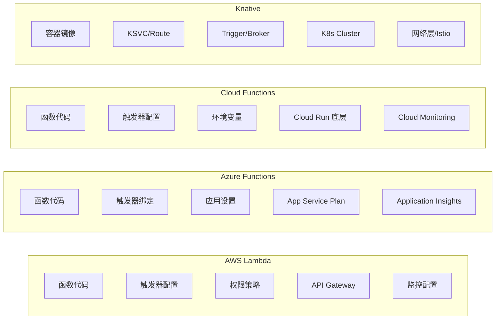
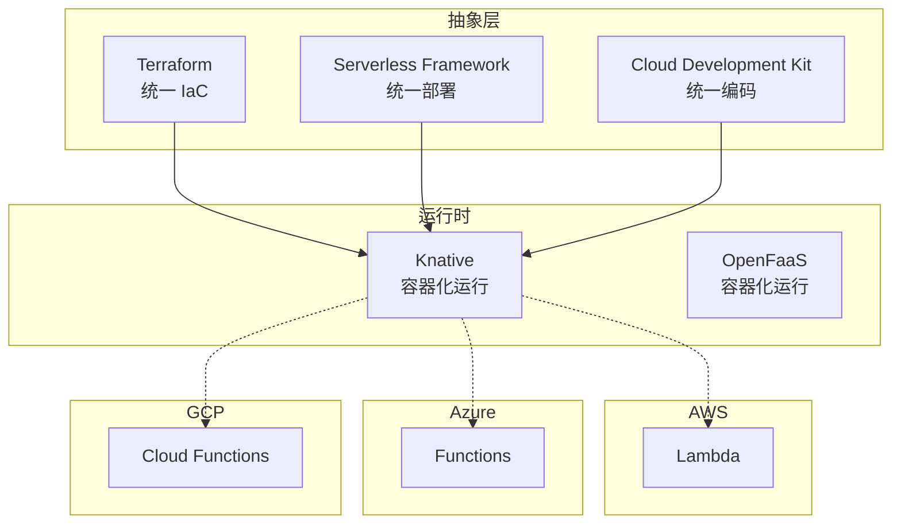

你的 CTO 决定评估 Serverless 作为新项目的计算平台。团队里有人用 Lambda，有人推荐 Azure Functions，隔壁组刚上了 Knative。每个人都说自己的方案最好。

**「没有最好的框架，只有最适合的框架。」** 本文的目的是帮你建立完整的评估框架，而不是给你一个标准答案。

## 评估维度

评估 Serverless 框架时，需要从多个维度综合考虑：

| 评估维度 | 关键问题 |
| --- | --- |
| **功能能力** | 支持哪些触发器、语言、集成？ |
| **性能特征** | 冷启动时间、执行时间限制、并发能力？ |
| **成本模型** | 计费方式、免费额度、规模经济？ |
| **运维复杂度** | 需要管理什么？学习曲线如何？ |
| **生态集成** | 与云服务的集成度如何？ |
| **可移植性** | 能否跨云部署？ |
| **企业支持** | SLA 保障、技术支持、社区活跃度？ |

## 功能对比

### 触发器与事件源

| 触发器 | AWS Lambda | Azure Functions | Cloud Functions | Knative |
| --- | --- | --- | --- | --- |
| **HTTP** | API Gateway/VPC | 内置 HTTP | 内置 HTTP | Istio/Contour |
| **定时任务** | EventBridge | Timer Trigger | Cloud Scheduler | CronJob Source |
| **对象存储** | S3 | Blob Trigger | Storage Trigger | Source 适配 |
| **消息队列** | SQS | Queue Trigger | Pub/Sub | Kafka/MT Broker |
| **数据库变更** | DynamoDB Streams | Cosmos DB Change Feed | Firestore | Trigger 适配 |
| **流数据** | Kinesis | Event Hubs | Dataflow | Kafka Source |
| **消息主题** | SNS | Service Bus | Pub/Sub | Broker/Channel |

### 编程语言支持

| 语言 | AWS Lambda | Azure Functions | Cloud Functions | Knative |
| --- | --- | --- | --- | --- |
| **Node.js** | 18.x, 16.x | 18, 16, 14 | 18, 16, 14 | ✓ |
| **Python** | 3.11, 3.10, 3.9 | 3.11, 3.10, 3.9 | 3.11, 3.10, 3.9 | ✓ |
| **Java** | 17, 11, 8 | 17, 11, 8 | 17, 11 | ✓ |
| **Go** | 1.x | 不支持 | 1.x | ✓ |
| **.NET** | 不支持 | 6, 3.1 | 不支持 | ✓ |
| **Ruby** | 3.x | 不支持 | 不支持 | ✓ |
| **Custom Runtime** | ✓ | ✓ | ✓ | ✓ |

### 状态与编排

| 能力 | AWS Lambda | Azure Functions | Cloud Functions | Knative |
| --- | --- | --- | --- | --- |
| **有状态函数** | Step Functions | Durable Functions | 外部服务 | KEDA + State |
| **工作流编排** | Step Functions | Durable Functions | Workflows API | Argo/Tekton |
| **Saga 模式** | Step Functions | Durable Functions | 自定义 | 自定义 |
| **人类交互** | Task Token | Approval | Callback | 自定义 |

## 性能对比

### 冷启动时间

| 运行时 | Lambda | Azure | Cloud Functions |
| --- | --- | --- | --- |
| **Node.js** | 50-200ms | 100-300ms | 100-200ms |
| **Python** | 100-300ms | 100-300ms | 100-300ms |
| **Java** | 1-5s (含 SnapStart) | 2-10s | 2-8s |
| **Go** | 10-50ms | N/A | 50-100ms |

### 执行限制

| 限制 | AWS Lambda | Azure Functions | Cloud Functions |
| --- | --- | --- | --- |
| **最大执行时间** | 15 分钟 | 无限制（消耗计划） | 60 分钟（2nd gen） |
| **最大内存** | 10 GB | 14 GB | 8 GB |
| **最大包大小** | 50 MB（解压 250 MB） | 100 MB（扩展到 500 MB） | 100 MB |
| **HTTP 超时** | 30 秒（API GW） | 230 秒 | 60-3600 秒 |

### 扩缩容

| 特性 | AWS Lambda | Azure Functions | Cloud Functions |
| --- | --- | --- | --- |
| **并发限制** | 账户级默认 1000 | 100-200（消耗） | 1000（2nd gen） |
| **最小实例** | 无 | Premium: 0/1 | 2nd gen: 支持 |
| **并发/实例** | 1 | 多（可配置） | 多（2nd gen） |

## 成本对比

### 计费模型

| 计费项 | AWS Lambda | Azure Functions | Cloud Functions |
| --- | --- | --- | --- |
| **执行时间** | 每 GB-秒 | 每 GB-秒 | 每 GB-秒 |
| **请求数** | 每 100 万次 | 每 100 万次 | 每 100 万次 |
| **免费额度** | 400K GB-s + 1M 请求/月 | 400K GB-s + 1M 请求/月 | 400K GB-s + 2M 请求/月 |
| **1M 请求 + 1B GB-s 成本** | ~$0.20 | ~$0.20 | ~$0.40 |

### 实际成本计算

假设一个函数配置：

- 内存：512 MB
- 执行时间：100ms
- 月请求量：1000 万次

```python title="cost_calculator.py"
def calculate_monthly_cost(
    memory_mb: int,
    duration_ms: int,
    monthly_requests: int,
    provider: str
) -> float:
    # 执行时间成本（GB-秒）
    gb_seconds = (memory_mb / 1024) * (duration_ms / 1000) * monthly_requests

    # 每月免费额度
    free_gb_seconds = 400_000  # 约 400K GB-秒

    # 计费 GB-秒
    billable_gb_seconds = max(0, gb_seconds - free_gb_seconds)

    # 成本计算（美元）
    if provider == "aws":
        # $0.0000166667 per GB-second
        execution_cost = billable_gb_seconds * 0.0000166667
        request_cost = (monthly_requests / 1_000_000) * 0.20
    elif provider == "azure":
        execution_cost = billable_gb_seconds * 0.000016
        request_cost = (monthly_requests / 1_000_000) * 0.20
    else:  # gcp
        execution_cost = billable_gb_seconds * 0.000015
        request_cost = (monthly_requests / 1_000_000) * 0.40

    return execution_cost + request_cost

# 计算示例
cost = calculate_monthly_cost(
    memory_mb=512,
    duration_ms=100,
    monthly_requests=10_000_000,
    provider="aws"
)
print(f"Monthly cost: ${cost:.2f}")  # ~$6.67
```

## 运维对比

### 需要管理的组件



### 部署工具

| 工具 | AWS | Azure | GCP | Knative |
| --- | --- | --- | --- | --- |
| **CLI** | AWS CLI, SAM CLI | Azure CLI, Functions Core | gcloud CLI | kubectl |
| **IaC** | Terraform, SAM | ARM, Bicep, Terraform | Terraform | Helm, Kustomize |
| **框架** | Serverless Framework | Durable Functions SDK | Functions Framework | Custom YAML |
| **CDK** | AWS CDK | 不支持 | 不支持 | CDK8s |

## 集成生态

### 数据库

| 数据库 | Lambda | Azure | GCP | Knative |
| --- | --- | --- | --- | --- |
| **SQL** | RDS Proxy, Aurora | SQL Database, Cosmos DB | Cloud SQL | 标准驱动 |
| **NoSQL** | DynamoDB | Cosmos DB | Firestore, Bigtable | 标准驱动 |
| **Cache** | ElastiCache | Azure Cache | Memorystore | 标准驱动 |
| **Search** | CloudSearch, OpenSearch | Azure Search | Cloud Search | 标准驱动 |

### 监控

| 监控 | Lambda | Azure | GCP | Knative |
| --- | --- | --- | --- | --- |
| **日志** | CloudWatch Logs | Application Insights | Cloud Logging | Loki/EFK |
| **指标** | CloudWatch Metrics | Monitor | Cloud Monitoring | Prometheus |
| **追踪** | X-Ray | Application Insights | Cloud Trace | Jaeger |
| **APM** | 第三方 | Application Insights | Operations | Jaeger/Grafana |

## 可移植性

### 跨云策略



### 迁移复杂度

| 迁移路径 | 复杂度 | 主要工作 |
| --- | --- | --- |
| Lambda → Azure Functions | 中 | 触发器适配、SDK 替换 |
| Lambda → Cloud Functions | 低 | 触发器适配、SDK 替换 |
| Lambda → Knative | 高 | 容器化、网络配置 |
| Functions → Knative | 中 | 容器化、集成配置 |

## 选择建议

### 按场景推荐

| 场景 | 推荐 | 原因 |
| --- | --- | --- |
| **AWS 深度集成** | Lambda | 原生集成、成本优化 |
| **Azure 深度集成** | Azure Functions | Microsoft 生态无缝 |
| **GCP 深度集成** | Cloud Functions | GCP 服务原生 |
| **跨云部署** | Knative | 无厂商锁定 |
| **有状态工作流** | Durable Functions / Step Functions | 内置编排 |
| **简单事件处理** | Cloud Functions | 最快上手 |
| **长期运行任务** | Knative / Cloud Run | 无时间限制 |
| **现有 K8s 架构** | Knative | 复用基础设施 |

### 按团队推荐

| 团队情况 | 推荐 | 原因 |
| --- | --- | --- |
| **DevOps 全栈团队** | Knative | 完全可控 |
| **快速创业公司** | 云函数 | 最小运维 |
| **大型企业** | 云函数 + 治理 | 云厂商企业支持 |
| **初学 Serverless** | Cloud Functions | 文档最清晰 |

## 评估清单

在选择 Serverless 平台前，回答这些问题：

1. **厂商锁定是否可接受？**
   - 如果需要多云，Knative 是唯一选择

2. **冷启动是否关键？**
   - 如果 P99 延迟敏感，考虑 Go/Node.js 或 Provisioned Concurrency

3. **执行时间有多长？**
   - 如果超过 15 分钟，Lambda 不适用

4. **团队技术栈是什么？**
   - .NET 团队优先 Azure Functions
   - Java 团队考虑 Knative + Spring Boot

5. **运维能力如何？**
   - 无 K8s 经验，优先云函数
   - 有 K8s 经验，Knative 更灵活

6. **成本模型是否清晰？**
   - 运行频率高时，专用实例/Reserved 可能更划算

## 延伸思考

Serverless 选型不是一次性的决定，而是可以渐进演进的：

1. **起步**：选择一个云厂商的 Serverless，原型验证
2. **成长**：识别核心业务，考虑跨云抽象
3. **成熟**：如果需要多云，迁移到 Knative 或 Serverless Framework

记住：**Serverless 的价值不在于「不用管理服务器」，而在于「只为你使用的计算付费」。** 如果你的应用负载稳定，Serverless 可能比 EC2 更贵。

评估的核心问题是：**Serverless 是否能降低我的总拥有成本（TCO）？**