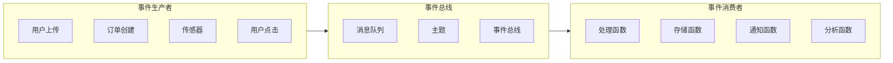
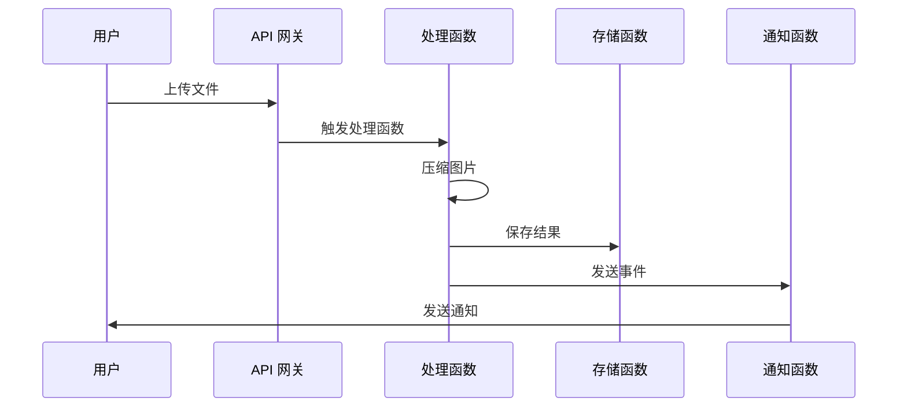
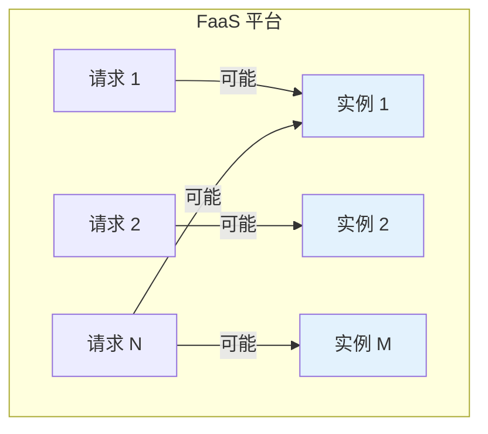
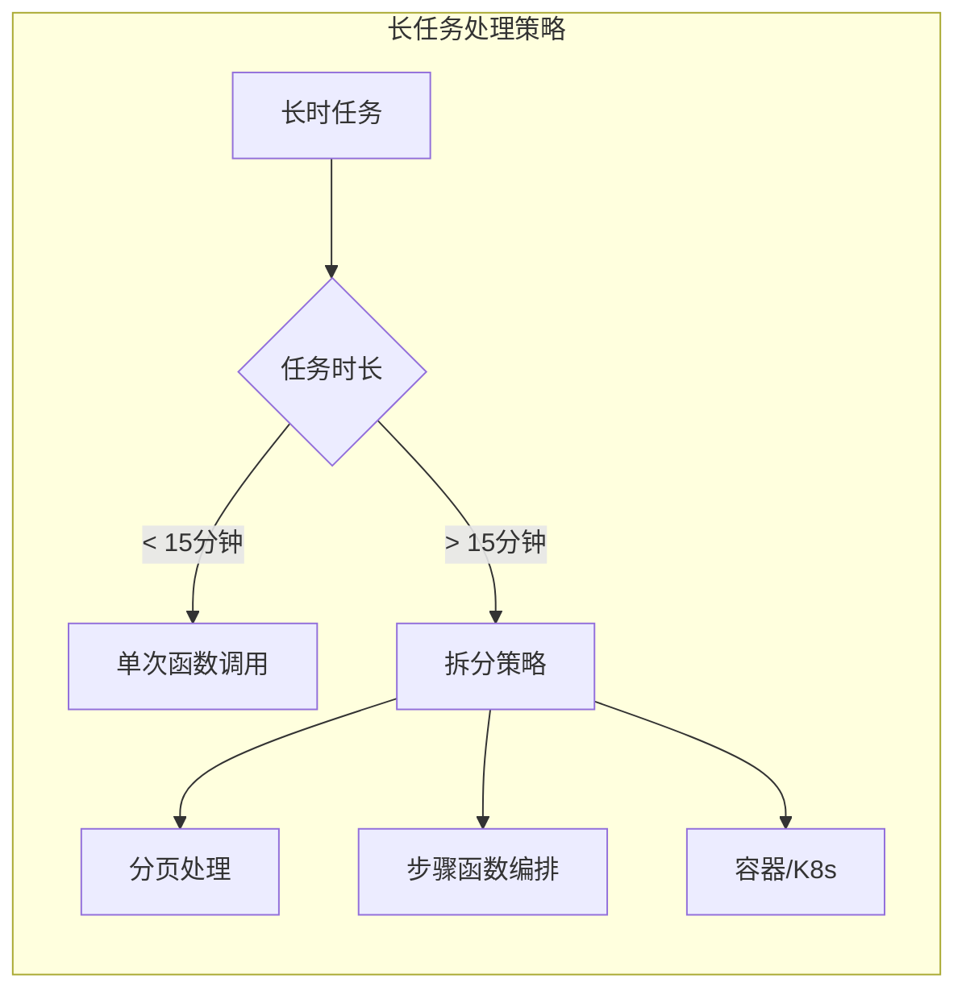
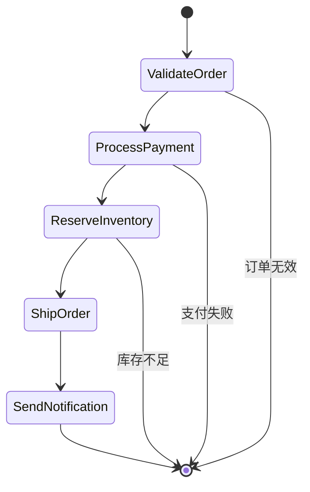
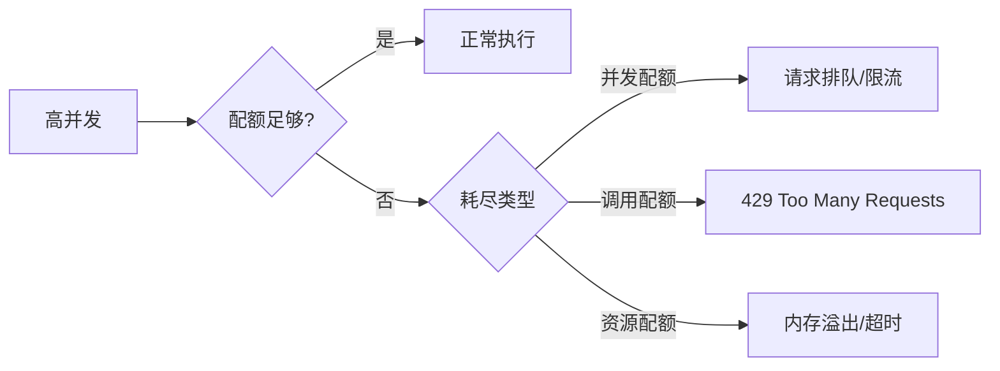

你正在开发一个视频处理服务。用户在 App 上传视频，后台自动转码成多种分辨率，并生成缩略图。传统做法是：一个常驻服务持续监听消息队列，处理完成后更新数据库。

但问题是：凌晨 3 点，没有用户上传视频，你的服务还在空跑，浪费资源。大促期间，上传量暴增 50 倍，你得提前扩容服务器，否则队列堆积、用户等待时间爆炸。

Serverless 的核心设计哲学正是为了解决这个矛盾：**不要为空闲付钱，也不要为峰值发愁**。但要实现这个目标，你需要理解它的几个核心概念。

## 事件驱动架构

### 什么是事件驱动

事件驱动架构是一种软件设计模式，其中系统的组件通过**事件的产生、消费和响应**来进行通信和解耦。

在传统请求-响应模型中，客户端主动发起请求，服务端被动响应。在事件驱动模型中，**事件生产者**产生事件，**事件消费者**订阅并响应事件，两者不需要直接交互。



### Serverless 中的事件驱动

Serverless 函数天然适合事件驱动架构：

- 函数本身不运行，直到有事件触发
- 事件源（HTTP 请求、消息队列、定时器）统一抽象为触发器
- 函数之间通过事件总线解耦，可以独立扩展



### 事件驱动的好处

| 好处 | 说明 |
| --- | --- |
| **松耦合** | 生产者和消费者不直接依赖，可以独立开发和部署 |
| **弹性扩展** | 每个消费者独立扩缩容，不相互影响 |
| **容错性强** | 事件可持久化，失败后可重试 |
| **成本优化** | 空闲时不消耗资源 |

### 事件驱动 vs 请求-响应

:::tip
**如何选择**：事件驱动适合异步、解耦、可并行处理的工作流；请求-响应适合需要实时返回结果的场景。两者可以共存——API 网关接收请求（同步），触发函数处理后发布事件（异步）。
:::

## 无状态函数

### 无状态原则

Serverless 函数的核心原则是**无状态**：每次函数执行，都应该是独立的，不依赖上一次执行留下的数据。

这意味着：

- 函数执行完成后，内存中的数据会丢失
- 临时文件会被清理
- 无法持有数据库连接、线程池等资源

```java title="无状态函数示例"
public class StatelessFunction {
    // 错误：持有状态
    // private static String cachedData;  // ❌ 不推荐

    public void handleRequest(Object event, Context context) {
        // 每次执行都是全新的开始
        // 所有需要持久化的数据必须存储到外部服务

        // 从外部存储获取数据
        String data = externalStorage.get("key");

        // 处理业务逻辑
        String result = process(data);

        // 将结果存储到外部服务
        externalStorage.put("result", result);
    }
}
```

### 如何实现状态外部化

当函数需要维护状态时，必须将状态存储到外部服务：

| 状态类型 | 存储方案 |
| --- | --- |
| **会话数据** | Redis、Memcached、DynamoDB |
| **文件数据** | S3、OSS、GCS |
| **结构化数据** | RDS、MongoDB、CosmosDB |
| **配置数据** | 配置中心、环境变量 |
| **缓存数据** | ElastiCache、Redis Cluster |

```java title="状态外部化示例"
public class StatefulFunction {
    private static Jedis redis;  // 保持单例，但每次调用可能连接不同实例

    public void handleRequest(Object event, Context context) {
        // 初始化 Redis 连接（懒加载）
        if (redis == null) {
            redis = new Jedis(
                System.getenv("REDIS_HOST"),
                Integer.parseInt(System.getenv("REDIS_PORT"))
            );
        }

        // 读取状态
        String counter = redis.get("request_counter");

        // 更新状态
        redis.incr("request_counter");

        // 业务逻辑...
    }
}
```

:::warning
**连接池复用**：每次函数调用都创建新连接会产生额外开销。可以使用单例模式或框架提供的连接管理功能，避免频繁创建和销毁连接。
:::

## 并发模型

### 请求级并发

Serverless 平台的并发模型是**请求级**的：当多个请求同时到达时，平台会同时启动多个函数实例来处理这些请求。



### 并发限制

云厂商对并发数有限制：

| 限制类型 | AWS Lambda | 阿里云 FC | 说明 |
| --- | --- | --- | --- |
| **默认并发数** | 100-1000 | 100 | 与地域相关 |
| **最大并发数** | 可提升（预留并发） | 可配置 | 需要申请或付费 |
| **单函数并发** | 受全局限制 | 受全局限制 | 所有函数共享 |
| **突发并发** | 可 Burst 到 500-3000 | 支持 | 短时间内突破限制 |

### 预留并发 vs 按需并发

| 类型 | 按需并发 | 预留并发 |
| --- | --- | --- |
| **计费** | 免费，但有上限 | 按预留实例计费 |
| **冷启动** | 可能发生 | 不会冷启动 |
| **适用场景** | 流量波动大、预算敏感 | 延迟敏感、流量稳定 |

```yaml title="预留并发配置"
function:
  name: critical-api
  provisionedConcurrency: 10  # 预留 10 个并发实例
```

:::info
**预留给谁**：预留并发适合对延迟敏感的关键函数，如核心 API、实时处理管道。不需要给所有函数都预留并发。
:::

## 执行时长限制

Serverless 函数通常有**最大执行时长**限制：

| 厂商 | 最大执行时长 | 适用场景 |
| --- | --- | --- |
| AWS Lambda | 15 分钟 | 短时任务 |
| 阿里云 FC | 24 小时（可配置） | 中长任务 |
| Azure Functions | 无硬性限制 | 任意时长 |

### 时长限制的影响

长时任务需要拆分或选择其他方案：



### 步骤函数编排

对于需要长时执行的复杂工作流，可以使用步骤函数（Step Functions）编排多个函数：



## 依赖包大小限制

函数代码包有大小限制：

| 厂商 | 代码包限制 | 压缩包限制 |
| --- | --- | --- |
| AWS Lambda | 50 MB（解压后 250 MB） | 50 MB（直接上传） |
| 阿里云 FC | 50 MB | 50 MB |
| Azure Functions | 100 MB | 100 MB |

### 优化依赖包

依赖包过大会导致：

- 冷启动时间延长（下载和解压耗时）
- 部署时间增加
- 可能超出平台限制

```bash title="依赖优化命令"
# 只安装运行时需要的依赖
npm install --production

# 使用 bundler 移除未使用的代码
pip install --no-deps  # 谨慎使用

# 分析包大小
npm run build && npx bundlephobia
```

### 分层策略（Layers）

将公共依赖抽取为层（Layer），可复用且不计入函数包大小：

```yaml title="Layer 配置"
function:
  name: image-processor
  layers:
    - arn:aws:lambda:us-east-1:123456789012:layer:common-utils:1
    - arn:aws:lambda:us-east-1:123456789012:layer:image-processing:2

layer:
  name: common-utils
  content:
    - common-lib.jar
    - config/
```

## 并发限制与配额

### 配额类型

| 配额类型 | 说明 | 调整方式 |
| --- | --- | --- |
| **并发配额** | 同时执行的函数实例数上限 | 控制台调整/提交工单 |
| **调用配额** | 单位时间内的最大调用次数 | 通常自动调整 |
| **资源配额** | 内存、CPU、临时存储限制 | 按函数配置 |

### 配额耗尽的表现



### 配额管理策略

- **监控配额使用**：设置告警，提前发现配额瓶颈
- **请求限流**：在函数内或 API 网关层限流，保护下游服务
- **错峰处理**：将批量任务分散到不同时间窗口
- **申请提升**：对于确定的业务增长，提前申请配额提升

## 权衡矩阵

| 维度 | Serverless 优势 | Serverless 劣势 |
| --- | --- | --- |
| **弹性** | 毫秒级扩缩容，近乎无限 | 并发配额受限 |
| **成本** | 低流量时成本低 | 高流量时成本可能更高 |
| **运维** | 无服务器运维负担 | 需要函数级运维 |
| **性能** | 热函数延迟低 | 冷启动有额外延迟 |
| **状态** | 无状态简化推理 | 状态管理需要外部化 |
| **控制** | 配置简单 | 定制化能力受限 |

## 常见问题与反模式

### 反模式 1：在函数中存储状态

```java title="❌ 错误示例"
public class BadFunction {
    private static Map<String, Object> cache = new HashMap<>();

    public void handleRequest(Object event) {
        cache.put("lastEvent", event);  // 函数销毁后数据丢失
        // ...
    }
}
```

```java title="✓ 正确示例"
public class GoodFunction {
    private static RedisClient redis;  // 外部状态存储

    public void handleRequest(Object event, Context context) {
        redis.setex("lastEvent", 3600, event);  // 状态存储到 Redis
        // ...
    }
}
```

### 反模式 2：忽略执行时长限制

```java title="❌ 错误示例"
public void handleRequest() {
    List<Record> allRecords = queryAllRecords();  // 假设返回 1000 万条
    for (Record r : allRecords) {
        process(r);
    }
}
```

```java title="✓ 正确示例"
public void handleRequest(Object event) {
    // 分页处理，设置超时检查
    int pageSize = 1000;
    int offset = 0;

    while (hasMoreData(offset) && !isTimeout()) {
        List<Record> page = queryRecords(offset, pageSize);
        processBatch(page);
        offset += pageSize;
    }
}
```

### 反模式 3：依赖函数实例状态做分布式锁

```java title="❌ 错误示例"
public void handleRequest(Object event) {
    // 函数实例状态不可靠，不能用于分布式锁
    if (instanceLock.tryLock()) {
        // 可能在其他实例上重复执行
    }
}
```

```java title="✓ 正确示例"
public void handleRequest(Object event) {
    // 使用 Redis 或数据库做分布式锁
    String lockKey = "processing:" + event.getId();
    Boolean acquired = redis.setnx(lockKey, "locked", "EX", 60);

    if (Boolean.TRUE.equals(acquired)) {
        try {
            process(event);
        } finally {
            redis.del(lockKey);
        }
    }
}
```

## 延伸思考

Serverless 的核心约束（无状态、执行时长限制、资源限制）迫使开发者以不同的方式思考系统设计。

当你遇到「这个在 Serverless 里怎么做」的问题时，答案是：**把状态推到外部，把工作流拆散，把复杂度转移到编排层**。

但这不意味着 Serverless 适合所有场景。对于需要复杂本地状态、长连接、或精细资源控制的场景，容器和传统架构仍然是更好的选择。Serverless 是工具箱里的一把新锤子，学会什么时候用它，什么时候不用它，才是真正的架构智慧。
