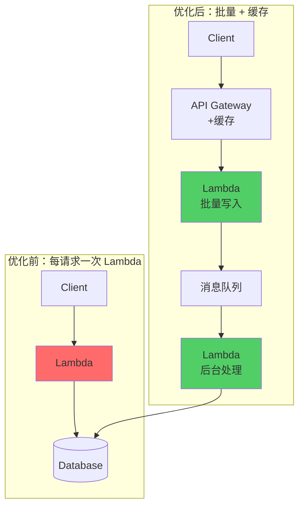

你的团队迁移到 Serverless 后，云账单反而涨了 30%。原本以为「按调用付费」会更省钱，结果每个月的支出都超出预期。

**「Serverless 不是免费的午餐，而是另一种成本模型。」** 理解 Serverless 的计费逻辑，才能真正发挥它的成本优势。

## Serverless 计费模型

### AWS Lambda 计费

Lambda 的计费基于两个维度：**执行时间**和**调用次数**。

```
月度成本 = (执行时间成本 × 执行时间) + (请求成本 × 调用次数)
```

| 计费项 | 免费额度 | 超出部分 |
| --- | --- | --- |
| **执行时间** | 400,000 GB-秒/月 | $0.0000166667/GB-秒 |
| **请求次数** | 1,000,000 次/月 | $0.20/1,000,000 次 |

### 执行时间计算

```python title="cost_calculator.py"
def calculate_lambda_cost(
    memory_mb: int,
    duration_ms: int,
    monthly_requests: int,
    provisioned_concurrency: int = 0,
    provisioned_hours_per_month: int = 0
) -> dict:
    """
    计算 Lambda 月度成本
    """
    # 按需执行成本
    gb_seconds_per_request = (memory_mb / 1024) * (duration_ms / 1000)
    total_gb_seconds = gb_seconds_per_request * monthly_requests

    # 免费额度
    free_gb_seconds = 400_000
    billable_gb_seconds = max(0, total_gb_seconds - free_gb_seconds)

    # 成本
    on_demand_cost = billable_gb_seconds * 0.0000166667  # $/GB-秒
    request_cost = (monthly_requests / 1_000_000) * 0.20

    # Provisioned Concurrency 成本
    provisioned_cost = 0
    if provisioned_concurrency > 0 and provisioned_hours_per_month > 0:
        # $0.000015 per GB-second
        provisioned_gb_seconds = (memory_mb / 1024) * (provisioned_concurrency * provisioned_hours_per_month * 3600)
        provisioned_cost = provisioned_gb_seconds * 0.000015

    return {
        'on_demand_cost': round(on_demand_cost, 4),
        'request_cost': round(request_cost, 4),
        'provisioned_cost': round(provisioned_cost, 4),
        'total_cost': round(on_demand_cost + request_cost + provisioned_cost, 4)
    }

# 示例：中等规模 API
result = calculate_lambda_cost(
    memory_mb=512,
    duration_ms=100,
    monthly_requests=10_000_000
)
print(result)
# {'on_demand_cost': 5.12, 'request_cost': 2.0, 'provisioned_cost': 0, 'total_cost': 7.12}
```

## 成本陷阱

### 陷阱一：高频小请求

当调用频率极高时，Lambda 可能比 EC2 更贵：

```python title="cost_comparison.py")
def compare_lambda_vs_ec2(
    requests_per_month: int,
    avg_duration_ms: int,
    memory_mb: int
) -> dict:
    """Lambda vs EC2 成本对比"""

    # Lambda 成本
    lambda_cost = calculate_lambda_cost(
        memory_mb, avg_duration_ms, requests_per_month
    )

    # EC2 成本（假设一个 t3.medium 足够）
    # t3.medium: $0.0416/小时，2 vCPU, 4GB RAM
    ec2_monthly_cost = 0.0416 * 24 * 30  # $29.95/月

    # 按需使用 EC2（如果 EC2 24/7 运行的话）
    # 但如果 EC2 也按需扩展呢？
    # 假设峰值 100 QPS，平均 10 QPS
    # EC2 需要 2 个实例处理峰值 = $59.9/月

    return {
        'lambda_monthly': lambda_cost['total_cost'],
        'ec2_monthly': ec2_monthly_cost,
        'break_even_qps': calculate_break_even(memory_mb, avg_duration_ms)
    }

def calculate_break_even(memory_mb: int, duration_ms: int) -> float:
    """计算 Lambda 比 EC2 贵的临界 QPS"""

    # EC2 t3.medium: $0.0416/小时 = $0.00001156/秒
    ec2_cost_per_second = 0.0416 / 3600

    # Lambda 成本: $0.0000166667/GB-秒
    # 单次调用成本
    lambda_cost_per_call = (memory_mb / 1024) * (duration_ms / 1000) * 0.0000166667

    # 每秒调用多少次时 Lambda 比 EC2 贵
    break_even_qps = ec2_cost_per_second / lambda_cost_per_call

    return break_even_qps

# 512MB, 100ms 的情况下
qps = calculate_break_even(512, 100)
print(f"Break-even QPS: {qps:.1f} req/s")
# ~278 req/s 临界点
# 低于此 QPS，Lambda 更便宜
# 高于此 QPS，EC2 更便宜
```

### 陷阱二：Provisioned Concurrency

```python title="provisioned_cost.py")
def analyze_provisioned_concurrency(
    baseline_qps: int,
    peak_qps: int,
    memory_mb: int,
    cost_per_gb_second: float = 0.000015
) -> dict:
    """
    分析 Provisioned Concurrency 的成本
    """

    # 默认情况：全部按需
    on_demand_cost = calculate_lambda_cost(
        memory_mb, 100, baseline_qps * 30 * 24 * 3600
    )

    # 全量 Provisioned
    provisioned_cost = calculate_lambda_cost(
        memory_mb, 100, 0,
        provisioned_concurrency=baseline_qps,
        provisioned_hours_per_month=24 * 30
    )

    return {
        'pure_on_demand': on_demand_cost,
        'fully_provisioned': provisioned_cost,
        'recommendation': 'Provisioned only if cold start cost > provisioned cost'
    }
```

### 陷阱三：数据传输成本

```python title="data_transfer.py")
def estimate_data_transfer_cost(
    monthly_requests: int,
    avg_request_size_kb: float,
    avg_response_size_kb: float
) -> dict:
    """
    估算数据传输成本
    """

    total_data_gb = monthly_requests * (avg_request_size_kb + avg_response_size_kb) / (1024 * 1024)

    # Lambda 同 Region 免费
    # Lambda → Internet: $0.09/GB
    # Lambda → 其他 Region: $0.02/GB
    # Lambda ← Internet: 免费

    internet_egress_cost = total_data_gb * 0.09

    return {
        'total_data_gb': round(total_data_gb, 2),
        'internet_egress_cost': round(internet_egress_cost, 2)
    }
```

## 成本优化策略

### 策略一：降低内存配置

```python title="memory_optimization.py")
def find_optimal_memory(
    duration_by_memory: dict[int, int]  # memory_mb -> duration_ms
) -> dict:
    """
    找到最优内存配置（成本最低）
    """
    results = []

    for memory_mb, duration_ms in duration_by_memory.items():
        # 计算执行时间成本
        gb_seconds = (memory_mb / 1024) * (duration_ms / 1000)
        cost_per_call = gb_seconds * 0.0000166667

        # 添加请求成本
        request_cost_per_call = 0.20 / 1_000_000
        total_cost_per_call = cost_per_call + request_cost_per_call

        # 计算 CPU 成本（CPU 与内存成正比）
        cpu_units = memory_mb / 128  # 128MB = 1 CPU unit

        results.append({
            'memory_mb': memory_mb,
            'duration_ms': duration_ms,
            'cost_per_1m_calls': round(total_cost_per_call * 1_000_000, 2),
            'cpu_units': cpu_units
        })

    return min(results, key=lambda x: x['cost_per_1m_calls'])

# 示例数据
duration_data = {
    128: 500,    # 低内存，慢
    256: 300,    # 中等
    512: 180,    # 较快
    1024: 120,   # 快
    2048: 100,   # 最快
}

optimal = find_optimal_memory(duration_data)
print(f"Optimal: {optimal['memory_mb']}MB, cost per 1M calls: ${optimal['cost_per_1m_calls']}")
```

### 策略二：减少执行时间

```typescript title="optimize_duration.ts"
// 优化前：同步调用
async function processOrder(orderId: string) {
  const order = await db.query(`SELECT * FROM orders WHERE id = '${orderId}'`);
  const user = await db.query(`SELECT * FROM users WHERE id = '${order.userId}'`);
  const items = await db.query(`SELECT * FROM order_items WHERE orderId = '${orderId}'`);
  return { order, user, items };
}

// 优化后：并行查询
async function processOrderOptimized(orderId: string) {
  // 并行执行所有查询
  const [order, user, items] = await Promise.all([
    db.query(`SELECT * FROM orders WHERE id = '${orderId}'`),
    db.query(`SELECT * FROM users WHERE id = '${order.userId}'`),
    db.query(`SELECT * FROM order_items WHERE orderId = '${orderId}'`),
  ]);
  return { order, user, items };
}
```

### 策略三：批处理

```typescript title="batch_processing.ts")
// 优化前：逐条处理
export const handler = async (event: SQSEvent) => {
  for (const record of event.Records) {
    await processMessage(JSON.parse(record.body));
  }
};

// 优化后：批量处理
export const handler = async (event: SQSEvent) => {
  const messages = event.Records.map(r => JSON.parse(r.body));

  // 批量写入数据库
  await db.batchWrite('messages', messages);

  // 批量发送通知
  await Promise.all(messages.map(m => sendNotification(m)));
};
```

### 策略四：分层架构



## 成本监控

### 成本分配标签

```yaml title="cost-tags.yaml")
Resources:
  LambdaFunction:
    Type: AWS::Serverless::Function
    Properties:
      FunctionName: !Sub '${Project}-${Environment}-order-service'
      Tags:
        Project: !Ref Project
        Environment: !Ref Environment
        CostCenter: !Ref CostCenter
        Owner: !Ref Owner
```

### 成本异常告警

```json title="cost-anomaly-alarm.json")
{
  "AlarmName": "Lambda Cost Anomaly",
  "AlarmDescription": "Lambda costs increased by more than 50%",
  "MetricName": "EstimatedCharges",
  "Namespace": "AWS/Billing",
  "Statistic": "Maximum",
  "Period": 86400,
  "EvaluationPeriods": 1,
  "Threshold": 1000,
  "ComparisonOperator": "GreaterThanThreshold",
  "TreatMissingData": "notBreaching",
  "Dimensions": [
    {
      "Name": "Currency",
      "Value": "USD"
    }
  ],
  "AlarmActions": [
    {
      "Ref": "AlarmSNSTopic"
    }
  ]
}
```

## 成本对比矩阵

| 场景 | Lambda 推荐 | EC2/ECS 推荐 | 原因 |
| --- | --- | --- | --- |
| **低频低延迟 API** | ✓ | - | Lambda 成本极低 |
| **高频低延迟 API** | - | ✓ | Lambda 成本超过 EC2 |
| **突发流量** | ✓ | - | Lambda 自动扩缩 |
| **稳定基线流量** | - | ✓ | 预留实例更划算 |
| **批量处理** | ✓ | - | Lambda 按执行时间计费 |
| **长时间任务** | - | ✓ | Lambda 最大 15 分钟 |
| **机器学习推理** | - | ✓ | GPU 支持、推理优化 |

## 成本优化清单

| 优化项 | 预期节省 | 实施难度 |
| --- | --- | --- |
| 降低不必要的内存配置 | 10-30% | 低 |
| 优化代码减少执行时间 | 20-50% | 中 |
| 使用批处理减少调用次数 | 30-70% | 中 |
| 合理设置超时时间 | 5-10% | 低 |
| 迁移稳定负载到 EC2 | 50-70% | 高 |
| 启用 Provisioned Concurrency 优化 | 视情况 | 中 |

## 实际案例分析

### 案例：电商促销系统

```python title="ecommerce_case.py")
# 促销前：日均 10 万次调用
normal_cost = calculate_lambda_cost(512, 100, 100_000 * 30)
print(f"Normal monthly cost: ${normal_cost['total_cost']}")
# $26.72

# 促销时：日均 500 万次调用（峰值）
promo_cost = calculate_lambda_cost(512, 100, 5_000_000 * 30)
print(f"Promo monthly cost: ${promo_cost['total_cost']}")
# $1,036.72

# EC2 方案（2 个 c6i.large 24/7）
ec2_monthly = 0.085 * 2 * 24 * 30  # $122.4
print(f"EC2 monthly cost: ${ec2_monthly}")
# $122.4

# 结论：促销成本是 EC2 的 8.5 倍
# 优化：使用 SQS 队列削峰 + 批量处理
```

## 延伸思考

Serverless 的成本优势不是自动获得的，而是需要精心设计：

1. **分析你的流量模式**：高频稳定流量可能不适合 Serverless
2. **监控执行时间**：每降低 10ms 都能节省成本
3. **考虑混合架构**：核心服务用 EC2，边缘用 Lambda
4. **建立成本意识**：让每个工程师都了解成本影响

核心问题是：**Serverless 的「按需扩展」优势，是否超过了它的「按调用计费」溢价？** 如果你的流量稳定且可预测，EC2/ECS 可能是更经济的选择。