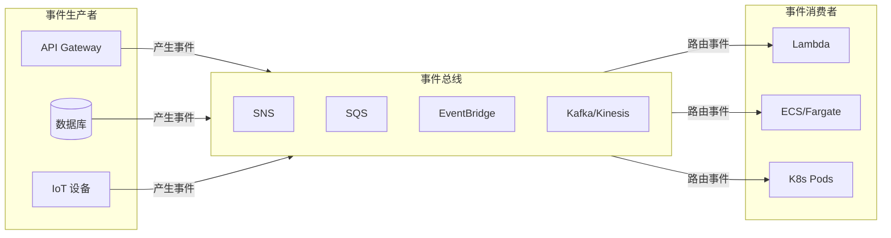
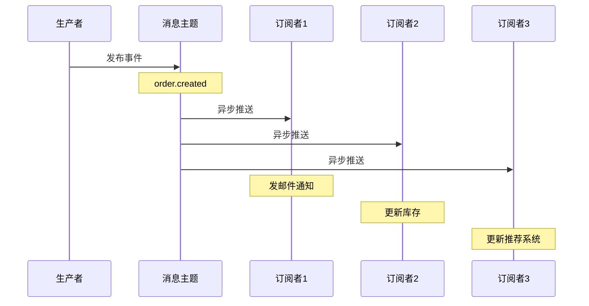
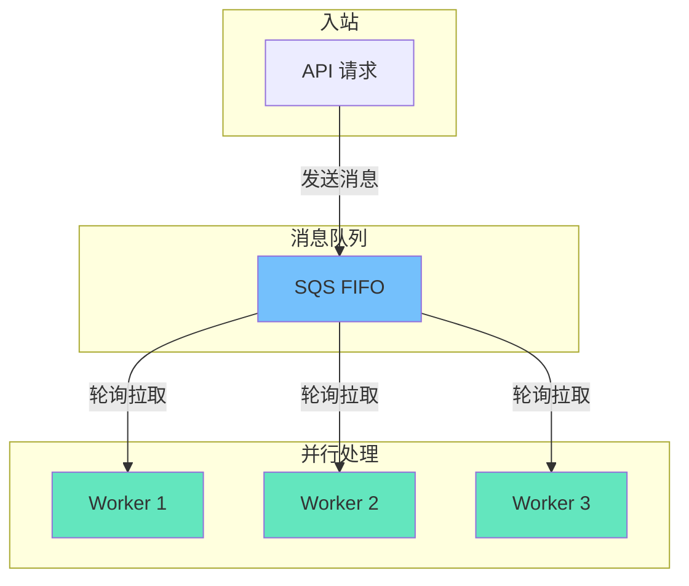
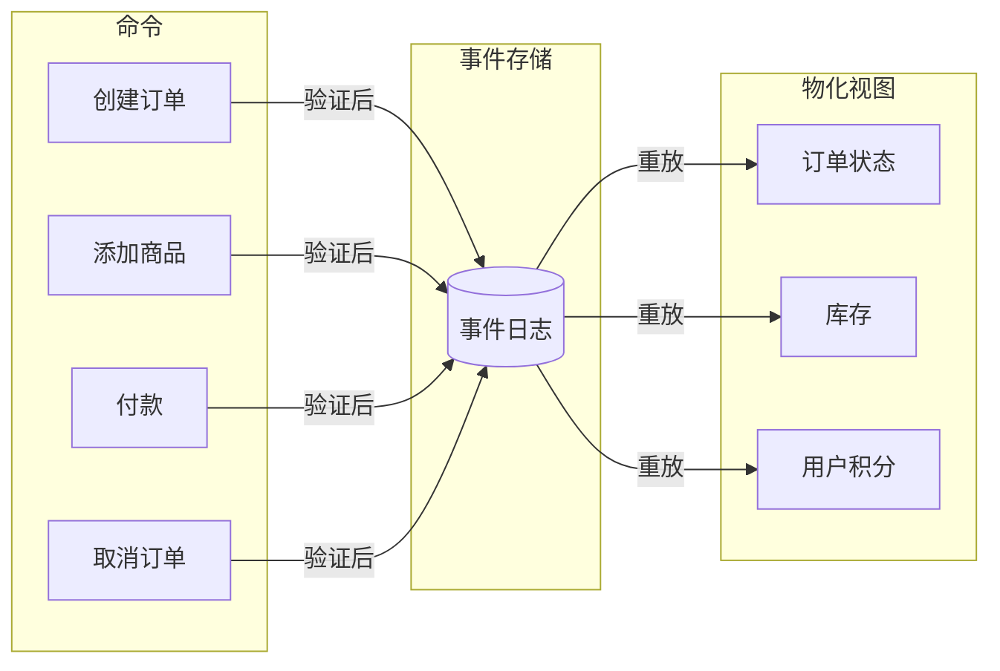
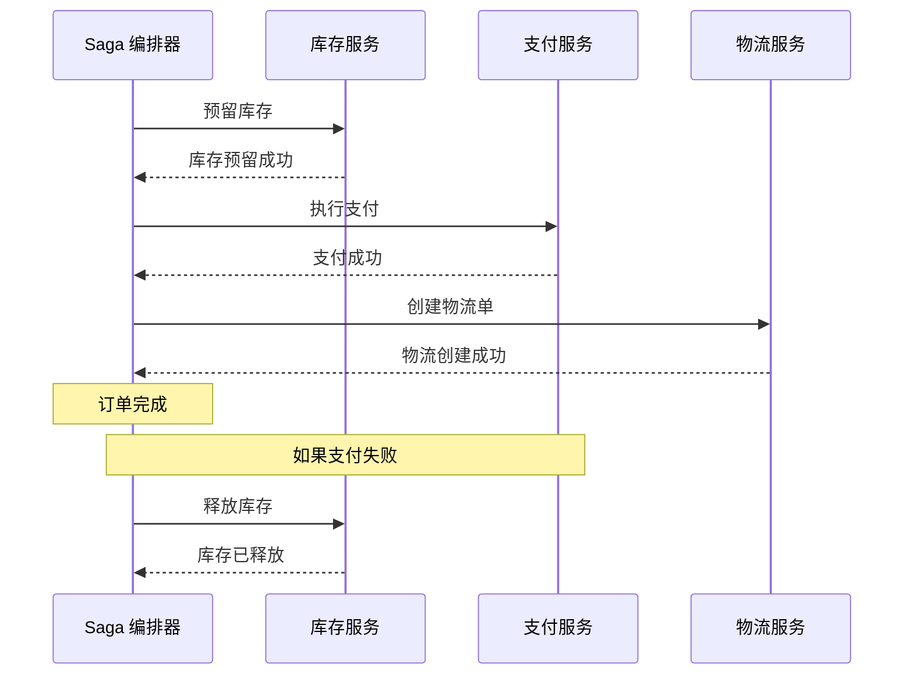

你的电商系统刚刚经历了一次「秒杀」活动。系统设计了复杂的限流、排队逻辑，数据库连接池被打满，Redis 集群过载。但当你复盘时发现：真正的峰值其实只有 1000 QPS，远没达到设计的上限。

问题出在哪？

**「同步调用的系统，一处慢，处处慢。」** 事件驱动架构的核心思想，就是把「实时响应」和「异步处理」分开，让系统从容应对流量峰值。

## 事件驱动架构的本质

事件驱动架构（Event-Driven Architecture，EDA）是一种软件设计范式，其中**组件之间的通信通过事件的产生和消费来完成**，而不是直接的函数调用。



## 核心模式

### 模式一：发布-订阅（Pub/Sub）



```typescript title="pub-sub/producer.ts"
import { EventBridgeClient, PutEventsCommand } from '@aws-sdk/client-eventbridge';

const eb = new EventBridgeClient({});

export const publishOrderCreated = async (order: Order) => {
  const result = await eb.send(new PutEventsCommand({
    Entries: [{
      EventBusName: 'default',
      Source: 'com.ecommerce.orders',
      DetailType: 'order.created',
      Time: new Date(),
      Detail: JSON.stringify({
        orderId: order.id,
        customerId: order.customerId,
        totalAmount: order.totalAmount,
        items: order.items,
      }),
    }],
  }));

  return result;
};
```

```typescript title="pub-sub/consumer-email.ts"
import { EventBridgeCloudWatchDestination, Lambda } from '@aws-sdk/client-eventbridge';

export const handler = async (event: any) => {
  const detail = JSON.parse(event.detail);

  console.log(`Processing order.created for order: ${detail.orderId}`);

  // 发送确认邮件
  await sendEmail({
    to: detail.customerEmail,
    subject: `Order Confirmed: #${detail.orderId}`,
    body: `Your order totaling $${detail.totalAmount} has been confirmed.`,
  });

  return { statusCode: 200 };
};
```

### 模式二：消息队列（Queue）



```typescript title="queue/producer.ts"
import { SQSClient, SendMessageCommand } from '@aws-sdk/client-sqs';

const sqs = new SQSClient({});

export const enqueueImageProcessing = async (imageId: string, userId: string) => {
  await sqs.send(new SendMessageCommand({
    QueueUrl: process.env.QUEUE_URL!,
    MessageBody: JSON.stringify({
      imageId,
      userId,
      operation: 'resize',
      timestamp: Date.now(),
    }),
    // FIFO 队列需要 MessageGroupId
    MessageGroupId: 'image-processing',
    // 消息去重
    MessageDeduplicationId: `img-${imageId}-${Date.now()}`,
  }));
};
```

```typescript title="queue/consumer.ts"
import { SQSClient, ReceiveMessageCommand, DeleteMessageCommand } from '@aws-sdk/client-sqs';

const sqs = new SQSClient({});

export const handler = async (event: SQSEvent) => {
  for (const record of event.Records) {
    const message = JSON.parse(record.body);

    try {
      await processImage(message);
      // 处理成功后删除消息
      await sqs.send(new DeleteMessageCommand({
        QueueUrl: process.env.QUEUE_URL!,
        ReceiptHandle: record.receiptHandle,
      }));
    } catch (error) {
      // 失败时不删除，消息会重新可见
      console.error(`Failed to process image ${message.imageId}:`, error);
      throw error;
    }
  }
};
```

### 模式三：事件溯源（Event Sourcing）



```typescript title="event-sourcing/aggregate.ts"
interface Event {
  type: string;
  payload: any;
  timestamp: number;
  aggregateId: string;
}

class OrderAggregate {
  private events: Event[] = [];
  private state = {
    orderId: '',
    status: 'pending',
    items: [] as OrderItem[],
    totalAmount: 0,
  };

  createOrder(orderId: string, items: OrderItem[]) {
    this.state.orderId = orderId;
    this.state.items = items;
    this.state.totalAmount = items.reduce((sum, item) => sum + item.price, 0);
    this.state.status = 'pending';

    this.events.push({
      type: 'ORDER_CREATED',
      payload: { orderId, items },
      timestamp: Date.now(),
      aggregateId: orderId,
    });
  }

  addItem(item: OrderItem) {
    this.state.items.push(item);
    this.state.totalAmount += item.price;

    this.events.push({
      type: 'ITEM_ADDED',
      payload: { item },
      timestamp: Date.now(),
      aggregateId: this.state.orderId,
    });
  }

  pay(paymentId: string) {
    if (this.state.status !== 'pending') {
      throw new Error('Order cannot be paid');
    }

    this.state.status = 'paid';

    this.events.push({
      type: 'ORDER_PAID',
      payload: { paymentId },
      timestamp: Date.now(),
      aggregateId: this.state.orderId,
    });
  }

  getEvents() {
    return [...this.events];
  }

  // 从事件重建状态
  static fromEvents(events: Event[]): OrderAggregate {
    const aggregate = new OrderAggregate();
    for (const event of events) {
      // 重放事件重建状态
      aggregate.state.orderId = event.aggregateId;
    }
    return aggregate;
  }
}
```

### 模式四：Saga 模式



```typescript title="saga/orchestrator.ts"
interface SagaStep {
  name: string;
  execute: () => Promise<any>;
  compensate: () => Promise<void>;
}

class OrderSaga {
  private steps: SagaStep[] = [];

  addStep(step: SagaStep): this {
    this.steps.push(step);
    return this;
  }

  async execute(): Promise<any> {
    const executed: SagaStep[] = [];

    try {
      for (const step of this.steps) {
        const result = await step.execute();
        executed.push(step);
      }
    } catch (error) {
      // 回滚已执行的步骤
      console.error('Saga failed, compensating...');
      for (const step of executed.reverse()) {
        try {
          await step.compensate();
        } catch (compensateError) {
          console.error(`Compensate failed for ${step.name}:`, compensateError);
        }
      }
      throw error;
    }
  }
}

// 定义 Saga
const orderSaga = new OrderSaga()
  .addStep({
    name: 'reserve-inventory',
    execute: async () => {
      const result = await inventoryService.reserve(orderId, items);
      return { reservationId: result.id };
    },
    compensate: async () => {
      await inventoryService.release(orderId);
    },
  })
  .addStep({
    name: 'process-payment',
    execute: async () => {
      const result = await paymentService.charge(customerId, totalAmount);
      return { paymentId: result.id };
    },
    compensate: async () => {
      await paymentService.refund(paymentId);
    },
  })
  .addStep({
    name: 'create-shipment',
    execute: async () => {
      const result = await shippingService.create(orderId, address);
      return { trackingId: result.id };
    },
    compensate: async () => {
      await shippingService.cancel(trackingId);
    },
  });
```

## Serverless 事件源

### AWS Lambda 支持的事件源

| 事件源 | 触发方式 | 常见场景 |
| --- | --- | --- |
| **API Gateway** | HTTP 请求 | REST/GraphQL API |
| **S3** | 对象创建/修改 | 文件处理、CDN 触发 |
| **DynamoDB Streams** | 数据变更 | CDC、实时处理 |
| **Kinesis** | 流数据 | 日志分析、实时 BI |
| **SQS** | 队列消息 | 异步任务处理 |
| **SNS** | 主题发布 | 广播通知 |
| **EventBridge** | 规则匹配 | 跨服务编排 |
| **CloudWatch Events** | 定时/系统事件 | 定时任务 |

### EventBridge Schema Registry

```typescript title="eventbridge/schema.ts"
import { SchemaRegistryClient, discoverSchema } from '@aws-sdk/client-eventbridge';

const schemaClient = new SchemaRegistryClient({});

// 验证事件格式
export const validateEvent = async (event: any) => {
  const schema = await discoverSchema({
    SchemaArn: 'arn:aws:schemas:us-east-1:123456789:schema/com.ecommerce/orders',
  });

  // Schema Registry 提供类型安全的验证
  return schema.validate(event);
};
```

## 错误处理策略

### 重试与死信

```yaml title="dlq-config.yaml"
Resources:
  MyQueue:
    Type: AWS::SQS::Queue
    Properties:
      QueueName: my-processor-queue
      VisibilityTimeout: 30
      MessageRetentionPeriod: 1209600  # 14 天
      RedrivePolicy:
        # 超过 3 次处理失败，进入死信队列
        maxReceiveCount: 3
        deadLetterTargetArn: !GetAtt DeadLetterQueue.Arn

  DeadLetterQueue:
    Type: AWS::SQS::Queue
    Properties:
      QueueName: my-processor-dlq
```

### 幂等处理

```typescript
export const handler = async (event: SQSEvent) => {
  for (const record of event.Records) {
    const { orderId, idempotencyKey } = JSON.parse(record.body);

    // 检查是否已处理（使用 Redis 或 DynamoDB）
    const processed = await redis.exists(`processed:${idempotencyKey}`);

    if (processed) {
      console.log(`Skipping duplicate: ${idempotencyKey}`);
      continue;
    }

    await processOrder(orderId);

    // 标记为已处理（设置过期时间）
    await redis.setex(`processed:${idempotencyKey}`, 86400, '1');
  }
};
```

## 监控与可观测性

### 分布式追踪

```typescript title="lib/tracing.ts"
import { LambdaClient, InvokeCommand } from '@aws-sdk/client-lambda';
import { Context } from 'aws-lambda';

export const handler = async (event: any, context: Context) => {
  // 提取上游追踪头
  const traceId = event.headers?.['x-trace-id'] || context.awsRequestId;

  // 在处理开始时记录
  const startTime = Date.now();

  try {
    const result = await processEvent(event, traceId);

    // 记录成功
    console.log(JSON.stringify({
      event: 'processing_complete',
      traceId,
      duration: Date.now() - startTime,
      status: 'success',
    }));

    return result;
  } catch (error) {
    // 记录失败
    console.error(JSON.stringify({
      event: 'processing_failed',
      traceId,
      duration: Date.now() - startTime,
      status: 'error',
      error: error.message,
    }));
    throw error;
  }
};
```

### CloudWatch 仪表板

```json
{
  "widgets": [
    {
      "type": "metric",
      "properties": {
        "title": "Event Processing",
        "metrics": [
          ["Serverless/Events", "EventsProcessed", "Service", "order-service"],
          [".", "EventsFailed", ".", "."],
          [".", "ProcessingLatency", ".", "."]
        ]
      }
    },
    {
      "type": "log",
      "properties": {
        "title": "Recent Errors",
        "query": "fields @timestamp, @message | filter status = 'error' | sort @timestamp desc | limit 20"
      }
    }
  ]
}
```

## 权衡矩阵

| 模式 | 优势 | 劣势 | 适用场景 |
| --- | --- | --- | --- |
| **Pub/Sub** | 解耦、广播 | 消息丢失风险 | 通知、分析 |
| **Queue** | 可靠处理、背压 | 延迟增加 | 异步任务 |
| **Event Sourcing** | 完整历史、审计 | 复杂度高 | 金融、订单 |
| **Saga** | 分布式事务 | 补偿逻辑复杂 | 跨服务流程 |

## 延伸思考

事件驱动架构不是银弹。它解决了很多问题，但也引入了新的复杂性：

1. **最终一致性**：消息延迟导致系统状态在某一时刻可能不一致
2. **调试困难**：异步流程的调用链不直观
3. **消息顺序**：如果需要保证顺序，消息系统选择受限

在选择事件驱动架构之前，先问自己：**我的业务真的需要异步吗？** 对于大多数 CRUD 操作，同步调用可能更简单。只有当性能、可靠性或解耦需求超过一致性需求时，才考虑事件驱动。

另一个方向是：**如何设计好的事件？** 一个好的事件应该：
- 自包含（包含所有需要的信息）
- 语义清晰（事件名明确表达发生了什么）
- 版本化（考虑事件格式可能演进）
- 不可变（事件一旦产生就不修改）