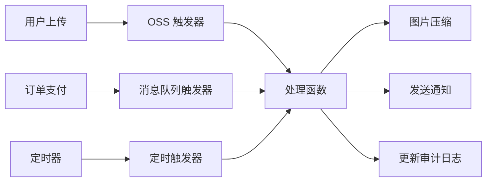
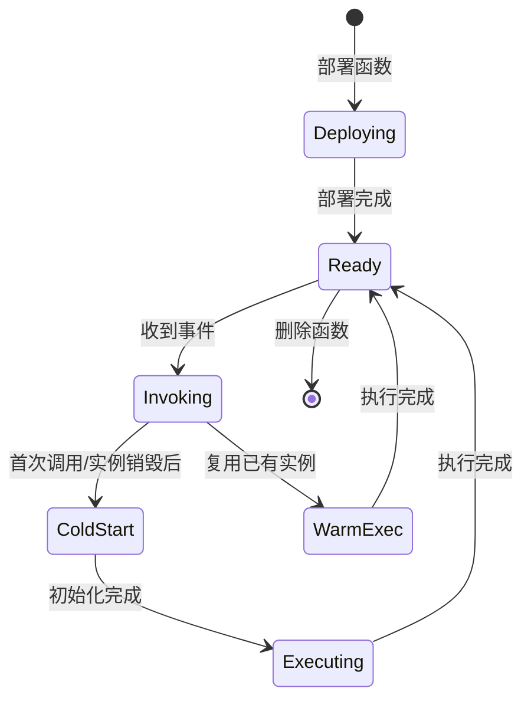
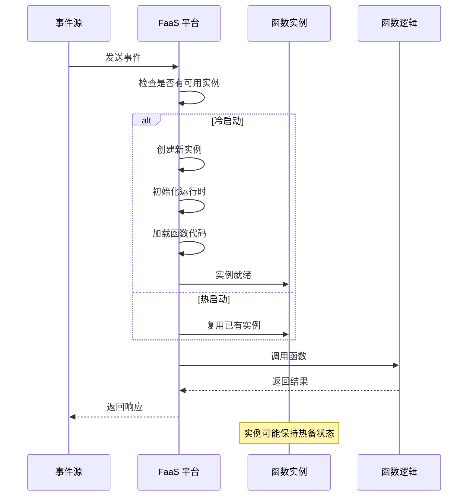

你正在开发一个图片处理服务。传统做法是：买一台服务器，部署一个 Tomcat 应用，配置一个 4 核 8G 的实例，然后祈祷大促时它能扛住。结果呢？平时 CPU 利用率 5%，大促时流量是平时的 50 倍，服务器直接挂掉。

FaaS（Function as a Service）换了一种思路：**不要买服务器了，你的代码就是服务**。云负责在任何时候运行你的代码——不管是一天一次还是每秒一万次，你只需要为实际执行时间付费。

## FaaS 核心概念

FaaS 是 Serverless 架构的核心支柱。它将应用逻辑分解为独立的函数，每个函数响应特定的事件，执行完成后释放所有资源。

### 核心特征

- **无服务器管理**：开发者不需要关心服务器操作系统、运行时配置、安全补丁
- **事件驱动**：函数由特定事件触发，而不是持续监听请求
- **自动扩缩容**：平台根据请求量自动启动或销毁函数实例
- **按执行计费**：只对实际执行时间收费，空闲时不产生费用

### 与传统函数的区别

FaaS 函数与传统编程中的「函数」概念不同：

| 维度 | 传统函数 | FaaS 函数 |
| --- | --- | --- |
| **执行环境** | 常驻进程 | 按需创建/销毁 |
| **生命周期** | 与应用同周期 | 单次调用为生命周期 |
| **状态管理** | 可持有进程内状态 | 无状态或使用外部存储 |
| **并发模型** | 固定线程池 | 平台动态分配 |
| **启动开销** | 启动时一次性 | 每次调用可能有冷启动 |

## 触发器类型

触发器是 FaaS 的核心概念——没有触发器，函数永远不会执行。每个云厂商都提供了丰富的触发器类型：

### HTTP 触发器

最常见的触发器类型，用于构建 Web API。

```yaml title="阿里云函数计算 - HTTP 触发器配置"
trigger:
  type: http
  name: http-trigger
  config:
    methods:
      - GET
      - POST
    authType: anonymous  # 匿名访问
    # 可选：强制 HTTPS
    # 可选：IP 白名单/黑名单
```

```java title="HTTP 函数示例"
public class MyHttpHandler implements HttpHandler {
    @Override
    public void handleRequest(HttpRequest request, HttpResponse response, Context context) {
        String name = request.getQueryParameter("name");

        if (name == null || name.isEmpty()) {
            response.setStatusCode(400);
            response.setBody("{\"error\": \"name is required\"}");
            return;
        }

        String result = String.format("Hello, %s!", name);
        response.setStatusCode(200);
        response.setContentType("application/json");
        response.setBody(String.format("{\"message\": \"%s\"}", result));
    }
}
```

HTTP 触发器通常配合 API 网关使用，支持请求路由、认证限流等功能。

### 队列/消息触发器

当消息队列中有新消息时触发函数，常用于异步处理任务。

```yaml title="消息队列触发器配置"
trigger:
  type: mns_queue  # 或 rocketmq、rabbitmq、kafka
  name: order-processor-trigger
  config:
    queueName: order-queue
    batchSize: 10          # 批量处理消息数
    maximumMessageAge: 604800  # 消息最大存活时间（秒）
```

```java title="消息处理函数示例"
public class OrderProcessorHandler implements EventHandler {
    @Override
    public void handleRequest(Object event, Context context) {
        // 事件可能是单个消息或批量消息
        if (event instanceof List) {
            List<OrderMessage> orders = (List<OrderMessage>) event;
            for (OrderMessage order : orders) {
                processOrder(order);
            }
        } else {
            processOrder((OrderMessage) event);
        }
    }

    private void processOrder(OrderMessage order) {
        // 订单处理逻辑
        log.info("Processing order: {}", order.getOrderId());
        // 更新数据库、发送通知等
    }
}
```

:::tip
**批量处理优化**：大多数消息触发器支持批量消费，将多条消息打包一次发给函数，减少函数调用次数和网络开销。
:::

### 定时触发器

类似 cron 表达式，定时执行函数。适合定时任务、报表生成、数据同步等场景。

```yaml title="定时触发器配置"
trigger:
  type: timer
  name: daily-report-trigger
  config:
    cronExpression: "0 0 2 * * *"  # 每天凌晨 2 点
    enable: true
    payload: "optional custom payload"
```

```java title="定时任务函数示例"
public class ReportGeneratorHandler implements EventHandler {
    @Override
    public void handleRequest(Object event, Context context) {
        TimerTrigger trigger = (TimerTrigger) event;

        log.info("Timer triggered at: {}", trigger.getTriggerTime());

        // 生成日报
        generateDailyReport();

        // 清理过期数据
        cleanupOldData();
    }
}
```

### 对象存储触发器

当对象存储（如 S3、OSS）中上传或删除文件时触发函数。典型场景：图片压缩、音视频转码、日志分析。

```yaml title="对象存储触发器配置"
trigger:
  type: oss
  name: image-processor-trigger
  config:
    bucket: user-upload-bucket
    events:
      - oss:ObjectCreated:PutObject
      - oss:ObjectCreated:PostObject
    filter:
      prefix: images/
      suffix: .jpg
```

```java title="图片处理函数示例"
public class ImageProcessorHandler implements EventHandler {
    @Override
    public void handleRequest(Object event, Context context) {
        OSSEvent ossEvent = (OSSEvent) event;

        for (OSSEventRecord record : ossEvent.getRecords()) {
            String bucket = record.getBucket();
            String objectKey = record.getOSSKey();

            log.info("Processing file: {}/{}", bucket, objectKey);

            // 获取文件内容
            InputStream input = getObjectContent(bucket, objectKey);

            // 图片压缩处理
            byte[] compressed = compressImage(input, 80);

            // 上传到目标 bucket
            String targetKey = objectKey.replace("images/", "processed/");
            putObject("processed-bucket", targetKey, compressed);

            // 删除原图（可选）
            deleteObject(bucket, objectKey);
        }
    }
}
```

### 触发器组合

一个函数可以绑定多个触发器，实现复杂的业务流程：



## 函数生命周期

函数从创建到销毁，经历以下阶段：



### 部署阶段

1. 开发者打包函数代码和依赖
2. 上传到云平台
3. 平台解压并缓存代码包
4. 函数进入「就绪」状态

```yaml title="函数部署配置"
function:
  name: order-processor
  runtime: java11
  handler: com.example.OrderHandler::handleRequest
  timeout: 30s
  memorySize: 512 MB

  environment:
    variables:
      DB_HOST: ${env(DB_HOST)}
      REDIS_ADDR: ${env(REDIS_ADDR)}

  layers:
    - arn:aws:lambda:us-east-1:123456789012:layer:common-utils:1
```

### 调用阶段

当事件到达时，平台按以下流程处理：



### 销毁阶段

函数执行完成后，实例的处理：

- **保持热备**：平台通常会保留最近使用的实例一段时间（通常 5-15 分钟），等待下一个请求
- **完全销毁**：长时间无请求后，平台销毁实例，释放资源

## 执行环境

### 运行时支持

主流云厂商支持的运行时：

| 运行时 | AWS Lambda | 阿里云 FC | Azure Functions |
| --- | --- | --- | --- |
| Node.js | 18.x, 16.x, 14.x | 18, 16, 14, 12 | 18, 16, 14 |
| Python | 3.11, 3.10, 3.9 | 3.11, 3.9, 3.6 | 3.11, 3.10, 3.9 |
| Java | 17, 11, 8 | 17, 11, 8 | 11, 8 |
| Go | 1.x | 1.x | - |
| Ruby | 2.7, 3.x | 2.7 | 3.x |
| Custom Runtime | 支持 | 支持 | 支持 |

### 自定义运行时

如果官方运行时不满足需求，可以使用自定义运行时：

```yaml title="自定义运行时配置"
function:
  runtime: custom
  handler: bootstrap  # 可执行文件的入口点
```

```dockerfile title="Dockerfile"
FROM public.ecr.aws/lambda/provided:al2

COPY bootstrap ${LAMBDA_RUNTIME_DIR}/
RUN chmod +x ${LAMBDA_RUNTIME_DIR}/bootstrap

# 安装其他依赖
RUN dnf install -y some-package

COPY app/* ${LAMBDA_TASK_ROOT}/
```

## 冷启动与热复用

### 冷启动

当没有可用实例时，平台需要创建新实例，这个过程称为冷启动。冷启动包括：

1. **分配容器资源**：从资源池中申请一个容器
2. **启动运行时**：初始化语言运行时（如 JVM）
3. **加载函数代码**：解压和加载函数包
4. **执行初始化逻辑**：运行函数外的静态代码块

```java title="冷启动过程详解"
public class MyFunction {
    // 这段代码在每次冷启动时执行
    static {
        // 加载配置
        loadConfiguration();
        // 初始化连接池
        initConnectionPool();
        // 预热缓存
        warmupCache();
    }

    public void handleRequest(Object event, Context context) {
        // 这个方法只执行一次
    }
}
```

### 热复用

为减少冷启动延迟，平台会**保持活跃实例的温池**：

```mermaid
gantt
    title 函数实例生命周期
    dateFormat X
    axisFormat %s秒

    section 实例 A
    启动:done, init1, 0, 2
    执行:done, exec1, 2, 3
    保持热备:done, warm1, 3, 8
    复用执行:done, exec2, 8, 9
    保持热备:done, warm2, 9, 15
    销毁:done, destroy1, 15, 16

    section 实例 B
    启动:done, init2, 5, 7
    执行:done, exec3, 7, 8
    销毁:done, destroy2, 15, 16
```



:::warning
**热复用的不确定性**：平台可以随时销毁空闲实例，不保证任何实例的持久性。函数代码必须是无状态的，或者状态必须存储在外部服务中。
:::

## 资源限制

FaaS 平台对函数配置有明确的限制：

### 内存配置

| 厂商 | 最小内存 | 最大内存 | 步进 |
| --- | --- | --- | --- |
| AWS Lambda | 128 MB | 10,240 MB | 64 MB |
| 阿里云 FC | 128 MB | 3,072 MB | 64 MB |
| Azure Functions | 128 MB | 1,792 MB | 128 MB |

内存配置直接影响执行性能和冷启动速度。内存越大，CPU 配额通常也越大。

### 执行时长限制

| 厂商 | 最大执行时长 | HTTP 同步调用 | 异步/后台 |
| --- | --- | --- | --- |
| AWS Lambda | 15 分钟 | 同步 | 异步/事件 |
| 阿里云 FC | 24 小时 | 同步 | 异步调用 |
| Azure Functions | 无限制（消耗计费） | 230 秒（默认） | 不限 |

### 并发限制

| 厂商 | 默认并发数 | 最大并发数 | 提升方式 |
| --- | --- | --- | --- |
| AWS Lambda | 100-1000 | 预留并发可提升 | 提交工单/自动 |
| 阿里云 FC | 100 | 可配置 | 控制台/API |

## 适用与不适用场景

### FaaS 适合的场景

- **事件驱动处理**：S3 上传处理、消息队列消费、定时任务
- **Webhook 处理**：接收第三方回调
- **实时数据处理**：流式数据转换和分析
- **轻量级 API**：业务逻辑简单的微服务
- **突发流量处理**：大促、投票、直播

### FaaS 不适合的场景

- **长时间计算**：机器学习训练、科学计算
- **需要长连接**：WebSocket、实时通信
- **资源密集型**：需要 GPU、更多内存
- **状态复杂**：频繁的状态读写，且无法外部化

## 延伸思考

FaaS 的函数粒度设计是架构决策的关键。粒度太粗，失去弹性优势；粒度太细，增加调用延迟和协调复杂度。

常见的函数拆分策略：

- **按业务能力拆分**：用户函数、订单函数、支付函数
- **按处理阶段拆分**：验证函数、转换函数、存储函数
- **按触发源拆分**：HTTP 函数、队列函数、定时函数

如何判断拆分是否合理？一个函数应该是**原子业务操作的最小单元**——如果两个操作需要共同回滚，就应该合并为一个函数。
