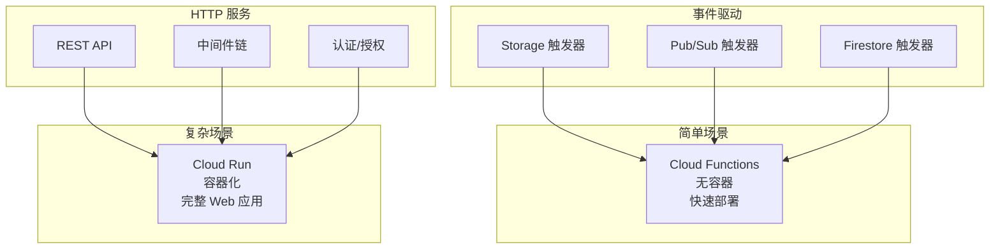

你的团队在 Google Cloud 生态中深耕多年：数据存储用 BigQuery，机器学习用 Vertex AI，消息队列用 Pub/Sub。当需要 Serverless 计算时，Google Cloud Functions 几乎是必然的选择。

**「Cloud Functions 不是 GCP 唯一的 Serverless 选择，但可能是最简单的一个。」** 理解它的定位和边界，才能做出正确的架构决策。

## Cloud Functions 的演进

Google Cloud Functions 有两代版本：

| 特性 | 第一代 (1st gen) | 第二代 (2nd gen) |
| --- | --- | --- |
| **底层架构** | Cloud Functions 专用 | Cloud Run（容器） |
| **冷启动** | ~100ms-1s | ~100ms-2s |
| **最大超时** | 9 分钟（60-9 分钟可配置） | 60 分钟 |
| **并发请求** | 1 请求/实例 | 多请求/实例 |
| **VPC 支持** | 有限 | 完整 |
| **最小实例** | 不支持 | 支持 |
| **HTTP 压缩** | 不支持 | 支持 |

## 触发器类型

### HTTP 触发器

```javascript title="index.js"
// Node.js HTTP 函数
const functions = require('@google-cloud/functions-framework');

functions.http('helloHttp', (req, res) => {
  const name = req.query.name || req.body.name || 'World';

  res
    .status(200)
    .set('Content-Type', 'application/json')
    .send(JSON.stringify({
      message: `Hello, ${name}!`,
      timestamp: new Date().toISOString()
    }));
});
```

```python title="main.py"
# Python HTTP 函数
import functions_framework

@functions_framework.http
def hello_http(request):
    request_json = request.get_json(silent=True)
    name = request_json.get('name') if request_json else 'World'

    return {
        'message': f'Hello, {name}!',
        'timestamp': datetime.now(timezone.utc).isoformat()
    }
```

### Cloud Storage 触发器

```javascript title="storage-trigger.js"
const functions = require('@google-cloud/functions-framework');
const { Storage } = require('@google-cloud/storage');

const storage = new Storage();

functions.cloudEvent('processFile', async (cloudEvent) => {
  const file = cloudEvent.data;
  const bucketName = file.bucket;
  const fileName = file.name;

  console.log(`Processing file: ${fileName} in bucket: ${bucketName}`);

  // 获取文件内容
  const bucket = storage.bucket(bucketName);
  const fileRef = bucket.file(fileName);

  const [exists] = await fileRef.exists();
  if (!exists) {
    console.log('File does not exist');
    return;
  }

  // 根据文件类型处理
  if (fileName.endsWith('.csv')) {
    await processCSV(fileRef);
  } else if (fileName.endsWith('.json')) {
    await processJSON(fileRef);
  }

  console.log(`Completed processing: ${fileName}`);
});

async function processCSV(fileRef) {
  const [contents] = await fileRef.download();
  const rows = contents.toString().split('\n');

  console.log(`CSV has ${rows.length} rows`);

  // 处理完成后移动到 processed 文件夹
  const destFileName = fileRef.name.replace('uploads/', 'processed/');
  await fileRef.move(destFileName);
}
```

### Pub/Sub 触发器

```javascript title="pubsub-trigger.js"
functions.cloudEvent('processMessage', async (cloudEvent) => {
  const message = cloudEvent.data;
  const data = Buffer.from(message.data, 'base64').toString();

  console.log('Received message:', data);

  try {
    const payload = JSON.parse(data);

    switch (payload.type) {
      case 'user.created':
        await handleUserCreated(payload);
        break;
      case 'order.completed':
        await handleOrderCompleted(payload);
        break;
      default:
        console.log(`Unknown message type: ${payload.type}`);
    }
  } catch (error) {
    console.error('Error processing message:', error);
    throw error; // 导致消息重试
  }
});

async function handleUserCreated(payload) {
  console.log(`Creating user: ${payload.userId}`);
  // 用户创建逻辑
}

async function handleOrderCompleted(payload) {
  console.log(`Processing order: ${payload.orderId}`);
  // 订单处理逻辑
}
```

### Firebase 触发器

```javascript title="firebase-trigger.js")
const functions = require('firebase-functions');
const admin = require('firebase-admin');

admin.initializeApp();

exports.onUserCreate = functions.firestore
  .document('users/{userId}')
  .onCreate(async (snap, context) => {
    const user = snap.data();
    const userId = context.params.userId;

    console.log(`New user created: ${userId}`);

    // 创建用户资料
    await admin.firestore().collection('profiles').doc(userId).set({
      createdAt: admin.firestore.FieldValue.serverTimestamp(),
      displayName: user.displayName || 'Anonymous',
      email: user.email || '',
    });

    // 发送欢迎邮件
    if (user.email) {
      await sendWelcomeEmail(user.email, user.displayName);
    }

    // 更新统计
    await incrementUserCount();
  });

exports.onOrderUpdate = functions.firestore
  .document('orders/{orderId}')
  .onUpdate(async (change, context) => {
    const before = change.before.data();
    const after = change.after.data();
    const orderId = context.params.orderId;

    // 检测状态变更
    if (before.status !== 'completed' && after.status === 'completed') {
      console.log(`Order ${orderId} completed`);

      // 更新库存
      await updateInventory(after.items);

      // 触发后续流程
      await triggerPostOrderWorkflow(orderId);
    }
  });
```

## 第二代函数的 Cloud Run 特性

### 并发处理

```javascript title="concurrent-handler.js")
// 2nd gen 支持并发处理
functions.http('concurrentHandler', (req, res) => {
  // 每个实例可以同时处理多个请求
  // 默认并发数基于内存：1 实例 / 256MB

  const processing = req.body.map(item => processItem(item));

  Promise.all(processing)
    .then(results => {
      res.status(200).json({ results });
    })
    .catch(error => {
      res.status(500).json({ error: error.message });
    });
});

async function processItem(item) {
  // 模拟处理
  await new Promise(resolve => setTimeout(resolve, 100));
  return { ...item, processed: true };
}
```

### 最小实例

```yaml title="main.py"
import functions_framework
from flask import Flask

# 创建 Flask 应用
app = Flask(__name__)

@app.route('/')
def hello():
    return 'Hello, World!'

# 注册函数
functions_framework(app=app, target='app')
```

```yaml title="gcloud-config.yaml"
# deployment.yaml
runtime: python311
entrypoint: gunicorn
instance_size: SMALL
min_instances: 2  # 始终保持 2 个热实例
max_instances: 100
timeout: 60
service_account: my-function@my-project.iam.gserviceaccount.com

vpc_connector: my-vpc-connector
vpc_egress_settings: private-ranges-only

environment_variables:
  ENV: production
```

## 环境配置

### 环境变量

```yaml title="env-vars.yaml"
# 部署时设置环境变量
gcloud functions deploy my-function \
  --set-env-vars "ENV=production,REGION=us-central1" \
  --runtime python311
```

```javascript title="access-env.js")
// 访问环境变量
const dbHost = process.env['DB_HOST'];
const dbPassword = process.env['DB_PASSWORD']; // 建议使用 Secret Manager

// 访问 Secret Manager
const { SecretManagerServiceClient } = require('@google-cloud/secret-manager');

async function accessSecret(secretName) {
  const client = new SecretManagerServiceClient();
  const [version] = await client.accessSecretVersion({ name: secretName });
  return version.payload.data.toString();
}
```

### Secret Manager 集成

```yaml title="secret-config.yaml"
# 使用 Secret Manager 存储敏感信息
gcloud functions deploy my-function \
  --set-secrets "DB_PASSWORD=db-password:latest,API_KEY=api-key:latest" \
  --runtime nodejs18
```

```javascript title="use-secret.js")
const { SecretManagerServiceClient } = require('@google-cloud/secret-manager');

const client = new SecretManagerServiceClient();

async function getDbPassword() {
  const [accessResponse] = await client.accessSecretVersion({
    name: 'projects/my-project/secrets/db-password/versions/latest'
  });

  return accessResponse.payload.data.toString();
}
```

## 监控与日志

### Cloud Logging 集成

```javascript title="structured-logging.js")
const functions = require('@google-cloud/functions-framework');
const { Logging } = require('@google-cloud/logging');

const logging = new Logging();

functions.http('loggedFunction', async (req, res) => {
  const logger = logging.log('my-function');

  // 结构化日志
  logger.info({
    message: 'Processing request',
    requestId: req.headers['x-request-id'],
    userId: req.body.userId,
    timestamp: new Date().toISOString()
  });

  try {
    const result = await processBusinessLogic(req.body);

    logger.info({
      message: 'Request processed successfully',
      result: result
    });

    res.status(200).json(result);
  } catch (error) {
    logger.error({
      message: 'Request failed',
      error: error.message,
      stack: error.stack
    });

    res.status(500).json({ error: 'Internal error' });
  }
});
```

### Cloud Monitoring 指标

```javascript title="custom-metrics.js")
const { MetricServiceClient } = require('@google-cloud/monitoring');

// 创建自定义指标
const metricClient = new MetricServiceClient();

async function recordLatency(durationMs) {
  const metric = metricClient.metricPath(myProjectId, 'custom.googleapis.com', 'function_latency');

  const dataPoint = {
    interval: {
      endTime: {
        seconds: Date.now() / 1000,
      },
    },
    value: {
      doubleValue: durationMs,
    },
  };

  const timeSeries = {
    metric: {
      type: metric,
    },
    resource: {
      type: 'cloud_function',
      labels: {
        function_name: 'my-function',
        region: 'us-central1',
      },
    },
    points: [dataPoint],
  };

  await metricClient.createTimeSeries({ name: metric, timeSeries: [timeSeries] });
}
```

## 与 Cloud Run 的选择

Cloud Functions 适合：
- **简单的事件驱动函数**：上传文件、接收消息
- **快速原型**：不需要构建容器
- **单函数独立部署**：每个函数独立管理

Cloud Run 适合：
- **复杂应用**：需要多个端点、中间件
- **已有容器镜像**：复用现有 Docker 镜像
- **长期运行任务**：需要更长超时
- **更细粒度控制**：自定义容器配置



## 性能优化

### 连接池复用

```javascript title="db-pool.js")
// 模块级数据库连接池
const { Pool } = require('pg');

const pool = new Pool({
  host: process.env['DB_HOST'],
  database: process.env['DB_NAME'],
  user: process.env['DB_USER'],
  password: process.env['DB_PASSWORD'],
  max: 10, // 最大连接数
  idleTimeoutMillis: 30000,
});

exports.handler = async (req, res) => {
  const client = await pool.connect();

  try {
    const result = await client.query('SELECT * FROM users WHERE id = $1', [req.body.userId]);
    res.json(result.rows);
  } finally {
    client.release(); // 释放回连接池
  }
};
```

### 依赖预加载

```javascript title="ml-model.js")
// 模块级模型加载（只在冷启动时执行）
let model = null;
let modelLoading = null;

async function loadModel() {
  if (model) return model;
  if (modelLoading) return modelLoading;

  modelLoading = loadMyMLModel(); // 返回 Promise
  model = await modelLoading;
  return model;
}

exports.predict = async (req, res) => {
  const mlModel = await loadModel();
  const prediction = mlModel.predict(req.body.features);

  res.json({ prediction });
};
```

## 最佳实践

### 1. 幂等性

```javascript title="idempotent.js")
// 使用幂等键处理重复消息
exports.processOrder = async (event) => {
  const messageId = event.message.messageId;
  const data = JSON.parse(Buffer.from(event.data).toString());

  // 检查是否已处理
  const cache = await getCache();
  const cached = await cache.get(`processed:${messageId}`);

  if (cached) {
    console.log(`Message ${messageId} already processed`);
    return;
  }

  // 业务逻辑
  await processOrderLogic(data);

  // 标记为已处理
  await cache.setex(`processed:${messageId}`, 86400, '1');
};
```

### 2. 错误处理与重试

```yaml title="retry-config.yaml"
# 配置重试策略
gcloud functions deploy my-function \
  --retry \
  --runtime nodejs18
```

```javascript title="retry-handler.js")
// 设置最大重试次数
const MAX_RETRIES = 3;

exports.processWithRetry = async (event) => {
  const retryCount = event.publishTime ? 0 : (event.attributes?.['retry-count'] || 0);

  try {
    await processBusinessLogic(event.data);
  } catch (error) {
    if (retryCount < MAX_RETRIES) {
      console.log(`Retrying (${retryCount + 1}/${MAX_RETRIES})`);
      throw error; // 导致重试
    }
    // 超过重试次数，发送到死信队列
    await sendToDeadLetterQueue(event);
  }
};
```

## 与 AWS Lambda 对比

| 维度 | AWS Lambda | GCP Cloud Functions |
| --- | --- | --- |
| **触发器** | 事件源集成 | Cloud Events SDK |
| **HTTP 框架** | API Gateway（额外费用） | 内置 HTTP |
| **执行时间** | 最大 15 分钟 | 最大 60 分钟（2nd gen） |
| **并发** | 按需扩展 | 最大 1000/实例 |
| **最小实例** | 无 | 支持（2nd gen） |
| **计费** | 请求数 + 执行时间 | 请求数 + 执行时间 + 入口流量 |
| **多云支持** | AWS 专用 | GCP 专用 |

## 延伸思考

Cloud Functions 的简洁性是它的优势，也是它的局限。当你的函数变得复杂、需要更多控制时，可能需要迁移到 Cloud Run。

Google Cloud 的 Serverless 策略越来越清晰：**Cloud Functions 用于简单的事件驱动，Cloud Run 用于复杂的容器化工作负载，Anthos 用于混合/多云场景。**

选择哪个，取决于你的具体需求：
- 需要快速响应 HTTP 请求？→ Cloud Functions
- 需要处理长时间任务？→ Cloud Run
- 需要跨云部署？→ Anthos Service Mesh