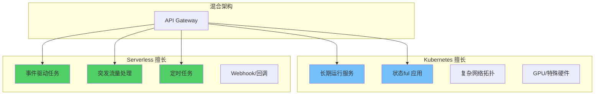
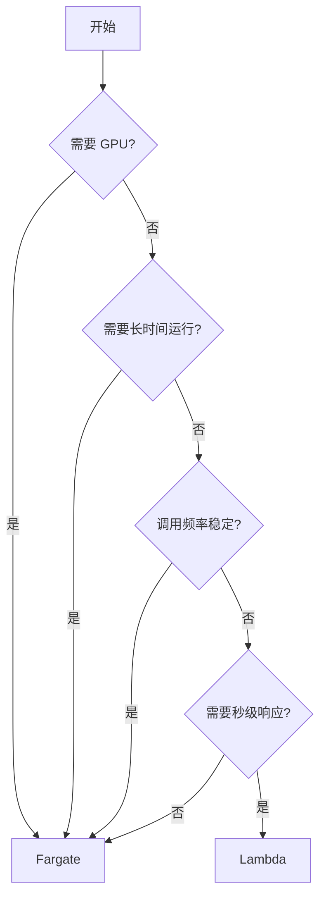
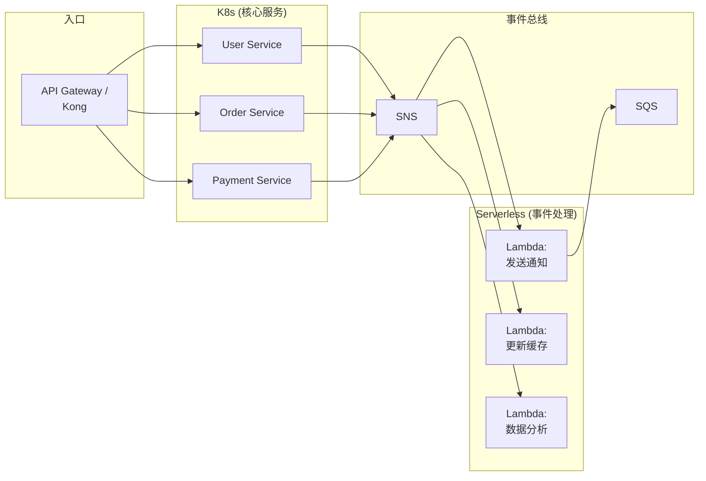
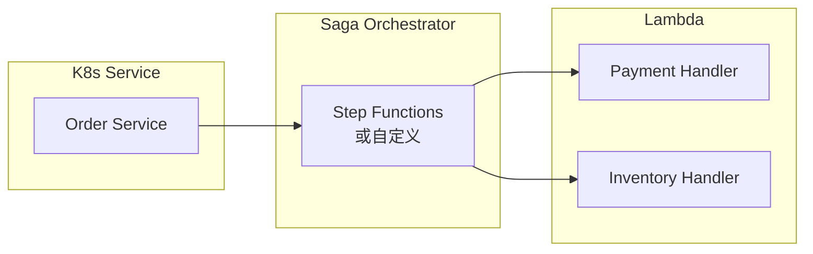
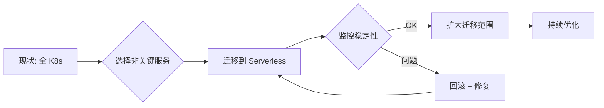

你的公司已经有两个 Kubernetes 集群：一个运行核心业务（用户服务、订单系统），另一个跑着数据处理任务。团队在讨论是否要引入 Serverless，因为某些场景（如突发流量、事件驱动任务）用 Lambda/Functions 更合适。

但完全迁移到纯 Serverless 架构风险太大。

**「Serverless 和 Kubernetes 不是非此即彼的选择，而是可以共存的。」** 混合架构让你既能享受 Kubernetes 的可控性，又能利用 Serverless 的弹性。

## 混合架构设计

### 为什么需要混合架构？



### 适用场景对比

| 场景 | Kubernetes | Serverless | 建议 |
| --- | --- | --- | --- |
| **Web API（稳定流量）** | ✓ | ✓ | K8s（成本可预测） |
| **Web API（突发流量）** | △ | ✓ | Serverless（弹性好） |
| **数据处理管道** | ✓ | ✓ | 视复杂度而定 |
| **ML 模型推理** | ✓ | △ | K8s（GPU 支持） |
| **定时批处理** | △ | ✓ | Serverless（按执行计费） |
| **事件驱动响应** | △ | ✓ | Serverless（原生集成） |
| **实时通信** | ✓ | ✗ | K8s（长连接） |
| **复杂状态管理** | ✓ | △ | K8s |

## Knative：K8s 上的 Serverless

### Knative Serving

Knative Serving 让 Kubernetes 支持 Serverless 风格的部署：

```yaml title="knative-service.yaml")
apiVersion: serving.knative.dev/v1
kind: Service
metadata:
  name: event-handler
  namespace: production
spec:
  template:
    metadata:
      annotations:
        autoscaling.knative.dev/minScale: "2"
        autoscaling.knative.dev/maxScale: "50"
    spec:
      containers:
        - image: my-registry/event-handler:v1.0.0
          resources:
            requests:
              cpu: "100m"
              memory: "128Mi"
```

### Knative Eventing

事件驱动的 Serverless：

```yaml title="knative-trigger.yaml")
apiVersion: eventing.knative.dev/v1
kind: Trigger
metadata:
  name: order-trigger
spec:
  broker: default
  filter:
    attributes:
      type: com.ecommerce.order.created
  subscriber:
    ref:
      apiVersion: serving.knative.dev/v1
      kind: Service
      name: order-processor
```

### KEDA：事件驱动的自动扩缩容

KEDA（Kubernetes Event-Driven Autoscaling）让你可以用任何事件源驱动 K8s 应用的扩缩容：

```yaml title="keda-scaler.yaml")
apiVersion: keda.sh/v1alpha1
kind: ScaledObject
metadata:
  name: order-processor-scaler
spec:
  scaleTargetRef:
    name: order-processor
  pollingInterval: 30
  cooldownPeriod: 300
  minReplicaCount: 2
  maxReplicaCount: 100
  triggers:
    - type: aws-sqs-queue
      metadata:
        queueURL: https://sqs.us-east-1.amazonaws.com/123456/orders
        queueLength: "10"
        identityOwner: pod
      authenticationRef:
        name: keda-trigger-auth
```

## AWS Fargate：EC2 vs Serverless

### Fargate 的定位

AWS Fargate 是 ECS/EKS 上的无服务器计算引擎：

```
EC2 模式：                Fargate 模式：
┌──────────────────┐      ┌──────────────────┐
│ 你管理 EC2 实例  │      │ AWS 管理运行时  │
│ 容量规划         │      │ 按任务计费       │
│ 安全更新         │      │ 自动扩缩         │
│ 实例配置         │      │ 无服务器运维     │
└──────────────────┘      └──────────────────┘

Lambda 模式：             Fargate 模式：
┌──────────────────┐      ┌──────────────────┐
│ 容器不可选        │      │ 完整容器支持     │
│ 最大 10GB 内存    │      │ 最大 120GB 内存  │
│ 最大 15 分钟      │      │ 无时间限制       │
│ 冷启动问题        │      │ 无冷启动         │
└──────────────────┘      └──────────────────┘
```

### Fargate vs Lambda 对比

| 特性 | Lambda | Fargate |
| --- | --- | --- |
| **计费单位** | 100ms | 秒 |
| **内存范围** | 128MB - 10GB | 512MB - 120GB |
| **vCPU** | 与内存关联 | 独立配置 |
| **最大执行时间** | 15 分钟 | 无限制 |
| **冷启动** | 有 | 无 |
| **容器支持** | 容器模式 | 原生 |
| **文件系统** | /tmp (512MB) | EFS (无限) |
| **GPU 支持** | ✗ | ✓ |

### 选择建议



## 混合架构实现

### 场景一：K8s 服务 + Lambda 事件处理



```yaml title="event-architecture.yaml")
# K8s Deployment
apiVersion: apps/v1
kind: Deployment
metadata:
  name: order-service
spec:
  replicas: 3
  selector:
    matchLabels:
      app: order-service
  template:
    spec:
      containers:
        - name: order-service
          image: my-registry/order-service:v1
          env:
            - name: SNS_TOPIC_ARN
              valueFrom:
                secretKeyRef:
                  name: aws-credentials
                  key: sns-topic

---
# Lambda 函数（Terraform/SAM）
resource "aws_lambda_function" "notification_handler" {
  function_name = "notification-handler"
  runtime     = "nodejs18.x"
  handler     = "handler.handleNotification"
  memory_size = 256
  timeout     = 30

  environment {
    variables = {
      SNS_TOPIC_ARN = aws_sns_topic.orders.arn
    }
  }
}
```

### 场景二：K8s + Knative 混合

```yaml title="mixed-workloads.yaml")
# Knative Service（事件驱动，自动扩缩到零）
apiVersion: serving.knative.dev/v1
kind: Service
metadata:
  name: image-processor
spec:
  template:
    metadata:
      annotations:
        autoscaling.knative.dev/minScale: "0"
        autoscaling.knative.dev/maxScale: "10"
    spec:
      containers:
        - image: my-registry/image-processor:v1
---
# 标准 K8s Deployment（始终运行）
apiVersion: apps/v1
kind: Deployment
metadata:
  name: api-gateway
spec:
  replicas: 3
  selector:
    matchLabels:
      app: api-gateway
  template:
    spec:
      containers:
        - name: api-gateway
          image: my-registry/api-gateway:v1
```

### 场景三：Fargate + Lambda 组合

```yaml title="ecs-fargate.yaml")
# ECS Fargate 任务定义
resource "aws_ecs_task_definition" "api_service" {
  family                   = "api-service"
  network_mode             = "awsvpc"
  requires_compatibilities = ["FARGATE"]
  cpu                      = "1024"
  memory                   = "2048"
  container_definitions    = jsonencode([{
    name      = "api-service"
    image     = "my-registry/api-service:v1"
    portMappings = [{ containerPort = 8080 }]
  }])
}

# Lambda 函数用于事件处理
resource "aws_lambda_function" "event_handler" {
  function_name = "event-handler"
  runtime     = "nodejs18.x"
  handler     = "handler.handle"
  memory_size = 256
  timeout     = 60
}
```

## 统一运维平台

### 统一监控

```yaml title="monitoring-setup.yaml")
# Prometheus 配置
apiVersion: v1
kind: ConfigMap
metadata:
  name: prometheus-config
data:
  prometheus.yml: |
    scrape_configs:
      # K8s 指标
      - job_name: 'kubernetes-pods'
        kubernetes_sd_configs:
          - role: pod
      # Lambda 指标（通过 CloudWatch Exporter）
      - job_name: 'lambda'
        static_configs:
          - targets: ['cloudwatch-exporter:9100']
```

### 统一日志

```yaml title="logging-setup.yaml")
# Fluent Bit 配置
apiVersion: v1
kind: ConfigMap
metadata:
  name: fluent-bit-config
data:
  fluent-bit.conf: |
    [INPUT]
        Name              tail
        Path              /var/log/containers/*.log
        Parser            docker
        Tag               kube.*

    [INPUT]
        Name              cloudwatch_logs
        Plugin            cloudwatch
        Log_group_name    /aws/lambda/production
        Log_stream_name   {kubernetes_cluster_name}/{container_name}
        Region            us-east-1
        Tag               lambda.*

    [OUTPUT]
        Name              es
        Match             *
        Host              elasticsearch.logging.svc
        Port              9200
```

### 统一身份认证

```yaml title="service-account.yaml")
# Kubernetes ServiceAccount + IAM Role
apiVersion: v1
kind: ServiceAccount
metadata:
  name: event-handler
  namespace: production
  annotations:
    eks.amazonaws.com/role-arn: arn:aws:iam::123456:role/event-handler-role
---
# Lambda 执行角色
resource "aws_iam_role" "lambda_execution" {
  name = "lambda-execution-role"

  assume_role_policy = jsonencode({
    Version = "2012-10-17"
    Statement = [{
      Action = "sts:AssumeRole"
      Effect = "Allow"
      Principal = {
        Service = "lambda.amazonaws.com"
      }
    }]
  })
}
```

## 数据一致性策略

### 分布式事务



### 补偿事务

```typescript title="compensation.ts")
class OrderSaga {
  async execute(orderId: string) {
    try {
      // 1. 创建订单（K8s）
      const order = await orderService.create(orderId);

      // 2. 预留库存（Lambda）
      await lambda.invoke('reserve-inventory', { orderId });

      // 3. 处理支付（Lambda）
      await lambda.invoke('process-payment', { orderId });

      // 4. 创建物流（K8s）
      await logisticsService.create({ orderId });

    } catch (error) {
      // 补偿事务
      await lambda.invoke('release-inventory', { orderId });
      await lambda.invoke('refund-payment', { orderId });
      await orderService.cancel(orderId);

      throw error;
    }
  }
}
```

## 成本优化

### 混合架构成本分析

```python title="hybrid_cost.py")
def calculate_hybrid_cost(
    k8s_monthly_hours: float = 730,  # 24/7
    k8s_cpu: int = 2000,  # 2 vCPU
    k8s_memory: int = 4096,  # 4 GB
    lambda_monthly_requests: int = 1_000_000,
    lambda_avg_duration_ms: int = 100,
    lambda_memory_mb: int = 512
) -> dict:
    # Fargate 成本
    fargate_vcpu_hour = 0.04048
    fargate_gb_hour = 0.004445

    fargate_compute_cost = (k8s_cpu / 1024) * fargate_vcpu_hour * k8s_monthly_hours
    fargate_memory_cost = (k8s_memory / 1024) * fargate_gb_hour * k8s_monthly_hours
    fargate_monthly = fargate_compute_cost + fargate_memory_cost

    # Lambda 成本
    lambda_cost = calculate_lambda_cost(
        lambda_memory_mb,
        lambda_avg_duration_ms,
        lambda_monthly_requests
    )

    return {
        'fargate_monthly': round(fargate_monthly, 2),
        'lambda_monthly': lambda_cost['total_cost'],
        'total_monthly': round(fargate_monthly + lambda_cost['total_cost'], 2)
    }
```

### 迁移优化

| 工作负载 | 策略 |
| --- | --- |
| **稳定基线** | K8s/Fargate |
| **突发流量** | Lambda |
| **事件处理** | Lambda/Knative |
| **定时任务** | Lambda/CronJob |

## 最佳实践

### 1. 统一代码仓库

```
monorepo/
├── services/
│   ├── user-service/       # K8s Deployment
│   │   ├── k8s/
│   │   └── src/
│   └── order-service/      # K8s Deployment
│       ├── k8s/
│       └── src/
├── functions/
│   ├── notification-handler/  # Lambda
│   │   ├── serverless.yml
│   │   └── src/
│   └── event-processor/       # Lambda
│       ├── serverless.yml
│       └── src/
└── shared/
    ├── libs/
    └── contracts/
```

### 2. 统一的 CI/CD

```yaml title="github-actions.yaml")
name: Deploy

on:
  push:
    branches: [main]

jobs:
  deploy-k8s:
    runs-on: ubuntu-latest
    steps:
      - uses: actions/checkout@v4
      - name: Deploy to K8s
        run: |
          kubectl apply -f services/user-service/k8s/

  deploy-lambda:
    runs-on: ubuntu-latest
    steps:
      - uses: actions/checkout@v4
      - name: Deploy Lambda
        run: |
          serverless deploy --stage production
```

### 3. 渐进式迁移



## 延伸思考

Serverless + Kubernetes 混合架构的核心思想是：**让每个组件运行在最合适的地方**。

实践中，最大的挑战不是技术，而是**组织的认知转变**：

1. **打破「一刀切」思维**：不是所有东西都要 Serverless
2. **建立评估标准**：什么时候用 K8s，什么时候用 Serverless
3. **统一运维体验**：让团队用同一套工具管理两种架构

一个好的混合架构，应该是**透明的**——业务逻辑不需要关心代码运行在哪里，开发者只关心功能实现。